<!-- GENERATED BY govern-modular-event-architecture; DO NOT EDIT -->

# thesis-trace 架構導覽

- Standard: `2.2.0`
- Schema: `2.2.0`

## 系統目的與程式入口

- `thesis_trace_application` — Coordinate authenticated cross-domain product flows without owning domain state.
  - 程式入口: [`EvidenceIntakeFlow`](../backend/src/thesis_trace/application/flows/evidence_intake.py) (orchestrator) [`EvidenceStageFlow`](../backend/src/thesis_trace/application/flows/evidence_stage.py) (orchestrator)
- `backend_composition` — Construct the release application and wire functional ports to concrete adapters.
  - 程式入口: [`compose_application`](../backend/src/thesis_trace/bootstrap/application.py) (initializer)

## 主要功能樹

```mermaid
flowchart TD
    n_thesis_trace_application["thesis_trace_application (L0)<br/>協調跨領域產品流程"]
    n_backend_composition["backend_composition (L0)<br/>組裝正式應用與技術介面"]
    n_access_domain["access_domain (L1)<br/>管理身分與應用授權"]
    n_research_domain["research_domain (L1)<br/>管理公司與研究證據"]
    n_evidence_intake["evidence_intake (L2)<br/>接收證據網址並建立工作"]
    n_evidence_collection["evidence_collection (L2)<br/>擷取來源並保存不可變快照"]
    n_evidence_stage["evidence_stage (L2)<br/>管理 Owner 確認的事實與 E0-E6 推導"]
    n_anomaly_assessment["anomaly_assessment (L2)<br/>管理來源分類、線索評分與 anomaly 閘門"]
    n_thesis_domain["thesis_domain (L1)<br/>管理 Thesis 生命週期與反思"]
    n_portfolio_domain["portfolio_domain (L1)<br/>管理投資組合與風險快照"]
    n_recommendation_domain["recommendation_domain (L1)<br/>管理建議與 Owner 決策"]
    n_workflow_domain["workflow_domain (L1)<br/>管理人工行動收件匣"]
    n_notification_domain["notification_domain (L1)<br/>管理通知分類與安全內容"]
    n_identity_registry["identity_registry (L2)<br/>管理外部身分與內部帳號映射"]
    n_session_management["session_management (L2)<br/>管理受限工作階段與角色設定檔"]
    n_account_administration["account_administration (L2)<br/>管理帳號生命週期與角色"]
    n_confirmation_challenge["confirmation_challenge (L2)<br/>管理高風險操作的單次確認"]
    n_thesis_trace_application -->|owns| n_access_domain
    n_thesis_trace_application -->|owns| n_research_domain
    n_research_domain -->|owns| n_evidence_intake
    n_research_domain -->|owns| n_evidence_collection
    n_research_domain -->|owns| n_evidence_stage
    n_research_domain -->|owns| n_anomaly_assessment
    n_thesis_trace_application -->|owns| n_thesis_domain
    n_thesis_trace_application -->|owns| n_portfolio_domain
    n_thesis_trace_application -->|owns| n_recommendation_domain
    n_thesis_trace_application -->|owns| n_workflow_domain
    n_thesis_trace_application -->|owns| n_notification_domain
    n_access_domain -->|owns| n_identity_registry
    n_access_domain -->|owns| n_session_management
    n_access_domain -->|owns| n_account_administration
    n_access_domain -->|owns| n_confirmation_challenge
```

## 功能導覽

### `thesis_trace_application`

- **目的:** Coordinate authenticated cross-domain product flows without owning domain state.
- **子功能:** `access_domain`, `research_domain`, `thesis_domain`, `portfolio_domain`, `recommendation_domain`, `workflow_domain`, `notification_domain`
- **相關 Flows:** [`access_session_bootstrap`](generated/thesis_trace_application.md#access_session_bootstrap), [`confirmed_account_change`](generated/thesis_trace_application.md#confirmed_account_change), [`role_filtered_deep_link`](generated/thesis_trace_application.md#role_filtered_deep_link), [`access_session_revocation`](generated/thesis_trace_application.md#access_session_revocation), [`owner_evidence_intake`](generated/thesis_trace_application.md#owner_evidence_intake), [`owner_confirmed_evidence_stage`](generated/thesis_trace_application.md#owner_confirmed_evidence_stage), [`owner_anomaly_assessment`](generated/thesis_trace_application.md#owner_anomaly_assessment), [`owner_anomaly_review_action`](generated/thesis_trace_application.md#owner_anomaly_review_action), [`owner_action_inbox`](generated/thesis_trace_application.md#owner_action_inbox)
- **保護理由:** Sibling domains communicate only through this parent; Domain state remains child-owned.; Reject unauthenticated or unauthorized commands → Reject unauthenticated or unauthorized commands; Propagate child admission failures. → Propagate child admission failures.

### `backend_composition`

- **目的:** Construct the release application and wire functional ports to concrete adapters.
- **子功能:** 無
- **相關 Flows:** [`production_database_migration`](generated/backend_composition.md#production_database_migration)
- **保護理由:** Only this module selects concrete adapters; Exactly one release composition root exists.; Fail startup when mandatory configuration or adapters are unavailable. → Fail startup when mandatory configuration or adapters are unavailable.

### `access_domain`

- **目的:** Own authenticated actor identity and application authorization decisions.
- **子功能:** `identity_registry`, `session_management`, `account_administration`, `confirmation_challenge`
- **相關 Flows:** [`access_session_bootstrap`](generated/thesis_trace_application.md#access_session_bootstrap), [`confirmed_account_change`](generated/thesis_trace_application.md#confirmed_account_change), [`role_filtered_deep_link`](generated/thesis_trace_application.md#role_filtered_deep_link), [`access_session_revocation`](generated/thesis_trace_application.md#access_session_revocation), [`owner_evidence_intake`](generated/thesis_trace_application.md#owner_evidence_intake), [`owner_confirmed_evidence_stage`](generated/thesis_trace_application.md#owner_confirmed_evidence_stage), [`owner_anomaly_assessment`](generated/thesis_trace_application.md#owner_anomaly_assessment), [`owner_anomaly_review_action`](generated/thesis_trace_application.md#owner_anomaly_review_action), [`owner_action_inbox`](generated/thesis_trace_application.md#owner_action_inbox)
- **保護理由:** Provider identity never collapses by email alone; JWT subject and provider discriminator resolve through a preapproved mapping.; Unknown provider, identity, session, role, or challenge fails closed without existence disclosure.; Authorization fails closed.; Reject absent → Reject absent; expired → expired; or unauthorized identities. → or unauthorized identities.

### `research_domain`

- **目的:** Own companies, evidence provenance, collection lifecycle, evidence stages, and anomaly facts.
- **子功能:** `evidence_intake`, `evidence_collection`, `evidence_stage`, `anomaly_assessment`
- **相關 Flows:** [`owner_evidence_intake`](generated/thesis_trace_application.md#owner_evidence_intake), [`owner_anomaly_review_action`](generated/thesis_trace_application.md#owner_anomaly_review_action)
- **保護理由:** State commits before success events; Evidence streams are serialized; Source records are immutable.; Reject invalid URLs or stale company versions → Reject invalid URLs or stale company versions; Record safe retry and terminal failures. → Record safe retry and terminal failures.

### `evidence_intake`

- **目的:** Admit Evidence URLs and atomically create received state, audit fact, and collection job.
- **子功能:** 無
- **相關 Flows:** 無
- **保護理由:** Evidence; audit; and job commit atomically; Accepted commands return a record and version.; Reject invalid URL → Reject invalid URL; duplicate admission → duplicate admission; stale version → stale version; or unavailable persistence. → or unavailable persistence.

### `evidence_collection`

- **目的:** Collect restricted sources and commit immutable snapshots or safe failures.
- **子功能:** 無
- **相關 Flows:** 無
- **保護理由:** A lease token is opaque; Success is published only after snapshot commit.; Retry transient failures and dead-letter terminal failures without leaking secrets. → Retry transient failures and dead-letter terminal failures without leaking secrets.

### `evidence_stage`

- **目的:** Own versioned Owner-confirmed dimension facts and deterministic E0-E6 derivation.
- **子功能:** 無
- **相關 Flows:** [`owner_confirmed_evidence_stage`](generated/thesis_trace_application.md#owner_confirmed_evidence_stage)
- **保護理由:** Canonical stage is derived only by ALG-0002 from confirmed facts.; Every committed version binds one immutable source snapshot, actor, Server time, reason and complete E1-E6 gate trace.; Learner and Admin, client-computed values and unconfirmed AI candidates have no mutation authority.

### `anomaly_assessment`

- **目的:** Own versioned source classification, clue scoring, deterministic anomaly decisions, traces, durable analysis work, and offline qualification evaluation.
- **子功能:** 無
- **相關 Flows:** [`owner_anomaly_assessment`](generated/thesis_trace_application.md#owner_anomaly_assessment)
- **保護理由:** AI, adapters, and clients cannot set source tier, clue score, anomaly class, qualification, notification, recommendation, or trade state.; Ambiguous source classification resolves downward and C-clue score never contributes to Hard quorum.; Formal Hard publication remains disabled until offline qualification, thirty consecutive shadow days, and explicit Owner activation all bind the exact version tuple.

### `thesis_domain`

- **目的:** Own Thesis lifecycle
- **子功能:** 無
- **相關 Flows:** 無
- **保護理由:** Historical decisions are append-only.; Reject illegal lifecycle transitions. → Reject illegal lifecycle transitions.

### `portfolio_domain`

- **目的:** Own holdings
- **子功能:** 無
- **相關 Flows:** 無
- **保護理由:** Risk aggregates all buckets for a security.; Reject incomplete or over-allocated trades. → Reject incomplete or over-allocated trades.

### `recommendation_domain`

- **目的:** Own immutable recommendations
- **子功能:** 無
- **相關 Flows:** 無
- **保護理由:** AI cannot override deterministic policy.; Abstain when validation or risk inputs fail. → Abstain when validation or risk inputs fail.

### `workflow_domain`

- **目的:** Own actionable work items, deterministic priority and safety floors, assignment, lifecycle, recurrence, and consistent inbox queries.
- **子功能:** 無
- **相關 Flows:** [`owner_anomaly_review_action`](generated/thesis_trace_application.md#owner_anomaly_review_action), [`owner_action_inbox`](generated/thesis_trace_application.md#owner_action_inbox)
- **保護理由:** System priority and safety floors are server-owned.; Terminal Action Items never reopen or rewrite source records.; Assignees derive only from Server-owned identity and source ownership.

### `notification_domain`

- **目的:** Own notification classification
- **子功能:** 無
- **相關 Flows:** 無
- **保護理由:** Forbidden portfolio data never enters message content.; Dead-letter permanent delivery failures. → Dead-letter permanent delivery failures.

### `identity_registry`

- **目的:** Own preapproved provider-subject mappings to stable internal users without merging identities by email.
- **子功能:** 無
- **相關 Flows:** 無
- **保護理由:** Provider type plus provider ID plus subject uniquely identify one mapping; Same email never merges distinct provider identities; At most ten accounts are enabled.; Provider discriminator or preapproved mapping is absent or disabled. → Reject with the uniform access_denied outcome.

### `session_management`

- **目的:** Own bounded application sessions and role-filtered session profiles derived from verified Access identity.
- **子功能:** 無
- **相關 Flows:** 無
- **保護理由:** Google sessions are bounded by eight hours; Recovery sessions are Owner-only and bounded by thirty minutes; Logout and recovery disablement revoke reuse.; Identity → Reject and expose no profile or protected route data.

### `account_administration`

- **目的:** Own Admin-visible account lifecycle commands while excluding all research and portfolio fields.
- **子功能:** 無
- **相關 Flows:** 無
- **保護理由:** Client cannot select data ownership; Account payloads never include research or investment data; Consequential changes require a consumed confirmation challenge.; Actor lacks Admin capability or target/version is unavailable. → Return the same resource_unavailable envelope for forbidden and absent targets.

### `confirmation_challenge`

- **目的:** Own single-use five-minute actor, action, target-version, and payload-digest bound confirmation challenges.
- **子功能:** 無
- **相關 Flows:** 無
- **保護理由:** Challenge lifetime never exceeds five minutes; Challenge token is never persisted by the browser; Blank reasons and repeated confirmation are rejected.; Challenge is expired → Destroy client challenge state and require a fresh preview.

## Parent Views

- [`thesis_trace_application`](generated/thesis_trace_application.md) — Coordinate authenticated cross-domain product flows without owning domain state.
- [`backend_composition`](generated/backend_composition.md) — Construct the release application and wire functional ports to concrete adapters.
- [`access_domain`](generated/access_domain.md) — Own authenticated actor identity and application authorization decisions.
- [`research_domain`](generated/research_domain.md) — Own companies, evidence provenance, collection lifecycle, evidence stages, and anomaly facts.
- [`thesis_domain`](generated/thesis_domain.md) — Own Thesis lifecycle
- [`portfolio_domain`](generated/portfolio_domain.md) — Own holdings
- [`recommendation_domain`](generated/recommendation_domain.md) — Own immutable recommendations
- [`workflow_domain`](generated/workflow_domain.md) — Own actionable work items, deterministic priority and safety floors, assignment, lifecycle, recurrence, and consistent inbox queries.
- [`notification_domain`](generated/notification_domain.md) — Own notification classification

## 端到端 Flows

- [`production_database_migration`](generated/backend_composition.md#production_database_migration) — Apply forward-only schema changes and least-privilege runtime grants before API or collector startup.
- [`access_session_bootstrap`](generated/thesis_trace_application.md#access_session_bootstrap) — Verify full Cloudflare identity, resolve a preapproved user, establish a bounded session, and return a role-safe profile.
- [`confirmed_account_change`](generated/thesis_trace_application.md#confirmed_account_change) — Preview and atomically confirm one consequential identity, role, or account lifecycle change.
- [`role_filtered_deep_link`](generated/thesis_trace_application.md#role_filtered_deep_link) — Resolve responsive direct routes with server role filtering and indistinguishable unavailable-resource behavior.
- [`access_session_revocation`](generated/thesis_trace_application.md#access_session_revocation) — Revalidate and revoke one application session without extending the Cloudflare Access credential.
- [`owner_evidence_intake`](generated/thesis_trace_application.md#owner_evidence_intake) — Admit an Owner Evidence URL and expose durable lifecycle state.
- [`owner_confirmed_evidence_stage`](generated/thesis_trace_application.md#owner_confirmed_evidence_stage) — Confirm Owner-authored dimension facts and synchronously expose the atomically committed deterministic E0-E6 stage.
- [`owner_anomaly_assessment`](generated/thesis_trace_application.md#owner_anomaly_assessment) — Admit version-bound anomaly work, process it in the isolated AI worker, and expose only a committed fail-closed Research result.
- [`owner_anomaly_review_action`](generated/thesis_trace_application.md#owner_anomaly_review_action) — Resolve one immutable actionable anomaly version and synchronously create or return a traceable Workflow Action Item.
- [`owner_action_inbox`](generated/thesis_trace_application.md#owner_action_inbox) — Query, open, and transition assignee-scoped Action Items while preserving responsive route and list-query context.

## 完整技術參考

## 系統總覽

```mermaid
flowchart TD
    n_thesis_trace_application["thesis_trace_application (L0)<br/>協調跨領域產品流程"]
    n_backend_composition["backend_composition (L0)<br/>組裝正式應用與技術介面"]
    n_access_domain["access_domain (L1)<br/>管理身分與應用授權"]
    n_research_domain["research_domain (L1)<br/>管理公司與研究證據"]
    n_evidence_intake["evidence_intake (L2)<br/>接收證據網址並建立工作"]
    n_evidence_collection["evidence_collection (L2)<br/>擷取來源並保存不可變快照"]
    n_evidence_stage["evidence_stage (L2)<br/>管理 Owner 確認的事實與 E0-E6 推導"]
    n_anomaly_assessment["anomaly_assessment (L2)<br/>管理來源分類、線索評分與 anomaly 閘門"]
    n_thesis_domain["thesis_domain (L1)<br/>管理 Thesis 生命週期與反思"]
    n_portfolio_domain["portfolio_domain (L1)<br/>管理投資組合與風險快照"]
    n_recommendation_domain["recommendation_domain (L1)<br/>管理建議與 Owner 決策"]
    n_workflow_domain["workflow_domain (L1)<br/>管理人工行動收件匣"]
    n_notification_domain["notification_domain (L1)<br/>管理通知分類與安全內容"]
    n_fastapi_entrypoint["fastapi_entrypoint (L3+)<br/>轉換 HTTP 與應用契約"]
    n_postgres_workflow_adapter["postgres_workflow_adapter (L3+)<br/>保存待辦、優先級與稽核紀錄"]
    n_postgres_research_adapter["postgres_research_adapter (L3+)<br/>實作研究交易與持久工作租約"]
    n_restricted_source_fetch_adapter["restricted_source_fetch_adapter (L3+)<br/>依限制政策擷取外部 HTTPS 來源"]
    n_runtime_configuration_adapter["runtime_configuration_adapter (L3+)<br/>解析必要設定與檔案引用祕密"]
    n_collector_worker_adapter["collector_worker_adapter (L3+)<br/>啟動並探測收集器程序"]
    n_ai_worker_adapter["ai_worker_adapter (L3+)<br/>執行隔離的 anomaly AI 工作"]
    n_openai_recommendation_adapter["openai_recommendation_adapter (L3+)<br/>以嚴格結構化輸出提供候選與獨立 critic"]
    n_identity_registry["identity_registry (L2)<br/>管理外部身分與內部帳號映射"]
    n_session_management["session_management (L2)<br/>管理受限工作階段與角色設定檔"]
    n_account_administration["account_administration (L2)<br/>管理帳號生命週期與角色"]
    n_confirmation_challenge["confirmation_challenge (L2)<br/>管理高風險操作的單次確認"]
    n_cloudflare_identity_adapter["cloudflare_identity_adapter (L3+)<br/>驗證完整 Access 身分與提供者"]
    n_postgres_access_adapter["postgres_access_adapter (L3+)<br/>保存 Access 狀態並設定 RLS 安全脈絡"]
    n_react_access_adapter["react_access_adapter (L3+)<br/>呈現角色隔離的 Access 介面"]
    n_react_workflow_adapter["react_workflow_adapter (L3+)<br/>呈現響應式行動收件匣"]
    n_postgres_migration_entrypoint["postgres_migration_entrypoint (L3+)<br/>以獨立資料庫擁有者執行單次遷移"]
    n_thesis_trace_application -.->|depends| n_access_domain
    n_thesis_trace_application -.->|depends| n_research_domain
    n_thesis_trace_application -.->|depends| n_thesis_domain
    n_thesis_trace_application -.->|depends| n_portfolio_domain
    n_thesis_trace_application -.->|depends| n_recommendation_domain
    n_thesis_trace_application -.->|depends| n_workflow_domain
    n_thesis_trace_application -.->|depends| n_notification_domain
    n_backend_composition -.->|depends| n_thesis_trace_application
    n_backend_composition -.->|depends| n_fastapi_entrypoint
    n_backend_composition -.->|depends| n_access_domain
    n_backend_composition -.->|depends| n_research_domain
    n_backend_composition -.->|depends| n_evidence_collection
    n_backend_composition -.->|depends| n_evidence_stage
    n_backend_composition -.->|depends| n_anomaly_assessment
    n_backend_composition -.->|depends| n_workflow_domain
    n_backend_composition -.->|depends| n_postgres_research_adapter
    n_backend_composition -.->|depends| n_postgres_workflow_adapter
    n_backend_composition -.->|depends| n_restricted_source_fetch_adapter
    n_backend_composition -.->|depends| n_runtime_configuration_adapter
    n_backend_composition -.->|depends| n_postgres_access_adapter
    n_backend_composition -.->|depends| n_cloudflare_identity_adapter
    n_backend_composition -.->|depends| n_ai_worker_adapter
    n_backend_composition -.->|depends| n_openai_recommendation_adapter
    n_thesis_trace_application -->|owns| n_access_domain
    n_access_domain -.->|depends| n_identity_registry
    n_access_domain -.->|depends| n_session_management
    n_access_domain -.->|depends| n_account_administration
    n_access_domain -.->|depends| n_confirmation_challenge
    n_thesis_trace_application -->|owns| n_research_domain
    n_research_domain -.->|depends| n_evidence_intake
    n_research_domain -.->|depends| n_evidence_collection
    n_research_domain -.->|depends| n_evidence_stage
    n_research_domain -.->|depends| n_anomaly_assessment
    n_research_domain -->|owns| n_evidence_intake
    n_research_domain -->|owns| n_evidence_collection
    n_research_domain -->|owns| n_evidence_stage
    n_research_domain -->|owns| n_anomaly_assessment
    n_thesis_trace_application -->|owns| n_thesis_domain
    n_thesis_trace_application -->|owns| n_portfolio_domain
    n_thesis_trace_application -->|owns| n_recommendation_domain
    n_thesis_trace_application -->|owns| n_workflow_domain
    n_thesis_trace_application -->|owns| n_notification_domain
    n_fastapi_entrypoint -.->|depends| n_thesis_trace_application
    n_postgres_workflow_adapter -.->|depends| n_workflow_domain
    n_postgres_research_adapter -.->|depends| n_evidence_intake
    n_postgres_research_adapter -.->|depends| n_evidence_collection
    n_postgres_research_adapter -.->|depends| n_evidence_stage
    n_postgres_research_adapter -.->|depends| n_anomaly_assessment
    n_restricted_source_fetch_adapter -.->|depends| n_evidence_collection
    n_ai_worker_adapter -.->|depends| n_thesis_trace_application
    n_openai_recommendation_adapter -.->|depends| n_thesis_trace_application
    n_access_domain -->|owns| n_identity_registry
    n_access_domain -->|owns| n_session_management
    n_access_domain -->|owns| n_account_administration
    n_access_domain -->|owns| n_confirmation_challenge
    n_cloudflare_identity_adapter -.->|depends| n_identity_registry
    n_postgres_access_adapter -.->|depends| n_identity_registry
    n_postgres_access_adapter -.->|depends| n_session_management
    n_postgres_access_adapter -.->|depends| n_confirmation_challenge
    n_postgres_access_adapter -.->|depends| n_access_domain
    n_postgres_migration_entrypoint -.->|depends| n_postgres_research_adapter
    n_postgres_migration_entrypoint -.->|depends| n_postgres_access_adapter
    n_postgres_migration_entrypoint -.->|depends| n_postgres_workflow_adapter
```

## Type Catalog

- `actionitemstatus` — `workflow_domain` / `policy` / `module-public`
- `actionpriority` — `workflow_domain` / `policy` / `module-public`
- `actionitemtype` — `workflow_domain` / `policy` / `module-public`
- `workflowactorcontext` — `workflow_domain` / `domain-value` / `module-public`
- `actionsourceref` — `workflow_domain` / `domain-value` / `module-public`
- `createactionitemcommand` — `workflow_domain` / `command` / `module-public`
- `transitionactionitemcommand` — `workflow_domain` / `command` / `module-public`
- `actionpriorityevaluation` — `workflow_domain` / `domain-value` / `module-public`
- `actionitem` — `workflow_domain` / `domain-value` / `module-public`
- `actioninboxsummary` — `workflow_domain` / `query` / `module-public`
- `actioninboxquery` — `workflow_domain` / `query` / `module-public`
- `actioninboxpage` — `workflow_domain` / `query` / `module-public`
- `actionitemstoreport` — `workflow_domain` / `port` / `module-public`
- `workflowservice` — `workflow_domain` / `policy` / `module-public`
- `createanomalyreviewactionrequest` — `thesis_trace_application` / `command` / `module-public`
- `queryactioninboxrequest` — `thesis_trace_application` / `query` / `module-public`
- `queryactionitemrequest` — `thesis_trace_application` / `query` / `module-public`
- `transitionactionitemrequest` — `thesis_trace_application` / `command` / `module-public`
- `actionitemresult` — `thesis_trace_application` / `composition-mapping` / `module-public`
- `actioninboxresult` — `thesis_trace_application` / `composition-mapping` / `module-public`
- `actioninboxflow` — `thesis_trace_application` / `composition-mapping` / `module-public`
- `actionitemcreatebody` — `fastapi_entrypoint` / `wire-representation` / `private`
- `actionitemtransitionbody` — `fastapi_entrypoint` / `wire-representation` / `private`
- `actioninboxsummaryresponse` — `fastapi_entrypoint` / `wire-representation` / `private`
- `actionitemresponse` — `fastapi_entrypoint` / `wire-representation` / `private`
- `actioninboxresponse` — `fastapi_entrypoint` / `wire-representation` / `private`
- `postgresworkflowstore` — `postgres_workflow_adapter` / `adapter-binding` / `module-public`
- `workflowclient` — `react_workflow_adapter` / `port` / `private`
- `actioninboxquerywire` — `react_workflow_adapter` / `wire-representation` / `module-public`
- `dimensionfactsbody` — `fastapi_entrypoint` / `wire-representation` / `private`
- `evidencestageconfirmationbody` — `fastapi_entrypoint` / `wire-representation` / `private`
- `gateresultresponse` — `fastapi_entrypoint` / `wire-representation` / `private`
- `evidencestageresponse` — `fastapi_entrypoint` / `wire-representation` / `private`
- `evidencestageflow` — `thesis_trace_application` / `composition-mapping` / `module-public`
- `confirmevidencestagerequest` — `thesis_trace_application` / `command` / `module-public`
- `queryevidencestagerequest` — `thesis_trace_application` / `query` / `module-public`
- `evidencestagefactsresult` — `thesis_trace_application` / `domain-value` / `module-public`
- `evidencestagegateresult` — `thesis_trace_application` / `domain-value` / `module-public`
- `evidencestageresult` — `thesis_trace_application` / `domain-value` / `module-public`
- `researchactorcontext` — `research_domain` / `composition-mapping` / `module-public`
- `researchstageconfirmationrequest` — `research_domain` / `command` / `module-public`
- `researchstagequery` — `research_domain` / `query` / `module-public`
- `researchstagefacts` — `research_domain` / `domain-value` / `module-public`
- `researchstagegate` — `research_domain` / `domain-value` / `module-public`
- `researchstageresult` — `research_domain` / `domain-value` / `module-public`
- `researchstagefacade` — `research_domain` / `composition-mapping` / `module-public`
- `evidenceapi` — `fastapi_entrypoint` / `wire-representation` / `private`
- `submitevidencerequest` — `thesis_trace_application` / `command` / `module-public`
- `evidenceintakeflow` — `thesis_trace_application` / `private-helper` / `private`
- `role` — `access_domain` / `policy` / `module-public`
- `authenticatedactor` — `access_domain` / `domain-value` / `module-public`
- `fetchedsource` — `evidence_collection` / `domain-value` / `module-public`
- `collectedsourcesnapshot` — `evidence_collection` / `domain-value` / `module-public`
- `sourcefetchport` — `evidence_collection` / `port` / `module-public`
- `collectionstoreport` — `evidence_collection` / `port` / `module-public`
- `evidencecollector` — `evidence_collection` / `private-helper` / `private`
- `evidencestatus` — `evidence_intake` / `runtime-state` / `private`
- `evidenceaccepted` — `evidence_intake` / `event-payload` / `module-public`
- `submissionresult` — `evidence_intake` / `event-payload` / `module-public`
- `evidencerecord` — `evidence_intake` / `runtime-state` / `private`
- `evidencestatussnapshot` — `evidence_intake` / `query` / `module-public`
- `evidenceauditfact` — `evidence_intake` / `event-payload` / `module-public`
- `collectionrequest` — `evidence_intake` / `command` / `module-public`
- `evidenceintakeunitofworkport` — `evidence_intake` / `port` / `module-public`
- `jwtverificationerror` — `access_domain` / `domain-value` / `module-public`
- `accessjwtconfiguration` — `access_domain` / `configuration` / `module-public`
- `cloudflarejwtverifier` — `access_domain` / `policy` / `module-public`
- `leasedcollectionjob` — `evidence_intake` / `command` / `module-public`
- `createcompanycommand` — `thesis_trace_application` / `command` / `module-public`
- `listcompaniesquery` — `thesis_trace_application` / `query` / `module-public`
- `companyrecord` — `evidence_intake` / `domain-value` / `module-public`
- `companycreatebody` — `fastapi_entrypoint` / `wire-representation` / `private`
- `companyresponse` — `fastapi_entrypoint` / `wire-representation` / `private`
- `evidencesubmissionbody` — `fastapi_entrypoint` / `wire-representation` / `private`
- `evidenceresponse` — `fastapi_entrypoint` / `wire-representation` / `private`
- `secretprovider` — `runtime_configuration_adapter` / `port` / `module-public`
- `filesecretprovider` — `runtime_configuration_adapter` / `adapter-binding` / `private`
- `postgresunavailable` — `postgres_research_adapter` / `domain-value` / `module-public`
- `apiruntime` — `backend_composition` / `runtime-state` / `private`
- `collectorruntime` — `backend_composition` / `runtime-state` / `private`
- `anomalyprocessor` — `backend_composition` / `port` / `private`
- `aiworkerruntime` — `backend_composition` / `runtime-state` / `private`
- `postgresevidencestore` — `postgres_research_adapter` / `adapter-binding` / `module-public`
- `sourcefetchfailure` — `restricted_source_fetch_adapter` / `domain-value` / `module-public`
- `transportresponse` — `restricted_source_fetch_adapter` / `wire-representation` / `private`
- `sourcetransport` — `restricted_source_fetch_adapter` / `port` / `private`
- `pinnedhttpsconnection` — `restricted_source_fetch_adapter` / `private-helper` / `private`
- `pinnedhttpstransport` — `restricted_source_fetch_adapter` / `adapter-binding` / `private`
- `restrictedhttpsourcefetcher` — `restricted_source_fetch_adapter` / `adapter-binding` / `module-public`
- `databaseurlprovider` — `postgres_research_adapter` / `port` / `private`
- `provideridentity` — `identity_registry` / `domain-value` / `module-public`
- `verifiedprincipal` — `identity_registry` / `domain-value` / `module-public`
- `accessaccount` — `identity_registry` / `domain-value` / `module-public`
- `provideridentitymapping` — `identity_registry` / `domain-value` / `module-public`
- `accesssession` — `session_management` / `domain-value` / `module-public`
- `sessionprofile` — `session_management` / `query` / `module-public`
- `accountsummary` — `account_administration` / `query` / `module-public`
- `confirmationchallenge` — `confirmation_challenge` / `event-payload` / `module-public`
- `securitycontext` — `access_domain` / `domain-value` / `module-public`
- `sessionprofileview` — `react_access_adapter` / `wire-representation` / `private`
- `accessclient` — `react_access_adapter` / `port` / `private`
- `cloudflareidentityadapter` — `cloudflare_identity_adapter` / `adapter-binding` / `module-public`
- `cloudflaregetidentityclient` — `cloudflare_identity_adapter` / `adapter-binding` / `module-public`
- `postgresaccessadapter` — `postgres_access_adapter` / `adapter-binding` / `module-public`
- `accessapiport` — `fastapi_entrypoint` / `port` / `private`
- `accessapi` — `fastapi_entrypoint` / `adapter-binding` / `module-public`
- `ownersessionresponse` — `fastapi_entrypoint` / `wire-representation` / `private`
- `learnersessionresponse` — `fastapi_entrypoint` / `wire-representation` / `private`
- `adminsessionresponse` — `fastapi_entrypoint` / `wire-representation` / `private`
- `problemresponse` — `fastapi_entrypoint` / `wire-representation` / `private`
- `accessproblem` — `fastapi_entrypoint` / `domain-value` / `private`
- `accountcreatebody` — `fastapi_entrypoint` / `wire-representation` / `private`
- `accountresponse` — `fastapi_entrypoint` / `wire-representation` / `private`
- `confirmationchallengebody` — `fastapi_entrypoint` / `wire-representation` / `private`
- `confirmationchallengeresponse` — `fastapi_entrypoint` / `wire-representation` / `private`
- `impactsummaryresponse` — `fastapi_entrypoint` / `wire-representation` / `private`
- `confirmedactionbody` — `fastapi_entrypoint` / `wire-representation` / `private`
- `confirmedactionresponse` — `fastapi_entrypoint` / `wire-representation` / `private`
- `identityregistry` — `identity_registry` / `domain-value` / `module-public`
- `accountrepositoryport` — `identity_registry` / `port` / `module-public`
- `sessionservice` — `session_management` / `domain-value` / `module-public`
- `sessionrepositoryport` — `session_management` / `port` / `module-public`
- `confirmationservice` — `confirmation_challenge` / `domain-value` / `module-public`
- `challengerepositoryport` — `confirmation_challenge` / `port` / `module-public`
- `securitycontextport` — `access_domain` / `port` / `module-public`
- `accountadministration` — `account_administration` / `domain-value` / `module-public`
- `recoverypolicyconfiguration` — `access_domain` / `configuration` / `module-public`
- `accountactionpreview` — `access_domain` / `query` / `module-public`
- `confirmedaccountaction` — `access_domain` / `domain-value` / `module-public`
- `accountactionunitofwork` — `access_domain` / `port` / `module-public`
- `accountactionservice` — `access_domain` / `policy` / `module-public`
- `rejectredirects` — `cloudflare_identity_adapter` / `adapter-binding` / `private`
- `cloudflarejwksdecoder` — `cloudflare_identity_adapter` / `adapter-binding` / `module-public`
- `accountactionview` — `react_access_adapter` / `policy` / `private`
- `pendingaccountconfirmation` — `react_access_adapter` / `runtime-state` / `private`
- `evidencestage` — `evidence_stage` / `policy` / `module-public`
- `sourceconfirmation` — `evidence_stage` / `policy` / `module-public`
- `dimensionfacts` — `evidence_stage` / `domain-value` / `module-public`
- `stageactorcontext` — `evidence_stage` / `domain-value` / `module-public`
- `confirmdimensionfactscommand` — `evidence_stage` / `command` / `module-public`
- `gateresult` — `evidence_stage` / `domain-value` / `module-public`
- `stageevaluation` — `evidence_stage` / `domain-value` / `module-public`
- `evidencestagerecord` — `evidence_stage` / `domain-value` / `module-public`
- `evidencestagestoreport` — `evidence_stage` / `port` / `module-public`
- `evidencestageservice` — `evidence_stage` / `policy` / `module-public`
- `sourcetier` — `anomaly_assessment` / `policy` / `module-public`
- `anomalyclass` — `anomaly_assessment` / `policy` / `module-public`
- `assessmentstatus` — `anomaly_assessment` / `domain-value` / `module-public`
- `decisiongate` — `anomaly_assessment` / `domain-value` / `module-public`
- `sourcecharacteristicsnapshot` — `anomaly_assessment` / `domain-value` / `module-public`
- `cluefeaturevector` — `anomaly_assessment` / `domain-value` / `module-public`
- `clueroute` — `anomaly_assessment` / `policy` / `module-public`
- `anomalydecisiontrace` — `anomaly_assessment` / `domain-value` / `module-public`
- `requestassessmentcommand` — `anomaly_assessment` / `command` / `module-public`
- `evaluateassessmentcommand` — `anomaly_assessment` / `command` / `module-public`
- `anomalyanalysisjob` — `anomaly_assessment` / `command` / `module-public`
- `anomalyanalysisversions` — `anomaly_assessment` / `configuration` / `module-public`
- `anomalyassessmentrecord` — `anomaly_assessment` / `domain-value` / `module-public`
- `anomalyassessmentstoreport` — `anomaly_assessment` / `port` / `module-public`
- `anomalyassessmentservice` — `anomaly_assessment` / `policy` / `module-public`
- `anomalysourcebody` — `fastapi_entrypoint` / `wire-representation` / `module-public`
- `anomalyassessmentrequestbody` — `fastapi_entrypoint` / `wire-representation` / `module-public`
- `anomalygateresponse` — `fastapi_entrypoint` / `wire-representation` / `module-public`
- `anomalytraceresponse` — `fastapi_entrypoint` / `wire-representation` / `module-public`
- `anomalyassessmentresponse` — `fastapi_entrypoint` / `wire-representation` / `module-public`
- `analysissource` — `thesis_trace_application` / `composition-mapping` / `module-public`
- `recommendationproviderrequest` — `thesis_trace_application` / `command` / `module-public`
- `recommendationcriticrequest` — `thesis_trace_application` / `command` / `module-public`
- `validatedanomalycandidate` — `thesis_trace_application` / `domain-value` / `module-public`
- `recommendationproviderport` — `thesis_trace_application` / `port` / `module-public`
- `recommendationcriticport` — `thesis_trace_application` / `port` / `module-public`
- `anomalysourceinput` — `thesis_trace_application` / `composition-mapping` / `module-public`
- `requestanomalyassessment` — `thesis_trace_application` / `command` / `module-public`
- `anomalygateresult` — `thesis_trace_application` / `composition-mapping` / `module-public`
- `anomalytraceresult` — `thesis_trace_application` / `composition-mapping` / `module-public`
- `anomalyassessmentresult` — `thesis_trace_application` / `composition-mapping` / `module-public`
- `anomalyassessmentflow` — `thesis_trace_application` / `composition-mapping` / `module-public`
- `anomalyjobprocessor` — `thesis_trace_application` / `composition-mapping` / `module-public`
- `researchanomalysource` — `research_domain` / `composition-mapping` / `module-public`
- `researchanomalyrequest` — `research_domain` / `command` / `module-public`
- `researchanomalyjob` — `research_domain` / `command` / `module-public`
- `researchanomalygate` — `research_domain` / `composition-mapping` / `module-public`
- `researchanomalytrace` — `research_domain` / `composition-mapping` / `module-public`
- `researchanomalyresult` — `research_domain` / `composition-mapping` / `module-public`
- `researchanomalyfacade` — `research_domain` / `composition-mapping` / `module-public`
- `researchvalidatedanomalycandidate` — `research_domain` / `composition-mapping` / `module-public`
- `openairecommendationadapter` — `openai_recommendation_adapter` / `adapter-binding` / `module-public`
- `qualificationcasecategory` — `anomaly_assessment` / `policy` / `module-public`
- `qualificationversiontuple` — `anomaly_assessment` / `configuration` / `module-public`
- `qualificationcase` — `anomaly_assessment` / `domain-value` / `module-public`
- `offlinequalificationresult` — `anomaly_assessment` / `domain-value` / `module-public`

## State Ownership

## Cross-module Mapping

- `cloudflare-wire-to-provider-identity` / `access_domain` / `access_domain` to `identity_registry`
- `principal-to-session-profile` / `access_domain` / `identity_registry` to `session_management`
- `session-to-rls-context` / `access_domain` / `access_domain` to `session_management`
- `account-intent-to-confirmed-change` / `access_domain` / `account_administration` to `confirmation_challenge`
- `access-response-to-react-view` / `thesis_trace_application` / `thesis_trace_application` to `access_domain`
- `authenticated-owner-to-stage-command` / `thesis_trace_application` / `access_domain` to `research_domain`
- `source-snapshot-to-confirmed-stage` / `research_domain` / `evidence_collection` to `evidence_stage`
- `source-snapshot-to-anomaly-assessment` / `research_domain` / `evidence_collection` to `anomaly_assessment`
- `thesis-invalidation-to-anomaly-assessment` / `thesis_trace_application` / `thesis_domain` to `research_domain`
- `anomaly-assessment-to-action-source` / `thesis_trace_application` / `research_domain` to `workflow_domain`
- `authenticated-owner-to-workflow-actor` / `thesis_trace_application` / `access_domain` to `workflow_domain`
- `action-item-to-application-result` / `thesis_trace_application` / `workflow_domain` to `thesis_trace_application`

## Adoption Readiness

- [Human-readable readiness](generated/adoption-readiness.md)
- [Machine-readable readiness](generated/adoption-readiness.json)

## Execution Profiles

- [`linux_server_functional`](generated/execution-linux_server_functional.md) — `accepted` / `Ubuntu Server 26.04 LTS VM`

## Real-time Scheduling Studies
