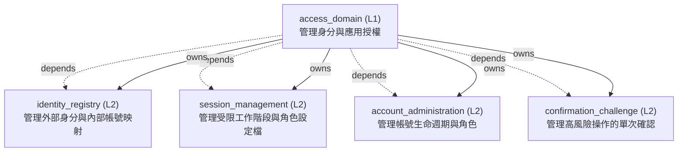

<!-- GENERATED BY govern-modular-event-architecture; DO NOT EDIT -->

# `access_domain`

## 結構圖

## 模組

| ID | Level | Role | 父模組 | 實作狀態 | 目的 |
|---|---|---|---|---|---|
| `access_domain` | L1 | domain | `thesis_trace_application` | implemented | Own authenticated actor identity and application authorization decisions. |
| `identity_registry` | L2 | component | `access_domain` | implemented | Own preapproved provider-subject mappings to stable internal users without merging identities by email. |
| `session_management` | L2 | component | `access_domain` | implemented | Own bounded application sessions and role-filtered session profiles derived from verified Access identity. |
| `account_administration` | L2 | component | `access_domain` | implemented | Own Admin-visible account lifecycle commands while excluding all research and portfolio fields. |
| `confirmation_challenge` | L2 | component | `access_domain` | implemented | Own single-use five-minute actor, action, target-version, and payload-digest bound confirmation challenges. |

### `access_domain`

- **目的:** Own authenticated actor identity and application authorization decisions.
- **父模組:** `thesis_trace_application`
- **實作狀態:** `implemented`
- **輸入 Ports:** `access.authorize_owner`
- **輸出 Ports:** `access.events`, `access.security_context`
- **輸出 Events:** `access.owner_authorized`, `access.session_established`, `access.account_changed`, `access.confirmation_consumed`
- **擁有狀態:** 無
- **副作用:** 無
- **異常:** `access_domain-error-1`: Reject absent → `access.owner_authorized` → Reject absent; `access_domain-error-2`: expired → `access.owner_authorized` → expired; `access_domain-error-3`: or unauthorized identities. → `access.owner_authorized` → or unauthorized identities.
- **不變條件:** Provider identity never collapses by email alone; JWT subject and provider discriminator resolve through a preapproved mapping.; Unknown provider, identity, session, role, or challenge fails closed without existence disclosure.; Authorization fails closed.
- **程式入口:** [`AuthenticatedActor`](../../backend/src/thesis_trace/modules/access/contracts.py) (contract) [`AccountActionService`](../../backend/src/thesis_trace/modules/access/orchestration.py) (orchestrator)
- **公開 Symbols:** [`AuthenticatedActor`](../../backend/src/thesis_trace/modules/access/contracts.py) (contract) [`SecurityContext`](../../backend/src/thesis_trace/modules/access/contracts.py) (contract) [`AccountActionService`](../../backend/src/thesis_trace/modules/access/orchestration.py) (service) [`RecoveryPolicyConfiguration`](../../backend/src/thesis_trace/modules/access/recovery_policy.py) (configuration)

### `identity_registry`

- **目的:** Own preapproved provider-subject mappings to stable internal users without merging identities by email.
- **父模組:** `access_domain`
- **實作狀態:** `implemented`
- **輸入 Ports:** `access.resolve_identity`
- **輸出 Ports:** `access.account_repository`, `access.identity_provider`
- **輸出 Events:** 無
- **擁有狀態:** 無
- **副作用:** Persist versioned account and provider mappings through an Access-owned repository port. (`-`)
- **異常:** `identity-registry-error-1`: Provider discriminator or preapproved mapping is absent or disabled. → `access.identity_rejected` → Reject with the uniform access_denied outcome.
- **不變條件:** Provider type plus provider ID plus subject uniquely identify one mapping; Same email never merges distinct provider identities; At most ten accounts are enabled.
- **程式入口:** [`IdentityRegistry`](../../backend/src/thesis_trace/modules/access/identity_registry/service.py) (service)
- **公開 Symbols:** [`ProviderIdentity`](../../backend/src/thesis_trace/modules/access/identity_registry/contracts.py) (contract) [`VerifiedPrincipal`](../../backend/src/thesis_trace/modules/access/identity_registry/contracts.py) (contract) [`AccessAccount`](../../backend/src/thesis_trace/modules/access/identity_registry/contracts.py) (contract) [`ProviderIdentityMapping`](../../backend/src/thesis_trace/modules/access/identity_registry/contracts.py) (contract)

### `session_management`

- **目的:** Own bounded application sessions and role-filtered session profiles derived from verified Access identity.
- **父模組:** `access_domain`
- **實作狀態:** `implemented`
- **輸入 Ports:** `access.bootstrap_session`, `access.revoke_session`
- **輸出 Ports:** `access.session_repository`
- **輸出 Events:** 無
- **擁有狀態:** 無
- **副作用:** Persist revocable sessions whose expiry never exceeds the verified Access token. (`-`)
- **異常:** `session-management-error-1`: Identity → `access.identity_rejected` → Reject and expose no profile or protected route data.
- **不變條件:** Google sessions are bounded by eight hours; Recovery sessions are Owner-only and bounded by thirty minutes; Logout and recovery disablement revoke reuse.
- **程式入口:** [`SessionService`](../../backend/src/thesis_trace/modules/access/session_management/service.py) (service)
- **公開 Symbols:** [`SessionProfile`](../../backend/src/thesis_trace/modules/access/session_management/contracts.py) (contract) [`AccessSession`](../../backend/src/thesis_trace/modules/access/session_management/contracts.py) (contract)

### `account_administration`

- **目的:** Own Admin-visible account lifecycle commands while excluding all research and portfolio fields.
- **父模組:** `access_domain`
- **實作狀態:** `implemented`
- **輸入 Ports:** `access.query_accounts`, `access.manage_accounts`
- **輸出 Ports:** 無
- **輸出 Events:** 無
- **擁有狀態:** 無
- **副作用:** Apply confirmed identity and role changes with append-only security audit. (`-`)
- **異常:** `account-administration-error-1`: Actor lacks Admin capability or target/version is unavailable. → `access.identity_rejected` → Return the same resource_unavailable envelope for forbidden and absent targets.
- **不變條件:** Client cannot select data ownership; Account payloads never include research or investment data; Consequential changes require a consumed confirmation challenge.
- **程式入口:** [`AccountAdministration`](../../backend/src/thesis_trace/modules/access/account_administration/service.py) (service)
- **公開 Symbols:** [`AccountSummary`](../../backend/src/thesis_trace/modules/access/account_administration/contracts.py) (contract)

### `confirmation_challenge`

- **目的:** Own single-use five-minute actor, action, target-version, and payload-digest bound confirmation challenges.
- **父模組:** `access_domain`
- **實作狀態:** `implemented`
- **輸入 Ports:** `access.preview_consequential_action`, `access.confirm_consequential_action`
- **輸出 Ports:** `access.challenge_repository`
- **輸出 Events:** 無
- **擁有狀態:** 無
- **副作用:** Persist opaque challenge metadata and atomically consume it with the consequential change. (`-`)
- **異常:** `confirmation-challenge-error-1`: Challenge is expired → `access.identity_rejected` → Destroy client challenge state and require a fresh preview.
- **不變條件:** Challenge lifetime never exceeds five minutes; Challenge token is never persisted by the browser; Blank reasons and repeated confirmation are rejected.
- **程式入口:** [`ConfirmationService`](../../backend/src/thesis_trace/modules/access/confirmation_challenge/service.py) (service)
- **公開 Symbols:** [`ConfirmationChallenge`](../../backend/src/thesis_trace/modules/access/confirmation_challenge/contracts.py) (contract)

## Port 契約

| ID | Owner | Direction | Kind | Timing | Description | Symbols |
|---|---|---|---|---|---|---|
| `access.authorize_owner` | `access_domain` | input | query | sync | Decide whether the actor may submit Owner evidence.: Immutable authenticated actor snapshot. | `AuthenticatedActor` |
| `access.events` | `access_domain` | output | event | sync | Publish authorization facts after validation.: Actor ID and authorization purpose. | `AuthenticatedActor` |
| `access.resolve_identity` | `identity_registry` | input | query | sync | Resolve a verified provider discriminator and subject through a preapproved mapping.: ProviderIdentity and verified token facts. | `ProviderIdentity` |
| `access.bootstrap_session` | `session_management` | input | command | sync | Establish or refresh a bounded application session and role-safe profile.: Resolved internal user, provider facts, MFA assurance, and Access expiry. | `SessionProfile` |
| `access.revoke_session` | `session_management` | input | command | sync | Revoke logout, recovery, disabled-account, or expired sessions.: Session ID, actor, reason, and expected session version. | `AccessSession` |
| `access.query_accounts` | `account_administration` | input | query | sync | Return Admin-safe account summaries without research or portfolio fields.: Authorized Admin actor and optional bounded filter. | `AccountSummary` |
| `access.manage_accounts` | `account_administration` | input | command | sync | Apply a previously confirmed identity, role, or account lifecycle mutation.: Actor, target account/version, immutable confirmed payload, and reason. | `AccountSummary` |
| `access.preview_consequential_action` | `confirmation_challenge` | input | command | sync | Generate a server-authoritative impact summary and opaque bounded challenge.: Actor, action type, target record/version, payload digest input, and idempotency key. | `ConfirmationChallenge` |
| `access.confirm_consequential_action` | `confirmation_challenge` | input | command | sync | Atomically validate and consume one challenge with a nonblank reason.: Opaque token, actor, exact payload, reason, and idempotency key. | `ConfirmationChallenge` |
| `access.identity_provider` | `identity_registry` | output | dependency | sync | Verify Cloudflare JWT and get-identity provider discriminator facts.: VerifiedPrincipal without raw token or header representations. | `ProviderIdentity`, `VerifiedPrincipal` |
| `access.account_repository` | `identity_registry` | output | dependency | sync | Persist and query versioned users and provider mappings.: AccessAccount and ProviderIdentityMapping. | `AccessAccount`, `ProviderIdentityMapping` |
| `access.session_repository` | `session_management` | output | dependency | sync | Persist, retrieve, and revoke bounded application sessions.: AccessSession metadata without JWT or credential values. | `AccessSession` |
| `access.challenge_repository` | `confirmation_challenge` | output | dependency | sync | Persist opaque challenge metadata and atomically consume single-use challenges.: Challenge digest, bindings, expiry, consumed state, and audit metadata. | `ConfirmationChallenge` |
| `access.security_context` | `access_domain` | output | dependency | sync | Bind server-derived user, role, and ownership scope to one PostgreSQL transaction for RLS.: SecurityContext without client-supplied authority fields. | `SecurityContext` |

## Event 契約

| ID | Owner | Delivery | Emitted when | Purpose | Consumers |
|---|---|---|---|---|---|
| `access.owner_authorized` | `access_domain` | at-most-once | Identity and role checks have succeeded. | Record a successful Owner authorization decision. | `thesis_trace_application` |
| `access.identity_resolved` | `access_domain` | at-most-once | Full JWT and get-identity facts match one enabled preapproved mapping. | Record successful resolution of provider-discriminated identity to one internal user. | `access_domain` |
| `access.identity_rejected` | `access_domain` | at-most-once | Provider evidence or preapproved mapping fails closed. | Record a non-disclosing identity rejection category. | `thesis_trace_application` |
| `access.session_established` | `access_domain` | at-least-once | Session binding and expiry have committed. | Report a committed bounded application session. | `thesis_trace_application`, `workflow_domain` |
| `access.session_revoked` | `access_domain` | at-least-once | Revocation has committed. | Report that a session can no longer authorize requests. | `thesis_trace_application` |
| `access.recovery_session_detected` | `access_domain` | at-least-once | The first valid recovery session for an activation window commits. | Trigger immutable security audit and a safety-locked task to disable recovery access. | `workflow_domain`, `thesis_trace_application` |
| `access.account_changed` | `access_domain` | at-least-once | Consequential mutation, confirmation consumption, and audit commit atomically. | Report a committed identity, role, or account lifecycle change. | `session_management`, `thesis_trace_application` |
| `access.confirmation_issued` | `access_domain` | at-most-once | Challenge bindings and expiry commit. | Record issuance of a short-lived challenge without publishing its token. | `thesis_trace_application` |
| `access.confirmation_consumed` | `access_domain` | at-least-once | Challenge, reason, mutation, and append-only audit commit. | Report atomic challenge consumption and consequential mutation. | `thesis_trace_application` |

## Type Catalog

| ID | Owner | Declaration | Visibility | Semantic kind | Consumers | References |
|---|---|---|---|---|---|---|
| `role` | `access_domain` | `Role` (enum, `backend/src/thesis_trace/modules/access/contracts.py`) | module-public | policy | `access_domain` | 無 |
| `authenticatedactor` | `access_domain` | `AuthenticatedActor` (class, `backend/src/thesis_trace/modules/access/contracts.py`) | module-public | domain-value | `access_domain` | `role` |
| `jwtverificationerror` | `access_domain` | `JwtVerificationError` (class, `backend/src/thesis_trace/modules/access/jwt_verifier.py`) | module-public | domain-value | `fastapi_entrypoint` | 無 |
| `accessjwtconfiguration` | `access_domain` | `AccessJwtConfiguration` (class, `backend/src/thesis_trace/modules/access/jwt_verifier.py`) | module-public | configuration | `backend_composition` | 無 |
| `cloudflarejwtverifier` | `access_domain` | `CloudflareJwtVerifier` (class, `backend/src/thesis_trace/modules/access/jwt_verifier.py`) | module-public | policy | `fastapi_entrypoint` | `accessjwtconfiguration`, `jwtverificationerror`, `authenticatedactor` |
| `provideridentity` | `identity_registry` | `ProviderIdentity` (class, `backend/src/thesis_trace/modules/access/identity_registry/contracts.py`) | module-public | domain-value | `session_management`, `cloudflare_identity_adapter` | 無 |
| `verifiedprincipal` | `identity_registry` | `VerifiedPrincipal` (class, `backend/src/thesis_trace/modules/access/identity_registry/contracts.py`) | module-public | domain-value | `identity_registry`, `session_management` | `provideridentity` |
| `accessaccount` | `identity_registry` | `AccessAccount` (class, `backend/src/thesis_trace/modules/access/identity_registry/contracts.py`) | module-public | domain-value | `session_management`, `account_administration`, `postgres_access_adapter` | 無 |
| `provideridentitymapping` | `identity_registry` | `ProviderIdentityMapping` (class, `backend/src/thesis_trace/modules/access/identity_registry/contracts.py`) | module-public | domain-value | `postgres_access_adapter` | `provideridentity` |
| `accesssession` | `session_management` | `AccessSession` (class, `backend/src/thesis_trace/modules/access/session_management/contracts.py`) | module-public | domain-value | `postgres_access_adapter` | 無 |
| `sessionprofile` | `session_management` | `SessionProfile` (union, `backend/src/thesis_trace/modules/access/session_management/contracts.py`) | module-public | query | `thesis_trace_application`, `react_access_adapter` | 無 |
| `accountsummary` | `account_administration` | `AccountSummary` (class, `backend/src/thesis_trace/modules/access/account_administration/contracts.py`) | module-public | query | `react_access_adapter` | 無 |
| `confirmationchallenge` | `confirmation_challenge` | `ConfirmationChallenge` (class, `backend/src/thesis_trace/modules/access/confirmation_challenge/contracts.py`) | module-public | event-payload | `confirmation_challenge`, `postgres_access_adapter`, `access_domain` | 無 |
| `securitycontext` | `access_domain` | `SecurityContext` (class, `backend/src/thesis_trace/modules/access/contracts.py`) | module-public | domain-value | `postgres_access_adapter` | `role` |
| `identityregistry` | `identity_registry` | `IdentityRegistry` (class, `backend/src/thesis_trace/modules/access/identity_registry/service.py`) | module-public | domain-value | `backend_composition` | `accountrepositoryport` |
| `accountrepositoryport` | `identity_registry` | `AccountRepositoryPort` (protocol, `backend/src/thesis_trace/modules/access/identity_registry/ports.py`) | module-public | port | `identity_registry`, `postgres_access_adapter` | `accessaccount`, `provideridentitymapping` |
| `sessionservice` | `session_management` | `SessionService` (class, `backend/src/thesis_trace/modules/access/session_management/service.py`) | module-public | domain-value | `backend_composition` | `sessionrepositoryport` |
| `sessionrepositoryport` | `session_management` | `SessionRepositoryPort` (protocol, `backend/src/thesis_trace/modules/access/session_management/ports.py`) | module-public | port | `session_management`, `postgres_access_adapter` | `accesssession` |
| `confirmationservice` | `confirmation_challenge` | `ConfirmationService` (class, `backend/src/thesis_trace/modules/access/confirmation_challenge/service.py`) | module-public | domain-value | `backend_composition` | `challengerepositoryport` |
| `challengerepositoryport` | `confirmation_challenge` | `ChallengeRepositoryPort` (protocol, `backend/src/thesis_trace/modules/access/confirmation_challenge/ports.py`) | module-public | port | `confirmation_challenge`, `postgres_access_adapter` | `confirmationchallenge` |
| `securitycontextport` | `access_domain` | `SecurityContextPort` (protocol, `backend/src/thesis_trace/modules/access/ports.py`) | module-public | port | `postgres_access_adapter` | `securitycontext` |
| `accountadministration` | `account_administration` | `AccountAdministration` (class, `backend/src/thesis_trace/modules/access/account_administration/service.py`) | module-public | domain-value | `backend_composition` | 無 |
| `recoverypolicyconfiguration` | `access_domain` | `RecoveryPolicyConfiguration` (class, `backend/src/thesis_trace/modules/access/recovery_policy.py`) | module-public | configuration | `session_management`, `backend_composition` | `provideridentity` |
| `accountactionpreview` | `access_domain` | `AccountActionPreview` (class, `backend/src/thesis_trace/modules/access/orchestration.py`) | module-public | query | `fastapi_entrypoint` | 無 |
| `confirmedaccountaction` | `access_domain` | `ConfirmedAccountAction` (class, `backend/src/thesis_trace/modules/access/orchestration.py`) | module-public | domain-value | `fastapi_entrypoint` | 無 |
| `accountactionunitofwork` | `access_domain` | `AccountActionUnitOfWork` (protocol, `backend/src/thesis_trace/modules/access/orchestration.py`) | module-public | port | `access_domain`, `postgres_access_adapter` | `accountsummary` |
| `accountactionservice` | `access_domain` | `AccountActionService` (class, `backend/src/thesis_trace/modules/access/orchestration.py`) | module-public | policy | `backend_composition`, `fastapi_entrypoint` | `accountactionunitofwork`, `accountactionpreview`, `confirmedaccountaction`, `confirmationservice` |

## State Ownership

| ID | Owner | Declaration | Type | Visibility | Mutability | Read authority | Write authority |
|---|---|---|---|---|---|---|---|

## Cross-module Mapping

| Interaction | Producer | Consumer | Parent | Producer contract | Consumer contract | Mapping owner | State accessed | Allowed edges | Forbidden edges |
|---|---|---|---|---|---|---|---|---|---|
| `cloudflare-wire-to-provider-identity`: Map a cryptographically verified Cloudflare token and token-bound full identity response into a preapproved provider identity. | `access_domain` | `identity_registry` | `access_domain` | `-` | `provideridentity` | `access_domain` | 無 | `access_domain->identity_registry` | `identity_registry->access_domain`, `identity_registry->cloudflare_identity_adapter` |
| `principal-to-session-profile`: Map an enabled provider identity and internal account snapshot into a bounded role-safe application session profile. | `identity_registry` | `session_management` | `access_domain` | `provideridentity` | `sessionprofile` | `access_domain` | 無 | 無 | `identity_registry->session_management`, `session_management->identity_registry` |
| `session-to-rls-context`: Convert a validated application session into transaction-local PostgreSQL RLS context without exposing SQL handles. | `access_domain` | `session_management` | `access_domain` | `securitycontext` | `sessionprofile` | `access_domain` | 無 | `access_domain->session_management` | `session_management->access_domain`, `session_management->postgres_access_adapter` |
| `account-intent-to-confirmed-change`: Map an exact versioned account mutation intent into a single-use confirmation and resume the mutation only after atomic validation. | `account_administration` | `confirmation_challenge` | `access_domain` | `accountsummary` | `confirmationchallenge` | `access_domain` | 無 | 無 | `account_administration->confirmation_challenge`, `confirmation_challenge->account_administration` |

## 端到端 Flows
