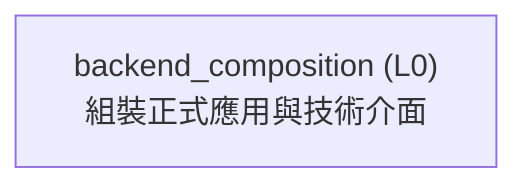
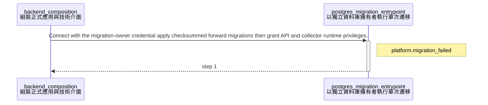

<!-- GENERATED BY govern-modular-event-architecture; DO NOT EDIT -->

# `backend_composition`

## 結構圖

## 模組

| ID | Level | Role | 父模組 | 實作狀態 | 目的 |
|---|---|---|---|---|---|
| `backend_composition` | L0 | composition | `-` | implemented | Construct the release application and wire functional ports to concrete adapters. |

### `backend_composition`

- **目的:** Construct the release application and wire functional ports to concrete adapters.
- **父模組:** `-`
- **實作狀態:** `implemented`
- **輸入 Ports:** 無
- **輸出 Ports:** 無
- **輸出 Events:** 無
- **擁有狀態:** 無
- **副作用:** Create process-scoped adapters and application instances. (`-`)
- **異常:** `backend_composition-error-1`: Fail startup when mandatory configuration or adapters are unavailable. → `application.evidence_submission_completed` → Fail startup when mandatory configuration or adapters are unavailable.
- **不變條件:** Only this module selects concrete adapters; Exactly one release composition root exists.
- **程式入口:** [`compose_application`](../../backend/src/thesis_trace/bootstrap/application.py) (initializer)
- **公開 Symbols:** [`compose_application`](../../backend/src/thesis_trace/bootstrap/application.py) (composition-root)

## Port 契約

| ID | Owner | Direction | Kind | Timing | Description | Symbols |
|---|---|---|---|---|---|---|

## Event 契約

| ID | Owner | Delivery | Emitted when | Purpose | Consumers |
|---|---|---|---|---|---|

## Type Catalog

| ID | Owner | Declaration | Visibility | Semantic kind | Consumers | References |
|---|---|---|---|---|---|---|
| `apiruntime` | `backend_composition` | `ApiRuntime` (class, `backend/src/thesis_trace/bootstrap/application.py`) | private | runtime-state | `backend_composition` | `postgresevidencestore`, `cloudflarejwtverifier`, `postgresaccessadapter`, `cloudflareidentityadapter`, `postgresworkflowstore`, `postgresthesisstore` |
| `collectorruntime` | `backend_composition` | `CollectorRuntime` (class, `backend/src/thesis_trace/bootstrap/application.py`) | private | runtime-state | `backend_composition` | `evidencecollector` |
| `anomalyprocessor` | `backend_composition` | `AnomalyProcessor` (protocol, `backend/src/thesis_trace/bootstrap/application.py`) | private | port | `backend_composition` | 無 |
| `aiworkerruntime` | `backend_composition` | `AiWorkerRuntime` (class, `backend/src/thesis_trace/bootstrap/application.py`) | private | runtime-state | `backend_composition` | `anomalyprocessor` |

## State Ownership

| ID | Owner | Declaration | Type | Visibility | Mutability | Read authority | Write authority |
|---|---|---|---|---|---|---|---|

## Cross-module Mapping

| Interaction | Producer | Consumer | Parent | Producer contract | Consumer contract | Mapping owner | State accessed | Allowed edges | Forbidden edges |
|---|---|---|---|---|---|---|---|---|---|

## 端到端 Flows

### `production_database_migration`

Apply forward-only schema changes and least-privilege runtime grants before API or collector startup.

#### Flow 圖

#### 執行步驟

| # | Module | Action | Receives | Emits | State changes | Side effects |
|---|---|---|---|---|---|---|
| 1 | `postgres_migration_entrypoint` | Connect with the migration-owner credential apply checksummed forward migrations then grant API and collector runtime privileges. | 無 | `platform.migration_failed` | Database schema version and role grants advance atomically or startup stops. | PostgreSQL DDL and grants under the one-shot migration role. |

- **成功結果:** Runtime services may start against the migrated schema using non-owner credentials.
- **異常:** Credential resolution migration checksum DDL or grant application fails. → `platform.migration_failed` → Exit nonzero and keep dependent runtime services stopped.

#### Execution efficiency

- Workload `production_database_migration_workload`: `best-effort`; steps `production_database_migration.apply`; profiles [`linux_server_functional`](execution-linux_server_functional.md).
