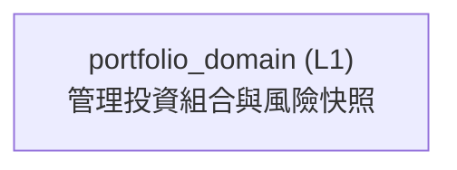

<!-- GENERATED BY govern-modular-event-architecture; DO NOT EDIT -->

# `portfolio_domain`

## 結構圖

## 模組

| ID | Level | Role | 父模組 | 實作狀態 | 目的 |
|---|---|---|---|---|---|
| `portfolio_domain` | L1 | domain | `thesis_trace_application` | implemented | Own versioned Cost Profiles, investable cash, canonical Trades, bucket allocations, holdings and deterministic exposure snapshots. |

### `portfolio_domain`

- **目的:** Own versioned Cost Profiles, investable cash, canonical Trades, bucket allocations, holdings and deterministic exposure snapshots.
- **父模組:** `thesis_trace_application`
- **實作狀態:** `implemented`
- **輸入 Ports:** 無
- **輸出 Ports:** `portfolio.store`
- **輸出 Events:** 無
- **擁有狀態:** 無
- **副作用:** Persist owner-scoped current and append-only Portfolio state through a demand-owned port. (`-`)
- **異常:** `portfolio_domain-error-1`: Reject incomplete or over-allocated trades. → `application.evidence_submission_completed` → Reject incomplete or over-allocated trades.
- **不變條件:** Risk aggregates all buckets for a security.
- **程式入口:** [`PortfolioService`](../../backend/src/thesis_trace/modules/portfolio/service.py) (service)
- **公開 Symbols:** [`PortfolioService`](../../backend/src/thesis_trace/modules/portfolio/service.py) (service) [`PortfolioStorePort`](../../backend/src/thesis_trace/modules/portfolio/ports.py) (port) [`PortfolioRecord`](../../backend/src/thesis_trace/modules/portfolio/contracts.py) (contract) [`TradePreview`](../../backend/src/thesis_trace/modules/portfolio/contracts.py) (contract)

## Port 契約

| ID | Owner | Direction | Kind | Timing | Description | Symbols |
|---|---|---|---|---|---|---|
| `portfolio.store` | `portfolio_domain` | output | dependency | sync | Persist/query owner Portfolio state atomically.: PortfolioRecord and command receipt primitives. | `PortfolioStorePort`, `PortfolioRecord` |

## Event 契約

| ID | Owner | Delivery | Emitted when | Purpose | Consumers |
|---|---|---|---|---|---|

## Type Catalog

| ID | Owner | Declaration | Visibility | Semantic kind | Consumers | References |
|---|---|---|---|---|---|---|
| `tradeside` | `portfolio_domain` | `TradeSide` (enum, `backend/src/thesis_trace/modules/portfolio/contracts.py`) | module-public | domain-value | `portfolio_domain`, `postgres_portfolio_adapter`, `thesis_trace_application` | 無 |
| `officialsecuritysnapshot` | `portfolio_domain` | `OfficialSecuritySnapshot` (class, `backend/src/thesis_trace/modules/portfolio/contracts.py`) | module-public | domain-value | `portfolio_domain`, `postgres_portfolio_adapter` | 無 |
| `holdingsnapshot` | `portfolio_domain` | `HoldingSnapshot` (class, `backend/src/thesis_trace/modules/portfolio/contracts.py`) | module-public | domain-value | `portfolio_domain`, `postgres_portfolio_adapter`, `thesis_trace_application` | 無 |
| `portfoliosnapshot` | `portfolio_domain` | `PortfolioSnapshot` (class, `backend/src/thesis_trace/modules/portfolio/contracts.py`) | module-public | domain-value | `portfolio_domain` | `holdingsnapshot` |
| `exposuresnapshot` | `portfolio_domain` | `ExposureSnapshot` (class, `backend/src/thesis_trace/modules/portfolio/contracts.py`) | module-public | domain-value | `portfolio_domain`, `thesis_trace_application` | 無 |
| `dcaselection` | `portfolio_domain` | `DcaSelection` (class, `backend/src/thesis_trace/modules/portfolio/contracts.py`) | module-public | domain-value | `portfolio_domain` | 無 |
| `canonicaltrade` | `portfolio_domain` | `CanonicalTrade` (class, `backend/src/thesis_trace/modules/portfolio/contracts.py`) | module-public | domain-value | `portfolio_domain`, `postgres_portfolio_adapter`, `thesis_trace_application` | `tradeside` |
| `canonicalcsvissue` | `portfolio_domain` | `CanonicalCsvIssue` (class, `backend/src/thesis_trace/modules/portfolio/contracts.py`) | module-public | domain-value | `portfolio_domain`, `thesis_trace_application` | 無 |
| `canonicalcsvpreview` | `portfolio_domain` | `CanonicalCsvPreview` (class, `backend/src/thesis_trace/modules/portfolio/contracts.py`) | module-public | query | `portfolio_domain`, `thesis_trace_application` | `canonicaltrade`, `canonicalcsvissue` |
| `tradeallocation` | `portfolio_domain` | `TradeAllocation` (class, `backend/src/thesis_trace/modules/portfolio/contracts.py`) | module-public | domain-value | `portfolio_domain`, `postgres_portfolio_adapter` | 無 |
| `companyactionallocation` | `portfolio_domain` | `CompanyActionAllocation` (class, `backend/src/thesis_trace/modules/portfolio/contracts.py`) | module-public | domain-value | `portfolio_domain` | 無 |
| `portfolioactorcontext` | `portfolio_domain` | `PortfolioActorContext` (class, `backend/src/thesis_trace/modules/portfolio/contracts.py`) | module-public | domain-value | `portfolio_domain`, `thesis_trace_application` | 無 |
| `costprofilesnapshot` | `portfolio_domain` | `CostProfileSnapshot` (class, `backend/src/thesis_trace/modules/portfolio/contracts.py`) | module-public | domain-value | `portfolio_domain`, `postgres_portfolio_adapter`, `thesis_trace_application` | 無 |
| `traderecord` | `portfolio_domain` | `TradeRecord` (class, `backend/src/thesis_trace/modules/portfolio/contracts.py`) | module-public | domain-value | `portfolio_domain`, `postgres_portfolio_adapter` | `canonicaltrade`, `tradeallocation` |
| `tradecorrectionrecord` | `portfolio_domain` | `TradeCorrectionRecord` (class, `backend/src/thesis_trace/modules/portfolio/contracts.py`) | module-public | domain-value | `portfolio_domain`, `postgres_portfolio_adapter`, `thesis_trace_application` | `tradeallocation` |
| `companyactionrecord` | `portfolio_domain` | `CompanyActionRecord` (class, `backend/src/thesis_trace/modules/portfolio/contracts.py`) | module-public | domain-value | `portfolio_domain`, `postgres_portfolio_adapter`, `thesis_trace_application` | `companyactionallocation` |
| `portfoliorecord` | `portfolio_domain` | `PortfolioRecord` (class, `backend/src/thesis_trace/modules/portfolio/contracts.py`) | module-public | domain-value | `portfolio_domain`, `postgres_portfolio_adapter`, `thesis_trace_application` | `costprofilesnapshot`, `holdingsnapshot`, `traderecord`, `tradecorrectionrecord`, `companyactionrecord` |
| `tradepreview` | `portfolio_domain` | `TradePreview` (class, `backend/src/thesis_trace/modules/portfolio/contracts.py`) | module-public | query | `portfolio_domain`, `thesis_trace_application` | `canonicaltrade`, `tradeallocation`, `portfoliosnapshot`, `exposuresnapshot` |
| `savecostprofilecommand` | `portfolio_domain` | `SaveCostProfileCommand` (class, `backend/src/thesis_trace/modules/portfolio/contracts.py`) | module-public | command | `portfolio_domain` | `portfolioactorcontext` |
| `saveinvestablecashcommand` | `portfolio_domain` | `SaveInvestableCashCommand` (class, `backend/src/thesis_trace/modules/portfolio/contracts.py`) | module-public | command | `portfolio_domain` | `portfolioactorcontext` |
| `previewtradecommand` | `portfolio_domain` | `PreviewTradeCommand` (class, `backend/src/thesis_trace/modules/portfolio/contracts.py`) | module-public | command | `portfolio_domain` | `portfolioactorcontext`, `canonicaltrade`, `tradeallocation` |
| `confirmtradecommand` | `portfolio_domain` | `ConfirmTradeCommand` (class, `backend/src/thesis_trace/modules/portfolio/contracts.py`) | module-public | command | `portfolio_domain` | `portfolioactorcontext`, `tradepreview` |
| `tradecorrectionpreview` | `portfolio_domain` | `TradeCorrectionPreview` (class, `backend/src/thesis_trace/modules/portfolio/contracts.py`) | module-public | query | `portfolio_domain`, `thesis_trace_application`, `backend_composition` | `portfoliosnapshot`, `exposuresnapshot` |
| `confirmtradecorrectioncommand` | `portfolio_domain` | `ConfirmTradeCorrectionCommand` (class, `backend/src/thesis_trace/modules/portfolio/contracts.py`) | module-public | command | `portfolio_domain`, `backend_composition` | `portfolioactorcontext`, `tradecorrectionpreview` |
| `companyactionpreview` | `portfolio_domain` | `CompanyActionPreview` (class, `backend/src/thesis_trace/modules/portfolio/contracts.py`) | module-public | query | `portfolio_domain`, `thesis_trace_application`, `backend_composition` | `companyactionallocation`, `portfoliosnapshot`, `exposuresnapshot` |
| `confirmcompanyactioncommand` | `portfolio_domain` | `ConfirmCompanyActionCommand` (class, `backend/src/thesis_trace/modules/portfolio/contracts.py`) | module-public | command | `portfolio_domain`, `backend_composition` | `portfolioactorcontext`, `companyactionpreview` |
| `portfoliostoreport` | `portfolio_domain` | `PortfolioStorePort` (protocol, `backend/src/thesis_trace/modules/portfolio/ports.py`) | module-public | port | `portfolio_domain`, `postgres_portfolio_adapter` | `portfoliorecord` |
| `brokerstatementparserport` | `portfolio_domain` | `BrokerStatementParserPort` (protocol, `backend/src/thesis_trace/modules/portfolio/ports.py`) | module-public | port | `portfolio_domain` | `canonicalcsvpreview` |
| `portfolioservice` | `portfolio_domain` | `PortfolioService` (class, `backend/src/thesis_trace/modules/portfolio/service.py`) | module-public | policy | `backend_composition`, `thesis_trace_application` | `portfoliostoreport`, `portfoliorecord`, `tradepreview` |

## State Ownership

| ID | Owner | Declaration | Type | Visibility | Mutability | Read authority | Write authority |
|---|---|---|---|---|---|---|---|

## Cross-module Mapping

| Interaction | Producer | Consumer | Parent | Producer contract | Consumer contract | Mapping owner | State accessed | Allowed edges | Forbidden edges |
|---|---|---|---|---|---|---|---|---|---|

## 端到端 Flows
