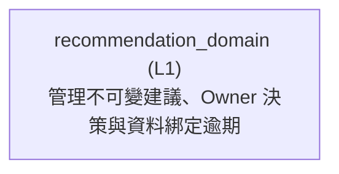

<!-- GENERATED BY govern-modular-event-architecture; DO NOT EDIT -->

# `recommendation_domain`

## 結構圖

## 模組

| ID | Level | Role | 父模組 | 實作狀態 | 目的 |
|---|---|---|---|---|---|
| `recommendation_domain` | L1 | domain | `thesis_trace_application` | planned | Own version-bound investment recommendations, validated candidate evidence and append-only Owner decisions under accepted ADR-0009; no trading authority. |

### `recommendation_domain`

- **目的:** Own version-bound investment recommendations, validated candidate evidence and append-only Owner decisions under accepted ADR-0009; no trading authority.
- **父模組:** `thesis_trace_application`
- **實作狀態:** `planned`
- **輸入 Ports:** `recommendation.request`, `recommendation.query`, `recommendation.decide`, `recommendation.reconcile_expiry`
- **輸出 Ports:** `recommendation.store`
- **輸出 Events:** 無
- **擁有狀態:** 無
- **副作用:** Planned owner-scoped request/job, immutable recommendation/decision and audit writes through demand ports. (`-`)
- **異常:** 無
- **不變條件:** DEC-105 expires only unfinalized recommendations; accepted/rejected history is immutable.; AI cannot override valuation, risk, Owner authority or formal-Hard activation.; Cross-domain state is mapped by L0 and atomically persisted by owner adapters; no sibling access.; ADR-0009 and ALG-0032/0033/0034 accepted by project owner on 2026-09-05; Wave 7 remains planned until integration and validation complete.
- **程式入口:** [`RecommendationService`](../../backend/src/thesis_trace/modules/recommendation/service.py) (service)
- **公開 Symbols:** [`RecommendationActor`](../../backend/src/thesis_trace/modules/recommendation/contracts.py) (class) [`BoundRecommendationInput`](../../backend/src/thesis_trace/modules/recommendation/contracts.py) (class) [`RecommendationSource`](../../backend/src/thesis_trace/modules/recommendation/contracts.py) (class) [`RecommendationInputSnapshot`](../../backend/src/thesis_trace/modules/recommendation/contracts.py) (class) [`RecommendationCandidate`](../../backend/src/thesis_trace/modules/recommendation/contracts.py) (class) [`RecommendationRecord`](../../backend/src/thesis_trace/modules/recommendation/contracts.py) (class) [`OwnerDecision`](../../backend/src/thesis_trace/modules/recommendation/contracts.py) (class) [`RecommendationJob`](../../backend/src/thesis_trace/modules/recommendation/contracts.py) (class) [`RecommendationStorePort`](../../backend/src/thesis_trace/modules/recommendation/ports.py) (protocol) [`RecommendationService`](../../backend/src/thesis_trace/modules/recommendation/service.py) (service)

## Port 契約

| ID | Owner | Direction | Kind | Timing | Description | Symbols |
|---|---|---|---|---|---|---|
| `recommendation.request` | `recommendation_domain` | input | command | sync | Admit exact immutable inputs and typed analysis work.: Owner, active Thesis/cycle, immutable bound input identities and explicit source intent. | `RecommendationInputSnapshot` |
| `recommendation.query` | `recommendation_domain` | input | query | sync | Return immutable history and current input validity without mutating on read.: Authorized Owner, exact Recommendation identity/version. | `RecommendationRecord` |
| `recommendation.decide` | `recommendation_domain` | input | command | sync | Append a legal Owner Decision under ALG-0033.: Expected decision sequence, reason, action and exact confirmation when consequential. | `OwnerDecision` |
| `recommendation.reconcile_expiry` | `recommendation_domain` | input | command | sync | Evaluate DEC-105 against current parent-resolved bound inputs.: Exact current versions and transaction time; never accepted/rejected history. | `BoundRecommendationInput` |
| `recommendation.store` | `recommendation_domain` | output | dependency | sync | Persist normalized Recommendation state, immutable decisions and leased version-bound work.: Owner-scoped semantic request/job/record/decision values; no SQL handles. | `RecommendationStorePort` |

## Event 契約

| ID | Owner | Delivery | Emitted when | Purpose | Consumers |
|---|---|---|---|---|---|

## Type Catalog

| ID | Owner | Declaration | Visibility | Semantic kind | Consumers | References |
|---|---|---|---|---|---|---|
| `recommendationactor` | `recommendation_domain` | `RecommendationActor` (class, `backend/src/thesis_trace/modules/recommendation/contracts.py`) | module-public | domain-value | `recommendation_domain`, `thesis_trace_application`, `postgres_recommendation_adapter` | 無 |
| `boundrecommendationinput` | `recommendation_domain` | `BoundRecommendationInput` (class, `backend/src/thesis_trace/modules/recommendation/contracts.py`) | module-public | domain-value | `recommendation_domain`, `thesis_trace_application`, `postgres_recommendation_adapter` | 無 |
| `recommendationsource` | `recommendation_domain` | `RecommendationSource` (class, `backend/src/thesis_trace/modules/recommendation/contracts.py`) | module-public | domain-value | `recommendation_domain`, `thesis_trace_application`, `postgres_recommendation_adapter` | 無 |
| `recommendationinputsnapshot` | `recommendation_domain` | `RecommendationInputSnapshot` (class, `backend/src/thesis_trace/modules/recommendation/contracts.py`) | module-public | domain-value | `recommendation_domain`, `thesis_trace_application`, `postgres_recommendation_adapter` | `recommendationactor`, `boundrecommendationinput`, `recommendationsource` |
| `recommendationcandidate` | `recommendation_domain` | `RecommendationCandidate` (class, `backend/src/thesis_trace/modules/recommendation/contracts.py`) | module-public | domain-value | `recommendation_domain`, `thesis_trace_application`, `postgres_recommendation_adapter` | 無 |
| `recommendationrecord` | `recommendation_domain` | `RecommendationRecord` (class, `backend/src/thesis_trace/modules/recommendation/contracts.py`) | module-public | domain-value | `recommendation_domain`, `thesis_trace_application`, `postgres_recommendation_adapter` | `recommendationinputsnapshot`, `recommendationcandidate` |
| `ownerdecision` | `recommendation_domain` | `OwnerDecision` (class, `backend/src/thesis_trace/modules/recommendation/contracts.py`) | module-public | domain-value | `recommendation_domain`, `thesis_trace_application`, `postgres_recommendation_adapter` | 無 |
| `recommendationjob` | `recommendation_domain` | `RecommendationJob` (class, `backend/src/thesis_trace/modules/recommendation/contracts.py`) | module-public | domain-value | `recommendation_domain`, `thesis_trace_application`, `postgres_recommendation_adapter` | 無 |
| `recommendationstoreport` | `recommendation_domain` | `RecommendationStorePort` (protocol, `backend/src/thesis_trace/modules/recommendation/ports.py`) | module-public | port | `recommendation_domain`, `thesis_trace_application`, `postgres_recommendation_adapter` | `recommendationinputsnapshot`, `recommendationrecord`, `ownerdecision`, `recommendationjob` |
| `recommendationservice` | `recommendation_domain` | `RecommendationService` (class, `backend/src/thesis_trace/modules/recommendation/service.py`) | module-public | descriptor | `recommendation_domain`, `thesis_trace_application`, `postgres_recommendation_adapter` | `recommendationstoreport` |

## State Ownership

| ID | Owner | Declaration | Type | Visibility | Mutability | Read authority | Write authority |
|---|---|---|---|---|---|---|---|

## Cross-module Mapping

| Interaction | Producer | Consumer | Parent | Producer contract | Consumer contract | Mapping owner | State accessed | Allowed edges | Forbidden edges |
|---|---|---|---|---|---|---|---|---|---|

## 端到端 Flows
