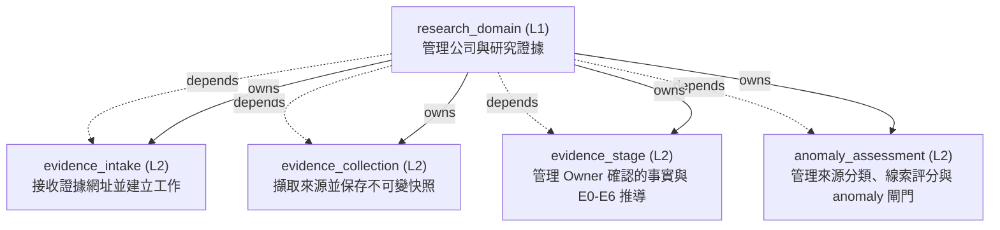

<!-- GENERATED BY govern-modular-event-architecture; DO NOT EDIT -->

# `research_domain`

## 結構圖

## 模組

| ID | Level | Role | 父模組 | 實作狀態 | 目的 |
|---|---|---|---|---|---|
| `research_domain` | L1 | domain | `thesis_trace_application` | implemented | Own companies, evidence provenance, collection lifecycle, evidence stages, and anomaly facts. |
| `evidence_intake` | L2 | component | `research_domain` | implemented | Admit Evidence URLs and atomically create received state, audit fact, and collection job. |
| `evidence_collection` | L2 | component | `research_domain` | implemented | Collect restricted sources and commit immutable snapshots or safe failures. |
| `evidence_stage` | L2 | component | `research_domain` | implemented | Own versioned Owner-confirmed dimension facts and deterministic E0-E6 derivation. |
| `anomaly_assessment` | L2 | component | `research_domain` | implemented | Own versioned source classification, clue scoring, deterministic anomaly decisions, traces, durable analysis work, and offline qualification evaluation. |

### `research_domain`

- **目的:** Own companies, evidence provenance, collection lifecycle, evidence stages, and anomaly facts.
- **父模組:** `thesis_trace_application`
- **實作狀態:** `implemented`
- **輸入 Ports:** `research.submit_evidence`, `research.query_evidence`
- **輸出 Ports:** `research.events`
- **輸出 Events:** `research.evidence_received`, `research.collection_succeeded`, `research.collection_failed`
- **擁有狀態:** 無
- **副作用:** Persist evidence state through demand-owned ports (`-`); Request restricted source collection. (`-`)
- **異常:** `research_domain-error-1`: Reject invalid URLs or stale company versions → `research.evidence_received` → Reject invalid URLs or stale company versions; `research_domain-error-2`: Record safe retry and terminal failures. → `research.evidence_received` → Record safe retry and terminal failures.
- **不變條件:** State commits before success events; Evidence streams are serialized; Source records are immutable.
- **程式入口:** [`EvidenceRecord`](../../backend/src/thesis_trace/modules/research/evidence_intake/contracts.py) (contract)
- **公開 Symbols:** [`ResearchActorContext`](../../backend/src/thesis_trace/modules/research/__init__.py) (contract) [`ResearchStageFacade`](../../backend/src/thesis_trace/modules/research/__init__.py) (orchestrator) [`ResearchStageConfirmationRequest`](../../backend/src/thesis_trace/modules/research/__init__.py) (contract) [`ResearchStageQuery`](../../backend/src/thesis_trace/modules/research/__init__.py) (contract) [`ResearchStageFacts`](../../backend/src/thesis_trace/modules/research/__init__.py) (contract) [`ResearchStageGate`](../../backend/src/thesis_trace/modules/research/__init__.py) (contract) [`ResearchStageResult`](../../backend/src/thesis_trace/modules/research/__init__.py) (contract) [`ResearchAnomalyFacade`](../../backend/src/thesis_trace/modules/research/__init__.py) (orchestrator) [`ResearchAnomalySource`](../../backend/src/thesis_trace/modules/research/__init__.py) (contract) [`ResearchAnomalyRequest`](../../backend/src/thesis_trace/modules/research/__init__.py) (contract) [`ResearchValidatedAnomalyCandidate`](../../backend/src/thesis_trace/modules/research/__init__.py) (contract) [`ResearchAnomalyJob`](../../backend/src/thesis_trace/modules/research/__init__.py) (contract) [`ResearchAnomalyGate`](../../backend/src/thesis_trace/modules/research/__init__.py) (contract) [`ResearchAnomalyTrace`](../../backend/src/thesis_trace/modules/research/__init__.py) (contract) [`ResearchAnomalyResult`](../../backend/src/thesis_trace/modules/research/__init__.py) (contract) [`ResearchRecordReference`](../../backend/src/thesis_trace/modules/research/__init__.py) (contract) [`EvidenceRecord`](../../backend/src/thesis_trace/modules/research/evidence_intake/contracts.py) (contract)

### `evidence_intake`

- **目的:** Admit Evidence URLs and atomically create received state, audit fact, and collection job.
- **父模組:** `research_domain`
- **實作狀態:** `implemented`
- **輸入 Ports:** 無
- **輸出 Ports:** `research.unit_of_work`
- **輸出 Events:** 無
- **擁有狀態:** 無
- **副作用:** 無
- **異常:** `evidence_intake-error-1`: Reject invalid URL → `application.evidence_submission_completed` → Reject invalid URL; `evidence_intake-error-2`: duplicate admission → `application.evidence_submission_completed` → duplicate admission; `evidence_intake-error-3`: stale version → `application.evidence_submission_completed` → stale version; `evidence_intake-error-4`: or unavailable persistence. → `application.evidence_submission_completed` → or unavailable persistence.
- **不變條件:** Evidence; audit; and job commit atomically; Accepted commands return a record and version.
- **程式入口:** [`EvidenceAccepted`](../../backend/src/thesis_trace/modules/research/evidence_intake/contracts.py) (contract)
- **公開 Symbols:** [`EvidenceAccepted`](../../backend/src/thesis_trace/modules/research/evidence_intake/contracts.py) (contract) [`EvidenceIntakeUnitOfWorkPort`](../../backend/src/thesis_trace/modules/research/evidence_intake/ports.py) (port)

### `evidence_collection`

- **目的:** Collect restricted sources and commit immutable snapshots or safe failures.
- **父模組:** `research_domain`
- **實作狀態:** `implemented`
- **輸入 Ports:** 無
- **輸出 Ports:** `research.collection_jobs`, `research.source_fetch`
- **輸出 Events:** 無
- **擁有狀態:** 無
- **副作用:** 無
- **異常:** `evidence_collection-error-1`: Retry transient failures and dead-letter terminal failures without leaking secrets. → `application.evidence_submission_completed` → Retry transient failures and dead-letter terminal failures without leaking secrets.
- **不變條件:** A lease token is opaque; Success is published only after snapshot commit.
- **程式入口:** [`EvidenceCollector`](../../backend/src/thesis_trace/modules/research/evidence_collection/service.py) (service)
- **公開 Symbols:** [`CollectedSourceSnapshot`](../../backend/src/thesis_trace/modules/research/evidence_collection/contracts.py) (contract) [`CollectionStorePort`](../../backend/src/thesis_trace/modules/research/evidence_collection/ports.py) (port) [`SourceFetchPort`](../../backend/src/thesis_trace/modules/research/evidence_collection/ports.py) (port)

### `evidence_stage`

- **目的:** Own versioned Owner-confirmed dimension facts and deterministic E0-E6 derivation.
- **父模組:** `research_domain`
- **實作狀態:** `implemented`
- **輸入 Ports:** `research.confirm_dimension_facts`, `research.query_evidence_stage`
- **輸出 Ports:** `research.evidence_stage_store`
- **輸出 Events:** 無
- **擁有狀態:** 無
- **副作用:** Append confirmed facts, derived stage, gate trace and audit through a demand-owned port. (`-`)
- **異常:** 無
- **不變條件:** Canonical stage is derived only by ALG-0002 from confirmed facts.; Every committed version binds one immutable source snapshot, actor, Server time, reason and complete E1-E6 gate trace.; Learner and Admin, client-computed values and unconfirmed AI candidates have no mutation authority.
- **程式入口:** [`EvidenceStageService`](../../backend/src/thesis_trace/modules/research/evidence_stage/service.py) (service)
- **公開 Symbols:** [`StageActorContext`](../../backend/src/thesis_trace/modules/research/evidence_stage/contracts.py) (contract) [`ConfirmDimensionFactsCommand`](../../backend/src/thesis_trace/modules/research/evidence_stage/contracts.py) (contract) [`EvidenceStageRecord`](../../backend/src/thesis_trace/modules/research/evidence_stage/contracts.py) (contract) [`EvidenceStageStorePort`](../../backend/src/thesis_trace/modules/research/evidence_stage/ports.py) (port)

### `anomaly_assessment`

- **目的:** Own versioned source classification, clue scoring, deterministic anomaly decisions, traces, durable analysis work, and offline qualification evaluation.
- **父模組:** `research_domain`
- **實作狀態:** `implemented`
- **輸入 Ports:** `research.request_anomaly_assessment`, `research.query_anomaly_assessment`
- **輸出 Ports:** `research.anomaly_assessment_store`
- **輸出 Events:** 無
- **擁有狀態:** 無
- **副作用:** Append pending assessments, leased jobs, immutable results, and audit through a demand-owned port. (`-`)
- **異常:** 無
- **不變條件:** AI, adapters, and clients cannot set source tier, clue score, anomaly class, qualification, notification, recommendation, or trade state.; Ambiguous source classification resolves downward and C-clue score never contributes to Hard quorum.; Formal Hard publication remains disabled until offline qualification, thirty consecutive shadow days, and explicit Owner activation all bind the exact version tuple.
- **程式入口:** [`AnomalyAssessmentService`](../../backend/src/thesis_trace/modules/research/anomaly_assessment/service.py) (service)
- **公開 Symbols:** [`AnomalyAssessmentRecord`](../../backend/src/thesis_trace/modules/research/anomaly_assessment/contracts.py) (contract) [`SourceTier`](../../backend/src/thesis_trace/modules/research/anomaly_assessment/contracts.py) (contract) [`ClueRoute`](../../backend/src/thesis_trace/modules/research/anomaly_assessment/contracts.py) (contract) [`AnomalyClass`](../../backend/src/thesis_trace/modules/research/anomaly_assessment/contracts.py) (contract) [`AssessmentStatus`](../../backend/src/thesis_trace/modules/research/anomaly_assessment/contracts.py) (contract) [`SourceCharacteristicSnapshot`](../../backend/src/thesis_trace/modules/research/anomaly_assessment/contracts.py) (contract) [`ClueFeatureVector`](../../backend/src/thesis_trace/modules/research/anomaly_assessment/contracts.py) (contract) [`DecisionGate`](../../backend/src/thesis_trace/modules/research/anomaly_assessment/contracts.py) (contract) [`AnomalyDecisionTrace`](../../backend/src/thesis_trace/modules/research/anomaly_assessment/contracts.py) (contract) [`RequestAssessmentCommand`](../../backend/src/thesis_trace/modules/research/anomaly_assessment/contracts.py) (contract) [`EvaluateAssessmentCommand`](../../backend/src/thesis_trace/modules/research/anomaly_assessment/contracts.py) (contract) [`AnomalyAnalysisJob`](../../backend/src/thesis_trace/modules/research/anomaly_assessment/contracts.py) (contract) [`AnomalyAnalysisVersions`](../../backend/src/thesis_trace/modules/research/anomaly_assessment/contracts.py) (contract) [`AnomalyAssessmentStorePort`](../../backend/src/thesis_trace/modules/research/anomaly_assessment/ports.py) (port) [`QualificationCaseCategory`](../../backend/src/thesis_trace/modules/research/anomaly_assessment/qualification.py) (contract) [`QualificationVersionTuple`](../../backend/src/thesis_trace/modules/research/anomaly_assessment/qualification.py) (contract) [`QualificationCase`](../../backend/src/thesis_trace/modules/research/anomaly_assessment/qualification.py) (contract) [`OfflineQualificationResult`](../../backend/src/thesis_trace/modules/research/anomaly_assessment/qualification.py) (contract)

## Port 契約

| ID | Owner | Direction | Kind | Timing | Description | Symbols |
|---|---|---|---|---|---|---|
| `research.submit_evidence` | `research_domain` | input | command | sync | Atomically admit one Evidence URL.: Authorized actor | `EvidenceRecord` |
| `research.query_evidence` | `research_domain` | input | query | sync | Return an authorized immutable Evidence status snapshot.: Evidence ID and server version. | `EvidenceRecord` |
| `research.unit_of_work` | `evidence_intake` | output | dependency | sync | Atomically save evidence state: Semantic records without ORM representations. | `EvidenceIntakeUnitOfWorkPort` |
| `research.collection_jobs` | `evidence_collection` | output | dependency | async | Lease: Collection request and opaque lease token. | `CollectionStorePort` |
| `research.source_fetch` | `evidence_collection` | output | dependency | async | Fetch one admitted external source under SSRF and size restrictions.: Evidence URL and semantic fetch result. | `SourceFetchPort` |
| `research.confirm_dimension_facts` | `evidence_stage` | input | command | sync | Confirm one complete version of Owner-authored E-stage dimension facts and derive the canonical stage.: Authorized Owner, Evidence and snapshot identity, expected version, immutable dimension facts, reason and idempotency key. | `ConfirmDimensionFactsCommand` |
| `research.query_evidence_stage` | `evidence_stage` | input | query | sync | Return the current Server-authoritative E-stage projection for an authorized Evidence stream.: Authenticated Owner or Learner, Evidence identity and current stage version. | `EvidenceStageRecord` |
| `research.evidence_stage_store` | `evidence_stage` | output | dependency | sync | Atomically validate snapshot membership and expected version then append confirmed facts, derived stage, trace and audit.: Semantic stage record and idempotency key without SQL or wire representations. | `EvidenceStageStorePort` |
| `research.evidence_stage_events` | `evidence_stage` | output | event | sync | Reserved for a later notification slice that will publish committed confirmed-fact and deterministic stage versions through a durable outbox.: Evidence identity, stage version, source snapshot, canonical stage and stable event identity. | `EvidenceStageRecord` |
| `research.request_anomaly_assessment` | `anomaly_assessment` | input | command | sync | Atomically create a version-bound pending assessment, audit fact, and durable AI job.: Authorized Owner, immutable source snapshot identities/versions, bounded source-characteristic facts, reason, and idempotency key. | `RequestAssessmentCommand`, `AnomalyAssessmentRecord` |
| `research.query_anomaly_assessment` | `anomaly_assessment` | input | query | sync | Return the latest committed role-safe anomaly assessment state and deterministic trace.: Authorized actor and assessment identity. | `AnomalyAssessmentRecord` |
| `research.anomaly_assessment_store` | `anomaly_assessment` | output | dependency | async | Atomically request, lease, load immutable sources, commit, supersede, and query anomaly work under immutable version bindings.: Semantic assessment, job, decision trace, source snapshot, and audit values without SQL, provider, or wire representations. | `AnomalyAssessmentStorePort`, `AnomalyAnalysisJob`, `AnomalyAnalysisVersions`, `AnomalyAssessmentRecord` |
| `research.clock` | `research_domain` | output | dependency | sync | Supply observed and retrieved times.: Time value with provenance. | `EvidenceRecord` |
| `research.ids` | `research_domain` | output | dependency | sync | Generate persistent semantic identifiers.: Opaque unique identifier. | `EvidenceRecord` |
| `research.events` | `research_domain` | output | event | async | Publish committed evidence lifecycle transitions.: Persistent event envelope and semantic payload. | `EvidenceRecord` |

## Event 契約

| ID | Owner | Delivery | Emitted when | Purpose | Consumers |
|---|---|---|---|---|---|
| `research.evidence_received` | `research_domain` | at-least-once | The atomic intake transaction has committed. | Report that received evidence | `thesis_trace_application`, `research_domain` |
| `research.collection_succeeded` | `research_domain` | at-least-once | The snapshot and succeeded state have committed. | Report a committed immutable source snapshot. | `thesis_trace_application` |
| `research.collection_failed` | `research_domain` | at-least-once | Failure state and retry metadata have committed. | Report a committed retryable or terminal safe failure. | `thesis_trace_application` |
| `research.evidence_stage_changed` | `evidence_stage` | at-least-once | Confirmed facts, stage, complete gate trace and audit have committed atomically. | Report a committed Owner-confirmed fact and deterministic E-stage version. | `thesis_trace_application`, `notification_domain` |

## Type Catalog

| ID | Owner | Declaration | Visibility | Semantic kind | Consumers | References |
|---|---|---|---|---|---|---|
| `researchrecordreference` | `research_domain` | `ResearchRecordReference` (class, `backend/src/thesis_trace/modules/research/__init__.py`) | module-public | composition-mapping | `research_domain`, `thesis_trace_application` | 無 |
| `valuationsourcefact` | `evidence_collection` | `ValuationSourceFact` (class, `backend/src/thesis_trace/modules/research/evidence_collection/contracts.py`) | module-public | domain-value | `postgres_research_adapter`, `thesis_trace_application` | 無 |
| `researchactorcontext` | `research_domain` | `ResearchActorContext` (class, `backend/src/thesis_trace/modules/research/__init__.py`) | module-public | composition-mapping | `research_domain`, `thesis_trace_application` | 無 |
| `researchstageconfirmationrequest` | `research_domain` | `ResearchStageConfirmationRequest` (class, `backend/src/thesis_trace/modules/research/__init__.py`) | module-public | command | `research_domain`, `thesis_trace_application` | 無 |
| `researchstagequery` | `research_domain` | `ResearchStageQuery` (class, `backend/src/thesis_trace/modules/research/__init__.py`) | module-public | query | `research_domain`, `thesis_trace_application` | 無 |
| `researchstagefacts` | `research_domain` | `ResearchStageFacts` (class, `backend/src/thesis_trace/modules/research/__init__.py`) | module-public | domain-value | `research_domain`, `thesis_trace_application` | 無 |
| `researchstagegate` | `research_domain` | `ResearchStageGate` (class, `backend/src/thesis_trace/modules/research/__init__.py`) | module-public | domain-value | `research_domain`, `thesis_trace_application` | 無 |
| `researchstageresult` | `research_domain` | `ResearchStageResult` (class, `backend/src/thesis_trace/modules/research/__init__.py`) | module-public | domain-value | `research_domain`, `thesis_trace_application` | `researchstagefacts`, `researchstagegate` |
| `researchstagefacade` | `research_domain` | `ResearchStageFacade` (class, `backend/src/thesis_trace/modules/research/__init__.py`) | module-public | composition-mapping | `thesis_trace_application`, `backend_composition` | `researchactorcontext`, `researchstageconfirmationrequest`, `researchstagequery`, `researchstagefacts`, `researchstagegate`, `researchstageresult`, `stageactorcontext`, `confirmdimensionfactscommand`, `dimensionfacts`, `sourceconfirmation`, `evidencestagerecord`, `evidencestageservice` |
| `fetchedsource` | `evidence_collection` | `FetchedSource` (class, `backend/src/thesis_trace/modules/research/evidence_collection/contracts.py`) | module-public | domain-value | `evidence_collection` | 無 |
| `collectedsourcesnapshot` | `evidence_collection` | `CollectedSourceSnapshot` (class, `backend/src/thesis_trace/modules/research/evidence_collection/contracts.py`) | module-public | domain-value | `evidence_collection` | 無 |
| `sourcefetchport` | `evidence_collection` | `SourceFetchPort` (protocol, `backend/src/thesis_trace/modules/research/evidence_collection/ports.py`) | module-public | port | `research_domain` | 無 |
| `collectionstoreport` | `evidence_collection` | `CollectionStorePort` (protocol, `backend/src/thesis_trace/modules/research/evidence_collection/ports.py`) | module-public | port | `research_domain` | 無 |
| `evidencecollector` | `evidence_collection` | `EvidenceCollector` (class, `backend/src/thesis_trace/modules/research/evidence_collection/service.py`) | private | private-helper | `evidence_collection` | 無 |
| `evidencestatus` | `evidence_intake` | `EvidenceStatus` (enum, `backend/src/thesis_trace/modules/research/evidence_intake/contracts.py`) | private | runtime-state | `evidence_intake` | 無 |
| `evidenceaccepted` | `evidence_intake` | `EvidenceAccepted` (class, `backend/src/thesis_trace/modules/research/evidence_intake/contracts.py`) | module-public | event-payload | `evidence_intake` | 無 |
| `submissionresult` | `evidence_intake` | `SubmissionResult` (class, `backend/src/thesis_trace/modules/research/evidence_intake/contracts.py`) | module-public | event-payload | `evidence_intake` | `evidenceaccepted` |
| `evidencerecord` | `evidence_intake` | `EvidenceRecord` (class, `backend/src/thesis_trace/modules/research/evidence_intake/contracts.py`) | private | runtime-state | `evidence_intake` | `evidencestatus` |
| `evidencestatussnapshot` | `evidence_intake` | `EvidenceStatusSnapshot` (class, `backend/src/thesis_trace/modules/research/evidence_intake/contracts.py`) | module-public | query | `evidence_intake` | `evidencestatus` |
| `evidenceauditfact` | `evidence_intake` | `EvidenceAuditFact` (class, `backend/src/thesis_trace/modules/research/evidence_intake/contracts.py`) | module-public | event-payload | `evidence_intake` | 無 |
| `collectionrequest` | `evidence_intake` | `CollectionRequest` (class, `backend/src/thesis_trace/modules/research/evidence_intake/contracts.py`) | module-public | command | `evidence_intake` | 無 |
| `evidenceintakeunitofworkport` | `evidence_intake` | `EvidenceIntakeUnitOfWorkPort` (protocol, `backend/src/thesis_trace/modules/research/evidence_intake/ports.py`) | module-public | port | `research_domain` | 無 |
| `leasedcollectionjob` | `evidence_intake` | `LeasedCollectionJob` (class, `backend/src/thesis_trace/modules/research/evidence_intake/contracts.py`) | module-public | command | `evidence_collection` | 無 |
| `companyrecord` | `evidence_intake` | `CompanyRecord` (class, `backend/src/thesis_trace/modules/research/evidence_intake/contracts.py`) | module-public | domain-value | `thesis_trace_application`, `postgres_research_adapter` | 無 |
| `evidencestage` | `evidence_stage` | `EvidenceStage` (enum, `backend/src/thesis_trace/modules/research/evidence_stage/contracts.py`) | module-public | policy | `evidence_stage`, `postgres_research_adapter` | 無 |
| `sourceconfirmation` | `evidence_stage` | `SourceConfirmation` (enum, `backend/src/thesis_trace/modules/research/evidence_stage/contracts.py`) | module-public | policy | `evidence_stage`, `postgres_research_adapter`, `research_domain` | 無 |
| `dimensionfacts` | `evidence_stage` | `DimensionFacts` (class, `backend/src/thesis_trace/modules/research/evidence_stage/contracts.py`) | module-public | domain-value | `evidence_stage`, `postgres_research_adapter`, `research_domain` | `sourceconfirmation` |
| `stageactorcontext` | `evidence_stage` | `StageActorContext` (class, `backend/src/thesis_trace/modules/research/evidence_stage/contracts.py`) | module-public | domain-value | `evidence_stage`, `research_domain` | 無 |
| `confirmdimensionfactscommand` | `evidence_stage` | `ConfirmDimensionFactsCommand` (class, `backend/src/thesis_trace/modules/research/evidence_stage/contracts.py`) | module-public | command | `evidence_stage`, `postgres_research_adapter`, `research_domain` | `stageactorcontext`, `dimensionfacts` |
| `gateresult` | `evidence_stage` | `GateResult` (class, `backend/src/thesis_trace/modules/research/evidence_stage/contracts.py`) | module-public | domain-value | `evidence_stage`, `postgres_research_adapter` | `evidencestage` |
| `stageevaluation` | `evidence_stage` | `StageEvaluation` (class, `backend/src/thesis_trace/modules/research/evidence_stage/contracts.py`) | module-public | domain-value | `evidence_stage`, `postgres_research_adapter` | `evidencestage`, `gateresult` |
| `evidencestagerecord` | `evidence_stage` | `EvidenceStageRecord` (class, `backend/src/thesis_trace/modules/research/evidence_stage/contracts.py`) | module-public | domain-value | `evidence_stage`, `postgres_research_adapter`, `research_domain` | `dimensionfacts`, `stageevaluation` |
| `evidencestagestoreport` | `evidence_stage` | `EvidenceStageStorePort` (protocol, `backend/src/thesis_trace/modules/research/evidence_stage/ports.py`) | module-public | port | `evidence_stage`, `postgres_research_adapter` | `confirmdimensionfactscommand`, `evidencestagerecord`, `stageevaluation` |
| `evidencestageservice` | `evidence_stage` | `EvidenceStageService` (class, `backend/src/thesis_trace/modules/research/evidence_stage/service.py`) | module-public | policy | `backend_composition`, `research_domain` | `evidencestagestoreport`, `confirmdimensionfactscommand`, `dimensionfacts`, `evidencestage`, `evidencestagerecord`, `gateresult`, `sourceconfirmation`, `stageactorcontext`, `stageevaluation` |
| `sourcetier` | `anomaly_assessment` | `SourceTier` (enum, `backend/src/thesis_trace/modules/research/anomaly_assessment/contracts.py`) | module-public | policy | `anomaly_assessment`, `postgres_research_adapter` | 無 |
| `anomalyclass` | `anomaly_assessment` | `AnomalyClass` (enum, `backend/src/thesis_trace/modules/research/anomaly_assessment/contracts.py`) | module-public | policy | `anomaly_assessment`, `postgres_research_adapter`, `research_domain` | 無 |
| `assessmentstatus` | `anomaly_assessment` | `AssessmentStatus` (enum, `backend/src/thesis_trace/modules/research/anomaly_assessment/contracts.py`) | module-public | domain-value | `anomaly_assessment`, `postgres_research_adapter` | 無 |
| `decisiongate` | `anomaly_assessment` | `DecisionGate` (class, `backend/src/thesis_trace/modules/research/anomaly_assessment/contracts.py`) | module-public | domain-value | `anomaly_assessment`, `postgres_research_adapter` | 無 |
| `sourcecharacteristicsnapshot` | `anomaly_assessment` | `SourceCharacteristicSnapshot` (class, `backend/src/thesis_trace/modules/research/anomaly_assessment/contracts.py`) | module-public | domain-value | `anomaly_assessment`, `postgres_research_adapter` | 無 |
| `cluefeaturevector` | `anomaly_assessment` | `ClueFeatureVector` (class, `backend/src/thesis_trace/modules/research/anomaly_assessment/contracts.py`) | module-public | domain-value | `anomaly_assessment`, `postgres_research_adapter` | 無 |
| `clueroute` | `anomaly_assessment` | `ClueRoute` (enum, `backend/src/thesis_trace/modules/research/anomaly_assessment/contracts.py`) | module-public | policy | `anomaly_assessment`, `postgres_research_adapter` | 無 |
| `anomalydecisiontrace` | `anomaly_assessment` | `AnomalyDecisionTrace` (class, `backend/src/thesis_trace/modules/research/anomaly_assessment/contracts.py`) | module-public | domain-value | `anomaly_assessment`, `postgres_research_adapter`, `research_domain` | `anomalyclass`, `sourcetier`, `clueroute`, `decisiongate` |
| `requestassessmentcommand` | `anomaly_assessment` | `RequestAssessmentCommand` (class, `backend/src/thesis_trace/modules/research/anomaly_assessment/contracts.py`) | module-public | command | `anomaly_assessment`, `research_domain` | `sourcecharacteristicsnapshot` |
| `evaluateassessmentcommand` | `anomaly_assessment` | `EvaluateAssessmentCommand` (class, `backend/src/thesis_trace/modules/research/anomaly_assessment/contracts.py`) | module-public | command | `anomaly_assessment`, `research_domain` | `cluefeaturevector`, `sourcecharacteristicsnapshot` |
| `anomalyanalysisjob` | `anomaly_assessment` | `AnomalyAnalysisJob` (class, `backend/src/thesis_trace/modules/research/anomaly_assessment/contracts.py`) | module-public | command | `anomaly_assessment`, `postgres_research_adapter`, `thesis_trace_application` | 無 |
| `anomalyanalysisversions` | `anomaly_assessment` | `AnomalyAnalysisVersions` (class, `backend/src/thesis_trace/modules/research/anomaly_assessment/contracts.py`) | module-public | configuration | `anomaly_assessment`, `postgres_research_adapter`, `thesis_trace_application` | 無 |
| `anomalyassessmentrecord` | `anomaly_assessment` | `AnomalyAssessmentRecord` (class, `backend/src/thesis_trace/modules/research/anomaly_assessment/contracts.py`) | module-public | domain-value | `anomaly_assessment`, `postgres_research_adapter`, `research_domain` | `assessmentstatus`, `anomalydecisiontrace` |
| `anomalyassessmentstoreport` | `anomaly_assessment` | `AnomalyAssessmentStorePort` (protocol, `backend/src/thesis_trace/modules/research/anomaly_assessment/ports.py`) | module-public | port | `anomaly_assessment`, `postgres_research_adapter` | `requestassessmentcommand`, `evaluateassessmentcommand`, `anomalyanalysisjob`, `anomalyanalysisversions`, `anomalyassessmentrecord`, `anomalydecisiontrace`, `sourcecharacteristicsnapshot` |
| `anomalyassessmentservice` | `anomaly_assessment` | `AnomalyAssessmentService` (class, `backend/src/thesis_trace/modules/research/anomaly_assessment/service.py`) | module-public | policy | `backend_composition`, `research_domain` | `anomalyassessmentstoreport`, `anomalyanalysisversions`, `sourcecharacteristicsnapshot`, `requestassessmentcommand`, `evaluateassessmentcommand`, `anomalyassessmentrecord`, `anomalyanalysisjob` |
| `researchanomalysource` | `research_domain` | `ResearchAnomalySource` (class, `backend/src/thesis_trace/modules/research/__init__.py`) | module-public | composition-mapping | `research_domain`, `thesis_trace_application` | 無 |
| `researchanomalyrequest` | `research_domain` | `ResearchAnomalyRequest` (class, `backend/src/thesis_trace/modules/research/__init__.py`) | module-public | command | `research_domain`, `thesis_trace_application` | `researchanomalysource` |
| `researchanomalyjob` | `research_domain` | `ResearchAnomalyJob` (class, `backend/src/thesis_trace/modules/research/__init__.py`) | module-public | command | `research_domain`, `thesis_trace_application` | 無 |
| `researchanomalygate` | `research_domain` | `ResearchAnomalyGate` (class, `backend/src/thesis_trace/modules/research/__init__.py`) | module-public | composition-mapping | `research_domain`, `thesis_trace_application` | 無 |
| `researchanomalytrace` | `research_domain` | `ResearchAnomalyTrace` (class, `backend/src/thesis_trace/modules/research/__init__.py`) | module-public | composition-mapping | `research_domain`, `thesis_trace_application` | `researchanomalygate` |
| `researchanomalyresult` | `research_domain` | `ResearchAnomalyResult` (class, `backend/src/thesis_trace/modules/research/__init__.py`) | module-public | composition-mapping | `research_domain`, `thesis_trace_application` | `researchanomalytrace` |
| `researchanomalyfacade` | `research_domain` | `ResearchAnomalyFacade` (class, `backend/src/thesis_trace/modules/research/__init__.py`) | module-public | composition-mapping | `backend_composition`, `thesis_trace_application` | `anomalyassessmentservice`, `requestassessmentcommand`, `evaluateassessmentcommand`, `anomalyanalysisjob`, `anomalyassessmentrecord`, `sourcecharacteristicsnapshot`, `cluefeaturevector`, `researchactorcontext`, `researchanomalysource`, `researchanomalyrequest`, `researchanomalyjob`, `researchanomalygate`, `researchanomalytrace`, `researchanomalyresult`, `researchvalidatedanomalycandidate` |
| `researchvalidatedanomalycandidate` | `research_domain` | `ResearchValidatedAnomalyCandidate` (class, `backend/src/thesis_trace/modules/research/__init__.py`) | module-public | composition-mapping | `research_domain`, `thesis_trace_application` | 無 |
| `qualificationcasecategory` | `anomaly_assessment` | `QualificationCaseCategory` (enum, `backend/src/thesis_trace/modules/research/anomaly_assessment/qualification.py`) | module-public | policy | `anomaly_assessment` | 無 |
| `qualificationversiontuple` | `anomaly_assessment` | `QualificationVersionTuple` (class, `backend/src/thesis_trace/modules/research/anomaly_assessment/qualification.py`) | module-public | configuration | `anomaly_assessment` | 無 |
| `qualificationcase` | `anomaly_assessment` | `QualificationCase` (class, `backend/src/thesis_trace/modules/research/anomaly_assessment/qualification.py`) | module-public | domain-value | `anomaly_assessment` | `qualificationversiontuple`, `qualificationcasecategory`, `sourcecharacteristicsnapshot`, `cluefeaturevector`, `anomalyclass`, `sourcetier`, `clueroute` |
| `offlinequalificationresult` | `anomaly_assessment` | `OfflineQualificationResult` (class, `backend/src/thesis_trace/modules/research/anomaly_assessment/qualification.py`) | module-public | domain-value | `anomaly_assessment` | `qualificationversiontuple` |

## State Ownership

| ID | Owner | Declaration | Type | Visibility | Mutability | Read authority | Write authority |
|---|---|---|---|---|---|---|---|

## Cross-module Mapping

| Interaction | Producer | Consumer | Parent | Producer contract | Consumer contract | Mapping owner | State accessed | Allowed edges | Forbidden edges |
|---|---|---|---|---|---|---|---|---|---|
| `source-snapshot-to-confirmed-stage`: Validate an immutable collected source snapshot as the provenance target of one confirmed fact and stage version. | `evidence_collection` | `evidence_stage` | `research_domain` | `collectedsourcesnapshot` | `evidencestagerecord` | `research_domain` | 無 | `research_domain->evidence_collection`, `research_domain->evidence_stage` | `evidence_collection->evidence_stage`, `evidence_stage->evidence_collection` |
| `source-snapshot-to-anomaly-assessment`: Resolve immutable snapshot identities into Server-owned publisher characteristics, source category, and lineage components and bind them to one anomaly assessment. | `evidence_collection` | `anomaly_assessment` | `research_domain` | `collectedsourcesnapshot` | `sourcecharacteristicsnapshot` | `research_domain` | 無 | `research_domain->evidence_collection`, `research_domain->anomaly_assessment` | `evidence_collection->anomaly_assessment`, `anomaly_assessment->evidence_collection` |

## 端到端 Flows
