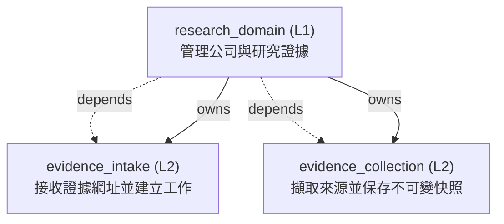

<!-- GENERATED BY govern-modular-event-architecture; DO NOT EDIT -->

# `research_domain`

## 結構圖

## 模組

| ID | Level | Role | 父模組 | 實作狀態 | 目的 |
|---|---|---|---|---|---|
| `research_domain` | L1 | domain | `thesis_trace_application` | implemented | Own companies, evidence provenance, collection lifecycle, evidence stages, and anomaly facts. |
| `evidence_intake` | L2 | component | `research_domain` | implemented | Admit Evidence URLs and atomically create received state, audit fact, and collection job. |
| `evidence_collection` | L2 | component | `research_domain` | implemented | Collect restricted sources and commit immutable snapshots or safe failures. |

### `research_domain`

- **目的:** Own companies, evidence provenance, collection lifecycle, evidence stages, and anomaly facts.
- **父模組:** `thesis_trace_application`
- **實作狀態:** `implemented`
- **輸入 Ports:** `research.submit_evidence`, `research.query_evidence`
- **輸出 Ports:** `research.events`
- **輸出 Events:** `research.evidence_received`, `research.collection_succeeded`, `research.collection_failed`
- **擁有狀態:** 無
- **副作用:** Persist evidence state through demand-owned ports (`-`); Request restricted source collection. (`-`)
- **異常:** `research_domain-error-1`: Reject invalid URLs or stale company versions → `research.evidence_received` → Reject invalid URLs or stale company versions; `research_domain-error-2`: Record safe retry and terminal failures. → `research.evidence_received` → Record safe retry and terminal failures.
- **不變條件:** State commits before success events; Evidence streams are serialized; Source records are immutable.
- **程式入口:** [`EvidenceRecord`](../../backend/src/thesis_trace/modules/research/evidence_intake/contracts.py) (contract)
- **公開 Symbols:** [`EvidenceRecord`](../../backend/src/thesis_trace/modules/research/evidence_intake/contracts.py) (contract)

### `evidence_intake`

- **目的:** Admit Evidence URLs and atomically create received state, audit fact, and collection job.
- **父模組:** `research_domain`
- **實作狀態:** `implemented`
- **輸入 Ports:** 無
- **輸出 Ports:** `research.unit_of_work`
- **輸出 Events:** 無
- **擁有狀態:** 無
- **副作用:** 無
- **異常:** `evidence_intake-error-1`: Reject invalid URL → `application.evidence_submission_completed` → Reject invalid URL; `evidence_intake-error-2`: duplicate admission → `application.evidence_submission_completed` → duplicate admission; `evidence_intake-error-3`: stale version → `application.evidence_submission_completed` → stale version; `evidence_intake-error-4`: or unavailable persistence. → `application.evidence_submission_completed` → or unavailable persistence.
- **不變條件:** Evidence; audit; and job commit atomically; Accepted commands return a record and version.
- **程式入口:** [`EvidenceAccepted`](../../backend/src/thesis_trace/modules/research/evidence_intake/contracts.py) (contract)
- **公開 Symbols:** [`EvidenceAccepted`](../../backend/src/thesis_trace/modules/research/evidence_intake/contracts.py) (contract) [`EvidenceIntakeUnitOfWorkPort`](../../backend/src/thesis_trace/modules/research/evidence_intake/ports.py) (port)

### `evidence_collection`

- **目的:** Collect restricted sources and commit immutable snapshots or safe failures.
- **父模組:** `research_domain`
- **實作狀態:** `implemented`
- **輸入 Ports:** 無
- **輸出 Ports:** `research.collection_jobs`, `research.source_fetch`
- **輸出 Events:** 無
- **擁有狀態:** 無
- **副作用:** 無
- **異常:** `evidence_collection-error-1`: Retry transient failures and dead-letter terminal failures without leaking secrets. → `application.evidence_submission_completed` → Retry transient failures and dead-letter terminal failures without leaking secrets.
- **不變條件:** A lease token is opaque; Success is published only after snapshot commit.
- **程式入口:** [`EvidenceCollector`](../../backend/src/thesis_trace/modules/research/evidence_collection/service.py) (service)
- **公開 Symbols:** [`CollectedSourceSnapshot`](../../backend/src/thesis_trace/modules/research/evidence_collection/contracts.py) (contract) [`CollectionStorePort`](../../backend/src/thesis_trace/modules/research/evidence_collection/ports.py) (port) [`SourceFetchPort`](../../backend/src/thesis_trace/modules/research/evidence_collection/ports.py) (port)

## Port 契約

| ID | Owner | Direction | Kind | Timing | Description | Symbols |
|---|---|---|---|---|---|---|
| `research.submit_evidence` | `research_domain` | input | command | sync | Atomically admit one Evidence URL.: Authorized actor | `EvidenceRecord` |
| `research.query_evidence` | `research_domain` | input | query | sync | Return an authorized immutable Evidence status snapshot.: Evidence ID and server version. | `EvidenceRecord` |
| `research.unit_of_work` | `evidence_intake` | output | dependency | sync | Atomically save evidence state: Semantic records without ORM representations. | `EvidenceIntakeUnitOfWorkPort` |
| `research.collection_jobs` | `evidence_collection` | output | dependency | async | Lease: Collection request and opaque lease token. | `CollectionStorePort` |
| `research.source_fetch` | `evidence_collection` | output | dependency | async | Fetch one admitted external source under SSRF and size restrictions.: Evidence URL and semantic fetch result. | `SourceFetchPort` |
| `research.clock` | `research_domain` | output | dependency | sync | Supply observed and retrieved times.: Time value with provenance. | `EvidenceRecord` |
| `research.ids` | `research_domain` | output | dependency | sync | Generate persistent semantic identifiers.: Opaque unique identifier. | `EvidenceRecord` |
| `research.events` | `research_domain` | output | event | async | Publish committed evidence lifecycle transitions.: Persistent event envelope and semantic payload. | `EvidenceRecord` |

## Event 契約

| ID | Owner | Delivery | Emitted when | Purpose | Consumers |
|---|---|---|---|---|---|
| `research.evidence_received` | `research_domain` | at-least-once | The atomic intake transaction has committed. | Report that received evidence | `thesis_trace_application`, `research_domain` |
| `research.collection_succeeded` | `research_domain` | at-least-once | The snapshot and succeeded state have committed. | Report a committed immutable source snapshot. | `thesis_trace_application` |
| `research.collection_failed` | `research_domain` | at-least-once | Failure state and retry metadata have committed. | Report a committed retryable or terminal safe failure. | `thesis_trace_application` |

## Type Catalog

| ID | Owner | Declaration | Visibility | Semantic kind | Consumers | References |
|---|---|---|---|---|---|---|
| `fetchedsource` | `evidence_collection` | `FetchedSource` (class, `backend/src/thesis_trace/modules/research/evidence_collection/contracts.py`) | module-public | domain-value | `evidence_collection` | 無 |
| `collectedsourcesnapshot` | `evidence_collection` | `CollectedSourceSnapshot` (class, `backend/src/thesis_trace/modules/research/evidence_collection/contracts.py`) | module-public | domain-value | `evidence_collection` | 無 |
| `sourcefetchport` | `evidence_collection` | `SourceFetchPort` (protocol, `backend/src/thesis_trace/modules/research/evidence_collection/ports.py`) | module-public | port | `research_domain` | 無 |
| `collectionstoreport` | `evidence_collection` | `CollectionStorePort` (protocol, `backend/src/thesis_trace/modules/research/evidence_collection/ports.py`) | module-public | port | `research_domain` | 無 |
| `evidencecollector` | `evidence_collection` | `EvidenceCollector` (class, `backend/src/thesis_trace/modules/research/evidence_collection/service.py`) | private | private-helper | `evidence_collection` | 無 |
| `evidencestatus` | `evidence_intake` | `EvidenceStatus` (enum, `backend/src/thesis_trace/modules/research/evidence_intake/contracts.py`) | private | runtime-state | `evidence_intake` | 無 |
| `evidenceaccepted` | `evidence_intake` | `EvidenceAccepted` (class, `backend/src/thesis_trace/modules/research/evidence_intake/contracts.py`) | module-public | event-payload | `evidence_intake` | 無 |
| `submissionresult` | `evidence_intake` | `SubmissionResult` (class, `backend/src/thesis_trace/modules/research/evidence_intake/contracts.py`) | module-public | event-payload | `evidence_intake` | `evidenceaccepted` |
| `evidencerecord` | `evidence_intake` | `EvidenceRecord` (class, `backend/src/thesis_trace/modules/research/evidence_intake/contracts.py`) | private | runtime-state | `evidence_intake` | `evidencestatus` |
| `evidencestatussnapshot` | `evidence_intake` | `EvidenceStatusSnapshot` (class, `backend/src/thesis_trace/modules/research/evidence_intake/contracts.py`) | module-public | query | `evidence_intake` | `evidencestatus` |
| `evidenceauditfact` | `evidence_intake` | `EvidenceAuditFact` (class, `backend/src/thesis_trace/modules/research/evidence_intake/contracts.py`) | module-public | event-payload | `evidence_intake` | 無 |
| `collectionrequest` | `evidence_intake` | `CollectionRequest` (class, `backend/src/thesis_trace/modules/research/evidence_intake/contracts.py`) | module-public | command | `evidence_intake` | 無 |
| `evidenceintakeunitofworkport` | `evidence_intake` | `EvidenceIntakeUnitOfWorkPort` (protocol, `backend/src/thesis_trace/modules/research/evidence_intake/ports.py`) | module-public | port | `research_domain` | 無 |
| `leasedcollectionjob` | `evidence_intake` | `LeasedCollectionJob` (class, `backend/src/thesis_trace/modules/research/evidence_intake/contracts.py`) | module-public | command | `evidence_collection` | 無 |
| `companyrecord` | `evidence_intake` | `CompanyRecord` (class, `backend/src/thesis_trace/modules/research/evidence_intake/contracts.py`) | module-public | domain-value | `thesis_trace_application`, `postgres_research_adapter` | 無 |

## State Ownership

| ID | Owner | Declaration | Type | Visibility | Mutability | Read authority | Write authority |
|---|---|---|---|---|---|---|---|

## Cross-module Mapping

| Interaction | Producer | Consumer | Parent | Producer contract | Consumer contract | Mapping owner | State accessed | Allowed edges | Forbidden edges |
|---|---|---|---|---|---|---|---|---|---|

## 端到端 Flows
