<!-- GENERATED BY govern-modular-event-architecture; DO NOT EDIT -->

# 系統總覽

```mermaid
flowchart TD
    n_thesis_trace_application["thesis_trace_application (L0)<br/>協調跨領域產品流程"]
    n_backend_composition["backend_composition (L0)<br/>組裝正式應用與技術介面"]
    n_access_domain["access_domain (L1)<br/>管理身分與應用授權"]
    n_research_domain["research_domain (L1)<br/>管理公司與研究證據"]
    n_evidence_intake["evidence_intake (L2)<br/>接收證據網址並建立工作"]
    n_evidence_collection["evidence_collection (L2)<br/>擷取來源並保存不可變快照"]
    n_evidence_stage["evidence_stage (L2)<br/>管理 Owner 確認的事實與 E0-E6 推導"]
    n_anomaly_assessment["anomaly_assessment (L2)<br/>管理來源分類、線索評分與 anomaly 閘門"]
    n_thesis_domain["thesis_domain (L1)<br/>管理 Thesis 生命週期與反思"]
    n_portfolio_domain["portfolio_domain (L1)<br/>管理投資組合與風險快照"]
    n_recommendation_domain["recommendation_domain (L1)<br/>管理建議與 Owner 決策"]
    n_workflow_domain["workflow_domain (L1)<br/>管理人工行動收件匣"]
    n_notification_domain["notification_domain (L1)<br/>管理通知分類與安全內容"]
    n_fastapi_entrypoint["fastapi_entrypoint (L3+)<br/>轉換 HTTP 與應用契約"]
    n_postgres_workflow_adapter["postgres_workflow_adapter (L3+)<br/>保存待辦、優先級與稽核紀錄"]
    n_postgres_research_adapter["postgres_research_adapter (L3+)<br/>實作研究交易與持久工作租約"]
    n_restricted_source_fetch_adapter["restricted_source_fetch_adapter (L3+)<br/>依限制政策擷取外部 HTTPS 來源"]
    n_runtime_configuration_adapter["runtime_configuration_adapter (L3+)<br/>解析必要設定與檔案引用祕密"]
    n_collector_worker_adapter["collector_worker_adapter (L3+)<br/>啟動並探測收集器程序"]
    n_ai_worker_adapter["ai_worker_adapter (L3+)<br/>執行隔離的 anomaly AI 工作"]
    n_openai_recommendation_adapter["openai_recommendation_adapter (L3+)<br/>以嚴格結構化輸出提供候選與獨立 critic"]
    n_identity_registry["identity_registry (L2)<br/>管理外部身分與內部帳號映射"]
    n_session_management["session_management (L2)<br/>管理受限工作階段與角色設定檔"]
    n_account_administration["account_administration (L2)<br/>管理帳號生命週期與角色"]
    n_confirmation_challenge["confirmation_challenge (L2)<br/>管理高風險操作的單次確認"]
    n_cloudflare_identity_adapter["cloudflare_identity_adapter (L3+)<br/>驗證完整 Access 身分與提供者"]
    n_postgres_access_adapter["postgres_access_adapter (L3+)<br/>保存 Access 狀態並設定 RLS 安全脈絡"]
    n_react_access_adapter["react_access_adapter (L3+)<br/>呈現角色隔離的 Access 介面"]
    n_react_workflow_adapter["react_workflow_adapter (L3+)<br/>呈現響應式行動收件匣"]
    n_postgres_migration_entrypoint["postgres_migration_entrypoint (L3+)<br/>以獨立資料庫擁有者執行單次遷移"]
    n_thesis_trace_application -.->|depends| n_access_domain
    n_thesis_trace_application -.->|depends| n_research_domain
    n_thesis_trace_application -.->|depends| n_thesis_domain
    n_thesis_trace_application -.->|depends| n_portfolio_domain
    n_thesis_trace_application -.->|depends| n_recommendation_domain
    n_thesis_trace_application -.->|depends| n_workflow_domain
    n_thesis_trace_application -.->|depends| n_notification_domain
    n_backend_composition -.->|depends| n_thesis_trace_application
    n_backend_composition -.->|depends| n_fastapi_entrypoint
    n_backend_composition -.->|depends| n_access_domain
    n_backend_composition -.->|depends| n_research_domain
    n_backend_composition -.->|depends| n_evidence_collection
    n_backend_composition -.->|depends| n_evidence_stage
    n_backend_composition -.->|depends| n_anomaly_assessment
    n_backend_composition -.->|depends| n_workflow_domain
    n_backend_composition -.->|depends| n_postgres_research_adapter
    n_backend_composition -.->|depends| n_postgres_workflow_adapter
    n_backend_composition -.->|depends| n_restricted_source_fetch_adapter
    n_backend_composition -.->|depends| n_runtime_configuration_adapter
    n_backend_composition -.->|depends| n_postgres_access_adapter
    n_backend_composition -.->|depends| n_cloudflare_identity_adapter
    n_backend_composition -.->|depends| n_ai_worker_adapter
    n_backend_composition -.->|depends| n_openai_recommendation_adapter
    n_thesis_trace_application -->|owns| n_access_domain
    n_access_domain -.->|depends| n_identity_registry
    n_access_domain -.->|depends| n_session_management
    n_access_domain -.->|depends| n_account_administration
    n_access_domain -.->|depends| n_confirmation_challenge
    n_thesis_trace_application -->|owns| n_research_domain
    n_research_domain -.->|depends| n_evidence_intake
    n_research_domain -.->|depends| n_evidence_collection
    n_research_domain -.->|depends| n_evidence_stage
    n_research_domain -.->|depends| n_anomaly_assessment
    n_research_domain -->|owns| n_evidence_intake
    n_research_domain -->|owns| n_evidence_collection
    n_research_domain -->|owns| n_evidence_stage
    n_research_domain -->|owns| n_anomaly_assessment
    n_thesis_trace_application -->|owns| n_thesis_domain
    n_thesis_trace_application -->|owns| n_portfolio_domain
    n_thesis_trace_application -->|owns| n_recommendation_domain
    n_thesis_trace_application -->|owns| n_workflow_domain
    n_thesis_trace_application -->|owns| n_notification_domain
    n_fastapi_entrypoint -.->|depends| n_thesis_trace_application
    n_postgres_workflow_adapter -.->|depends| n_workflow_domain
    n_postgres_research_adapter -.->|depends| n_evidence_intake
    n_postgres_research_adapter -.->|depends| n_evidence_collection
    n_postgres_research_adapter -.->|depends| n_evidence_stage
    n_postgres_research_adapter -.->|depends| n_anomaly_assessment
    n_restricted_source_fetch_adapter -.->|depends| n_evidence_collection
    n_ai_worker_adapter -.->|depends| n_thesis_trace_application
    n_openai_recommendation_adapter -.->|depends| n_thesis_trace_application
    n_access_domain -->|owns| n_identity_registry
    n_access_domain -->|owns| n_session_management
    n_access_domain -->|owns| n_account_administration
    n_access_domain -->|owns| n_confirmation_challenge
    n_cloudflare_identity_adapter -.->|depends| n_identity_registry
    n_postgres_access_adapter -.->|depends| n_identity_registry
    n_postgres_access_adapter -.->|depends| n_session_management
    n_postgres_access_adapter -.->|depends| n_confirmation_challenge
    n_postgres_access_adapter -.->|depends| n_access_domain
    n_postgres_migration_entrypoint -.->|depends| n_postgres_research_adapter
    n_postgres_migration_entrypoint -.->|depends| n_postgres_access_adapter
    n_postgres_migration_entrypoint -.->|depends| n_postgres_workflow_adapter
```

## 模組

| ID | Level | Role | 父模組 | 實作狀態 | 目的 |
|---|---|---|---|---|---|
| `thesis_trace_application` | L0 | orchestration | `-` | implemented | Coordinate authenticated cross-domain product flows without owning domain state. |
| `backend_composition` | L0 | composition | `-` | implemented | Construct the release application and wire functional ports to concrete adapters. |
| `access_domain` | L1 | domain | `thesis_trace_application` | implemented | Own authenticated actor identity and application authorization decisions. |
| `research_domain` | L1 | domain | `thesis_trace_application` | implemented | Own companies, evidence provenance, collection lifecycle, evidence stages, and anomaly facts. |
| `evidence_intake` | L2 | component | `research_domain` | implemented | Admit Evidence URLs and atomically create received state, audit fact, and collection job. |
| `evidence_collection` | L2 | component | `research_domain` | implemented | Collect restricted sources and commit immutable snapshots or safe failures. |
| `evidence_stage` | L2 | component | `research_domain` | implemented | Own versioned Owner-confirmed dimension facts and deterministic E0-E6 derivation. |
| `anomaly_assessment` | L2 | component | `research_domain` | implemented | Own versioned source classification, clue scoring, deterministic anomaly decisions, traces, durable analysis work, and offline qualification evaluation. |
| `thesis_domain` | L1 | domain | `thesis_trace_application` | planned | Own Thesis lifecycle |
| `portfolio_domain` | L1 | domain | `thesis_trace_application` | planned | Own holdings |
| `recommendation_domain` | L1 | domain | `thesis_trace_application` | planned | Own immutable recommendations |
| `workflow_domain` | L1 | domain | `thesis_trace_application` | implemented | Own actionable work items, deterministic priority and safety floors, assignment, lifecycle, recurrence, and consistent inbox queries. |
| `notification_domain` | L1 | domain | `thesis_trace_application` | planned | Own notification classification |
| `fastapi_entrypoint` | L3+ | adapter | `-` | implemented | Translate versioned JSON HTTP requests into application commands and queries. |
| `postgres_workflow_adapter` | L3+ | adapter | `-` | implemented | Persist Workflow Action Items, priority evaluations, and append-only audit using PostgreSQL. |
| `postgres_research_adapter` | L3+ | adapter | `-` | implemented | Implement atomic Research persistence and leased collector work using PostgreSQL. |
| `restricted_source_fetch_adapter` | L3+ | adapter | `-` | implemented | Fetch approved HTTPS sources through bounded DNS and transport policy. |
| `runtime_configuration_adapter` | L3+ | adapter | `-` | implemented | Resolve mandatory runtime configuration and file-referenced secrets fail closed. |
| `collector_worker_adapter` | L3+ | adapter | `-` | implemented | Start and probe the collector using only factories owned by the release composition root. |
| `ai_worker_adapter` | L3+ | adapter | `-` | implemented | Run isolated version-bound anomaly analysis jobs through public application contracts. |
| `openai_recommendation_adapter` | L3+ | adapter | `-` | implemented | Invoke OpenAI Responses structured outputs through provider-neutral application ports without granting policy authority. |
| `identity_registry` | L2 | component | `access_domain` | implemented | Own preapproved provider-subject mappings to stable internal users without merging identities by email. |
| `session_management` | L2 | component | `access_domain` | implemented | Own bounded application sessions and role-filtered session profiles derived from verified Access identity. |
| `account_administration` | L2 | component | `access_domain` | implemented | Own Admin-visible account lifecycle commands while excluding all research and portfolio fields. |
| `confirmation_challenge` | L2 | component | `access_domain` | implemented | Own single-use five-minute actor, action, target-version, and payload-digest bound confirmation challenges. |
| `cloudflare_identity_adapter` | L3+ | adapter | `-` | implemented | Verify full Cloudflare Access JWT and map get-identity provider discriminator facts into semantic identity. |
| `postgres_access_adapter` | L3+ | adapter | `-` | implemented | Persist Access aggregates and bind request security context to PostgreSQL RLS transactions. |
| `react_access_adapter` | L3+ | adapter | `-` | implemented | Present role-filtered session, account, workspace, denial, and volatile confirmation UI through generated contracts. |
| `react_workflow_adapter` | L3+ | adapter | `-` | implemented | Present the Server-authoritative Action Inbox, responsive detail route, and company-context link through generated contracts. |
| `postgres_migration_entrypoint` | L3+ | adapter | `-` | implemented | Run forward-only schema migration and least-privilege grants once under the database-owner migration credential. |

### `thesis_trace_application`

- **目的:** Coordinate authenticated cross-domain product flows without owning domain state.
- **父模組:** `-`
- **實作狀態:** `implemented`
- **輸入 Ports:** `application.submit_evidence`, `application.confirm_evidence_stage`, `application.query_evidence_stage`, `application.request_anomaly_assessment`, `application.query_anomaly_assessment`, `application.process_anomaly_job`, `application.create_anomaly_review_action`, `application.query_action_inbox`, `application.query_action_item`, `application.transition_action_item`
- **輸出 Ports:** `application.events`, `application.recommendation_provider`, `application.recommendation_critic`
- **輸出 Events:** `application.evidence_submission_completed`, `application.action_item_operation_failed`
- **擁有狀態:** 無
- **副作用:** Coordinate child commands and map child events. (`-`)
- **異常:** `thesis_trace_application-error-1`: Reject unauthenticated or unauthorized commands → `application.evidence_submission_completed` → Reject unauthenticated or unauthorized commands; `thesis_trace_application-error-2`: Propagate child admission failures. → `application.evidence_submission_completed` → Propagate child admission failures.
- **不變條件:** Sibling domains communicate only through this parent; Domain state remains child-owned.
- **程式入口:** [`EvidenceIntakeFlow`](../../backend/src/thesis_trace/application/flows/evidence_intake.py) (orchestrator) [`EvidenceStageFlow`](../../backend/src/thesis_trace/application/flows/evidence_stage.py) (orchestrator)
- **公開 Symbols:** [`SubmitEvidenceRequest`](../../backend/src/thesis_trace/application/contracts.py) (contract) [`EvidenceStageFlow`](../../backend/src/thesis_trace/application/flows/evidence_stage.py) (orchestrator) [`ConfirmEvidenceStageRequest`](../../backend/src/thesis_trace/application/flows/evidence_stage.py) (contract) [`QueryEvidenceStageRequest`](../../backend/src/thesis_trace/application/flows/evidence_stage.py) (contract) [`EvidenceStageFactsResult`](../../backend/src/thesis_trace/application/flows/evidence_stage.py) (contract) [`EvidenceStageGateResult`](../../backend/src/thesis_trace/application/flows/evidence_stage.py) (contract) [`EvidenceStageResult`](../../backend/src/thesis_trace/application/flows/evidence_stage.py) (contract) [`AnomalyAssessmentFlow`](../../backend/src/thesis_trace/application/flows/anomaly_assessment.py) (orchestrator) [`AnomalyJobProcessor`](../../backend/src/thesis_trace/application/flows/anomaly_assessment.py) (orchestrator) [`RequestAnomalyAssessment`](../../backend/src/thesis_trace/application/flows/anomaly_assessment.py) (contract) [`AnomalySourceInput`](../../backend/src/thesis_trace/application/flows/anomaly_assessment.py) (contract) [`AnomalyAssessmentResult`](../../backend/src/thesis_trace/application/flows/anomaly_assessment.py) (contract) [`AnomalyGateResult`](../../backend/src/thesis_trace/application/flows/anomaly_assessment.py) (contract) [`AnomalyTraceResult`](../../backend/src/thesis_trace/application/flows/anomaly_assessment.py) (contract) [`ActionInboxFlow`](../../backend/src/thesis_trace/application/flows/anomaly_assessment.py) (orchestrator) [`CreateAnomalyReviewActionRequest`](../../backend/src/thesis_trace/application/flows/anomaly_assessment.py) (contract) [`QueryActionInboxRequest`](../../backend/src/thesis_trace/application/flows/anomaly_assessment.py) (contract) [`QueryActionItemRequest`](../../backend/src/thesis_trace/application/flows/anomaly_assessment.py) (contract) [`TransitionActionItemRequest`](../../backend/src/thesis_trace/application/flows/anomaly_assessment.py) (contract) [`ActionItemResult`](../../backend/src/thesis_trace/application/flows/anomaly_assessment.py) (contract) [`ActionInboxResult`](../../backend/src/thesis_trace/application/flows/anomaly_assessment.py) (contract) [`RecommendationProviderPort`](../../backend/src/thesis_trace/application/ai_ports.py) (port) [`RecommendationCriticPort`](../../backend/src/thesis_trace/application/ai_ports.py) (port) [`RecommendationProviderRequest`](../../backend/src/thesis_trace/application/ai_ports.py) (contract) [`RecommendationCriticRequest`](../../backend/src/thesis_trace/application/ai_ports.py) (contract) [`AnalysisSource`](../../backend/src/thesis_trace/application/ai_ports.py) (contract) [`ValidatedAnomalyCandidate`](../../backend/src/thesis_trace/application/ai_ports.py) (contract)

### `backend_composition`

- **目的:** Construct the release application and wire functional ports to concrete adapters.
- **父模組:** `-`
- **實作狀態:** `implemented`
- **輸入 Ports:** 無
- **輸出 Ports:** 無
- **輸出 Events:** 無
- **擁有狀態:** 無
- **副作用:** Create process-scoped adapters and application instances. (`-`)
- **異常:** `backend_composition-error-1`: Fail startup when mandatory configuration or adapters are unavailable. → `application.evidence_submission_completed` → Fail startup when mandatory configuration or adapters are unavailable.
- **不變條件:** Only this module selects concrete adapters; Exactly one release composition root exists.
- **程式入口:** [`compose_application`](../../backend/src/thesis_trace/bootstrap/application.py) (initializer)
- **公開 Symbols:** [`compose_application`](../../backend/src/thesis_trace/bootstrap/application.py) (composition-root)

### `access_domain`

- **目的:** Own authenticated actor identity and application authorization decisions.
- **父模組:** `thesis_trace_application`
- **實作狀態:** `implemented`
- **輸入 Ports:** `access.authorize_owner`
- **輸出 Ports:** `access.events`, `access.security_context`
- **輸出 Events:** `access.owner_authorized`, `access.session_established`, `access.account_changed`, `access.confirmation_consumed`
- **擁有狀態:** 無
- **副作用:** 無
- **異常:** `access_domain-error-1`: Reject absent → `access.owner_authorized` → Reject absent; `access_domain-error-2`: expired → `access.owner_authorized` → expired; `access_domain-error-3`: or unauthorized identities. → `access.owner_authorized` → or unauthorized identities.
- **不變條件:** Provider identity never collapses by email alone; JWT subject and provider discriminator resolve through a preapproved mapping.; Unknown provider, identity, session, role, or challenge fails closed without existence disclosure.; Authorization fails closed.
- **程式入口:** [`AuthenticatedActor`](../../backend/src/thesis_trace/modules/access/contracts.py) (contract) [`AccountActionService`](../../backend/src/thesis_trace/modules/access/orchestration.py) (orchestrator)
- **公開 Symbols:** [`AuthenticatedActor`](../../backend/src/thesis_trace/modules/access/contracts.py) (contract) [`SecurityContext`](../../backend/src/thesis_trace/modules/access/contracts.py) (contract) [`AccountActionService`](../../backend/src/thesis_trace/modules/access/orchestration.py) (service) [`RecoveryPolicyConfiguration`](../../backend/src/thesis_trace/modules/access/recovery_policy.py) (configuration)

### `research_domain`

- **目的:** Own companies, evidence provenance, collection lifecycle, evidence stages, and anomaly facts.
- **父模組:** `thesis_trace_application`
- **實作狀態:** `implemented`
- **輸入 Ports:** `research.submit_evidence`, `research.query_evidence`
- **輸出 Ports:** `research.events`
- **輸出 Events:** `research.evidence_received`, `research.collection_succeeded`, `research.collection_failed`
- **擁有狀態:** 無
- **副作用:** Persist evidence state through demand-owned ports (`-`); Request restricted source collection. (`-`)
- **異常:** `research_domain-error-1`: Reject invalid URLs or stale company versions → `research.evidence_received` → Reject invalid URLs or stale company versions; `research_domain-error-2`: Record safe retry and terminal failures. → `research.evidence_received` → Record safe retry and terminal failures.
- **不變條件:** State commits before success events; Evidence streams are serialized; Source records are immutable.
- **程式入口:** [`EvidenceRecord`](../../backend/src/thesis_trace/modules/research/evidence_intake/contracts.py) (contract)
- **公開 Symbols:** [`ResearchActorContext`](../../backend/src/thesis_trace/modules/research/__init__.py) (contract) [`ResearchStageFacade`](../../backend/src/thesis_trace/modules/research/__init__.py) (orchestrator) [`ResearchStageConfirmationRequest`](../../backend/src/thesis_trace/modules/research/__init__.py) (contract) [`ResearchStageQuery`](../../backend/src/thesis_trace/modules/research/__init__.py) (contract) [`ResearchStageFacts`](../../backend/src/thesis_trace/modules/research/__init__.py) (contract) [`ResearchStageGate`](../../backend/src/thesis_trace/modules/research/__init__.py) (contract) [`ResearchStageResult`](../../backend/src/thesis_trace/modules/research/__init__.py) (contract) [`ResearchAnomalyFacade`](../../backend/src/thesis_trace/modules/research/__init__.py) (orchestrator) [`ResearchAnomalySource`](../../backend/src/thesis_trace/modules/research/__init__.py) (contract) [`ResearchAnomalyRequest`](../../backend/src/thesis_trace/modules/research/__init__.py) (contract) [`ResearchValidatedAnomalyCandidate`](../../backend/src/thesis_trace/modules/research/__init__.py) (contract) [`ResearchAnomalyJob`](../../backend/src/thesis_trace/modules/research/__init__.py) (contract) [`ResearchAnomalyGate`](../../backend/src/thesis_trace/modules/research/__init__.py) (contract) [`ResearchAnomalyTrace`](../../backend/src/thesis_trace/modules/research/__init__.py) (contract) [`ResearchAnomalyResult`](../../backend/src/thesis_trace/modules/research/__init__.py) (contract) [`EvidenceRecord`](../../backend/src/thesis_trace/modules/research/evidence_intake/contracts.py) (contract)

### `evidence_intake`

- **目的:** Admit Evidence URLs and atomically create received state, audit fact, and collection job.
- **父模組:** `research_domain`
- **實作狀態:** `implemented`
- **輸入 Ports:** 無
- **輸出 Ports:** `research.unit_of_work`
- **輸出 Events:** 無
- **擁有狀態:** 無
- **副作用:** 無
- **異常:** `evidence_intake-error-1`: Reject invalid URL → `application.evidence_submission_completed` → Reject invalid URL; `evidence_intake-error-2`: duplicate admission → `application.evidence_submission_completed` → duplicate admission; `evidence_intake-error-3`: stale version → `application.evidence_submission_completed` → stale version; `evidence_intake-error-4`: or unavailable persistence. → `application.evidence_submission_completed` → or unavailable persistence.
- **不變條件:** Evidence; audit; and job commit atomically; Accepted commands return a record and version.
- **程式入口:** [`EvidenceAccepted`](../../backend/src/thesis_trace/modules/research/evidence_intake/contracts.py) (contract)
- **公開 Symbols:** [`EvidenceAccepted`](../../backend/src/thesis_trace/modules/research/evidence_intake/contracts.py) (contract) [`EvidenceIntakeUnitOfWorkPort`](../../backend/src/thesis_trace/modules/research/evidence_intake/ports.py) (port)

### `evidence_collection`

- **目的:** Collect restricted sources and commit immutable snapshots or safe failures.
- **父模組:** `research_domain`
- **實作狀態:** `implemented`
- **輸入 Ports:** 無
- **輸出 Ports:** `research.collection_jobs`, `research.source_fetch`
- **輸出 Events:** 無
- **擁有狀態:** 無
- **副作用:** 無
- **異常:** `evidence_collection-error-1`: Retry transient failures and dead-letter terminal failures without leaking secrets. → `application.evidence_submission_completed` → Retry transient failures and dead-letter terminal failures without leaking secrets.
- **不變條件:** A lease token is opaque; Success is published only after snapshot commit.
- **程式入口:** [`EvidenceCollector`](../../backend/src/thesis_trace/modules/research/evidence_collection/service.py) (service)
- **公開 Symbols:** [`CollectedSourceSnapshot`](../../backend/src/thesis_trace/modules/research/evidence_collection/contracts.py) (contract) [`CollectionStorePort`](../../backend/src/thesis_trace/modules/research/evidence_collection/ports.py) (port) [`SourceFetchPort`](../../backend/src/thesis_trace/modules/research/evidence_collection/ports.py) (port)

### `evidence_stage`

- **目的:** Own versioned Owner-confirmed dimension facts and deterministic E0-E6 derivation.
- **父模組:** `research_domain`
- **實作狀態:** `implemented`
- **輸入 Ports:** `research.confirm_dimension_facts`, `research.query_evidence_stage`
- **輸出 Ports:** `research.evidence_stage_store`
- **輸出 Events:** 無
- **擁有狀態:** 無
- **副作用:** Append confirmed facts, derived stage, gate trace and audit through a demand-owned port. (`-`)
- **異常:** 無
- **不變條件:** Canonical stage is derived only by ALG-0002 from confirmed facts.; Every committed version binds one immutable source snapshot, actor, Server time, reason and complete E1-E6 gate trace.; Learner and Admin, client-computed values and unconfirmed AI candidates have no mutation authority.
- **程式入口:** [`EvidenceStageService`](../../backend/src/thesis_trace/modules/research/evidence_stage/service.py) (service)
- **公開 Symbols:** [`StageActorContext`](../../backend/src/thesis_trace/modules/research/evidence_stage/contracts.py) (contract) [`ConfirmDimensionFactsCommand`](../../backend/src/thesis_trace/modules/research/evidence_stage/contracts.py) (contract) [`EvidenceStageRecord`](../../backend/src/thesis_trace/modules/research/evidence_stage/contracts.py) (contract) [`EvidenceStageStorePort`](../../backend/src/thesis_trace/modules/research/evidence_stage/ports.py) (port)

### `anomaly_assessment`

- **目的:** Own versioned source classification, clue scoring, deterministic anomaly decisions, traces, durable analysis work, and offline qualification evaluation.
- **父模組:** `research_domain`
- **實作狀態:** `implemented`
- **輸入 Ports:** `research.request_anomaly_assessment`, `research.query_anomaly_assessment`
- **輸出 Ports:** `research.anomaly_assessment_store`
- **輸出 Events:** 無
- **擁有狀態:** 無
- **副作用:** Append pending assessments, leased jobs, immutable results, and audit through a demand-owned port. (`-`)
- **異常:** 無
- **不變條件:** AI, adapters, and clients cannot set source tier, clue score, anomaly class, qualification, notification, recommendation, or trade state.; Ambiguous source classification resolves downward and C-clue score never contributes to Hard quorum.; Formal Hard publication remains disabled until offline qualification, thirty consecutive shadow days, and explicit Owner activation all bind the exact version tuple.
- **程式入口:** [`AnomalyAssessmentService`](../../backend/src/thesis_trace/modules/research/anomaly_assessment/service.py) (service)
- **公開 Symbols:** [`AnomalyAssessmentRecord`](../../backend/src/thesis_trace/modules/research/anomaly_assessment/contracts.py) (contract) [`SourceTier`](../../backend/src/thesis_trace/modules/research/anomaly_assessment/contracts.py) (contract) [`ClueRoute`](../../backend/src/thesis_trace/modules/research/anomaly_assessment/contracts.py) (contract) [`AnomalyClass`](../../backend/src/thesis_trace/modules/research/anomaly_assessment/contracts.py) (contract) [`AssessmentStatus`](../../backend/src/thesis_trace/modules/research/anomaly_assessment/contracts.py) (contract) [`SourceCharacteristicSnapshot`](../../backend/src/thesis_trace/modules/research/anomaly_assessment/contracts.py) (contract) [`ClueFeatureVector`](../../backend/src/thesis_trace/modules/research/anomaly_assessment/contracts.py) (contract) [`DecisionGate`](../../backend/src/thesis_trace/modules/research/anomaly_assessment/contracts.py) (contract) [`AnomalyDecisionTrace`](../../backend/src/thesis_trace/modules/research/anomaly_assessment/contracts.py) (contract) [`RequestAssessmentCommand`](../../backend/src/thesis_trace/modules/research/anomaly_assessment/contracts.py) (contract) [`EvaluateAssessmentCommand`](../../backend/src/thesis_trace/modules/research/anomaly_assessment/contracts.py) (contract) [`AnomalyAnalysisJob`](../../backend/src/thesis_trace/modules/research/anomaly_assessment/contracts.py) (contract) [`AnomalyAnalysisVersions`](../../backend/src/thesis_trace/modules/research/anomaly_assessment/contracts.py) (contract) [`AnomalyAssessmentStorePort`](../../backend/src/thesis_trace/modules/research/anomaly_assessment/ports.py) (port) [`QualificationCaseCategory`](../../backend/src/thesis_trace/modules/research/anomaly_assessment/qualification.py) (contract) [`QualificationVersionTuple`](../../backend/src/thesis_trace/modules/research/anomaly_assessment/qualification.py) (contract) [`QualificationCase`](../../backend/src/thesis_trace/modules/research/anomaly_assessment/qualification.py) (contract) [`OfflineQualificationResult`](../../backend/src/thesis_trace/modules/research/anomaly_assessment/qualification.py) (contract)

### `thesis_domain`

- **目的:** Own Thesis lifecycle
- **父模組:** `thesis_trace_application`
- **實作狀態:** `planned`
- **輸入 Ports:** 無
- **輸出 Ports:** 無
- **輸出 Events:** 無
- **擁有狀態:** 無
- **副作用:** 無
- **異常:** `thesis_domain-error-1`: Reject illegal lifecycle transitions. → `application.evidence_submission_completed` → Reject illegal lifecycle transitions.
- **不變條件:** Historical decisions are append-only.
- **程式入口:** [`thesis_domain_contract`](../../backend/src/thesis_trace/modules/thesis/service.py) (boundary)
- **公開 Symbols:** [`thesis_domain_contract`](../../backend/src/thesis_trace/modules/thesis/service.py) (boundary)

### `portfolio_domain`

- **目的:** Own holdings
- **父模組:** `thesis_trace_application`
- **實作狀態:** `planned`
- **輸入 Ports:** 無
- **輸出 Ports:** 無
- **輸出 Events:** 無
- **擁有狀態:** 無
- **副作用:** 無
- **異常:** `portfolio_domain-error-1`: Reject incomplete or over-allocated trades. → `application.evidence_submission_completed` → Reject incomplete or over-allocated trades.
- **不變條件:** Risk aggregates all buckets for a security.
- **程式入口:** [`portfolio_domain_contract`](../../backend/src/thesis_trace/modules/portfolio/service.py) (boundary)
- **公開 Symbols:** [`portfolio_domain_contract`](../../backend/src/thesis_trace/modules/portfolio/service.py) (boundary)

### `recommendation_domain`

- **目的:** Own immutable recommendations
- **父模組:** `thesis_trace_application`
- **實作狀態:** `planned`
- **輸入 Ports:** 無
- **輸出 Ports:** 無
- **輸出 Events:** 無
- **擁有狀態:** 無
- **副作用:** 無
- **異常:** `recommendation_domain-error-1`: Abstain when validation or risk inputs fail. → `application.evidence_submission_completed` → Abstain when validation or risk inputs fail.
- **不變條件:** AI cannot override deterministic policy.
- **程式入口:** [`recommendation_domain_contract`](../../backend/src/thesis_trace/modules/recommendation/service.py) (boundary)
- **公開 Symbols:** [`recommendation_domain_contract`](../../backend/src/thesis_trace/modules/recommendation/service.py) (boundary)

### `workflow_domain`

- **目的:** Own actionable work items, deterministic priority and safety floors, assignment, lifecycle, recurrence, and consistent inbox queries.
- **父模組:** `thesis_trace_application`
- **實作狀態:** `implemented`
- **輸入 Ports:** `workflow.create_action_item`, `workflow.query_action_inbox`, `workflow.query_action_item`, `workflow.transition_action_item`
- **輸出 Ports:** `workflow.action_item_store`
- **輸出 Events:** 無
- **擁有狀態:** 無
- **副作用:** Persist Action Items, priority evaluations, and append-only audit through a demand-owned port. (`-`)
- **異常:** 無
- **不變條件:** System priority and safety floors are server-owned.; Terminal Action Items never reopen or rewrite source records.; Assignees derive only from Server-owned identity and source ownership.
- **程式入口:** [`WorkflowService`](../../backend/src/thesis_trace/modules/workflow/service.py) (service)
- **公開 Symbols:** [`ActionItem`](../../backend/src/thesis_trace/modules/workflow/contracts.py) (contract) [`ActionInboxPage`](../../backend/src/thesis_trace/modules/workflow/contracts.py) (contract) [`CreateActionItemCommand`](../../backend/src/thesis_trace/modules/workflow/contracts.py) (contract) [`TransitionActionItemCommand`](../../backend/src/thesis_trace/modules/workflow/contracts.py) (contract) [`ActionInboxQuery`](../../backend/src/thesis_trace/modules/workflow/contracts.py) (contract) [`ActionItemStorePort`](../../backend/src/thesis_trace/modules/workflow/ports.py) (port) [`WorkflowService`](../../backend/src/thesis_trace/modules/workflow/service.py) (service)

### `notification_domain`

- **目的:** Own notification classification
- **父模組:** `thesis_trace_application`
- **實作狀態:** `planned`
- **輸入 Ports:** 無
- **輸出 Ports:** 無
- **輸出 Events:** 無
- **擁有狀態:** 無
- **副作用:** 無
- **異常:** `notification_domain-error-1`: Dead-letter permanent delivery failures. → `application.evidence_submission_completed` → Dead-letter permanent delivery failures.
- **不變條件:** Forbidden portfolio data never enters message content.
- **程式入口:** [`notification_domain_contract`](../../backend/src/thesis_trace/modules/notification/service.py) (boundary)
- **公開 Symbols:** [`notification_domain_contract`](../../backend/src/thesis_trace/modules/notification/service.py) (boundary)

### `fastapi_entrypoint`

- **目的:** Translate versioned JSON HTTP requests into application commands and queries.
- **父模組:** `-`
- **實作狀態:** `implemented`
- **輸入 Ports:** 無
- **輸出 Ports:** 無
- **輸出 Events:** 無
- **擁有狀態:** 無
- **副作用:** Serve HTTP and OpenAPI. (`-`)
- **異常:** `fastapi_entrypoint-error-1`: Return the uniform non-disclosing error envelope. → `application.evidence_submission_completed` → Return the uniform non-disclosing error envelope.
- **不變條件:** Client values never become server authority.
- **程式入口:** [`create_fastapi_app`](../../backend/src/thesis_trace/api.py) (factory)
- **公開 Symbols:** [`EvidenceApi`](../../backend/src/thesis_trace/api.py) (adapter)

### `postgres_workflow_adapter`

- **目的:** Persist Workflow Action Items, priority evaluations, and append-only audit using PostgreSQL.
- **父模組:** `-`
- **實作狀態:** `implemented`
- **輸入 Ports:** 無
- **輸出 Ports:** 無
- **輸出 Events:** 無
- **擁有狀態:** 無
- **副作用:** Execute bounded RLS-protected Workflow transactions and repeatable-read inbox queries. (`-`)
- **異常:** 無
- **不變條件:** Workflow audit is append-only.; Summary counts and page rows use one authorization scope and query snapshot.; The adapter never reads or writes Research tables to derive Workflow policy.
- **程式入口:** [`PostgresWorkflowStore`](../../backend/src/thesis_trace/adapters/postgres_workflow/adapter.py) (adapter)
- **公開 Symbols:** [`PostgresWorkflowStore`](../../backend/src/thesis_trace/adapters/postgres_workflow/adapter.py) (adapter)

### `postgres_research_adapter`

- **目的:** Implement atomic Research persistence and leased collector work using PostgreSQL.
- **父模組:** `-`
- **實作狀態:** `implemented`
- **輸入 Ports:** 無
- **輸出 Ports:** 無
- **輸出 Events:** 無
- **擁有狀態:** 無
- **副作用:** Resolve the database secret at connection time and execute bounded SQL transactions. (`-`)
- **異常:** `postgres_research_adapter-error-1`: PostgreSQL or secret resolution is unavailable. → `application.evidence_submission_completed` → Raise a stable non-secret postgres_unavailable error.
- **不變條件:** The adapter stores a secret provider and never a resolved database URL.; Evidence, audit, and durable work commit atomically.
- **程式入口:** [`PostgresEvidenceStore`](../../backend/src/thesis_trace/platform/postgres.py) (adapter)
- **公開 Symbols:** [`PostgresEvidenceStore`](../../backend/src/thesis_trace/platform/postgres.py) (adapter)

### `restricted_source_fetch_adapter`

- **目的:** Fetch approved HTTPS sources through bounded DNS and transport policy.
- **父模組:** `-`
- **實作狀態:** `implemented`
- **輸入 Ports:** 無
- **輸出 Ports:** 無
- **輸出 Events:** 無
- **擁有狀態:** 無
- **副作用:** Resolve public addresses and perform bounded HTTPS requests. (`-`)
- **異常:** `restricted_source_fetch_adapter-error-1`: Address, redirect, media, size, or upstream policy fails. → `research.collection_failed` → Return a stable retryable or terminal failure code.
- **不變條件:** Resolved private and special-purpose addresses are rejected.; Raw transport errors and response bodies never cross the port.
- **程式入口:** [`RestrictedHttpSourceFetcher`](../../backend/src/thesis_trace/platform/source_fetch.py) (adapter)
- **公開 Symbols:** [`RestrictedHttpSourceFetcher`](../../backend/src/thesis_trace/platform/source_fetch.py) (adapter)

### `runtime_configuration_adapter`

- **目的:** Resolve mandatory runtime configuration and file-referenced secrets fail closed.
- **父模組:** `-`
- **實作狀態:** `implemented`
- **輸入 Ports:** 無
- **輸出 Ports:** 無
- **輸出 Events:** 無
- **擁有狀態:** 無
- **副作用:** Read a deployment-owned secret file only at the point of use. (`-`)
- **異常:** `runtime_configuration_adapter-error-1`: A setting, file reference, or secret value is absent. → `application.evidence_submission_completed` → Fail startup or readiness without revealing the value or file path.
- **不變條件:** Database secrets require a file reference.; Provider representations are always redacted.
- **程式入口:** [`required_secret_provider`](../../backend/src/thesis_trace/platform/runtime.py) (factory)
- **公開 Symbols:** [`SecretProvider`](../../backend/src/thesis_trace/platform/runtime.py) (port)

### `collector_worker_adapter`

- **目的:** Start and probe the collector using only factories owned by the release composition root.
- **父模組:** `-`
- **實作狀態:** `implemented`
- **輸入 Ports:** 無
- **輸出 Ports:** 無
- **輸出 Events:** 無
- **擁有狀態:** 無
- **副作用:** Delegate process startup and readiness to backend composition factories. (`-`)
- **異常:** `collector_worker_adapter-error-1`: Composition or readiness fails. → `research.collection_failed` → Exit non-zero without selecting an adapter in the entrypoint.
- **不變條件:** Entrypoints never select concrete stores, fetchers, or configuration providers.
- **程式入口:** [`main`](../../backend/src/thesis_trace/entrypoints/collector_worker.py) (process-entrypoint)
- **公開 Symbols:** [`main`](../../backend/src/thesis_trace/entrypoints/collector_worker.py) (process-entrypoint)

### `ai_worker_adapter`

- **目的:** Run isolated version-bound anomaly analysis jobs through public application contracts.
- **父模組:** `-`
- **實作狀態:** `implemented`
- **輸入 Ports:** 無
- **輸出 Ports:** 無
- **輸出 Events:** 無
- **擁有狀態:** 無
- **副作用:** Lease anomaly work and invoke provider and critic through the composed application flow. (`-`)
- **異常:** 無
- **不變條件:** The worker never reads or writes private Research tables.; Provider latency or failure never blocks API, collector, or email processes.
- **程式入口:** [`main`](../../backend/src/thesis_trace/entrypoints/ai_worker.py) (process-entrypoint)
- **公開 Symbols:** [`main`](../../backend/src/thesis_trace/entrypoints/ai_worker.py) (process-entrypoint)

### `openai_recommendation_adapter`

- **目的:** Invoke OpenAI Responses structured outputs through provider-neutral application ports without granting policy authority.
- **父模組:** `-`
- **實作狀態:** `implemented`
- **輸入 Ports:** 無
- **輸出 Ports:** 無
- **輸出 Events:** 無
- **擁有狀態:** 無
- **副作用:** Perform bounded HTTPS requests to the configured OpenAI Responses endpoint. (`-`)
- **異常:** 無
- **不變條件:** API keys and provider response bodies never cross the adapter boundary or enter logs.; Structured provider and critic bytes remain untrusted until application validation.
- **程式入口:** [`OpenAIRecommendationAdapter`](../../backend/src/thesis_trace/adapters/openai_recommendation/adapter.py) (adapter)
- **公開 Symbols:** [`OpenAIRecommendationAdapter`](../../backend/src/thesis_trace/adapters/openai_recommendation/adapter.py) (adapter)

### `identity_registry`

- **目的:** Own preapproved provider-subject mappings to stable internal users without merging identities by email.
- **父模組:** `access_domain`
- **實作狀態:** `implemented`
- **輸入 Ports:** `access.resolve_identity`
- **輸出 Ports:** `access.account_repository`, `access.identity_provider`
- **輸出 Events:** 無
- **擁有狀態:** 無
- **副作用:** Persist versioned account and provider mappings through an Access-owned repository port. (`-`)
- **異常:** `identity-registry-error-1`: Provider discriminator or preapproved mapping is absent or disabled. → `access.identity_rejected` → Reject with the uniform access_denied outcome.
- **不變條件:** Provider type plus provider ID plus subject uniquely identify one mapping; Same email never merges distinct provider identities; At most ten accounts are enabled.
- **程式入口:** [`IdentityRegistry`](../../backend/src/thesis_trace/modules/access/identity_registry/service.py) (service)
- **公開 Symbols:** [`ProviderIdentity`](../../backend/src/thesis_trace/modules/access/identity_registry/contracts.py) (contract) [`VerifiedPrincipal`](../../backend/src/thesis_trace/modules/access/identity_registry/contracts.py) (contract) [`AccessAccount`](../../backend/src/thesis_trace/modules/access/identity_registry/contracts.py) (contract) [`ProviderIdentityMapping`](../../backend/src/thesis_trace/modules/access/identity_registry/contracts.py) (contract)

### `session_management`

- **目的:** Own bounded application sessions and role-filtered session profiles derived from verified Access identity.
- **父模組:** `access_domain`
- **實作狀態:** `implemented`
- **輸入 Ports:** `access.bootstrap_session`, `access.revoke_session`
- **輸出 Ports:** `access.session_repository`
- **輸出 Events:** 無
- **擁有狀態:** 無
- **副作用:** Persist revocable sessions whose expiry never exceeds the verified Access token. (`-`)
- **異常:** `session-management-error-1`: Identity → `access.identity_rejected` → Reject and expose no profile or protected route data.
- **不變條件:** Google sessions are bounded by eight hours; Recovery sessions are Owner-only and bounded by thirty minutes; Logout and recovery disablement revoke reuse.
- **程式入口:** [`SessionService`](../../backend/src/thesis_trace/modules/access/session_management/service.py) (service)
- **公開 Symbols:** [`SessionProfile`](../../backend/src/thesis_trace/modules/access/session_management/contracts.py) (contract) [`AccessSession`](../../backend/src/thesis_trace/modules/access/session_management/contracts.py) (contract)

### `account_administration`

- **目的:** Own Admin-visible account lifecycle commands while excluding all research and portfolio fields.
- **父模組:** `access_domain`
- **實作狀態:** `implemented`
- **輸入 Ports:** `access.query_accounts`, `access.manage_accounts`
- **輸出 Ports:** 無
- **輸出 Events:** 無
- **擁有狀態:** 無
- **副作用:** Apply confirmed identity and role changes with append-only security audit. (`-`)
- **異常:** `account-administration-error-1`: Actor lacks Admin capability or target/version is unavailable. → `access.identity_rejected` → Return the same resource_unavailable envelope for forbidden and absent targets.
- **不變條件:** Client cannot select data ownership; Account payloads never include research or investment data; Consequential changes require a consumed confirmation challenge.
- **程式入口:** [`AccountAdministration`](../../backend/src/thesis_trace/modules/access/account_administration/service.py) (service)
- **公開 Symbols:** [`AccountSummary`](../../backend/src/thesis_trace/modules/access/account_administration/contracts.py) (contract)

### `confirmation_challenge`

- **目的:** Own single-use five-minute actor, action, target-version, and payload-digest bound confirmation challenges.
- **父模組:** `access_domain`
- **實作狀態:** `implemented`
- **輸入 Ports:** `access.preview_consequential_action`, `access.confirm_consequential_action`
- **輸出 Ports:** `access.challenge_repository`
- **輸出 Events:** 無
- **擁有狀態:** 無
- **副作用:** Persist opaque challenge metadata and atomically consume it with the consequential change. (`-`)
- **異常:** `confirmation-challenge-error-1`: Challenge is expired → `access.identity_rejected` → Destroy client challenge state and require a fresh preview.
- **不變條件:** Challenge lifetime never exceeds five minutes; Challenge token is never persisted by the browser; Blank reasons and repeated confirmation are rejected.
- **程式入口:** [`ConfirmationService`](../../backend/src/thesis_trace/modules/access/confirmation_challenge/service.py) (service)
- **公開 Symbols:** [`ConfirmationChallenge`](../../backend/src/thesis_trace/modules/access/confirmation_challenge/contracts.py) (contract)

### `cloudflare_identity_adapter`

- **目的:** Verify full Cloudflare Access JWT and map get-identity provider discriminator facts into semantic identity.
- **父模組:** `-`
- **實作狀態:** `implemented`
- **輸入 Ports:** 無
- **輸出 Ports:** 無
- **輸出 Events:** 無
- **擁有狀態:** 無
- **副作用:** Fetch JWKS and get-identity only from the canonical tenant origin without redirects then verify signature issuer audience expiry MFA subject and idp.id/type. (`-`)
- **異常:** `cloudflare-identity-error-1`: JWT or get-identity is absent → `access.identity_rejected` → Fail closed as access_denied without trusting email or headers.
- **不變條件:** JWT sub never identifies provider by itself; Provider discriminator is idp.id plus idp.type; Every JWKS or identity redirect fails before a second request; Only a preapproved mapping yields an internal user.
- **程式入口:** [`CloudflareIdentityAdapter`](../../backend/src/thesis_trace/adapters/cloudflare_identity/adapter.py) (adapter) [`CloudflareJwksDecoder`](../../backend/src/thesis_trace/adapters/cloudflare_identity/adapter.py) (adapter)
- **公開 Symbols:** [`CloudflareIdentityAdapter`](../../backend/src/thesis_trace/adapters/cloudflare_identity/adapter.py) (adapter) [`CloudflareJwksDecoder`](../../backend/src/thesis_trace/adapters/cloudflare_identity/adapter.py) (adapter)

### `postgres_access_adapter`

- **目的:** Persist Access aggregates and bind request security context to PostgreSQL RLS transactions.
- **父模組:** `-`
- **實作狀態:** `implemented`
- **輸入 Ports:** 無
- **輸出 Ports:** 無
- **輸出 Events:** 無
- **擁有狀態:** 無
- **副作用:** Set transaction-local user (`-`)
- **異常:** `postgres-access-error-1`: Context → `access.identity_rejected` → Roll back and fail closed with a non-disclosing error.
- **不變條件:** Security context is transaction local; RLS never trusts client role or owner fields; Challenge consumption and consequential mutation are atomic.
- **程式入口:** [`PostgresAccessAdapter`](../../backend/src/thesis_trace/adapters/postgres_access/adapter.py) (adapter)
- **公開 Symbols:** [`PostgresAccessAdapter`](../../backend/src/thesis_trace/adapters/postgres_access/adapter.py) (adapter)

### `react_access_adapter`

- **目的:** Present role-filtered session, account, workspace, denial, and volatile confirmation UI through generated contracts.
- **父模組:** `-`
- **實作狀態:** `implemented`
- **輸入 Ports:** 無
- **輸出 Ports:** 無
- **輸出 Events:** 無
- **擁有狀態:** 無
- **副作用:** Submit user intent and retain challenge tokens only in volatile dialog memory. (`-`)
- **異常:** `react-access-error-1`: Session expires → `access.identity_rejected` → Clear sensitive volatile state and show uniform denial or reauthentication.
- **不變條件:** Owner-only fields never enter Learner or Admin payloads or DOM; Challenge tokens never enter URL or browser persistence; Forbidden and absent deep links render identically.
- **程式入口:** [`AccessRoutes`](../../frontend/src/access/routes.tsx) (router)
- **公開 Symbols:** [`SessionProfile`](../../frontend/src/access/contracts.ts) (view-contract)

### `react_workflow_adapter`

- **目的:** Present the Server-authoritative Action Inbox, responsive detail route, and company-context link through generated contracts.
- **父模組:** `-`
- **實作狀態:** `implemented`
- **輸入 Ports:** 無
- **輸出 Ports:** 無
- **輸出 Events:** 無
- **擁有狀態:** 無
- **副作用:** Submit Action Item intent and restore list query state from the URL without persistent domain caching. (`-`)
- **異常:** 無
- **不變條件:** The browser never computes priority safety or assignee; Selected item and list query are route-addressable; Narrow layout requires no horizontal scrolling for primary actions.
- **程式入口:** [`ActionInboxRoutes`](../../frontend/src/workflow/routes.tsx) (router)
- **公開 Symbols:** [`WorkflowClient`](../../frontend/src/workflow/client.ts) (view-contract)

### `postgres_migration_entrypoint`

- **目的:** Run forward-only schema migration and least-privilege grants once under the database-owner migration credential.
- **父模組:** `-`
- **實作狀態:** `implemented`
- **輸入 Ports:** 無
- **輸出 Ports:** `platform.migration_events`
- **輸出 Events:** `platform.migration_failed`
- **擁有狀態:** 無
- **副作用:** Apply versioned migrations and grant API and collector runtime roles only their required table privileges. (`-`)
- **異常:** `postgres-migration-error-1`: Migration credential → `platform.migration_failed` → Exit nonzero before API or collector starts with a redacted status.
- **不變條件:** The migration role is the only DDL authority; API and collector roles are non-owner NOBYPASSRLS; Migration never serves runtime traffic.
- **程式入口:** [`run_production_migrations`](../../infra/postgres/run-production-migrations.py) (initializer)
- **公開 Symbols:** [`run_production_migrations`](../../infra/postgres/run-production-migrations.py) (initializer)

## Port 契約

| ID | Owner | Direction | Kind | Timing | Description | Symbols |
|---|---|---|---|---|---|---|
| `platform.migration_events` | `postgres_migration_entrypoint` | output | event | sync | Describe the redacted terminal outcome of the one-shot migration process.: Stable migration outcome code without credentials or schema values. | 無 |
| `application.submit_evidence` | `thesis_trace_application` | input | command | async | Submit an authenticated Evidence URL intent.: Actor | `SubmitEvidenceRequest` |
| `application.confirm_evidence_stage` | `thesis_trace_application` | input | command | sync | Admit an authenticated Owner intent to confirm dimension facts for one Evidence snapshot.: Actor, Evidence and snapshot identity, expected version, facts, reason and idempotency key. | `EvidenceStageFlow`, `ConfirmEvidenceStageRequest`, `EvidenceStageResult` |
| `application.query_evidence_stage` | `thesis_trace_application` | input | query | sync | Query one role-safe Server-authoritative Evidence stage projection.: Authenticated actor and Evidence identity. | `EvidenceStageFlow`, `QueryEvidenceStageRequest`, `EvidenceStageResult` |
| `application.request_anomaly_assessment` | `thesis_trace_application` | input | command | sync | Admit an authenticated Owner request for a version-bound anomaly assessment.: Actor, Evidence and immutable snapshot identities, expected Evidence version, reason, and idempotency key; source characteristics and all policy values remain Server-owned. | `RequestAnomalyAssessment`, `AnomalyAssessmentResult` |
| `application.query_anomaly_assessment` | `thesis_trace_application` | input | query | sync | Query one role-safe Server-authoritative anomaly assessment projection and trace.: Authenticated actor and assessment identity. | `AnomalyAssessmentResult` |
| `application.process_anomaly_job` | `thesis_trace_application` | input | command | async | Process one leased anomaly job through provider, strict validator, critic, Research policy, and atomic result commit.: Opaque lease, assessment/input versions, correlation metadata, and exact build/model/prompt/schema/critic/policy tuple. | `AnomalyJobProcessor` |
| `application.create_anomaly_review_action` | `thesis_trace_application` | input | command | sync | Resolve one immutable actionable anomaly version and synchronously create or return its Server-authoritative Action Item.: Authenticated Owner, assessment identity/version, optional due time, reason, and idempotency key; assignee, priority, safety, Company, and trigger facts remain Server-owned. | `CreateAnomalyReviewActionRequest`, `ActionItemResult` |
| `application.query_action_inbox` | `thesis_trace_application` | input | query | sync | Query one role-safe Action Inbox summary and page from a single Server snapshot.: Authenticated actor, Server-whitelisted filters/search/sort, page size, and opaque cursor. | `QueryActionInboxRequest`, `ActionInboxResult` |
| `application.query_action_item` | `thesis_trace_application` | input | query | sync | Return one assignee-scoped Action Item detail and current legal operations.: Authenticated actor and opaque Action Item identity. | `QueryActionItemRequest`, `ActionItemResult` |
| `application.transition_action_item` | `thesis_trace_application` | input | command | sync | Revalidate assignee authority and request one versioned Server-time Action Item transition.: Actor, item/expected version, target status, reason, optional future defer time, and idempotency key. | `TransitionActionItemRequest`, `ActionItemResult` |
| `application.recommendation_provider` | `thesis_trace_application` | output | dependency | async | Request one provider-neutral source-bound structured analysis candidate from an immutable snapshot.: Exact snapshot/version tuple and bounded schema/model/prompt identifiers; output remains untrusted bytes until validation. | `RecommendationProviderPort`, `RecommendationProviderRequest` |
| `application.recommendation_critic` | `thesis_trace_application` | output | dependency | async | Independently verify availability, citation support, subject, time, invalidation, B independence, and newer-A conflict for one candidate.: Immutable source snapshot and candidate; output is an exact structured PASS or non-PASS result. | `RecommendationCriticPort`, `RecommendationCriticRequest` |
| `application.events` | `thesis_trace_application` | output | event | async | Publish application-visible evidence submission results.: Record identity | `SubmitEvidenceRequest` |
| `access.authorize_owner` | `access_domain` | input | query | sync | Decide whether the actor may submit Owner evidence.: Immutable authenticated actor snapshot. | `AuthenticatedActor` |
| `access.events` | `access_domain` | output | event | sync | Publish authorization facts after validation.: Actor ID and authorization purpose. | `AuthenticatedActor` |
| `access.resolve_identity` | `identity_registry` | input | query | sync | Resolve a verified provider discriminator and subject through a preapproved mapping.: ProviderIdentity and verified token facts. | `ProviderIdentity` |
| `access.bootstrap_session` | `session_management` | input | command | sync | Establish or refresh a bounded application session and role-safe profile.: Resolved internal user, provider facts, MFA assurance, and Access expiry. | `SessionProfile` |
| `access.revoke_session` | `session_management` | input | command | sync | Revoke logout, recovery, disabled-account, or expired sessions.: Session ID, actor, reason, and expected session version. | `AccessSession` |
| `access.query_accounts` | `account_administration` | input | query | sync | Return Admin-safe account summaries without research or portfolio fields.: Authorized Admin actor and optional bounded filter. | `AccountSummary` |
| `access.manage_accounts` | `account_administration` | input | command | sync | Apply a previously confirmed identity, role, or account lifecycle mutation.: Actor, target account/version, immutable confirmed payload, and reason. | `AccountSummary` |
| `access.preview_consequential_action` | `confirmation_challenge` | input | command | sync | Generate a server-authoritative impact summary and opaque bounded challenge.: Actor, action type, target record/version, payload digest input, and idempotency key. | `ConfirmationChallenge` |
| `access.confirm_consequential_action` | `confirmation_challenge` | input | command | sync | Atomically validate and consume one challenge with a nonblank reason.: Opaque token, actor, exact payload, reason, and idempotency key. | `ConfirmationChallenge` |
| `access.identity_provider` | `identity_registry` | output | dependency | sync | Verify Cloudflare JWT and get-identity provider discriminator facts.: VerifiedPrincipal without raw token or header representations. | `ProviderIdentity`, `VerifiedPrincipal` |
| `access.account_repository` | `identity_registry` | output | dependency | sync | Persist and query versioned users and provider mappings.: AccessAccount and ProviderIdentityMapping. | `AccessAccount`, `ProviderIdentityMapping` |
| `access.session_repository` | `session_management` | output | dependency | sync | Persist, retrieve, and revoke bounded application sessions.: AccessSession metadata without JWT or credential values. | `AccessSession` |
| `access.challenge_repository` | `confirmation_challenge` | output | dependency | sync | Persist opaque challenge metadata and atomically consume single-use challenges.: Challenge digest, bindings, expiry, consumed state, and audit metadata. | `ConfirmationChallenge` |
| `access.security_context` | `access_domain` | output | dependency | sync | Bind server-derived user, role, and ownership scope to one PostgreSQL transaction for RLS.: SecurityContext without client-supplied authority fields. | `SecurityContext` |
| `research.submit_evidence` | `research_domain` | input | command | sync | Atomically admit one Evidence URL.: Authorized actor | `EvidenceRecord` |
| `research.query_evidence` | `research_domain` | input | query | sync | Return an authorized immutable Evidence status snapshot.: Evidence ID and server version. | `EvidenceRecord` |
| `research.unit_of_work` | `evidence_intake` | output | dependency | sync | Atomically save evidence state: Semantic records without ORM representations. | `EvidenceIntakeUnitOfWorkPort` |
| `research.collection_jobs` | `evidence_collection` | output | dependency | async | Lease: Collection request and opaque lease token. | `CollectionStorePort` |
| `research.source_fetch` | `evidence_collection` | output | dependency | async | Fetch one admitted external source under SSRF and size restrictions.: Evidence URL and semantic fetch result. | `SourceFetchPort` |
| `research.confirm_dimension_facts` | `evidence_stage` | input | command | sync | Confirm one complete version of Owner-authored E-stage dimension facts and derive the canonical stage.: Authorized Owner, Evidence and snapshot identity, expected version, immutable dimension facts, reason and idempotency key. | `ConfirmDimensionFactsCommand` |
| `research.query_evidence_stage` | `evidence_stage` | input | query | sync | Return the current Server-authoritative E-stage projection for an authorized Evidence stream.: Authenticated Owner or Learner, Evidence identity and current stage version. | `EvidenceStageRecord` |
| `research.evidence_stage_store` | `evidence_stage` | output | dependency | sync | Atomically validate snapshot membership and expected version then append confirmed facts, derived stage, trace and audit.: Semantic stage record and idempotency key without SQL or wire representations. | `EvidenceStageStorePort` |
| `research.evidence_stage_events` | `evidence_stage` | output | event | sync | Reserved for a later notification slice that will publish committed confirmed-fact and deterministic stage versions through a durable outbox.: Evidence identity, stage version, source snapshot, canonical stage and stable event identity. | `EvidenceStageRecord` |
| `research.request_anomaly_assessment` | `anomaly_assessment` | input | command | sync | Atomically create a version-bound pending assessment, audit fact, and durable AI job.: Authorized Owner, immutable source snapshot identities/versions, bounded source-characteristic facts, reason, and idempotency key. | `RequestAssessmentCommand`, `AnomalyAssessmentRecord` |
| `research.query_anomaly_assessment` | `anomaly_assessment` | input | query | sync | Return the latest committed role-safe anomaly assessment state and deterministic trace.: Authorized actor and assessment identity. | `AnomalyAssessmentRecord` |
| `research.anomaly_assessment_store` | `anomaly_assessment` | output | dependency | async | Atomically request, lease, load immutable sources, commit, supersede, and query anomaly work under immutable version bindings.: Semantic assessment, job, decision trace, source snapshot, and audit values without SQL, provider, or wire representations. | `AnomalyAssessmentStorePort`, `AnomalyAnalysisJob`, `AnomalyAnalysisVersions`, `AnomalyAssessmentRecord` |
| `research.clock` | `research_domain` | output | dependency | sync | Supply observed and retrieved times.: Time value with provenance. | `EvidenceRecord` |
| `research.ids` | `research_domain` | output | dependency | sync | Generate persistent semantic identifiers.: Opaque unique identifier. | `EvidenceRecord` |
| `research.events` | `research_domain` | output | event | async | Publish committed evidence lifecycle transitions.: Persistent event envelope and semantic payload. | `EvidenceRecord` |
| `workflow.create_action_item` | `workflow_domain` | input | command | sync | Apply deterministic fingerprint, assignment, priority, and safety policy then atomically create or return an Action Item.: Workflow-local actor and immutable Server-mapped source context without Access, Research, wire, or storage representations. | `CreateActionItemCommand`, `ActionItem` |
| `workflow.query_action_inbox` | `workflow_domain` | input | query | sync | Return authorized counts and page rows from the same repeatable-read query snapshot.: Workflow actor scope, normalized filters/search/sort, page size, and opaque cursor. | `ActionInboxQuery`, `ActionInboxPage` |
| `workflow.query_action_item` | `workflow_domain` | input | query | sync | Return one current assignee-scoped Action Item aggregate.: Workflow actor and Action Item identity. | `ActionItem` |
| `workflow.transition_action_item` | `workflow_domain` | input | command | sync | Apply the versioned Action Item state machine and atomically append its audit fact.: Workflow actor, item/version, target state, reason, optional defer time, idempotency, and Server time. | `TransitionActionItemCommand`, `ActionItem` |
| `workflow.action_item_store` | `workflow_domain` | output | dependency | sync | Atomically persist and query Action Item aggregates, priority history, idempotency receipts, and append-only audit under assignee RLS.: Workflow semantic values without SQL, ORM, Access, Research, or wire representations. | `ActionItemStorePort` |

## Event 契約

| ID | Owner | Delivery | Emitted when | Purpose | Consumers |
|---|---|---|---|---|---|
| `platform.migration_failed` | `postgres_migration_entrypoint` | at-most-once | A forward migration or least-privilege grant cannot commit. | Describe a redacted terminal migration failure for process supervision. | `backend_composition` |
| `research.evidence_received` | `research_domain` | at-least-once | The atomic intake transaction has committed. | Report that received evidence | `thesis_trace_application`, `research_domain` |
| `research.collection_succeeded` | `research_domain` | at-least-once | The snapshot and succeeded state have committed. | Report a committed immutable source snapshot. | `thesis_trace_application` |
| `research.collection_failed` | `research_domain` | at-least-once | Failure state and retry metadata have committed. | Report a committed retryable or terminal safe failure. | `thesis_trace_application` |
| `research.evidence_stage_changed` | `evidence_stage` | at-least-once | Confirmed facts, stage, complete gate trace and audit have committed atomically. | Report a committed Owner-confirmed fact and deterministic E-stage version. | `thesis_trace_application`, `notification_domain` |
| `access.owner_authorized` | `access_domain` | at-most-once | Identity and role checks have succeeded. | Record a successful Owner authorization decision. | `thesis_trace_application` |
| `access.identity_resolved` | `access_domain` | at-most-once | Full JWT and get-identity facts match one enabled preapproved mapping. | Record successful resolution of provider-discriminated identity to one internal user. | `access_domain` |
| `access.identity_rejected` | `access_domain` | at-most-once | Provider evidence or preapproved mapping fails closed. | Record a non-disclosing identity rejection category. | `thesis_trace_application` |
| `access.session_established` | `access_domain` | at-least-once | Session binding and expiry have committed. | Report a committed bounded application session. | `thesis_trace_application`, `workflow_domain` |
| `access.session_revoked` | `access_domain` | at-least-once | Revocation has committed. | Report that a session can no longer authorize requests. | `thesis_trace_application` |
| `access.recovery_session_detected` | `access_domain` | at-least-once | The first valid recovery session for an activation window commits. | Trigger immutable security audit and a safety-locked task to disable recovery access. | `workflow_domain`, `thesis_trace_application` |
| `access.account_changed` | `access_domain` | at-least-once | Consequential mutation, confirmation consumption, and audit commit atomically. | Report a committed identity, role, or account lifecycle change. | `session_management`, `thesis_trace_application` |
| `access.confirmation_issued` | `access_domain` | at-most-once | Challenge bindings and expiry commit. | Record issuance of a short-lived challenge without publishing its token. | `thesis_trace_application` |
| `access.confirmation_consumed` | `access_domain` | at-least-once | Challenge, reason, mutation, and append-only audit commit. | Report atomic challenge consumption and consequential mutation. | `thesis_trace_application` |
| `application.action_item_operation_failed` | `thesis_trace_application` | at-most-once | Authorization, source resolution, Workflow validation, query, or transaction fails and no success state is presented. | Report a stable non-disclosing rejection or execution failure category for an Action Item application operation. | `fastapi_entrypoint` |
| `application.evidence_submission_completed` | `thesis_trace_application` | at-most-once | A Research lifecycle event has been mapped after commit. | Notify delivery adapters that current evidence status can be queried. | `fastapi_entrypoint` |

## Type Catalog

| ID | Owner | Declaration | Visibility | Semantic kind | Consumers | References |
|---|---|---|---|---|---|---|
| `actionitemstatus` | `workflow_domain` | `ActionItemStatus` (enum, `backend/src/thesis_trace/modules/workflow/contracts.py`) | module-public | policy | `workflow_domain`, `postgres_workflow_adapter` | 無 |
| `actionpriority` | `workflow_domain` | `ActionPriority` (enum, `backend/src/thesis_trace/modules/workflow/contracts.py`) | module-public | policy | `workflow_domain`, `postgres_workflow_adapter` | 無 |
| `actionitemtype` | `workflow_domain` | `ActionItemType` (enum, `backend/src/thesis_trace/modules/workflow/contracts.py`) | module-public | policy | `workflow_domain`, `postgres_workflow_adapter` | 無 |
| `workflowactorcontext` | `workflow_domain` | `WorkflowActorContext` (class, `backend/src/thesis_trace/modules/workflow/contracts.py`) | module-public | domain-value | `workflow_domain` | 無 |
| `actionsourceref` | `workflow_domain` | `ActionSourceRef` (class, `backend/src/thesis_trace/modules/workflow/contracts.py`) | module-public | domain-value | `workflow_domain`, `postgres_workflow_adapter` | 無 |
| `createactionitemcommand` | `workflow_domain` | `CreateActionItemCommand` (class, `backend/src/thesis_trace/modules/workflow/contracts.py`) | module-public | command | `workflow_domain`, `postgres_workflow_adapter` | `workflowactorcontext`, `actionsourceref` |
| `transitionactionitemcommand` | `workflow_domain` | `TransitionActionItemCommand` (class, `backend/src/thesis_trace/modules/workflow/contracts.py`) | module-public | command | `workflow_domain`, `postgres_workflow_adapter` | `workflowactorcontext`, `actionitemstatus` |
| `actionpriorityevaluation` | `workflow_domain` | `ActionPriorityEvaluation` (class, `backend/src/thesis_trace/modules/workflow/contracts.py`) | module-public | domain-value | `workflow_domain`, `postgres_workflow_adapter` | `actionpriority` |
| `actionitem` | `workflow_domain` | `ActionItem` (class, `backend/src/thesis_trace/modules/workflow/contracts.py`) | module-public | domain-value | `workflow_domain`, `postgres_workflow_adapter`, `thesis_trace_application` | `actionitemstatus`, `actionitemtype`, `actionpriorityevaluation` |
| `actioninboxsummary` | `workflow_domain` | `ActionInboxSummary` (class, `backend/src/thesis_trace/modules/workflow/contracts.py`) | module-public | query | `workflow_domain`, `thesis_trace_application` | 無 |
| `actioninboxquery` | `workflow_domain` | `ActionInboxQuery` (class, `backend/src/thesis_trace/modules/workflow/contracts.py`) | module-public | query | `workflow_domain`, `postgres_workflow_adapter` | `workflowactorcontext` |
| `actioninboxpage` | `workflow_domain` | `ActionInboxPage` (class, `backend/src/thesis_trace/modules/workflow/contracts.py`) | module-public | query | `workflow_domain`, `thesis_trace_application` | `actioninboxsummary`, `actionitem` |
| `actionitemstoreport` | `workflow_domain` | `ActionItemStorePort` (protocol, `backend/src/thesis_trace/modules/workflow/ports.py`) | module-public | port | `workflow_domain`, `postgres_workflow_adapter` | `createactionitemcommand`, `transitionactionitemcommand`, `actionpriorityevaluation`, `actionitem`, `actioninboxquery`, `actioninboxpage` |
| `workflowservice` | `workflow_domain` | `WorkflowService` (class, `backend/src/thesis_trace/modules/workflow/service.py`) | module-public | policy | `backend_composition`, `thesis_trace_application` | `actionitemstoreport`, `createactionitemcommand`, `transitionactionitemcommand`, `actionpriorityevaluation`, `actionitem`, `actioninboxquery`, `actioninboxpage` |
| `createanomalyreviewactionrequest` | `thesis_trace_application` | `CreateAnomalyReviewActionRequest` (class, `backend/src/thesis_trace/application/flows/anomaly_assessment.py`) | module-public | command | `thesis_trace_application`, `fastapi_entrypoint` | 無 |
| `queryactioninboxrequest` | `thesis_trace_application` | `QueryActionInboxRequest` (class, `backend/src/thesis_trace/application/flows/anomaly_assessment.py`) | module-public | query | `thesis_trace_application`, `fastapi_entrypoint` | 無 |
| `queryactionitemrequest` | `thesis_trace_application` | `QueryActionItemRequest` (class, `backend/src/thesis_trace/application/flows/anomaly_assessment.py`) | module-public | query | `thesis_trace_application`, `fastapi_entrypoint` | 無 |
| `transitionactionitemrequest` | `thesis_trace_application` | `TransitionActionItemRequest` (class, `backend/src/thesis_trace/application/flows/anomaly_assessment.py`) | module-public | command | `thesis_trace_application`, `fastapi_entrypoint` | 無 |
| `actionitemresult` | `thesis_trace_application` | `ActionItemResult` (class, `backend/src/thesis_trace/application/flows/anomaly_assessment.py`) | module-public | composition-mapping | `thesis_trace_application`, `fastapi_entrypoint` | 無 |
| `actioninboxresult` | `thesis_trace_application` | `ActionInboxResult` (class, `backend/src/thesis_trace/application/flows/anomaly_assessment.py`) | module-public | composition-mapping | `thesis_trace_application`, `fastapi_entrypoint` | `actionitemresult` |
| `actioninboxflow` | `thesis_trace_application` | `ActionInboxFlow` (class, `backend/src/thesis_trace/application/flows/anomaly_assessment.py`) | module-public | composition-mapping | `backend_composition`, `fastapi_entrypoint` | `authenticatedactor`, `role`, `researchanomalyfacade`, `workflowservice`, `workflowactorcontext`, `actionsourceref`, `createactionitemcommand`, `transitionactionitemcommand`, `actioninboxquery`, `createanomalyreviewactionrequest`, `queryactioninboxrequest`, `queryactionitemrequest`, `transitionactionitemrequest`, `actionitemresult`, `actioninboxresult` |
| `actionitemcreatebody` | `fastapi_entrypoint` | `ActionItemCreateBody` (class, `backend/src/thesis_trace/api.py`) | private | wire-representation | `fastapi_entrypoint` | 無 |
| `actionitemtransitionbody` | `fastapi_entrypoint` | `ActionItemTransitionBody` (class, `backend/src/thesis_trace/api.py`) | private | wire-representation | `fastapi_entrypoint` | 無 |
| `actioninboxsummaryresponse` | `fastapi_entrypoint` | `ActionInboxSummaryResponse` (class, `backend/src/thesis_trace/api.py`) | private | wire-representation | `fastapi_entrypoint`, `react_workflow_adapter` | 無 |
| `actionitemresponse` | `fastapi_entrypoint` | `ActionItemResponse` (class, `backend/src/thesis_trace/api.py`) | private | wire-representation | `fastapi_entrypoint`, `react_workflow_adapter` | 無 |
| `actioninboxresponse` | `fastapi_entrypoint` | `ActionInboxResponse` (class, `backend/src/thesis_trace/api.py`) | private | wire-representation | `fastapi_entrypoint`, `react_workflow_adapter` | `actioninboxsummaryresponse`, `actionitemresponse` |
| `postgresworkflowstore` | `postgres_workflow_adapter` | `PostgresWorkflowStore` (class, `backend/src/thesis_trace/adapters/postgres_workflow/adapter.py`) | module-public | adapter-binding | `backend_composition` | `actionitemstoreport`, `createactionitemcommand`, `transitionactionitemcommand`, `actionpriorityevaluation`, `actionitem`, `actioninboxquery`, `actioninboxpage` |
| `workflowclient` | `react_workflow_adapter` | `WorkflowClient` (interface, `frontend/src/workflow/client.ts`) | private | port | `react_workflow_adapter` | 無 |
| `actioninboxquerywire` | `react_workflow_adapter` | `ActionInboxQuery` (alias, `frontend/src/workflow/client.ts`) | module-public | wire-representation | `react_workflow_adapter` | 無 |
| `dimensionfactsbody` | `fastapi_entrypoint` | `DimensionFactsBody` (class, `backend/src/thesis_trace/api.py`) | private | wire-representation | `fastapi_entrypoint` | 無 |
| `evidencestageconfirmationbody` | `fastapi_entrypoint` | `EvidenceStageConfirmationBody` (class, `backend/src/thesis_trace/api.py`) | private | wire-representation | `fastapi_entrypoint` | `dimensionfactsbody` |
| `gateresultresponse` | `fastapi_entrypoint` | `GateResultResponse` (class, `backend/src/thesis_trace/api.py`) | private | wire-representation | `fastapi_entrypoint` | 無 |
| `evidencestageresponse` | `fastapi_entrypoint` | `EvidenceStageResponse` (class, `backend/src/thesis_trace/api.py`) | private | wire-representation | `fastapi_entrypoint` | `dimensionfactsbody`, `gateresultresponse` |
| `evidencestageflow` | `thesis_trace_application` | `EvidenceStageFlow` (class, `backend/src/thesis_trace/application/flows/evidence_stage.py`) | module-public | composition-mapping | `fastapi_entrypoint`, `backend_composition` | `authenticatedactor`, `role`, `researchactorcontext`, `researchstagefacade`, `researchstageconfirmationrequest`, `researchstagequery`, `researchstageresult`, `confirmevidencestagerequest`, `queryevidencestagerequest`, `evidencestagefactsresult`, `evidencestagegateresult`, `evidencestageresult` |
| `confirmevidencestagerequest` | `thesis_trace_application` | `ConfirmEvidenceStageRequest` (class, `backend/src/thesis_trace/application/flows/evidence_stage.py`) | module-public | command | `thesis_trace_application`, `fastapi_entrypoint` | 無 |
| `queryevidencestagerequest` | `thesis_trace_application` | `QueryEvidenceStageRequest` (class, `backend/src/thesis_trace/application/flows/evidence_stage.py`) | module-public | query | `thesis_trace_application`, `fastapi_entrypoint` | 無 |
| `evidencestagefactsresult` | `thesis_trace_application` | `EvidenceStageFactsResult` (class, `backend/src/thesis_trace/application/flows/evidence_stage.py`) | module-public | domain-value | `thesis_trace_application`, `fastapi_entrypoint` | 無 |
| `evidencestagegateresult` | `thesis_trace_application` | `EvidenceStageGateResult` (class, `backend/src/thesis_trace/application/flows/evidence_stage.py`) | module-public | domain-value | `thesis_trace_application`, `fastapi_entrypoint` | 無 |
| `evidencestageresult` | `thesis_trace_application` | `EvidenceStageResult` (class, `backend/src/thesis_trace/application/flows/evidence_stage.py`) | module-public | domain-value | `thesis_trace_application`, `fastapi_entrypoint` | `evidencestagefactsresult`, `evidencestagegateresult` |
| `researchactorcontext` | `research_domain` | `ResearchActorContext` (class, `backend/src/thesis_trace/modules/research/__init__.py`) | module-public | composition-mapping | `research_domain`, `thesis_trace_application` | 無 |
| `researchstageconfirmationrequest` | `research_domain` | `ResearchStageConfirmationRequest` (class, `backend/src/thesis_trace/modules/research/__init__.py`) | module-public | command | `research_domain`, `thesis_trace_application` | 無 |
| `researchstagequery` | `research_domain` | `ResearchStageQuery` (class, `backend/src/thesis_trace/modules/research/__init__.py`) | module-public | query | `research_domain`, `thesis_trace_application` | 無 |
| `researchstagefacts` | `research_domain` | `ResearchStageFacts` (class, `backend/src/thesis_trace/modules/research/__init__.py`) | module-public | domain-value | `research_domain`, `thesis_trace_application` | 無 |
| `researchstagegate` | `research_domain` | `ResearchStageGate` (class, `backend/src/thesis_trace/modules/research/__init__.py`) | module-public | domain-value | `research_domain`, `thesis_trace_application` | 無 |
| `researchstageresult` | `research_domain` | `ResearchStageResult` (class, `backend/src/thesis_trace/modules/research/__init__.py`) | module-public | domain-value | `research_domain`, `thesis_trace_application` | `researchstagefacts`, `researchstagegate` |
| `researchstagefacade` | `research_domain` | `ResearchStageFacade` (class, `backend/src/thesis_trace/modules/research/__init__.py`) | module-public | composition-mapping | `thesis_trace_application`, `backend_composition` | `researchactorcontext`, `researchstageconfirmationrequest`, `researchstagequery`, `researchstagefacts`, `researchstagegate`, `researchstageresult`, `stageactorcontext`, `confirmdimensionfactscommand`, `dimensionfacts`, `sourceconfirmation`, `evidencestagerecord`, `evidencestageservice` |
| `evidenceapi` | `fastapi_entrypoint` | `EvidenceApi` (class, `backend/src/thesis_trace/api.py`) | private | wire-representation | `fastapi_entrypoint` | `evidencestageflow`, `confirmevidencestagerequest`, `queryevidencestagerequest`, `evidencestageresult`, `anomalyassessmentflow`, `anomalysourceinput`, `requestanomalyassessment`, `anomalyassessmentresult` |
| `submitevidencerequest` | `thesis_trace_application` | `SubmitEvidenceRequest` (class, `backend/src/thesis_trace/application/contracts.py`) | module-public | command | `thesis_trace_application` | `authenticatedactor` |
| `evidenceintakeflow` | `thesis_trace_application` | `EvidenceIntakeFlow` (class, `backend/src/thesis_trace/application/flows/evidence_intake.py`) | private | private-helper | `thesis_trace_application` | 無 |
| `role` | `access_domain` | `Role` (enum, `backend/src/thesis_trace/modules/access/contracts.py`) | module-public | policy | `access_domain` | 無 |
| `authenticatedactor` | `access_domain` | `AuthenticatedActor` (class, `backend/src/thesis_trace/modules/access/contracts.py`) | module-public | domain-value | `access_domain` | `role` |
| `fetchedsource` | `evidence_collection` | `FetchedSource` (class, `backend/src/thesis_trace/modules/research/evidence_collection/contracts.py`) | module-public | domain-value | `evidence_collection` | 無 |
| `collectedsourcesnapshot` | `evidence_collection` | `CollectedSourceSnapshot` (class, `backend/src/thesis_trace/modules/research/evidence_collection/contracts.py`) | module-public | domain-value | `evidence_collection` | 無 |
| `sourcefetchport` | `evidence_collection` | `SourceFetchPort` (protocol, `backend/src/thesis_trace/modules/research/evidence_collection/ports.py`) | module-public | port | `research_domain` | 無 |
| `collectionstoreport` | `evidence_collection` | `CollectionStorePort` (protocol, `backend/src/thesis_trace/modules/research/evidence_collection/ports.py`) | module-public | port | `research_domain` | 無 |
| `evidencecollector` | `evidence_collection` | `EvidenceCollector` (class, `backend/src/thesis_trace/modules/research/evidence_collection/service.py`) | private | private-helper | `evidence_collection` | 無 |
| `evidencestatus` | `evidence_intake` | `EvidenceStatus` (enum, `backend/src/thesis_trace/modules/research/evidence_intake/contracts.py`) | private | runtime-state | `evidence_intake` | 無 |
| `evidenceaccepted` | `evidence_intake` | `EvidenceAccepted` (class, `backend/src/thesis_trace/modules/research/evidence_intake/contracts.py`) | module-public | event-payload | `evidence_intake` | 無 |
| `submissionresult` | `evidence_intake` | `SubmissionResult` (class, `backend/src/thesis_trace/modules/research/evidence_intake/contracts.py`) | module-public | event-payload | `evidence_intake` | `evidenceaccepted` |
| `evidencerecord` | `evidence_intake` | `EvidenceRecord` (class, `backend/src/thesis_trace/modules/research/evidence_intake/contracts.py`) | private | runtime-state | `evidence_intake` | `evidencestatus` |
| `evidencestatussnapshot` | `evidence_intake` | `EvidenceStatusSnapshot` (class, `backend/src/thesis_trace/modules/research/evidence_intake/contracts.py`) | module-public | query | `evidence_intake` | `evidencestatus` |
| `evidenceauditfact` | `evidence_intake` | `EvidenceAuditFact` (class, `backend/src/thesis_trace/modules/research/evidence_intake/contracts.py`) | module-public | event-payload | `evidence_intake` | 無 |
| `collectionrequest` | `evidence_intake` | `CollectionRequest` (class, `backend/src/thesis_trace/modules/research/evidence_intake/contracts.py`) | module-public | command | `evidence_intake` | 無 |
| `evidenceintakeunitofworkport` | `evidence_intake` | `EvidenceIntakeUnitOfWorkPort` (protocol, `backend/src/thesis_trace/modules/research/evidence_intake/ports.py`) | module-public | port | `research_domain` | 無 |
| `jwtverificationerror` | `access_domain` | `JwtVerificationError` (class, `backend/src/thesis_trace/modules/access/jwt_verifier.py`) | module-public | domain-value | `fastapi_entrypoint` | 無 |
| `accessjwtconfiguration` | `access_domain` | `AccessJwtConfiguration` (class, `backend/src/thesis_trace/modules/access/jwt_verifier.py`) | module-public | configuration | `backend_composition` | 無 |
| `cloudflarejwtverifier` | `access_domain` | `CloudflareJwtVerifier` (class, `backend/src/thesis_trace/modules/access/jwt_verifier.py`) | module-public | policy | `fastapi_entrypoint` | `accessjwtconfiguration`, `jwtverificationerror`, `authenticatedactor` |
| `leasedcollectionjob` | `evidence_intake` | `LeasedCollectionJob` (class, `backend/src/thesis_trace/modules/research/evidence_intake/contracts.py`) | module-public | command | `evidence_collection` | 無 |
| `createcompanycommand` | `thesis_trace_application` | `CreateCompanyCommand` (class, `backend/src/thesis_trace/application/contracts.py`) | module-public | command | `thesis_trace_application` | `authenticatedactor` |
| `listcompaniesquery` | `thesis_trace_application` | `ListCompaniesQuery` (class, `backend/src/thesis_trace/application/contracts.py`) | module-public | query | `thesis_trace_application` | `authenticatedactor` |
| `companyrecord` | `evidence_intake` | `CompanyRecord` (class, `backend/src/thesis_trace/modules/research/evidence_intake/contracts.py`) | module-public | domain-value | `thesis_trace_application`, `postgres_research_adapter` | 無 |
| `companycreatebody` | `fastapi_entrypoint` | `CompanyCreateBody` (class, `backend/src/thesis_trace/api.py`) | private | wire-representation | `fastapi_entrypoint` | 無 |
| `companyresponse` | `fastapi_entrypoint` | `CompanyResponse` (class, `backend/src/thesis_trace/api.py`) | private | wire-representation | `fastapi_entrypoint` | 無 |
| `evidencesubmissionbody` | `fastapi_entrypoint` | `EvidenceSubmissionBody` (class, `backend/src/thesis_trace/api.py`) | private | wire-representation | `fastapi_entrypoint` | 無 |
| `evidenceresponse` | `fastapi_entrypoint` | `EvidenceResponse` (class, `backend/src/thesis_trace/api.py`) | private | wire-representation | `fastapi_entrypoint` | 無 |
| `secretprovider` | `runtime_configuration_adapter` | `SecretProvider` (protocol, `backend/src/thesis_trace/platform/runtime.py`) | module-public | port | `backend_composition`, `postgres_research_adapter` | 無 |
| `filesecretprovider` | `runtime_configuration_adapter` | `FileSecretProvider` (class, `backend/src/thesis_trace/platform/runtime.py`) | private | adapter-binding | `runtime_configuration_adapter` | `secretprovider` |
| `postgresunavailable` | `postgres_research_adapter` | `PostgresUnavailable` (class, `backend/src/thesis_trace/platform/postgres.py`) | module-public | domain-value | `backend_composition` | 無 |
| `apiruntime` | `backend_composition` | `ApiRuntime` (class, `backend/src/thesis_trace/bootstrap/application.py`) | private | runtime-state | `backend_composition` | `postgresevidencestore`, `cloudflarejwtverifier`, `postgresaccessadapter`, `cloudflareidentityadapter`, `postgresworkflowstore` |
| `collectorruntime` | `backend_composition` | `CollectorRuntime` (class, `backend/src/thesis_trace/bootstrap/application.py`) | private | runtime-state | `backend_composition` | `evidencecollector` |
| `anomalyprocessor` | `backend_composition` | `AnomalyProcessor` (protocol, `backend/src/thesis_trace/bootstrap/application.py`) | private | port | `backend_composition` | 無 |
| `aiworkerruntime` | `backend_composition` | `AiWorkerRuntime` (class, `backend/src/thesis_trace/bootstrap/application.py`) | private | runtime-state | `backend_composition` | `anomalyprocessor` |
| `postgresevidencestore` | `postgres_research_adapter` | `PostgresEvidenceStore` (class, `backend/src/thesis_trace/platform/postgres.py`) | module-public | adapter-binding | `backend_composition` | `databaseurlprovider`, `companyrecord`, `evidenceaccepted`, `evidencerecord`, `evidenceauditfact`, `collectionrequest`, `evidencestatus`, `leasedcollectionjob`, `collectedsourcesnapshot`, `confirmdimensionfactscommand`, `dimensionfacts`, `evidencestage`, `evidencestagerecord`, `gateresult`, `sourceconfirmation`, `stageevaluation`, `anomalyanalysisjob`, `anomalyanalysisversions`, `anomalyassessmentrecord`, `anomalyclass`, `anomalydecisiontrace`, `assessmentstatus`, `clueroute`, `decisiongate`, `evaluateassessmentcommand`, `requestassessmentcommand`, `sourcecharacteristicsnapshot`, `sourcetier` |
| `sourcefetchfailure` | `restricted_source_fetch_adapter` | `SourceFetchFailure` (class, `backend/src/thesis_trace/platform/source_fetch.py`) | module-public | domain-value | `evidence_collection` | 無 |
| `transportresponse` | `restricted_source_fetch_adapter` | `TransportResponse` (class, `backend/src/thesis_trace/platform/source_fetch.py`) | private | wire-representation | `restricted_source_fetch_adapter` | 無 |
| `sourcetransport` | `restricted_source_fetch_adapter` | `SourceTransport` (protocol, `backend/src/thesis_trace/platform/source_fetch.py`) | private | port | `restricted_source_fetch_adapter` | `transportresponse` |
| `pinnedhttpsconnection` | `restricted_source_fetch_adapter` | `_PinnedHttpsConnection` (class, `backend/src/thesis_trace/platform/source_fetch.py`) | private | private-helper | `restricted_source_fetch_adapter` | 無 |
| `pinnedhttpstransport` | `restricted_source_fetch_adapter` | `PinnedHttpsTransport` (class, `backend/src/thesis_trace/platform/source_fetch.py`) | private | adapter-binding | `restricted_source_fetch_adapter` | `sourcetransport`, `transportresponse`, `pinnedhttpsconnection` |
| `restrictedhttpsourcefetcher` | `restricted_source_fetch_adapter` | `RestrictedHttpSourceFetcher` (class, `backend/src/thesis_trace/platform/source_fetch.py`) | module-public | adapter-binding | `backend_composition` | `sourcetransport`, `sourcefetchfailure` |
| `databaseurlprovider` | `postgres_research_adapter` | `DatabaseUrlProvider` (protocol, `backend/src/thesis_trace/platform/postgres.py`) | private | port | `postgres_research_adapter` | 無 |
| `provideridentity` | `identity_registry` | `ProviderIdentity` (class, `backend/src/thesis_trace/modules/access/identity_registry/contracts.py`) | module-public | domain-value | `session_management`, `cloudflare_identity_adapter` | 無 |
| `verifiedprincipal` | `identity_registry` | `VerifiedPrincipal` (class, `backend/src/thesis_trace/modules/access/identity_registry/contracts.py`) | module-public | domain-value | `identity_registry`, `session_management` | `provideridentity` |
| `accessaccount` | `identity_registry` | `AccessAccount` (class, `backend/src/thesis_trace/modules/access/identity_registry/contracts.py`) | module-public | domain-value | `session_management`, `account_administration`, `postgres_access_adapter` | 無 |
| `provideridentitymapping` | `identity_registry` | `ProviderIdentityMapping` (class, `backend/src/thesis_trace/modules/access/identity_registry/contracts.py`) | module-public | domain-value | `postgres_access_adapter` | `provideridentity` |
| `accesssession` | `session_management` | `AccessSession` (class, `backend/src/thesis_trace/modules/access/session_management/contracts.py`) | module-public | domain-value | `postgres_access_adapter` | 無 |
| `sessionprofile` | `session_management` | `SessionProfile` (union, `backend/src/thesis_trace/modules/access/session_management/contracts.py`) | module-public | query | `thesis_trace_application`, `react_access_adapter` | 無 |
| `accountsummary` | `account_administration` | `AccountSummary` (class, `backend/src/thesis_trace/modules/access/account_administration/contracts.py`) | module-public | query | `react_access_adapter` | 無 |
| `confirmationchallenge` | `confirmation_challenge` | `ConfirmationChallenge` (class, `backend/src/thesis_trace/modules/access/confirmation_challenge/contracts.py`) | module-public | event-payload | `confirmation_challenge`, `postgres_access_adapter`, `access_domain` | 無 |
| `securitycontext` | `access_domain` | `SecurityContext` (class, `backend/src/thesis_trace/modules/access/contracts.py`) | module-public | domain-value | `postgres_access_adapter` | `role` |
| `sessionprofileview` | `react_access_adapter` | `SessionProfile` (alias, `frontend/src/access/contracts.ts`) | private | wire-representation | `react_access_adapter` | 無 |
| `accessclient` | `react_access_adapter` | `AccessClient` (interface, `frontend/src/access/client.ts`) | private | port | `react_access_adapter` | 無 |
| `cloudflareidentityadapter` | `cloudflare_identity_adapter` | `CloudflareIdentityAdapter` (class, `backend/src/thesis_trace/adapters/cloudflare_identity/adapter.py`) | module-public | adapter-binding | `backend_composition` | `verifiedprincipal` |
| `cloudflaregetidentityclient` | `cloudflare_identity_adapter` | `CloudflareGetIdentityClient` (class, `backend/src/thesis_trace/adapters/cloudflare_identity/adapter.py`) | module-public | adapter-binding | `backend_composition` | 無 |
| `postgresaccessadapter` | `postgres_access_adapter` | `PostgresAccessAdapter` (class, `backend/src/thesis_trace/adapters/postgres_access/adapter.py`) | module-public | adapter-binding | `backend_composition` | 無 |
| `accessapiport` | `fastapi_entrypoint` | `AccessApiPort` (protocol, `backend/src/thesis_trace/api.py`) | private | port | `fastapi_entrypoint` | 無 |
| `accessapi` | `fastapi_entrypoint` | `AccessApi` (class, `backend/src/thesis_trace/api.py`) | module-public | adapter-binding | `backend_composition` | 無 |
| `ownersessionresponse` | `fastapi_entrypoint` | `OwnerSessionResponse` (class, `backend/src/thesis_trace/api.py`) | private | wire-representation | `fastapi_entrypoint` | 無 |
| `learnersessionresponse` | `fastapi_entrypoint` | `LearnerSessionResponse` (class, `backend/src/thesis_trace/api.py`) | private | wire-representation | `fastapi_entrypoint` | 無 |
| `adminsessionresponse` | `fastapi_entrypoint` | `AdminSessionResponse` (class, `backend/src/thesis_trace/api.py`) | private | wire-representation | `fastapi_entrypoint` | 無 |
| `problemresponse` | `fastapi_entrypoint` | `ProblemResponse` (class, `backend/src/thesis_trace/api.py`) | private | wire-representation | `fastapi_entrypoint` | 無 |
| `accessproblem` | `fastapi_entrypoint` | `AccessProblem` (class, `backend/src/thesis_trace/api.py`) | private | domain-value | `fastapi_entrypoint` | 無 |
| `accountcreatebody` | `fastapi_entrypoint` | `AccountCreateBody` (class, `backend/src/thesis_trace/api.py`) | private | wire-representation | `fastapi_entrypoint` | 無 |
| `accountresponse` | `fastapi_entrypoint` | `AccountResponse` (class, `backend/src/thesis_trace/api.py`) | private | wire-representation | `fastapi_entrypoint` | 無 |
| `confirmationchallengebody` | `fastapi_entrypoint` | `ConfirmationChallengeBody` (class, `backend/src/thesis_trace/api.py`) | private | wire-representation | `fastapi_entrypoint` | 無 |
| `confirmationchallengeresponse` | `fastapi_entrypoint` | `ConfirmationChallengeResponse` (class, `backend/src/thesis_trace/api.py`) | private | wire-representation | `fastapi_entrypoint` | 無 |
| `impactsummaryresponse` | `fastapi_entrypoint` | `ImpactSummaryResponse` (class, `backend/src/thesis_trace/api.py`) | private | wire-representation | `fastapi_entrypoint` | 無 |
| `confirmedactionbody` | `fastapi_entrypoint` | `ConfirmedActionBody` (class, `backend/src/thesis_trace/api.py`) | private | wire-representation | `fastapi_entrypoint` | 無 |
| `confirmedactionresponse` | `fastapi_entrypoint` | `ConfirmedActionResponse` (class, `backend/src/thesis_trace/api.py`) | private | wire-representation | `fastapi_entrypoint` | 無 |
| `identityregistry` | `identity_registry` | `IdentityRegistry` (class, `backend/src/thesis_trace/modules/access/identity_registry/service.py`) | module-public | domain-value | `backend_composition` | `accountrepositoryport` |
| `accountrepositoryport` | `identity_registry` | `AccountRepositoryPort` (protocol, `backend/src/thesis_trace/modules/access/identity_registry/ports.py`) | module-public | port | `identity_registry`, `postgres_access_adapter` | `accessaccount`, `provideridentitymapping` |
| `sessionservice` | `session_management` | `SessionService` (class, `backend/src/thesis_trace/modules/access/session_management/service.py`) | module-public | domain-value | `backend_composition` | `sessionrepositoryport` |
| `sessionrepositoryport` | `session_management` | `SessionRepositoryPort` (protocol, `backend/src/thesis_trace/modules/access/session_management/ports.py`) | module-public | port | `session_management`, `postgres_access_adapter` | `accesssession` |
| `confirmationservice` | `confirmation_challenge` | `ConfirmationService` (class, `backend/src/thesis_trace/modules/access/confirmation_challenge/service.py`) | module-public | domain-value | `backend_composition` | `challengerepositoryport` |
| `challengerepositoryport` | `confirmation_challenge` | `ChallengeRepositoryPort` (protocol, `backend/src/thesis_trace/modules/access/confirmation_challenge/ports.py`) | module-public | port | `confirmation_challenge`, `postgres_access_adapter` | `confirmationchallenge` |
| `securitycontextport` | `access_domain` | `SecurityContextPort` (protocol, `backend/src/thesis_trace/modules/access/ports.py`) | module-public | port | `postgres_access_adapter` | `securitycontext` |
| `accountadministration` | `account_administration` | `AccountAdministration` (class, `backend/src/thesis_trace/modules/access/account_administration/service.py`) | module-public | domain-value | `backend_composition` | 無 |
| `recoverypolicyconfiguration` | `access_domain` | `RecoveryPolicyConfiguration` (class, `backend/src/thesis_trace/modules/access/recovery_policy.py`) | module-public | configuration | `session_management`, `backend_composition` | `provideridentity` |
| `accountactionpreview` | `access_domain` | `AccountActionPreview` (class, `backend/src/thesis_trace/modules/access/orchestration.py`) | module-public | query | `fastapi_entrypoint` | 無 |
| `confirmedaccountaction` | `access_domain` | `ConfirmedAccountAction` (class, `backend/src/thesis_trace/modules/access/orchestration.py`) | module-public | domain-value | `fastapi_entrypoint` | 無 |
| `accountactionunitofwork` | `access_domain` | `AccountActionUnitOfWork` (protocol, `backend/src/thesis_trace/modules/access/orchestration.py`) | module-public | port | `access_domain`, `postgres_access_adapter` | `accountsummary` |
| `accountactionservice` | `access_domain` | `AccountActionService` (class, `backend/src/thesis_trace/modules/access/orchestration.py`) | module-public | policy | `backend_composition`, `fastapi_entrypoint` | `accountactionunitofwork`, `accountactionpreview`, `confirmedaccountaction`, `confirmationservice` |
| `rejectredirects` | `cloudflare_identity_adapter` | `_RejectRedirects` (class, `backend/src/thesis_trace/adapters/cloudflare_identity/adapter.py`) | private | adapter-binding | `cloudflare_identity_adapter` | 無 |
| `cloudflarejwksdecoder` | `cloudflare_identity_adapter` | `CloudflareJwksDecoder` (class, `backend/src/thesis_trace/adapters/cloudflare_identity/adapter.py`) | module-public | adapter-binding | `backend_composition`, `cloudflare_identity_adapter` | 無 |
| `accountactionview` | `react_access_adapter` | `AccountAction` (alias, `frontend/src/access/client.ts`) | private | policy | `react_access_adapter` | 無 |
| `pendingaccountconfirmation` | `react_access_adapter` | `Pending` (alias, `frontend/src/access/routes.tsx`) | private | runtime-state | `react_access_adapter` | `accountactionview` |
| `evidencestage` | `evidence_stage` | `EvidenceStage` (enum, `backend/src/thesis_trace/modules/research/evidence_stage/contracts.py`) | module-public | policy | `evidence_stage`, `postgres_research_adapter` | 無 |
| `sourceconfirmation` | `evidence_stage` | `SourceConfirmation` (enum, `backend/src/thesis_trace/modules/research/evidence_stage/contracts.py`) | module-public | policy | `evidence_stage`, `postgres_research_adapter`, `research_domain` | 無 |
| `dimensionfacts` | `evidence_stage` | `DimensionFacts` (class, `backend/src/thesis_trace/modules/research/evidence_stage/contracts.py`) | module-public | domain-value | `evidence_stage`, `postgres_research_adapter`, `research_domain` | `sourceconfirmation` |
| `stageactorcontext` | `evidence_stage` | `StageActorContext` (class, `backend/src/thesis_trace/modules/research/evidence_stage/contracts.py`) | module-public | domain-value | `evidence_stage`, `research_domain` | 無 |
| `confirmdimensionfactscommand` | `evidence_stage` | `ConfirmDimensionFactsCommand` (class, `backend/src/thesis_trace/modules/research/evidence_stage/contracts.py`) | module-public | command | `evidence_stage`, `postgres_research_adapter`, `research_domain` | `stageactorcontext`, `dimensionfacts` |
| `gateresult` | `evidence_stage` | `GateResult` (class, `backend/src/thesis_trace/modules/research/evidence_stage/contracts.py`) | module-public | domain-value | `evidence_stage`, `postgres_research_adapter` | `evidencestage` |
| `stageevaluation` | `evidence_stage` | `StageEvaluation` (class, `backend/src/thesis_trace/modules/research/evidence_stage/contracts.py`) | module-public | domain-value | `evidence_stage`, `postgres_research_adapter` | `evidencestage`, `gateresult` |
| `evidencestagerecord` | `evidence_stage` | `EvidenceStageRecord` (class, `backend/src/thesis_trace/modules/research/evidence_stage/contracts.py`) | module-public | domain-value | `evidence_stage`, `postgres_research_adapter`, `research_domain` | `dimensionfacts`, `stageevaluation` |
| `evidencestagestoreport` | `evidence_stage` | `EvidenceStageStorePort` (protocol, `backend/src/thesis_trace/modules/research/evidence_stage/ports.py`) | module-public | port | `evidence_stage`, `postgres_research_adapter` | `confirmdimensionfactscommand`, `evidencestagerecord`, `stageevaluation` |
| `evidencestageservice` | `evidence_stage` | `EvidenceStageService` (class, `backend/src/thesis_trace/modules/research/evidence_stage/service.py`) | module-public | policy | `backend_composition`, `research_domain` | `evidencestagestoreport`, `confirmdimensionfactscommand`, `dimensionfacts`, `evidencestage`, `evidencestagerecord`, `gateresult`, `sourceconfirmation`, `stageactorcontext`, `stageevaluation` |
| `sourcetier` | `anomaly_assessment` | `SourceTier` (enum, `backend/src/thesis_trace/modules/research/anomaly_assessment/contracts.py`) | module-public | policy | `anomaly_assessment`, `postgres_research_adapter` | 無 |
| `anomalyclass` | `anomaly_assessment` | `AnomalyClass` (enum, `backend/src/thesis_trace/modules/research/anomaly_assessment/contracts.py`) | module-public | policy | `anomaly_assessment`, `postgres_research_adapter`, `research_domain` | 無 |
| `assessmentstatus` | `anomaly_assessment` | `AssessmentStatus` (enum, `backend/src/thesis_trace/modules/research/anomaly_assessment/contracts.py`) | module-public | domain-value | `anomaly_assessment`, `postgres_research_adapter` | 無 |
| `decisiongate` | `anomaly_assessment` | `DecisionGate` (class, `backend/src/thesis_trace/modules/research/anomaly_assessment/contracts.py`) | module-public | domain-value | `anomaly_assessment`, `postgres_research_adapter` | 無 |
| `sourcecharacteristicsnapshot` | `anomaly_assessment` | `SourceCharacteristicSnapshot` (class, `backend/src/thesis_trace/modules/research/anomaly_assessment/contracts.py`) | module-public | domain-value | `anomaly_assessment`, `postgres_research_adapter` | 無 |
| `cluefeaturevector` | `anomaly_assessment` | `ClueFeatureVector` (class, `backend/src/thesis_trace/modules/research/anomaly_assessment/contracts.py`) | module-public | domain-value | `anomaly_assessment`, `postgres_research_adapter` | 無 |
| `clueroute` | `anomaly_assessment` | `ClueRoute` (enum, `backend/src/thesis_trace/modules/research/anomaly_assessment/contracts.py`) | module-public | policy | `anomaly_assessment`, `postgres_research_adapter` | 無 |
| `anomalydecisiontrace` | `anomaly_assessment` | `AnomalyDecisionTrace` (class, `backend/src/thesis_trace/modules/research/anomaly_assessment/contracts.py`) | module-public | domain-value | `anomaly_assessment`, `postgres_research_adapter`, `research_domain` | `anomalyclass`, `sourcetier`, `clueroute`, `decisiongate` |
| `requestassessmentcommand` | `anomaly_assessment` | `RequestAssessmentCommand` (class, `backend/src/thesis_trace/modules/research/anomaly_assessment/contracts.py`) | module-public | command | `anomaly_assessment`, `research_domain` | `sourcecharacteristicsnapshot` |
| `evaluateassessmentcommand` | `anomaly_assessment` | `EvaluateAssessmentCommand` (class, `backend/src/thesis_trace/modules/research/anomaly_assessment/contracts.py`) | module-public | command | `anomaly_assessment`, `research_domain` | `cluefeaturevector`, `sourcecharacteristicsnapshot` |
| `anomalyanalysisjob` | `anomaly_assessment` | `AnomalyAnalysisJob` (class, `backend/src/thesis_trace/modules/research/anomaly_assessment/contracts.py`) | module-public | command | `anomaly_assessment`, `postgres_research_adapter`, `thesis_trace_application` | 無 |
| `anomalyanalysisversions` | `anomaly_assessment` | `AnomalyAnalysisVersions` (class, `backend/src/thesis_trace/modules/research/anomaly_assessment/contracts.py`) | module-public | configuration | `anomaly_assessment`, `postgres_research_adapter`, `thesis_trace_application` | 無 |
| `anomalyassessmentrecord` | `anomaly_assessment` | `AnomalyAssessmentRecord` (class, `backend/src/thesis_trace/modules/research/anomaly_assessment/contracts.py`) | module-public | domain-value | `anomaly_assessment`, `postgres_research_adapter`, `research_domain` | `assessmentstatus`, `anomalydecisiontrace` |
| `anomalyassessmentstoreport` | `anomaly_assessment` | `AnomalyAssessmentStorePort` (protocol, `backend/src/thesis_trace/modules/research/anomaly_assessment/ports.py`) | module-public | port | `anomaly_assessment`, `postgres_research_adapter` | `requestassessmentcommand`, `evaluateassessmentcommand`, `anomalyanalysisjob`, `anomalyanalysisversions`, `anomalyassessmentrecord`, `anomalydecisiontrace`, `sourcecharacteristicsnapshot` |
| `anomalyassessmentservice` | `anomaly_assessment` | `AnomalyAssessmentService` (class, `backend/src/thesis_trace/modules/research/anomaly_assessment/service.py`) | module-public | policy | `backend_composition`, `research_domain` | `anomalyassessmentstoreport`, `anomalyanalysisversions`, `sourcecharacteristicsnapshot`, `requestassessmentcommand`, `evaluateassessmentcommand`, `anomalyassessmentrecord`, `anomalyanalysisjob` |
| `anomalysourcebody` | `fastapi_entrypoint` | `AnomalySourceBody` (class, `backend/src/thesis_trace/api.py`) | module-public | wire-representation | `fastapi_entrypoint` | 無 |
| `anomalyassessmentrequestbody` | `fastapi_entrypoint` | `AnomalyAssessmentRequestBody` (class, `backend/src/thesis_trace/api.py`) | module-public | wire-representation | `fastapi_entrypoint` | `anomalysourcebody` |
| `anomalygateresponse` | `fastapi_entrypoint` | `AnomalyGateResponse` (class, `backend/src/thesis_trace/api.py`) | module-public | wire-representation | `fastapi_entrypoint`, `react_access_adapter` | 無 |
| `anomalytraceresponse` | `fastapi_entrypoint` | `AnomalyTraceResponse` (class, `backend/src/thesis_trace/api.py`) | module-public | wire-representation | `fastapi_entrypoint`, `react_access_adapter` | `anomalygateresponse` |
| `anomalyassessmentresponse` | `fastapi_entrypoint` | `AnomalyAssessmentResponse` (class, `backend/src/thesis_trace/api.py`) | module-public | wire-representation | `fastapi_entrypoint`, `react_access_adapter` | `anomalytraceresponse` |
| `analysissource` | `thesis_trace_application` | `AnalysisSource` (class, `backend/src/thesis_trace/application/ai_ports.py`) | module-public | composition-mapping | `thesis_trace_application`, `openai_recommendation_adapter` | 無 |
| `recommendationproviderrequest` | `thesis_trace_application` | `RecommendationProviderRequest` (class, `backend/src/thesis_trace/application/ai_ports.py`) | module-public | command | `thesis_trace_application`, `openai_recommendation_adapter` | `analysissource` |
| `recommendationcriticrequest` | `thesis_trace_application` | `RecommendationCriticRequest` (class, `backend/src/thesis_trace/application/ai_ports.py`) | module-public | command | `thesis_trace_application`, `openai_recommendation_adapter` | `analysissource` |
| `validatedanomalycandidate` | `thesis_trace_application` | `ValidatedAnomalyCandidate` (class, `backend/src/thesis_trace/application/ai_ports.py`) | module-public | domain-value | `thesis_trace_application`, `research_domain` | 無 |
| `recommendationproviderport` | `thesis_trace_application` | `RecommendationProviderPort` (protocol, `backend/src/thesis_trace/application/ai_ports.py`) | module-public | port | `thesis_trace_application`, `openai_recommendation_adapter` | `recommendationproviderrequest` |
| `recommendationcriticport` | `thesis_trace_application` | `RecommendationCriticPort` (protocol, `backend/src/thesis_trace/application/ai_ports.py`) | module-public | port | `thesis_trace_application`, `openai_recommendation_adapter` | `recommendationcriticrequest` |
| `anomalysourceinput` | `thesis_trace_application` | `AnomalySourceInput` (class, `backend/src/thesis_trace/application/flows/anomaly_assessment.py`) | module-public | composition-mapping | `thesis_trace_application`, `fastapi_entrypoint` | 無 |
| `requestanomalyassessment` | `thesis_trace_application` | `RequestAnomalyAssessment` (class, `backend/src/thesis_trace/application/flows/anomaly_assessment.py`) | module-public | command | `thesis_trace_application`, `fastapi_entrypoint` | `anomalysourceinput` |
| `anomalygateresult` | `thesis_trace_application` | `AnomalyGateResult` (class, `backend/src/thesis_trace/application/flows/anomaly_assessment.py`) | module-public | composition-mapping | `thesis_trace_application`, `fastapi_entrypoint` | 無 |
| `anomalytraceresult` | `thesis_trace_application` | `AnomalyTraceResult` (class, `backend/src/thesis_trace/application/flows/anomaly_assessment.py`) | module-public | composition-mapping | `thesis_trace_application`, `fastapi_entrypoint` | `anomalygateresult` |
| `anomalyassessmentresult` | `thesis_trace_application` | `AnomalyAssessmentResult` (class, `backend/src/thesis_trace/application/flows/anomaly_assessment.py`) | module-public | composition-mapping | `thesis_trace_application`, `fastapi_entrypoint` | `anomalytraceresult` |
| `anomalyassessmentflow` | `thesis_trace_application` | `AnomalyAssessmentFlow` (class, `backend/src/thesis_trace/application/flows/anomaly_assessment.py`) | module-public | composition-mapping | `backend_composition`, `fastapi_entrypoint` | `authenticatedactor`, `role`, `anomalysourceinput`, `anomalygateresult`, `anomalytraceresult`, `researchactorcontext`, `researchanomalyfacade`, `researchanomalysource`, `researchanomalyrequest`, `researchanomalyresult`, `requestanomalyassessment`, `anomalyassessmentresult` |
| `anomalyjobprocessor` | `thesis_trace_application` | `AnomalyJobProcessor` (class, `backend/src/thesis_trace/application/flows/anomaly_assessment.py`) | module-public | composition-mapping | `backend_composition`, `ai_worker_adapter` | `researchanomalyfacade`, `researchanomalyjob`, `researchanomalysource`, `researchvalidatedanomalycandidate`, `recommendationproviderport`, `recommendationcriticport`, `recommendationproviderrequest`, `recommendationcriticrequest`, `analysissource`, `validatedanomalycandidate` |
| `researchanomalysource` | `research_domain` | `ResearchAnomalySource` (class, `backend/src/thesis_trace/modules/research/__init__.py`) | module-public | composition-mapping | `research_domain`, `thesis_trace_application` | 無 |
| `researchanomalyrequest` | `research_domain` | `ResearchAnomalyRequest` (class, `backend/src/thesis_trace/modules/research/__init__.py`) | module-public | command | `research_domain`, `thesis_trace_application` | `researchanomalysource` |
| `researchanomalyjob` | `research_domain` | `ResearchAnomalyJob` (class, `backend/src/thesis_trace/modules/research/__init__.py`) | module-public | command | `research_domain`, `thesis_trace_application` | 無 |
| `researchanomalygate` | `research_domain` | `ResearchAnomalyGate` (class, `backend/src/thesis_trace/modules/research/__init__.py`) | module-public | composition-mapping | `research_domain`, `thesis_trace_application` | 無 |
| `researchanomalytrace` | `research_domain` | `ResearchAnomalyTrace` (class, `backend/src/thesis_trace/modules/research/__init__.py`) | module-public | composition-mapping | `research_domain`, `thesis_trace_application` | `researchanomalygate` |
| `researchanomalyresult` | `research_domain` | `ResearchAnomalyResult` (class, `backend/src/thesis_trace/modules/research/__init__.py`) | module-public | composition-mapping | `research_domain`, `thesis_trace_application` | `researchanomalytrace` |
| `researchanomalyfacade` | `research_domain` | `ResearchAnomalyFacade` (class, `backend/src/thesis_trace/modules/research/__init__.py`) | module-public | composition-mapping | `backend_composition`, `thesis_trace_application` | `anomalyassessmentservice`, `requestassessmentcommand`, `evaluateassessmentcommand`, `anomalyanalysisjob`, `anomalyassessmentrecord`, `sourcecharacteristicsnapshot`, `cluefeaturevector`, `researchactorcontext`, `researchanomalysource`, `researchanomalyrequest`, `researchanomalyjob`, `researchanomalygate`, `researchanomalytrace`, `researchanomalyresult`, `researchvalidatedanomalycandidate` |
| `researchvalidatedanomalycandidate` | `research_domain` | `ResearchValidatedAnomalyCandidate` (class, `backend/src/thesis_trace/modules/research/__init__.py`) | module-public | composition-mapping | `research_domain`, `thesis_trace_application` | 無 |
| `openairecommendationadapter` | `openai_recommendation_adapter` | `OpenAIRecommendationAdapter` (class, `backend/src/thesis_trace/adapters/openai_recommendation/adapter.py`) | module-public | adapter-binding | `backend_composition` | `recommendationproviderport`, `recommendationcriticport`, `recommendationproviderrequest`, `recommendationcriticrequest`, `analysissource` |
| `qualificationcasecategory` | `anomaly_assessment` | `QualificationCaseCategory` (enum, `backend/src/thesis_trace/modules/research/anomaly_assessment/qualification.py`) | module-public | policy | `anomaly_assessment` | 無 |
| `qualificationversiontuple` | `anomaly_assessment` | `QualificationVersionTuple` (class, `backend/src/thesis_trace/modules/research/anomaly_assessment/qualification.py`) | module-public | configuration | `anomaly_assessment` | 無 |
| `qualificationcase` | `anomaly_assessment` | `QualificationCase` (class, `backend/src/thesis_trace/modules/research/anomaly_assessment/qualification.py`) | module-public | domain-value | `anomaly_assessment` | `qualificationversiontuple`, `qualificationcasecategory`, `sourcecharacteristicsnapshot`, `cluefeaturevector`, `anomalyclass`, `sourcetier`, `clueroute` |
| `offlinequalificationresult` | `anomaly_assessment` | `OfflineQualificationResult` (class, `backend/src/thesis_trace/modules/research/anomaly_assessment/qualification.py`) | module-public | domain-value | `anomaly_assessment` | `qualificationversiontuple` |

## State Ownership

| ID | Owner | Declaration | Type | Visibility | Mutability | Read authority | Write authority |
|---|---|---|---|---|---|---|---|

## Cross-module Mapping

| Interaction | Producer | Consumer | Parent | Producer contract | Consumer contract | Mapping owner | State accessed | Allowed edges | Forbidden edges |
|---|---|---|---|---|---|---|---|---|---|
| `cloudflare-wire-to-provider-identity`: Map a cryptographically verified Cloudflare token and token-bound full identity response into a preapproved provider identity. | `access_domain` | `identity_registry` | `access_domain` | `-` | `provideridentity` | `access_domain` | 無 | `access_domain->identity_registry` | `identity_registry->access_domain`, `identity_registry->cloudflare_identity_adapter` |
| `principal-to-session-profile`: Map an enabled provider identity and internal account snapshot into a bounded role-safe application session profile. | `identity_registry` | `session_management` | `access_domain` | `provideridentity` | `sessionprofile` | `access_domain` | 無 | 無 | `identity_registry->session_management`, `session_management->identity_registry` |
| `session-to-rls-context`: Convert a validated application session into transaction-local PostgreSQL RLS context without exposing SQL handles. | `access_domain` | `session_management` | `access_domain` | `securitycontext` | `sessionprofile` | `access_domain` | 無 | `access_domain->session_management` | `session_management->access_domain`, `session_management->postgres_access_adapter` |
| `account-intent-to-confirmed-change`: Map an exact versioned account mutation intent into a single-use confirmation and resume the mutation only after atomic validation. | `account_administration` | `confirmation_challenge` | `access_domain` | `accountsummary` | `confirmationchallenge` | `access_domain` | 無 | 無 | `account_administration->confirmation_challenge`, `confirmation_challenge->account_administration` |
| `access-response-to-react-view`: Deliver server-authoritative role-discriminated Access projections to responsive React routes through generated transport contracts. | `thesis_trace_application` | `access_domain` | `thesis_trace_application` | `-` | `-` | `thesis_trace_application` | 無 | `thesis_trace_application->access_domain` | `access_domain->thesis_trace_application` |
| `authenticated-owner-to-stage-command`: Map a revalidated Owner actor and HTTP intent into a semantic confirmed-dimension command without granting Access-to-Research dependency. | `access_domain` | `research_domain` | `thesis_trace_application` | `authenticatedactor` | `researchactorcontext` | `thesis_trace_application` | 無 | `thesis_trace_application->access_domain`, `thesis_trace_application->research_domain` | `access_domain->research_domain`, `research_domain->access_domain`, `evidence_stage->access_domain`, `evidence_stage->fastapi_entrypoint` |
| `source-snapshot-to-confirmed-stage`: Validate an immutable collected source snapshot as the provenance target of one confirmed fact and stage version. | `evidence_collection` | `evidence_stage` | `research_domain` | `collectedsourcesnapshot` | `evidencestagerecord` | `research_domain` | 無 | `research_domain->evidence_collection`, `research_domain->evidence_stage` | `evidence_collection->evidence_stage`, `evidence_stage->evidence_collection` |
| `source-snapshot-to-anomaly-assessment`: Resolve immutable snapshot identities into Server-owned publisher characteristics, source category, and lineage components and bind them to one anomaly assessment. | `evidence_collection` | `anomaly_assessment` | `research_domain` | `collectedsourcesnapshot` | `sourcecharacteristicsnapshot` | `research_domain` | 無 | `research_domain->evidence_collection`, `research_domain->anomaly_assessment` | `evidence_collection->anomaly_assessment`, `anomaly_assessment->evidence_collection` |
| `thesis-invalidation-to-anomaly-assessment`: Map a future Server-owned immutable predeclared Thesis invalidation projection into Research assessment primitives without accepting client or AI authority. | `thesis_domain` | `research_domain` | `thesis_trace_application` | `-` | `-` | `thesis_trace_application` | 無 | `thesis_trace_application->thesis_domain`, `thesis_trace_application->research_domain` | `thesis_domain->research_domain`, `research_domain->thesis_domain`, `anomaly_assessment->thesis_domain` |
| `anomaly-assessment-to-action-source`: Resolve an immutable authorized anomaly, Evidence, and Company projection into Workflow-local source primitives for a manual review item. | `research_domain` | `workflow_domain` | `thesis_trace_application` | `researchanomalyresult` | `actionsourceref` | `thesis_trace_application` | 無 | `thesis_trace_application->research_domain`, `thesis_trace_application->workflow_domain` | `research_domain->workflow_domain`, `workflow_domain->research_domain`, `postgres_research_adapter->workflow_domain` |
| `authenticated-owner-to-workflow-actor`: Map a revalidated Access actor into Workflow-local create, read, and transition capabilities without exposing Access contracts to Workflow. | `access_domain` | `workflow_domain` | `thesis_trace_application` | `authenticatedactor` | `workflowactorcontext` | `thesis_trace_application` | 無 | `thesis_trace_application->access_domain`, `thesis_trace_application->workflow_domain` | `access_domain->workflow_domain`, `workflow_domain->access_domain`, `fastapi_entrypoint->workflow_domain` |
| `action-item-to-application-result`: Map Workflow-owned Action Item summaries, rows, detail, and allowed transitions into application-owned primitives before HTTP presentation. | `workflow_domain` | `thesis_trace_application` | `thesis_trace_application` | `actioninboxpage` | `actioninboxresult` | `thesis_trace_application` | 無 | `thesis_trace_application->workflow_domain`, `fastapi_entrypoint->thesis_trace_application` | `react_workflow_adapter->workflow_domain`, `react_workflow_adapter->postgres_workflow_adapter`, `fastapi_entrypoint->workflow_domain`, `fastapi_entrypoint->postgres_workflow_adapter` |
