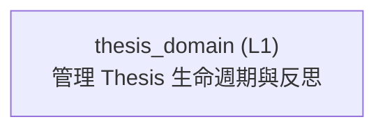

<!-- GENERATED BY govern-modular-event-architecture; DO NOT EDIT -->

# `thesis_domain`

## 結構圖

## 模組

| ID | Level | Role | 父模組 | 實作狀態 | 目的 |
|---|---|---|---|---|---|
| `thesis_domain` | L1 | domain | `thesis_trace_application` | implemented | Own personal Thesis lifecycle cycles, valuation drafts and immutable publications, invalidation conditions, Evidence links, Outcomes and Reflections. |

### `thesis_domain`

- **目的:** Own personal Thesis lifecycle cycles, valuation drafts and immutable publications, invalidation conditions, Evidence links, Outcomes and Reflections.
- **父模組:** `thesis_trace_application`
- **實作狀態:** `implemented`
- **輸入 Ports:** `thesis.create`, `thesis.query`, `thesis.save`, `thesis.transition`, `thesis.save_outcome`, `thesis.autosave_reflection`, `thesis.complete_reflection`, `thesis.save_valuation_draft`, `thesis.publish_valuation`
- **輸出 Ports:** `thesis.lifecycle_store`
- **輸出 Events:** 無
- **擁有狀態:** 無
- **副作用:** Persist owner-scoped current state, immutable lifecycle versions, cycles, conditions, links, Outcomes, Reflections, receipts and audit through a demand-owned port. (`-`)
- **異常:** `thesis_domain-error-1`: Reject illegal lifecycle transitions. → `application.thesis_operation_failed` → Reject illegal lifecycle transitions.
- **不變條件:** Thesis state is visible and mutable only by its personal owner.; Lifecycle versions, prior cycles, Outcomes, completed Reflections and published invalidation conditions are append-only.; Closing requires current-cycle Outcome and completed Reflection; invalidation never waits for Reflection.; Reopen starts exactly one new cycle and never rewrites a prior cycle.
- **程式入口:** [`ThesisService`](../../backend/src/thesis_trace/modules/thesis/service.py) (service)
- **公開 Symbols:** [`ThesisRecord`](../../backend/src/thesis_trace/modules/thesis/contracts.py) (contract) [`ThesisStatus`](../../backend/src/thesis_trace/modules/thesis/contracts.py) (contract) [`CreateThesisCommand`](../../backend/src/thesis_trace/modules/thesis/contracts.py) (contract) [`SaveThesisCommand`](../../backend/src/thesis_trace/modules/thesis/contracts.py) (contract) [`TransitionThesisCommand`](../../backend/src/thesis_trace/modules/thesis/contracts.py) (contract) [`SaveOutcomeCommand`](../../backend/src/thesis_trace/modules/thesis/contracts.py) (contract) [`SaveReflectionDraftCommand`](../../backend/src/thesis_trace/modules/thesis/contracts.py) (contract) [`CompleteReflectionCommand`](../../backend/src/thesis_trace/modules/thesis/contracts.py) (contract) [`ThesisInvalidationProjection`](../../backend/src/thesis_trace/modules/thesis/contracts.py) (contract) [`ThesisOutcome`](../../backend/src/thesis_trace/modules/thesis/contracts.py) (contract) [`ReflectionDraftRevision`](../../backend/src/thesis_trace/modules/thesis/contracts.py) (contract) [`ThesisReflection`](../../backend/src/thesis_trace/modules/thesis/contracts.py) (contract) [`ThesisTransitionPreview`](../../backend/src/thesis_trace/modules/thesis/contracts.py) (contract) [`ValuationDraft`](../../backend/src/thesis_trace/modules/thesis/contracts.py) (contract) [`ValuationSnapshot`](../../backend/src/thesis_trace/modules/thesis/contracts.py) (contract) [`SaveValuationDraftCommand`](../../backend/src/thesis_trace/modules/thesis/contracts.py) (contract) [`PublishValuationCommand`](../../backend/src/thesis_trace/modules/thesis/contracts.py) (contract) [`ThesisStorePort`](../../backend/src/thesis_trace/modules/thesis/ports.py) (port) [`ThesisService`](../../backend/src/thesis_trace/modules/thesis/service.py) (service)

## Port 契約

| ID | Owner | Direction | Kind | Timing | Description | Symbols |
|---|---|---|---|---|---|---|
| `thesis.save_valuation_draft` | `thesis_domain` | input | command | sync | Evaluate and save a versioned valuation draft.: SaveValuationDraftCommand. | `SaveValuationDraftCommand`, `ValuationDraft` |
| `thesis.publish_valuation` | `thesis_domain` | input | command | sync | Append an immutable confirmed valuation snapshot.: PublishValuationCommand. | `PublishValuationCommand`, `ValuationSnapshot` |
| `thesis.create` | `thesis_domain` | input | command | sync | Create one personal draft Thesis.: Thesis actor and Server-validated Company/research primitives. | `CreateThesisCommand`, `ThesisRecord` |
| `thesis.query` | `thesis_domain` | input | query | sync | Query owner-scoped Thesis cards details cycles and invalidation projections.: Thesis actor | `ThesisRecord`, `ThesisInvalidationProjection` |
| `thesis.save` | `thesis_domain` | input | command | sync | Save versioned Thesis fields conditions and Evidence links.: Save command with expected version and idempotency. | `SaveThesisCommand`, `ThesisRecord` |
| `thesis.transition` | `thesis_domain` | input | command | sync | Apply ALG-0013 to one personal Thesis.: Actor target status expected version reason confirmation metadata and Server time. | `TransitionThesisCommand`, `ThesisRecord`, `ThesisTransitionPreview` |
| `thesis.save_outcome` | `thesis_domain` | input | command | sync | Append a current-cycle Outcome version.: Outcome command and Server-validated Evidence references. | `SaveOutcomeCommand`, `ThesisOutcome`, `ThesisRecord` |
| `thesis.autosave_reflection` | `thesis_domain` | input | command | sync | Append an unfinished Reflection draft revision under ALG-0021.: Eligible field text expected draft version and idempotency. | `SaveReflectionDraftCommand`, `ReflectionDraftRevision` |
| `thesis.complete_reflection` | `thesis_domain` | input | command | sync | Append a completed current-cycle Reflection version.: Four required learning sections expected Thesis version reason and idempotency. | `CompleteReflectionCommand`, `ThesisReflection`, `ThesisRecord` |
| `thesis.lifecycle_store` | `thesis_domain` | output | dependency | sync | Atomically persist and query owner-scoped Thesis current state, immutable versions/cycles/conditions/links/Outcomes/Reflections/receipts/audit.: Thesis semantic commands and values without Access, Research, HTTP, ORM, SQL or session representations. | `ThesisStorePort` |

## Event 契約

| ID | Owner | Delivery | Emitted when | Purpose | Consumers |
|---|---|---|---|---|---|

## Type Catalog

| ID | Owner | Declaration | Visibility | Semantic kind | Consumers | References |
|---|---|---|---|---|---|---|
| `thesisstatus` | `thesis_domain` | `ThesisStatus` (enum, `backend/src/thesis_trace/modules/thesis/contracts.py`) | module-public | policy | `thesis_domain`, `postgres_thesis_adapter` | 無 |
| `thesisactorcontext` | `thesis_domain` | `ThesisActorContext` (class, `backend/src/thesis_trace/modules/thesis/contracts.py`) | module-public | domain-value | `thesis_domain`, `thesis_trace_application` | 無 |
| `thesisresearchreference` | `thesis_domain` | `ThesisResearchReference` (class, `backend/src/thesis_trace/modules/thesis/contracts.py`) | module-public | composition-mapping | `thesis_domain`, `thesis_trace_application`, `postgres_thesis_adapter` | 無 |
| `invalidationcondition` | `thesis_domain` | `InvalidationCondition` (class, `backend/src/thesis_trace/modules/thesis/contracts.py`) | module-public | domain-value | `thesis_domain`, `postgres_thesis_adapter`, `thesis_trace_application` | 無 |
| `thesisoutcome` | `thesis_domain` | `ThesisOutcome` (class, `backend/src/thesis_trace/modules/thesis/contracts.py`) | module-public | domain-value | `thesis_domain`, `postgres_thesis_adapter`, `thesis_trace_application` | `thesisresearchreference` |
| `reflectiondraftrevision` | `thesis_domain` | `ReflectionDraftRevision` (class, `backend/src/thesis_trace/modules/thesis/contracts.py`) | module-public | domain-value | `thesis_domain`, `postgres_thesis_adapter`, `thesis_trace_application` | 無 |
| `thesisreflection` | `thesis_domain` | `ThesisReflection` (class, `backend/src/thesis_trace/modules/thesis/contracts.py`) | module-public | domain-value | `thesis_domain`, `postgres_thesis_adapter`, `thesis_trace_application` | 無 |
| `thesisrecord` | `thesis_domain` | `ThesisRecord` (class, `backend/src/thesis_trace/modules/thesis/contracts.py`) | module-public | domain-value | `thesis_domain`, `postgres_thesis_adapter`, `thesis_trace_application` | `thesisstatus`, `invalidationcondition`, `thesisresearchreference`, `thesisoutcome`, `thesisreflection`, `reflectiondraftrevision` |
| `createthesiscommand` | `thesis_domain` | `CreateThesisCommand` (class, `backend/src/thesis_trace/modules/thesis/contracts.py`) | module-public | command | `thesis_domain`, `postgres_thesis_adapter` | `thesisactorcontext`, `thesisresearchreference` |
| `savethesiscommand` | `thesis_domain` | `SaveThesisCommand` (class, `backend/src/thesis_trace/modules/thesis/contracts.py`) | module-public | command | `thesis_domain`, `postgres_thesis_adapter` | `thesisactorcontext`, `thesisresearchreference` |
| `transitionthesiscommand` | `thesis_domain` | `TransitionThesisCommand` (class, `backend/src/thesis_trace/modules/thesis/contracts.py`) | module-public | command | `thesis_domain`, `postgres_thesis_adapter` | `thesisactorcontext`, `thesisstatus` |
| `saveoutcomecommand` | `thesis_domain` | `SaveOutcomeCommand` (class, `backend/src/thesis_trace/modules/thesis/contracts.py`) | module-public | command | `thesis_domain`, `postgres_thesis_adapter` | `thesisactorcontext`, `thesisresearchreference` |
| `savereflectiondraftcommand` | `thesis_domain` | `SaveReflectionDraftCommand` (class, `backend/src/thesis_trace/modules/thesis/contracts.py`) | module-public | command | `thesis_domain`, `postgres_thesis_adapter` | `thesisactorcontext` |
| `completereflectioncommand` | `thesis_domain` | `CompleteReflectionCommand` (class, `backend/src/thesis_trace/modules/thesis/contracts.py`) | module-public | command | `thesis_domain`, `postgres_thesis_adapter` | `thesisactorcontext` |
| `thesisinvalidationprojection` | `thesis_domain` | `ThesisInvalidationProjection` (class, `backend/src/thesis_trace/modules/thesis/contracts.py`) | module-public | composition-mapping | `thesis_domain`, `thesis_trace_application` | 無 |
| `thesistransitionpreview` | `thesis_domain` | `ThesisTransitionPreview` (class, `backend/src/thesis_trace/modules/thesis/contracts.py`) | module-public | query | `thesis_domain`, `thesis_trace_application` | `thesisstatus` |
| `thesisstoreport` | `thesis_domain` | `ThesisStorePort` (protocol, `backend/src/thesis_trace/modules/thesis/ports.py`) | module-public | port | `thesis_domain`, `postgres_thesis_adapter` | `thesisrecord`, `createthesiscommand`, `savethesiscommand`, `transitionthesiscommand`, `saveoutcomecommand`, `savereflectiondraftcommand`, `completereflectioncommand`, `thesisinvalidationprojection` |
| `thesisservice` | `thesis_domain` | `ThesisService` (class, `backend/src/thesis_trace/modules/thesis/service.py`) | module-public | policy | `backend_composition`, `thesis_trace_application` | `thesisstoreport`, `thesisrecord`, `createthesiscommand`, `savethesiscommand`, `transitionthesiscommand`, `saveoutcomecommand`, `savereflectiondraftcommand`, `completereflectioncommand`, `thesisinvalidationprojection`, `thesistransitionpreview` |
| `valuationmethod` | `thesis_domain` | `ValuationMethod` (enum, `backend/src/thesis_trace/modules/thesis/contracts.py`) | module-public | domain-value | `thesis_domain`, `postgres_thesis_adapter`, `thesis_trace_application` | 無 |
| `valuationcoverage` | `thesis_domain` | `ValuationCoverage` (enum, `backend/src/thesis_trace/modules/thesis/contracts.py`) | module-public | domain-value | `thesis_domain`, `postgres_thesis_adapter` | 無 |
| `valuationdistribution` | `thesis_domain` | `ValuationDistribution` (class, `backend/src/thesis_trace/modules/thesis/contracts.py`) | module-public | domain-value | `thesis_domain`, `postgres_thesis_adapter`, `thesis_trace_application` | `valuationcoverage` |
| `valuationsample` | `thesis_domain` | `ValuationSample` (class, `backend/src/thesis_trace/modules/thesis/contracts.py`) | module-public | domain-value | `thesis_domain`, `postgres_thesis_adapter`, `thesis_trace_application` | `thesisresearchreference` |
| `peervaluationmember` | `thesis_domain` | `PeerValuationMember` (class, `backend/src/thesis_trace/modules/thesis/contracts.py`) | module-public | domain-value | `thesis_domain`, `postgres_thesis_adapter`, `thesis_trace_application` | `valuationmethod`, `valuationsample` |
| `valuationbenchmarksnapshot` | `thesis_domain` | `ValuationBenchmarkSnapshot` (class, `backend/src/thesis_trace/modules/thesis/contracts.py`) | module-public | domain-value | `thesis_domain`, `postgres_thesis_adapter`, `thesis_trace_application` | `valuationdistribution`, `valuationsample` |
| `valuationvalidity` | `thesis_domain` | `ValuationValidity` (class, `backend/src/thesis_trace/modules/thesis/contracts.py`) | module-public | domain-value | `thesis_domain`, `postgres_thesis_adapter`, `thesis_trace_application` | 無 |
| `valuationreturn` | `thesis_domain` | `ValuationReturn` (class, `backend/src/thesis_trace/modules/thesis/contracts.py`) | module-public | domain-value | `thesis_domain`, `postgres_thesis_adapter`, `thesis_trace_application` | 無 |
| `valuationdraft` | `thesis_domain` | `ValuationDraft` (class, `backend/src/thesis_trace/modules/thesis/contracts.py`) | module-public | domain-value | `thesis_domain`, `postgres_thesis_adapter`, `thesis_trace_application` | `valuationmethod`, `valuationdistribution`, `valuationvalidity`, `valuationreturn`, `valuationbenchmarksnapshot`, `peervaluationmember` |
| `valuationsnapshot` | `thesis_domain` | `ValuationSnapshot` (class, `backend/src/thesis_trace/modules/thesis/contracts.py`) | module-public | domain-value | `thesis_domain`, `postgres_thesis_adapter`, `thesis_trace_application` | `valuationdraft` |
| `savevaluationdraftcommand` | `thesis_domain` | `SaveValuationDraftCommand` (class, `backend/src/thesis_trace/modules/thesis/contracts.py`) | module-public | command | `thesis_domain` | `thesisactorcontext`, `valuationmethod` |
| `publishvaluationcommand` | `thesis_domain` | `PublishValuationCommand` (class, `backend/src/thesis_trace/modules/thesis/contracts.py`) | module-public | command | `thesis_domain` | `thesisactorcontext` |
| `valuationabstained` | `thesis_domain` | `ValuationAbstained` (class, `backend/src/thesis_trace/modules/thesis/valuation.py`) | module-public | policy | `thesis_domain`, `thesis_trace_application` | 無 |

## State Ownership

| ID | Owner | Declaration | Type | Visibility | Mutability | Read authority | Write authority |
|---|---|---|---|---|---|---|---|

## Cross-module Mapping

| Interaction | Producer | Consumer | Parent | Producer contract | Consumer contract | Mapping owner | State accessed | Allowed edges | Forbidden edges |
|---|---|---|---|---|---|---|---|---|---|

## 端到端 Flows
