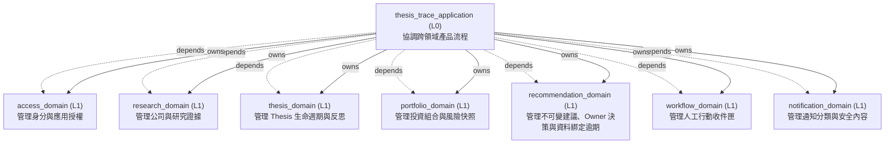
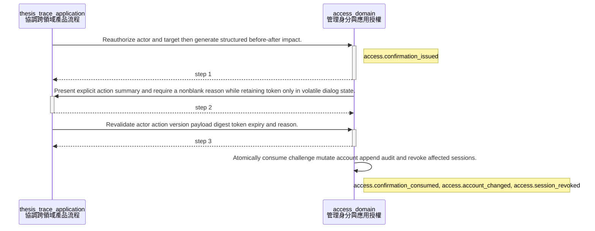
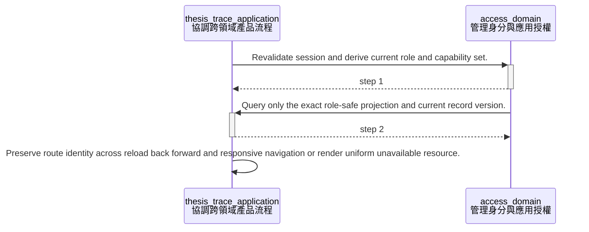
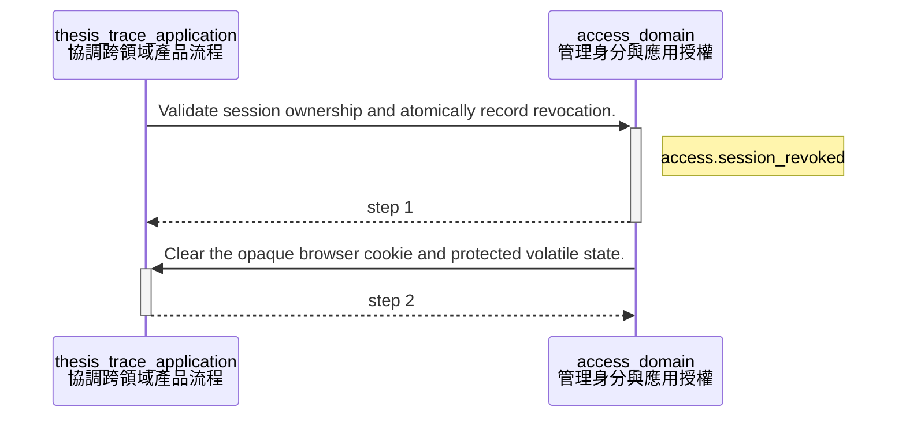
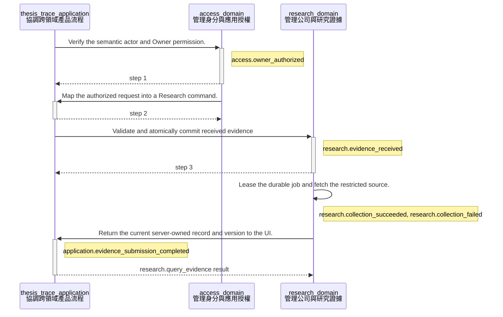
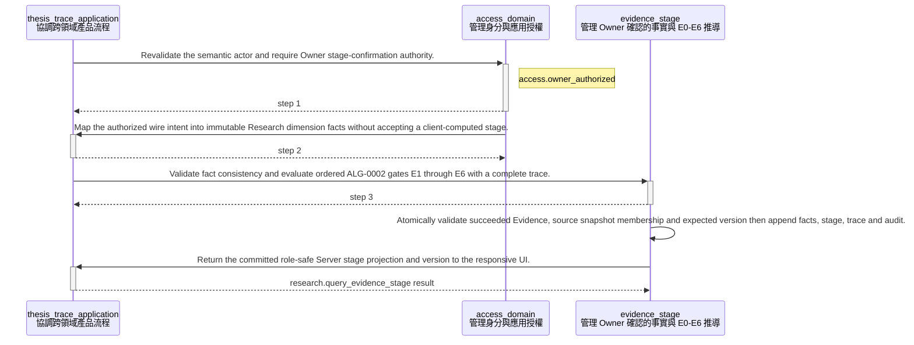
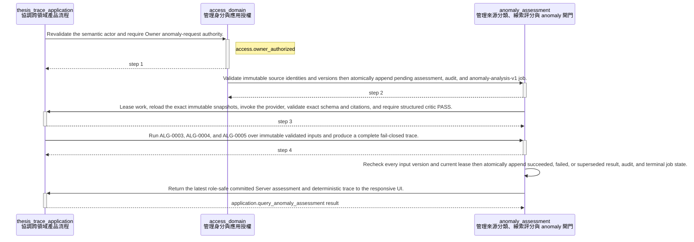
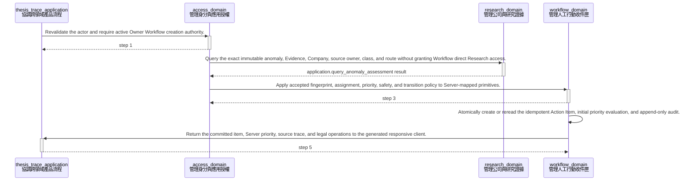
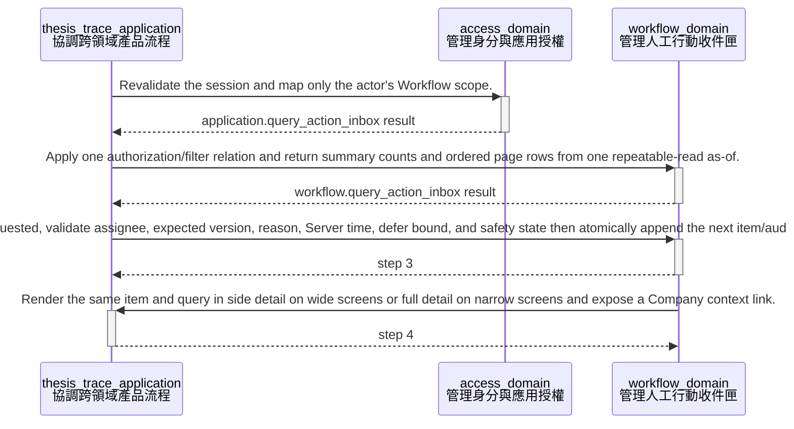

<!-- GENERATED BY govern-modular-event-architecture; DO NOT EDIT -->

# `thesis_trace_application`

## 結構圖



## 模組

| ID | Level | Role | 父模組 | 實作狀態 | 目的 |
|---|---|---|---|---|---|
| `thesis_trace_application` | L0 | orchestration | `-` | implemented | Coordinate authenticated cross-domain product flows without owning domain state. |
| `access_domain` | L1 | domain | `thesis_trace_application` | implemented | Own authenticated actor identity and application authorization decisions. |
| `research_domain` | L1 | domain | `thesis_trace_application` | implemented | Own companies, evidence provenance, collection lifecycle, evidence stages, and anomaly facts. |
| `thesis_domain` | L1 | domain | `thesis_trace_application` | implemented | Own personal Thesis lifecycle cycles, valuation drafts and immutable publications, invalidation conditions, Evidence links, Outcomes and Reflections. |
| `portfolio_domain` | L1 | domain | `thesis_trace_application` | implemented | Own versioned Cost Profiles, investable cash, canonical Trades, bucket allocations, holdings and deterministic exposure snapshots. |
| `recommendation_domain` | L1 | domain | `thesis_trace_application` | planned | Own version-bound investment recommendations, validated candidate evidence and append-only Owner decisions under accepted ADR-0009; no trading authority. |
| `workflow_domain` | L1 | domain | `thesis_trace_application` | implemented | Own actionable work items, deterministic priority and safety floors, assignment, lifecycle, recurrence, and consistent inbox queries. |
| `notification_domain` | L1 | domain | `thesis_trace_application` | planned | Own notification classification |

### `thesis_trace_application`

- **目的:** Coordinate authenticated cross-domain product flows without owning domain state.
- **父模組:** `-`
- **實作狀態:** `implemented`
- **輸入 Ports:** `application.request_recommendation`, `application.query_recommendation`, `application.decide_recommendation`, `application.process_recommendation`, `application.reconcile_recommendation_expiry`, `application.submit_evidence`, `application.confirm_evidence_stage`, `application.query_evidence_stage`, `application.request_anomaly_assessment`, `application.query_anomaly_assessment`, `application.process_anomaly_job`, `application.create_anomaly_review_action`, `application.query_action_inbox`, `application.query_action_item`, `application.transition_action_item`, `application.create_personal_thesis`, `application.query_personal_theses`, `application.save_personal_thesis`, `application.transition_personal_thesis`, `application.save_thesis_outcome`, `application.autosave_thesis_reflection`, `application.complete_thesis_reflection`, `application.save_valuation_draft`, `application.publish_valuation`, `application.manage_portfolio`, `application.confirm_portfolio_trade`
- **輸出 Ports:** `application.recommendation_transaction`, `application.investment_provider`, `application.investment_critic`, `application.events`, `application.recommendation_provider`, `application.recommendation_critic`
- **輸出 Events:** `application.recommendation_operation_resolved`, `application.evidence_submission_completed`, `application.action_item_operation_failed`, `application.thesis_operation_failed`
- **擁有狀態:** 無
- **副作用:** Coordinate child commands and map child events. (`-`)
- **異常:** `thesis_trace_application-error-1`: Reject unauthenticated or unauthorized commands → `application.evidence_submission_completed` → Reject unauthenticated or unauthorized commands; `thesis_trace_application-error-2`: Propagate child admission failures. → `application.evidence_submission_completed` → Propagate child admission failures.
- **不變條件:** Sibling domains communicate only through this parent; Domain state remains child-owned.
- **程式入口:** [`EvidenceIntakeFlow`](../../backend/src/thesis_trace/application/flows/evidence_intake.py) (orchestrator)<br>[`EvidenceStageFlow`](../../backend/src/thesis_trace/application/flows/evidence_stage.py) (orchestrator)
- **公開 Symbols:** [`RecommendationFlow`](../../backend/src/thesis_trace/application/contracts.py) (class)<br>[`RecommendationTransactionPort`](../../backend/src/thesis_trace/application/contracts.py) (protocol)<br>[`RecommendationView`](../../backend/src/thesis_trace/application/contracts.py) (class)<br>[`InvestmentAnalysisRequest`](../../backend/src/thesis_trace/application/contracts.py) (class)<br>[`RecommendationPublicationCommand`](../../backend/src/thesis_trace/application/contracts.py) (class)<br>[`RecommendationAdmissionCommand`](../../backend/src/thesis_trace/application/contracts.py) (class)<br>[`RecommendationDecisionCommand`](../../backend/src/thesis_trace/application/contracts.py) (class)<br>[`RecommendationDecisionPreview`](../../backend/src/thesis_trace/application/contracts.py) (class)<br>[`SubmitEvidenceRequest`](../../backend/src/thesis_trace/application/contracts.py) (contract)<br>[`EvidenceStageFlow`](../../backend/src/thesis_trace/application/flows/evidence_stage.py) (orchestrator)<br>[`ConfirmEvidenceStageRequest`](../../backend/src/thesis_trace/application/flows/evidence_stage.py) (contract)<br>[`QueryEvidenceStageRequest`](../../backend/src/thesis_trace/application/flows/evidence_stage.py) (contract)<br>[`EvidenceStageFactsResult`](../../backend/src/thesis_trace/application/flows/evidence_stage.py) (contract)<br>[`EvidenceStageGateResult`](../../backend/src/thesis_trace/application/flows/evidence_stage.py) (contract)<br>[`EvidenceStageResult`](../../backend/src/thesis_trace/application/flows/evidence_stage.py) (contract)<br>[`AnomalyAssessmentFlow`](../../backend/src/thesis_trace/application/flows/anomaly_assessment.py) (orchestrator)<br>[`AnomalyJobProcessor`](../../backend/src/thesis_trace/application/flows/anomaly_assessment.py) (orchestrator)<br>[`RequestAnomalyAssessment`](../../backend/src/thesis_trace/application/flows/anomaly_assessment.py) (contract)<br>[`AnomalySourceInput`](../../backend/src/thesis_trace/application/flows/anomaly_assessment.py) (contract)<br>[`AnomalyAssessmentResult`](../../backend/src/thesis_trace/application/flows/anomaly_assessment.py) (contract)<br>[`AnomalyGateResult`](../../backend/src/thesis_trace/application/flows/anomaly_assessment.py) (contract)<br>[`AnomalyTraceResult`](../../backend/src/thesis_trace/application/flows/anomaly_assessment.py) (contract)<br>[`ActionInboxFlow`](../../backend/src/thesis_trace/application/flows/anomaly_assessment.py) (orchestrator)<br>[`CreateAnomalyReviewActionRequest`](../../backend/src/thesis_trace/application/flows/anomaly_assessment.py) (contract)<br>[`QueryActionInboxRequest`](../../backend/src/thesis_trace/application/flows/anomaly_assessment.py) (contract)<br>[`QueryActionItemRequest`](../../backend/src/thesis_trace/application/flows/anomaly_assessment.py) (contract)<br>[`TransitionActionItemRequest`](../../backend/src/thesis_trace/application/flows/anomaly_assessment.py) (contract)<br>[`ActionItemResult`](../../backend/src/thesis_trace/application/flows/anomaly_assessment.py) (contract)<br>[`ActionInboxResult`](../../backend/src/thesis_trace/application/flows/anomaly_assessment.py) (contract)<br>[`ThesisLifecycleFlow`](../../backend/src/thesis_trace/application/contracts.py) (orchestrator)<br>[`ThesisLifecycleRequest`](../../backend/src/thesis_trace/application/contracts.py) (contract)<br>[`ThesisLifecycleResult`](../../backend/src/thesis_trace/application/contracts.py) (contract)<br>[`ValuationFlow`](../../backend/src/thesis_trace/application/contracts.py) (orchestrator)<br>[`PortfolioFlow`](../../backend/src/thesis_trace/application/contracts.py) (orchestrator)<br>[`ThesisConfirmedTransitionPort`](../../backend/src/thesis_trace/application/contracts.py) (port)<br>[`ValuationConfirmedPublicationPort`](../../backend/src/thesis_trace/application/contracts.py) (port)<br>[`PortfolioConfirmedTradePort`](../../backend/src/thesis_trace/application/contracts.py) (port)<br>[`RecommendationProviderPort`](../../backend/src/thesis_trace/application/ai_ports.py) (port)<br>[`RecommendationCriticPort`](../../backend/src/thesis_trace/application/ai_ports.py) (port)<br>[`RecommendationProviderRequest`](../../backend/src/thesis_trace/application/ai_ports.py) (contract)<br>[`RecommendationCriticRequest`](../../backend/src/thesis_trace/application/ai_ports.py) (contract)<br>[`AnalysisSource`](../../backend/src/thesis_trace/application/ai_ports.py) (contract)<br>[`ValidatedAnomalyCandidate`](../../backend/src/thesis_trace/application/ai_ports.py) (contract)

### `access_domain`

- **目的:** Own authenticated actor identity and application authorization decisions.
- **父模組:** `thesis_trace_application`
- **實作狀態:** `implemented`
- **輸入 Ports:** `access.authorize_owner`
- **輸出 Ports:** `access.events`, `access.security_context`
- **輸出 Events:** `access.owner_authorized`, `access.session_established`, `access.account_changed`, `access.confirmation_consumed`
- **擁有狀態:** 無
- **副作用:** 無
- **異常:** `access_domain-error-1`: Reject absent → `access.owner_authorized` → Reject absent; `access_domain-error-2`: expired → `access.owner_authorized` → expired; `access_domain-error-3`: or unauthorized identities. → `access.owner_authorized` → or unauthorized identities.
- **不變條件:** Provider identity never collapses by email alone; JWT subject and provider discriminator resolve through a preapproved mapping.; Unknown provider, identity, session, role, or challenge fails closed without existence disclosure.; Authorization fails closed.
- **程式入口:** [`AuthenticatedActor`](../../backend/src/thesis_trace/modules/access/contracts.py) (contract)<br>[`AccountActionService`](../../backend/src/thesis_trace/modules/access/orchestration.py) (orchestrator)
- **公開 Symbols:** [`AuthenticatedActor`](../../backend/src/thesis_trace/modules/access/contracts.py) (contract)<br>[`SecurityContext`](../../backend/src/thesis_trace/modules/access/contracts.py) (contract)<br>[`AccountActionService`](../../backend/src/thesis_trace/modules/access/orchestration.py) (service)<br>[`RecoveryPolicyConfiguration`](../../backend/src/thesis_trace/modules/access/recovery_policy.py) (configuration)

### `research_domain`

- **目的:** Own companies, evidence provenance, collection lifecycle, evidence stages, and anomaly facts.
- **父模組:** `thesis_trace_application`
- **實作狀態:** `implemented`
- **輸入 Ports:** `research.submit_evidence`, `research.query_evidence`
- **輸出 Ports:** `research.events`
- **輸出 Events:** `research.evidence_received`, `research.collection_succeeded`, `research.collection_failed`
- **擁有狀態:** 無
- **副作用:** Persist evidence state through demand-owned ports (`-`); Request restricted source collection. (`-`)
- **異常:** `research_domain-error-1`: Reject invalid URLs or stale company versions → `research.evidence_received` → Reject invalid URLs or stale company versions; `research_domain-error-2`: Record safe retry and terminal failures. → `research.evidence_received` → Record safe retry and terminal failures.
- **不變條件:** State commits before success events; Evidence streams are serialized; Source records are immutable.
- **程式入口:** [`EvidenceRecord`](../../backend/src/thesis_trace/modules/research/evidence_intake/contracts.py) (contract)
- **公開 Symbols:** [`ResearchActorContext`](../../backend/src/thesis_trace/modules/research/__init__.py) (contract)<br>[`ResearchStageFacade`](../../backend/src/thesis_trace/modules/research/__init__.py) (orchestrator)<br>[`ResearchStageConfirmationRequest`](../../backend/src/thesis_trace/modules/research/__init__.py) (contract)<br>[`ResearchStageQuery`](../../backend/src/thesis_trace/modules/research/__init__.py) (contract)<br>[`ResearchStageFacts`](../../backend/src/thesis_trace/modules/research/__init__.py) (contract)<br>[`ResearchStageGate`](../../backend/src/thesis_trace/modules/research/__init__.py) (contract)<br>[`ResearchStageResult`](../../backend/src/thesis_trace/modules/research/__init__.py) (contract)<br>[`ResearchAnomalyFacade`](../../backend/src/thesis_trace/modules/research/__init__.py) (orchestrator)<br>[`ResearchAnomalySource`](../../backend/src/thesis_trace/modules/research/__init__.py) (contract)<br>[`ResearchAnomalyRequest`](../../backend/src/thesis_trace/modules/research/__init__.py) (contract)<br>[`ResearchValidatedAnomalyCandidate`](../../backend/src/thesis_trace/modules/research/__init__.py) (contract)<br>[`ResearchAnomalyJob`](../../backend/src/thesis_trace/modules/research/__init__.py) (contract)<br>[`ResearchAnomalyGate`](../../backend/src/thesis_trace/modules/research/__init__.py) (contract)<br>[`ResearchAnomalyTrace`](../../backend/src/thesis_trace/modules/research/__init__.py) (contract)<br>[`ResearchAnomalyResult`](../../backend/src/thesis_trace/modules/research/__init__.py) (contract)<br>[`ResearchRecordReference`](../../backend/src/thesis_trace/modules/research/__init__.py) (contract)<br>[`ResearchRecommendationSource`](../../backend/src/thesis_trace/modules/research/__init__.py) (contract)<br>[`ResearchRecommendationQueryPort`](../../backend/src/thesis_trace/modules/research/__init__.py) (port)<br>[`ResearchRecommendationFacade`](../../backend/src/thesis_trace/modules/research/__init__.py) (orchestrator)<br>[`EvidenceRecord`](../../backend/src/thesis_trace/modules/research/evidence_intake/contracts.py) (contract)

### `thesis_domain`

- **目的:** Own personal Thesis lifecycle cycles, valuation drafts and immutable publications, invalidation conditions, Evidence links, Outcomes and Reflections.
- **父模組:** `thesis_trace_application`
- **實作狀態:** `implemented`
- **輸入 Ports:** `thesis.create`, `thesis.query`, `thesis.save`, `thesis.transition`, `thesis.save_outcome`, `thesis.autosave_reflection`, `thesis.complete_reflection`, `thesis.save_valuation_draft`, `thesis.publish_valuation`
- **輸出 Ports:** `thesis.lifecycle_store`
- **輸出 Events:** 無
- **擁有狀態:** 無
- **副作用:** Persist owner-scoped current state, immutable lifecycle versions, cycles, conditions, links, Outcomes, Reflections, receipts and audit through a demand-owned port. (`-`)
- **異常:** `thesis_domain-error-1`: Reject illegal lifecycle transitions. → `application.thesis_operation_failed` → Reject illegal lifecycle transitions.
- **不變條件:** Thesis state is visible and mutable only by its personal owner.; Lifecycle versions, prior cycles, Outcomes, completed Reflections and published invalidation conditions are append-only.; Closing requires current-cycle Outcome and completed Reflection; invalidation never waits for Reflection.; Reopen starts exactly one new cycle and never rewrites a prior cycle.
- **程式入口:** [`ThesisService`](../../backend/src/thesis_trace/modules/thesis/service.py) (service)
- **公開 Symbols:** [`ThesisRecord`](../../backend/src/thesis_trace/modules/thesis/contracts.py) (contract)<br>[`ThesisStatus`](../../backend/src/thesis_trace/modules/thesis/contracts.py) (contract)<br>[`CreateThesisCommand`](../../backend/src/thesis_trace/modules/thesis/contracts.py) (contract)<br>[`SaveThesisCommand`](../../backend/src/thesis_trace/modules/thesis/contracts.py) (contract)<br>[`TransitionThesisCommand`](../../backend/src/thesis_trace/modules/thesis/contracts.py) (contract)<br>[`SaveOutcomeCommand`](../../backend/src/thesis_trace/modules/thesis/contracts.py) (contract)<br>[`SaveReflectionDraftCommand`](../../backend/src/thesis_trace/modules/thesis/contracts.py) (contract)<br>[`CompleteReflectionCommand`](../../backend/src/thesis_trace/modules/thesis/contracts.py) (contract)<br>[`ThesisInvalidationProjection`](../../backend/src/thesis_trace/modules/thesis/contracts.py) (contract)<br>[`ThesisOutcome`](../../backend/src/thesis_trace/modules/thesis/contracts.py) (contract)<br>[`ReflectionDraftRevision`](../../backend/src/thesis_trace/modules/thesis/contracts.py) (contract)<br>[`ThesisReflection`](../../backend/src/thesis_trace/modules/thesis/contracts.py) (contract)<br>[`ThesisTransitionPreview`](../../backend/src/thesis_trace/modules/thesis/contracts.py) (contract)<br>[`ValuationDraft`](../../backend/src/thesis_trace/modules/thesis/contracts.py) (contract)<br>[`ValuationSnapshot`](../../backend/src/thesis_trace/modules/thesis/contracts.py) (contract)<br>[`SaveValuationDraftCommand`](../../backend/src/thesis_trace/modules/thesis/contracts.py) (contract)<br>[`PublishValuationCommand`](../../backend/src/thesis_trace/modules/thesis/contracts.py) (contract)<br>[`ThesisStorePort`](../../backend/src/thesis_trace/modules/thesis/ports.py) (port)<br>[`ThesisService`](../../backend/src/thesis_trace/modules/thesis/service.py) (service)

### `portfolio_domain`

- **目的:** Own versioned Cost Profiles, investable cash, canonical Trades, bucket allocations, holdings and deterministic exposure snapshots.
- **父模組:** `thesis_trace_application`
- **實作狀態:** `implemented`
- **輸入 Ports:** 無
- **輸出 Ports:** `portfolio.store`
- **輸出 Events:** 無
- **擁有狀態:** 無
- **副作用:** Persist owner-scoped current and append-only Portfolio state through a demand-owned port. (`-`)
- **異常:** `portfolio_domain-error-1`: Reject incomplete or over-allocated trades. → `application.evidence_submission_completed` → Reject incomplete or over-allocated trades.
- **不變條件:** Risk aggregates all buckets for a security.; DCA sizing uses explicit buy price and CostProfileSnapshot; cash includes buy fees and exposures use official close, with exact cap comparisons before presentation rounding.
- **程式入口:** [`PortfolioService`](../../backend/src/thesis_trace/modules/portfolio/service.py) (service)
- **公開 Symbols:** [`PortfolioRecommendationSnapshot`](../../backend/src/thesis_trace/modules/portfolio/contracts.py) (class)<br>[`PortfolioService`](../../backend/src/thesis_trace/modules/portfolio/service.py) (service)<br>[`PortfolioStorePort`](../../backend/src/thesis_trace/modules/portfolio/ports.py) (port)<br>[`PortfolioRecord`](../../backend/src/thesis_trace/modules/portfolio/contracts.py) (contract)<br>[`TradePreview`](../../backend/src/thesis_trace/modules/portfolio/contracts.py) (contract)

### `recommendation_domain`

- **目的:** Own version-bound investment recommendations, validated candidate evidence and append-only Owner decisions under accepted ADR-0009; no trading authority.
- **父模組:** `thesis_trace_application`
- **實作狀態:** `planned`
- **輸入 Ports:** `recommendation.request`, `recommendation.query`, `recommendation.decide`, `recommendation.reconcile_expiry`
- **輸出 Ports:** `recommendation.store`
- **輸出 Events:** 無
- **擁有狀態:** 無
- **副作用:** Planned owner-scoped request/job, immutable recommendation/decision and audit writes through demand ports. (`-`)
- **異常:** 無
- **不變條件:** DEC-105 expires only unfinalized recommendations; accepted/rejected history is immutable.; AI cannot override valuation, risk, Owner authority or formal-Hard activation.; Cross-domain state is mapped by L0 and atomically persisted by owner adapters; no sibling access.; ADR-0009 and ALG-0032/0033/0034 accepted by project owner on 2026-09-05; Wave 7 remains planned until integration and validation complete.
- **程式入口:** [`RecommendationService`](../../backend/src/thesis_trace/modules/recommendation/service.py) (service)
- **公開 Symbols:** [`RecommendationActor`](../../backend/src/thesis_trace/modules/recommendation/contracts.py) (class)<br>[`BoundRecommendationInput`](../../backend/src/thesis_trace/modules/recommendation/contracts.py) (class)<br>[`RecommendationSource`](../../backend/src/thesis_trace/modules/recommendation/contracts.py) (class)<br>[`RecommendationInputSnapshot`](../../backend/src/thesis_trace/modules/recommendation/contracts.py) (class)<br>[`RecommendationCandidate`](../../backend/src/thesis_trace/modules/recommendation/contracts.py) (class)<br>[`RecommendationRecord`](../../backend/src/thesis_trace/modules/recommendation/contracts.py) (class)<br>[`OwnerDecision`](../../backend/src/thesis_trace/modules/recommendation/contracts.py) (class)<br>[`RecommendationJob`](../../backend/src/thesis_trace/modules/recommendation/contracts.py) (class)<br>[`RecommendationStorePort`](../../backend/src/thesis_trace/modules/recommendation/ports.py) (protocol)<br>[`RecommendationService`](../../backend/src/thesis_trace/modules/recommendation/service.py) (service)

### `workflow_domain`

- **目的:** Own actionable work items, deterministic priority and safety floors, assignment, lifecycle, recurrence, and consistent inbox queries.
- **父模組:** `thesis_trace_application`
- **實作狀態:** `implemented`
- **輸入 Ports:** `workflow.create_action_item`, `workflow.query_action_inbox`, `workflow.query_action_item`, `workflow.transition_action_item`
- **輸出 Ports:** `workflow.action_item_store`
- **輸出 Events:** 無
- **擁有狀態:** 無
- **副作用:** Persist Action Items, exact and material trigger fingerprints, recurrence links, actor-scoped idempotency receipts, priority evaluations, and append-only audit through a demand-owned port. (`-`)
- **異常:** 無
- **不變條件:** System priority and safety floors are server-owned.; Terminal Action Items never reopen or rewrite source records.; Assignees derive only from Server-owned identity and source ownership.; Version-only source changes with identical material handling reuse the existing item; materially new work links the most relevant terminal item.; Exact transition retries replay their committed result before stale-version rejection.
- **程式入口:** [`WorkflowService`](../../backend/src/thesis_trace/modules/workflow/service.py) (service)
- **公開 Symbols:** [`ActionItem`](../../backend/src/thesis_trace/modules/workflow/contracts.py) (contract)<br>[`ActionInboxPage`](../../backend/src/thesis_trace/modules/workflow/contracts.py) (contract)<br>[`CreateActionItemCommand`](../../backend/src/thesis_trace/modules/workflow/contracts.py) (contract)<br>[`TransitionActionItemCommand`](../../backend/src/thesis_trace/modules/workflow/contracts.py) (contract)<br>[`ActionInboxQuery`](../../backend/src/thesis_trace/modules/workflow/contracts.py) (contract)<br>[`ActionItemStorePort`](../../backend/src/thesis_trace/modules/workflow/ports.py) (port)<br>[`WorkflowService`](../../backend/src/thesis_trace/modules/workflow/service.py) (service)

### `notification_domain`

- **目的:** Own notification classification
- **父模組:** `thesis_trace_application`
- **實作狀態:** `planned`
- **輸入 Ports:** 無
- **輸出 Ports:** 無
- **輸出 Events:** 無
- **擁有狀態:** 無
- **副作用:** 無
- **異常:** `notification_domain-error-1`: Dead-letter permanent delivery failures. → `application.evidence_submission_completed` → Dead-letter permanent delivery failures.
- **不變條件:** Forbidden portfolio data never enters message content.
- **程式入口:** [`notification_domain_contract`](../../backend/src/thesis_trace/modules/notification/service.py) (boundary)<br>[`ThesisConfirmedTransitionPort`](../../backend/src/thesis_trace/application/contracts.py) (port)
- **公開 Symbols:** [`notification_domain_contract`](../../backend/src/thesis_trace/modules/notification/service.py) (boundary)

## Port 契約

| ID | Owner | Direction | Kind | Timing | Description | Symbols |
|---|---|---|---|---|---|---|
| `recommendation.request` | `recommendation_domain` | input | command | sync | Admit exact immutable inputs and typed analysis work.: Owner, active Thesis/cycle, immutable bound input identities and explicit source intent. | `RecommendationInputSnapshot` |
| `recommendation.query` | `recommendation_domain` | input | query | sync | Return immutable history and current input validity without mutating on read.: Authorized Owner, exact Recommendation identity/version. | `RecommendationRecord` |
| `recommendation.decide` | `recommendation_domain` | input | command | sync | Append a legal Owner Decision under ALG-0033.: Expected decision sequence, reason, action and exact confirmation when consequential. | `OwnerDecision` |
| `recommendation.reconcile_expiry` | `recommendation_domain` | input | command | sync | Evaluate DEC-105 against current parent-resolved bound inputs.: Exact current versions and transaction time; never accepted/rejected history. | `BoundRecommendationInput` |
| `recommendation.store` | `recommendation_domain` | output | dependency | sync | Persist normalized Recommendation state, immutable decisions and leased version-bound work.: Owner-scoped semantic request/job/record/decision values; no SQL handles. | `RecommendationStorePort` |
| `research.recommendation_query` | `research_domain` | output | dependency | sync | Read immutable source provenance and current Evidence/stage identities through their Research owner.: ResearchRecommendationSource; no Recommendation DTO or SQL row crosses this boundary. | `ResearchRecommendationQueryPort`, `ResearchRecommendationSource` |
| `application.request_recommendation` | `thesis_trace_application` | input | command | sync | Resolve Owner intent and immutable child inputs for planned Wave 7 admission.: Thesis/valuation/source identities, expected versions, selection reason and idempotency. | `RecommendationFlow` |
| `application.query_recommendation` | `thesis_trace_application` | input | query | sync | Return one role-safe Recommendation workspace projection.: Owner-visible exact record, decision history, validity, reasons and allowed actions. | `RecommendationView` |
| `application.decide_recommendation` | `thesis_trace_application` | input | command | sync | Coordinate preview and atomic Owner decision with Workflow outcome.: Exact action/target/version, reason, reminder and optional single-use challenge. | `RecommendationFlow` |
| `application.process_recommendation` | `thesis_trace_application` | input | command | async | Lease and process one investment-analysis job outside API execution.: Pinned source/model/prompt/schema/build tuple and fenced publication. | `RecommendationFlow` |
| `application.reconcile_recommendation_expiry` | `thesis_trace_application` | input | command | async | Coordinate bounded owner-port expiry and reminder reconciliation.: Stable cursor and exact critical-input versions; no network I/O. | `RecommendationFlow` |
| `application.recommendation_transaction` | `thesis_trace_application` | output | command | sync | Commit owner-valid admission/publication/decision/expiry and Workflow state atomically.: SQL-free application intent, bound versions, lease/challenge, reason and idempotency. | `RecommendationTransactionPort` |
| `application.investment_provider` | `thesis_trace_application` | output | query | async | Request an untrusted investment candidate from pinned sources, not an anomaly label.: Bound research/valuation context, candidate schema/model/prompt/build; no final financial authority. | `InvestmentAnalysisRequest` |
| `application.investment_critic` | `thesis_trace_application` | output | query | async | Request claim-exact independent critic evidence for the investment candidate.: Pinned sources, exact candidate digest/claims and critic versions. | `InvestmentAnalysisRequest` |
| `application.submit_evidence` | `thesis_trace_application` | input | command | async | Submit an authenticated Evidence URL intent.: Actor | `SubmitEvidenceRequest` |
| `application.confirm_evidence_stage` | `thesis_trace_application` | input | command | sync | Admit an authenticated Owner intent to confirm dimension facts for one Evidence snapshot.: Actor, Evidence and snapshot identity, expected version, facts, reason and idempotency key. | `EvidenceStageFlow`, `ConfirmEvidenceStageRequest`, `EvidenceStageResult` |
| `application.query_evidence_stage` | `thesis_trace_application` | input | query | sync | Query one role-safe Server-authoritative Evidence stage projection.: Authenticated actor and Evidence identity. | `EvidenceStageFlow`, `QueryEvidenceStageRequest`, `EvidenceStageResult` |
| `application.request_anomaly_assessment` | `thesis_trace_application` | input | command | sync | Admit an authenticated Owner request for a version-bound anomaly assessment.: Actor, Evidence and immutable snapshot identities, expected Evidence version, reason, and idempotency key; source characteristics and all policy values remain Server-owned. | `RequestAnomalyAssessment`, `AnomalyAssessmentResult` |
| `application.query_anomaly_assessment` | `thesis_trace_application` | input | query | sync | Query one role-safe Server-authoritative anomaly assessment projection and trace.: Authenticated actor and assessment identity. | `AnomalyAssessmentResult` |
| `application.process_anomaly_job` | `thesis_trace_application` | input | command | async | Process one leased anomaly job through provider, strict validator, critic, Research policy, and atomic result commit.: Opaque lease, assessment/input versions, correlation metadata, and exact build/model/prompt/schema/critic/policy tuple. | `AnomalyJobProcessor` |
| `application.create_anomaly_review_action` | `thesis_trace_application` | input | command | sync | Resolve one immutable actionable anomaly version and synchronously create or return its Server-authoritative Action Item.: Authenticated Owner, assessment identity/version, optional due time, reason, and idempotency key; assignee, priority, safety, Company, and trigger facts remain Server-owned. | `CreateAnomalyReviewActionRequest`, `ActionItemResult` |
| `application.query_action_inbox` | `thesis_trace_application` | input | query | sync | Query one role-safe Action Inbox summary and page from a single Server snapshot.: Authenticated actor, Server-whitelisted filters/search/sort, page size, and opaque cursor. | `QueryActionInboxRequest`, `ActionInboxResult` |
| `application.query_action_item` | `thesis_trace_application` | input | query | sync | Return one assignee-scoped Action Item detail and current legal operations.: Authenticated actor and opaque Action Item identity. | `QueryActionItemRequest`, `ActionItemResult` |
| `application.transition_action_item` | `thesis_trace_application` | input | command | sync | Revalidate assignee authority and request one versioned Server-time Action Item transition.: Actor, item/expected version, target status, reason, optional future defer time, and idempotency key. | `TransitionActionItemRequest`, `ActionItemResult` |
| `application.thesis_confirmed_transition` | `thesis_trace_application` | output | command | sync | Atomically consume an exact confirmation and commit one consequential Thesis transition.: Authenticated actor, target/version, transition, reason, idempotency key, challenge token and Server time. | `ThesisConfirmedTransitionPort` |
| `application.portfolio_confirmed_trade` | `thesis_trace_application` | output | command | sync | Atomically consume an exact confirmation and commit one Trade, correction, or company action.: Authenticated actor, immutable preview, reason, idempotency key, challenge token and Server time. | `PortfolioConfirmedTradePort` |
| `application.valuation_confirmed_publication` | `thesis_trace_application` | output | command | sync | Atomically revalidate bound Evidence and Cost Profile versions, consume confirmation, and publish a Valuation snapshot.: Authenticated actor, Thesis/draft versions, exact source binding, reason, idempotency key, challenge token and Server time. | `ValuationConfirmedPublicationPort` |
| `application.create_personal_thesis` | `thesis_trace_application` | input | command | sync | Create one authenticated Owner- or Learner-owned draft Thesis in an authorized Company.: Actor, Company identity/version, title, narrative, invalidation conditions, Evidence references and idempotency key. | `ThesisLifecycleFlow`, `ThesisLifecycleRequest`, `ThesisLifecycleResult` |
| `application.query_personal_theses` | `thesis_trace_application` | input | query | sync | Query only the authenticated actor's Thesis cards or one detail/cycle projection in a Company.: Actor, Company identity and optional Thesis identity. | `ThesisLifecycleFlow`, `ThesisLifecycleRequest`, `ThesisLifecycleResult` |
| `application.save_personal_thesis` | `thesis_trace_application` | input | command | sync | Explicitly save a personal Thesis draft, published invalidation-condition version or Evidence links.: Actor, Thesis/expected version, bounded fields, exact Research references, reason and idempotency key. | `ThesisLifecycleFlow`, `ThesisLifecycleRequest`, `ThesisLifecycleResult` |
| `application.transition_personal_thesis` | `thesis_trace_application` | input | command | sync | Preview or commit one legal direct or consequential personal Thesis lifecycle transition.: Actor, Thesis/expected version, target status, reason, idempotency and optional exact confirmation challenge. | `ThesisLifecycleFlow`, `ThesisLifecycleRequest`, `ThesisLifecycleResult` |
| `application.save_thesis_outcome` | `thesis_trace_application` | input | command | sync | Append one current-cycle personal Thesis Outcome version through explicit save.: Actor, Thesis/expected version, observation time, result text, Evidence references, reason and idempotency. | `ThesisLifecycleFlow`, `ThesisLifecycleRequest`, `ThesisLifecycleResult` |
| `application.autosave_thesis_reflection` | `thesis_trace_application` | input | command | sync | Append one eligible unfinished Reflection draft revision without completing it.: Actor, Thesis/cycle, expected draft version, one eligible long-text field and idempotency key. | `ThesisLifecycleFlow`, `ThesisLifecycleRequest`, `ThesisLifecycleResult` |
| `application.complete_thesis_reflection` | `thesis_trace_application` | input | command | sync | Explicitly append a completed current-cycle Reflection with all required learning sections.: Actor, Thesis/expected version, original assumption, judgment errors, missing Evidence, improvement, reason and idempotency. | `ThesisLifecycleFlow`, `ThesisLifecycleRequest`, `ThesisLifecycleResult` |
| `application.save_valuation_draft` | `thesis_trace_application` | input | command | sync | Save and deterministically evaluate one Owner valuation draft against an exact Cost Profile version.: Owner, Thesis/draft versions, method, source-bound samples, horizon and Decimal forecast inputs. | `ValuationFlow` |
| `application.publish_valuation` | `thesis_trace_application` | input | command | sync | Preview and atomically publish one immutable valuation snapshot with an exact challenge.: Owner, Thesis/draft versions, exact challenge, reason and idempotency key. | `ValuationFlow`, `ValuationConfirmedPublicationPort` |
| `application.manage_portfolio` | `thesis_trace_application` | input | command | sync | Save/query Owner Cost Profile, cash, holdings and server exposure projections.: Owner, expected Portfolio version, Decimal values, reason and idempotency key. | `PortfolioFlow` |
| `application.confirm_portfolio_trade` | `thesis_trace_application` | input | command | sync | Preview deterministic Trade/allocation/exposure results and atomically confirm them with an exact challenge.: Owner, canonical trade intent, explicit buckets, authoritative classifications, challenge, reason and idempotency. | `PortfolioFlow`, `PortfolioConfirmedTradePort` |
| `thesis.save_valuation_draft` | `thesis_domain` | input | command | sync | Evaluate and save a versioned valuation draft.: SaveValuationDraftCommand. | `SaveValuationDraftCommand`, `ValuationDraft` |
| `thesis.publish_valuation` | `thesis_domain` | input | command | sync | Append an immutable confirmed valuation snapshot.: PublishValuationCommand. | `PublishValuationCommand`, `ValuationSnapshot` |
| `portfolio.store` | `portfolio_domain` | output | dependency | sync | Persist/query owner Portfolio state atomically.: PortfolioRecord and command receipt primitives. | `PortfolioStorePort`, `PortfolioRecord` |
| `application.recommendation_provider` | `thesis_trace_application` | output | dependency | async | Request one provider-neutral source-bound structured analysis candidate from an immutable snapshot.: Exact snapshot/version tuple and bounded schema/model/prompt identifiers; output remains untrusted bytes until validation. | `RecommendationProviderPort`, `RecommendationProviderRequest` |
| `application.recommendation_critic` | `thesis_trace_application` | output | dependency | async | Independently verify availability, citation support, subject, time, invalidation, B independence, and newer-A conflict for one candidate.: Immutable source snapshot and candidate; output is an exact structured PASS or non-PASS result. | `RecommendationCriticPort`, `RecommendationCriticRequest` |
| `application.events` | `thesis_trace_application` | output | event | async | Publish application-visible committed outcomes and safe resolved errors; never a durable Workflow delivery channel.: Record identity | `SubmitEvidenceRequest` |
| `access.authorize_owner` | `access_domain` | input | query | sync | Decide whether the actor may submit Owner evidence.: Immutable authenticated actor snapshot. | `AuthenticatedActor` |
| `access.events` | `access_domain` | output | event | sync | Publish authorization facts after validation.: Actor ID and authorization purpose. | `AuthenticatedActor` |
| `access.security_context` | `access_domain` | output | dependency | sync | Bind server-derived user, role, and ownership scope to one PostgreSQL transaction for RLS.: SecurityContext without client-supplied authority fields. | `SecurityContext` |
| `research.submit_evidence` | `research_domain` | input | command | sync | Atomically admit one Evidence URL.: Authorized actor | `EvidenceRecord` |
| `research.query_evidence` | `research_domain` | input | query | sync | Return an authorized immutable Evidence status snapshot.: Evidence ID and server version. | `EvidenceRecord` |
| `research.clock` | `research_domain` | output | dependency | sync | Supply observed and retrieved times.: Time value with provenance. | `EvidenceRecord` |
| `research.ids` | `research_domain` | output | dependency | sync | Generate persistent semantic identifiers.: Opaque unique identifier. | `EvidenceRecord` |
| `research.events` | `research_domain` | output | event | async | Publish committed evidence lifecycle transitions.: Persistent event envelope and semantic payload. | `EvidenceRecord` |
| `workflow.create_action_item` | `workflow_domain` | input | command | sync | Apply deterministic fingerprint, assignment, priority, and safety policy then atomically create or return an Action Item.: Workflow-local actor and immutable Server-mapped source context without Access, Research, wire, or storage representations. | `CreateActionItemCommand`, `ActionItem` |
| `workflow.query_action_inbox` | `workflow_domain` | input | query | sync | Return authorized counts and page rows from the same repeatable-read query snapshot.: Workflow actor scope, normalized filters/search/sort, page size, and opaque cursor. | `ActionInboxQuery`, `ActionInboxPage` |
| `workflow.query_action_item` | `workflow_domain` | input | query | sync | Return one current assignee-scoped Action Item aggregate.: Workflow actor and Action Item identity. | `ActionItem` |
| `workflow.transition_action_item` | `workflow_domain` | input | command | sync | Apply the versioned Action Item state machine and atomically append its audit fact.: Workflow actor, item/version, target state, reason, optional defer time, idempotency, and Server time. | `TransitionActionItemCommand`, `ActionItem` |
| `workflow.action_item_store` | `workflow_domain` | output | dependency | sync | Atomically persist and query Action Item aggregates, exact/material fingerprints, terminal recurrence links, priority history, actor-scoped idempotency receipts, and append-only audit under assignee RLS.: Workflow semantic values including creation-rule and trigger identity, without SQL, ORM, Access, Research, or wire representations. | `ActionItemStorePort` |
| `thesis.create` | `thesis_domain` | input | command | sync | Create one personal draft Thesis.: Thesis actor and Server-validated Company/research primitives. | `CreateThesisCommand`, `ThesisRecord` |
| `thesis.query` | `thesis_domain` | input | query | sync | Query owner-scoped Thesis cards details cycles and invalidation projections.: Thesis actor | `ThesisRecord`, `ThesisInvalidationProjection` |
| `thesis.save` | `thesis_domain` | input | command | sync | Save versioned Thesis fields conditions and Evidence links.: Save command with expected version and idempotency. | `SaveThesisCommand`, `ThesisRecord` |
| `thesis.transition` | `thesis_domain` | input | command | sync | Apply ALG-0013 to one personal Thesis.: Actor target status expected version reason confirmation metadata and Server time. | `TransitionThesisCommand`, `ThesisRecord`, `ThesisTransitionPreview` |
| `thesis.save_outcome` | `thesis_domain` | input | command | sync | Append a current-cycle Outcome version.: Outcome command and Server-validated Evidence references. | `SaveOutcomeCommand`, `ThesisOutcome`, `ThesisRecord` |
| `thesis.autosave_reflection` | `thesis_domain` | input | command | sync | Append an unfinished Reflection draft revision under ALG-0021.: Eligible field text expected draft version and idempotency. | `SaveReflectionDraftCommand`, `ReflectionDraftRevision` |
| `thesis.complete_reflection` | `thesis_domain` | input | command | sync | Append a completed current-cycle Reflection version.: Four required learning sections expected Thesis version reason and idempotency. | `CompleteReflectionCommand`, `ThesisReflection`, `ThesisRecord` |
| `thesis.lifecycle_store` | `thesis_domain` | output | dependency | sync | Atomically persist and query owner-scoped Thesis current state, immutable versions/cycles/conditions/links/Outcomes/Reflections/receipts/audit.: Thesis semantic commands and values without Access, Research, HTTP, ORM, SQL or session representations. | `ThesisStorePort` |

## Event 契約

| ID | Owner | Delivery | Emitted when | Purpose | Consumers |
|---|---|---|---|---|---|
| `application.recommendation_operation_resolved` | `thesis_trace_application` | at-most-once | After commit or completed rejection/rollback; result_code distinguishes those outcomes and never implies a state change on rejection. | Optional refresh hint for a resolved Recommendation operation, not authoritative state or a durable task trigger. | `fastapi_entrypoint` |
| `research.evidence_received` | `research_domain` | at-least-once | The atomic intake transaction has committed. | Report that received evidence | `thesis_trace_application`, `research_domain` |
| `research.collection_succeeded` | `research_domain` | at-least-once | The snapshot and succeeded state have committed. | Report a committed immutable source snapshot. | `thesis_trace_application` |
| `research.collection_failed` | `research_domain` | at-least-once | Failure state and retry metadata have committed. | Report a committed retryable or terminal safe failure. | `thesis_trace_application` |
| `access.owner_authorized` | `access_domain` | at-most-once | Identity and role checks have succeeded. | Record a successful Owner authorization decision. | `thesis_trace_application` |
| `access.identity_resolved` | `access_domain` | at-most-once | Full JWT and get-identity facts match one enabled preapproved mapping. | Record successful resolution of provider-discriminated identity to one internal user. | `access_domain` |
| `access.identity_rejected` | `access_domain` | at-most-once | Provider evidence or preapproved mapping fails closed. | Record a non-disclosing identity rejection category. | `thesis_trace_application` |
| `access.session_established` | `access_domain` | at-least-once | Session binding and expiry have committed. | Report a committed bounded application session. | `thesis_trace_application`, `workflow_domain` |
| `access.session_revoked` | `access_domain` | at-least-once | Revocation has committed. | Report that a session can no longer authorize requests. | `thesis_trace_application` |
| `access.recovery_session_detected` | `access_domain` | at-least-once | The first valid recovery session for an activation window commits. | Trigger immutable security audit and a safety-locked task to disable recovery access. | `workflow_domain`, `thesis_trace_application` |
| `access.account_changed` | `access_domain` | at-least-once | Consequential mutation, confirmation consumption, and audit commit atomically. | Report a committed identity, role, or account lifecycle change. | `session_management`, `thesis_trace_application` |
| `access.confirmation_issued` | `access_domain` | at-most-once | Challenge bindings and expiry commit. | Record issuance of a short-lived challenge without publishing its token. | `thesis_trace_application` |
| `access.confirmation_consumed` | `access_domain` | at-least-once | Challenge, reason, mutation, and append-only audit commit. | Report atomic challenge consumption and consequential mutation. | `thesis_trace_application` |
| `application.action_item_operation_failed` | `thesis_trace_application` | at-most-once | Authorization, source resolution, Workflow validation, query, or transaction fails and no success state is presented. | Report a stable non-disclosing rejection or execution failure category for an Action Item application operation. | `fastapi_entrypoint` |
| `application.thesis_operation_failed` | `thesis_trace_application` | at-most-once | Authorization, reference, transition, confirmation, version, idempotency or persistence validation rejects. | Describe a stable personal Thesis command or query rejection without disclosing inaccessible record existence. | `fastapi_entrypoint` |
| `application.evidence_submission_completed` | `thesis_trace_application` | at-most-once | A Research lifecycle event has been mapped after commit. | Notify delivery adapters that current evidence status can be queried. | `fastapi_entrypoint` |

## Type Catalog

| ID | Owner | Declaration | Visibility | Semantic kind | Consumers | References |
|---|---|---|---|---|---|---|
| `recommendationactor` | `recommendation_domain` | `RecommendationActor` (class, `backend/src/thesis_trace/modules/recommendation/contracts.py`) | module-public | domain-value | `recommendation_domain`, `thesis_trace_application`, `postgres_recommendation_adapter` | 無 |
| `boundrecommendationinput` | `recommendation_domain` | `BoundRecommendationInput` (class, `backend/src/thesis_trace/modules/recommendation/contracts.py`) | module-public | domain-value | `recommendation_domain`, `thesis_trace_application`, `postgres_recommendation_adapter` | 無 |
| `recommendationsource` | `recommendation_domain` | `RecommendationSource` (class, `backend/src/thesis_trace/modules/recommendation/contracts.py`) | module-public | domain-value | `recommendation_domain`, `thesis_trace_application`, `postgres_recommendation_adapter` | 無 |
| `recommendationinputsnapshot` | `recommendation_domain` | `RecommendationInputSnapshot` (class, `backend/src/thesis_trace/modules/recommendation/contracts.py`) | module-public | domain-value | `recommendation_domain`, `thesis_trace_application`, `postgres_recommendation_adapter` | `recommendationactor`, `boundrecommendationinput`, `recommendationsource` |
| `recommendationcandidate` | `recommendation_domain` | `RecommendationCandidate` (class, `backend/src/thesis_trace/modules/recommendation/contracts.py`) | module-public | domain-value | `recommendation_domain`, `thesis_trace_application`, `postgres_recommendation_adapter` | 無 |
| `recommendationrecord` | `recommendation_domain` | `RecommendationRecord` (class, `backend/src/thesis_trace/modules/recommendation/contracts.py`) | module-public | domain-value | `recommendation_domain`, `thesis_trace_application`, `postgres_recommendation_adapter` | `recommendationinputsnapshot`, `recommendationcandidate` |
| `ownerdecision` | `recommendation_domain` | `OwnerDecision` (class, `backend/src/thesis_trace/modules/recommendation/contracts.py`) | module-public | domain-value | `recommendation_domain`, `thesis_trace_application`, `postgres_recommendation_adapter` | 無 |
| `recommendationjob` | `recommendation_domain` | `RecommendationJob` (class, `backend/src/thesis_trace/modules/recommendation/contracts.py`) | module-public | domain-value | `recommendation_domain`, `thesis_trace_application`, `postgres_recommendation_adapter` | 無 |
| `recommendationstoreport` | `recommendation_domain` | `RecommendationStorePort` (protocol, `backend/src/thesis_trace/modules/recommendation/ports.py`) | module-public | port | `recommendation_domain`, `thesis_trace_application`, `postgres_recommendation_adapter` | `recommendationinputsnapshot`, `recommendationrecord`, `ownerdecision`, `recommendationjob` |
| `recommendationservice` | `recommendation_domain` | `RecommendationService` (class, `backend/src/thesis_trace/modules/recommendation/service.py`) | module-public | descriptor | `recommendation_domain`, `thesis_trace_application`, `postgres_recommendation_adapter` | `recommendationstoreport` |
| `recommendationflow` | `thesis_trace_application` | `RecommendationFlow` (class, `backend/src/thesis_trace/application/contracts.py`) | module-public | composition-mapping | `thesis_trace_application`, `postgres_atomic_adapter`, `backend_composition` | `recommendationdecisioncommand`, `recommendationdecisionpreview`, `accessconfirmationservice`, `ownerdecision`, `recommendationadmissioncommand`, `recommendationpublicationcommand`, `recommendationview`, `thesisstoreport`, `portfoliostoreport`, `researchrecommendationqueryport`, `actionitemstoreport`, `workflowservice`, `workflowactorcontext`, `actionsourceref`, `createactionitemcommand`, `investmentanalysisrequest`, `recommendationtransactionport`, `recommendationstoreport`, `recommendationjob`, `recommendationsource`, `researchrecommendationfacade`, `researchrecommendationsource`, `researchactorcontext`, `recommendationservice`, `recommendationinputsnapshot`, `recommendationrecord`, `recommendationactor`, `boundrecommendationinput`, `portfoliorecommendationsnapshot`, `portfolioservice`, `portfolioactorcontext`, `thesisservice`, `thesisactorcontext`, `authenticatedactor`, `thesisresearchqueryport` |
| `recommendationtransactionport` | `thesis_trace_application` | `RecommendationTransactionPort` (protocol, `backend/src/thesis_trace/application/contracts.py`) | module-public | port | `thesis_trace_application`, `postgres_atomic_adapter`, `backend_composition` | `recommendationadmissioncommand`, `recommendationpublicationcommand`, `recommendationdecisioncommand`, `recommendationdecisionpreview`, `recommendationview` |
| `recommendationview` | `thesis_trace_application` | `RecommendationView` (class, `backend/src/thesis_trace/application/contracts.py`) | module-public | domain-value | `thesis_trace_application`, `postgres_atomic_adapter` | 無 |
| `recommendationfieldview` | `thesis_trace_application` | `RecommendationFieldView` (class, `backend/src/thesis_trace/application/contracts.py`) | module-public | domain-value | `thesis_trace_application`, `fastapi_entrypoint` | 無 |
| `recommendationsourceview` | `thesis_trace_application` | `RecommendationSourceView` (class, `backend/src/thesis_trace/application/contracts.py`) | module-public | domain-value | `thesis_trace_application`, `fastapi_entrypoint` | 無 |
| `recommendationclaimview` | `thesis_trace_application` | `RecommendationClaimView` (class, `backend/src/thesis_trace/application/contracts.py`) | module-public | domain-value | `thesis_trace_application`, `fastapi_entrypoint` | 無 |
| `recommendationdecisionhistoryview` | `thesis_trace_application` | `RecommendationDecisionHistoryView` (class, `backend/src/thesis_trace/application/contracts.py`) | module-public | domain-value | `thesis_trace_application`, `fastapi_entrypoint` | `recommendationfieldview` |
| `recommendationriskrow` | `thesis_trace_application` | `RecommendationRiskRow` (class, `backend/src/thesis_trace/application/contracts.py`) | module-public | domain-value | `thesis_trace_application`, `fastapi_entrypoint` | 無 |
| `recommendationrequestview` | `thesis_trace_application` | `RecommendationRequestView` (class, `backend/src/thesis_trace/application/contracts.py`) | module-public | domain-value | `thesis_trace_application`, `fastapi_entrypoint` | 無 |
| `recommendationrequestpage` | `thesis_trace_application` | `RecommendationRequestPage` (class, `backend/src/thesis_trace/application/contracts.py`) | module-public | domain-value | `thesis_trace_application`, `fastapi_entrypoint` | `recommendationrequestview` |
| `recommendationdetailview` | `thesis_trace_application` | `RecommendationDetailView` (class, `backend/src/thesis_trace/application/contracts.py`) | module-public | domain-value | `thesis_trace_application`, `fastapi_entrypoint` | `recommendationfieldview`, `recommendationsourceview`, `recommendationclaimview`, `recommendationdecisionhistoryview`, `recommendationriskrow`, `recommendationview` |
| `recommendationdecisioncommand` | `thesis_trace_application` | `RecommendationDecisionCommand` (class, `backend/src/thesis_trace/application/contracts.py`) | module-public | command | `thesis_trace_application`, `postgres_atomic_adapter` | 無 |
| `recommendationdecisionpreview` | `thesis_trace_application` | `RecommendationDecisionPreview` (class, `backend/src/thesis_trace/application/contracts.py`) | module-public | domain-value | `thesis_trace_application`, `postgres_atomic_adapter` | `recommendationview` |
| `accessconfirmationservice` | `access_domain` | `AccessConfirmationService` (class, `backend/src/thesis_trace/modules/access/orchestration.py`) | module-public | composition-mapping | `access_domain`, `thesis_trace_application`, `postgres_access_adapter` | `confirmationservice`, `authenticatedactor`, `role` |
| `recommendationadmissioncommand` | `thesis_trace_application` | `RecommendationAdmissionCommand` (class, `backend/src/thesis_trace/application/contracts.py`) | module-public | command | `thesis_trace_application`, `postgres_atomic_adapter` | 無 |
| `recommendationpublicationcommand` | `thesis_trace_application` | `RecommendationPublicationCommand` (class, `backend/src/thesis_trace/application/contracts.py`) | module-public | command | `thesis_trace_application`, `postgres_atomic_adapter` | 無 |
| `investmentanalysisrequest` | `thesis_trace_application` | `InvestmentAnalysisRequest` (class, `backend/src/thesis_trace/application/contracts.py`) | module-public | domain-value | `thesis_trace_application`, `openai_recommendation_adapter` | 無 |
| `portfoliorecommendationsnapshot` | `portfolio_domain` | `PortfolioRecommendationSnapshot` (class, `backend/src/thesis_trace/modules/portfolio/contracts.py`) | module-public | domain-value | `portfolio_domain`, `thesis_trace_application`, `postgres_portfolio_adapter` | `portfoliosnapshot`, `costprofilesnapshot`, `exposuresnapshot`, `dcaselection`, `officialsecuritysnapshot` |
| `researchrecordreference` | `research_domain` | `ResearchRecordReference` (class, `backend/src/thesis_trace/modules/research/__init__.py`) | module-public | composition-mapping | `research_domain`, `thesis_trace_application`, `postgres_research_adapter` | 無 |
| `researchrecommendationsource` | `research_domain` | `ResearchRecommendationSource` (class, `backend/src/thesis_trace/modules/research/__init__.py`) | module-public | domain-value | `research_domain`, `thesis_trace_application`, `postgres_research_adapter` | `researchrecordreference` |
| `researchrecommendationqueryport` | `research_domain` | `ResearchRecommendationQueryPort` (protocol, `backend/src/thesis_trace/modules/research/__init__.py`) | module-public | port | `research_domain`, `postgres_research_adapter` | `researchrecommendationsource`, `researchrecordreference` |
| `researchrecommendationfacade` | `research_domain` | `ResearchRecommendationFacade` (class, `backend/src/thesis_trace/modules/research/__init__.py`) | module-public | composition-mapping | `research_domain`, `thesis_trace_application`, `backend_composition` | `researchactorcontext`, `researchrecommendationqueryport`, `researchrecommendationsource`, `researchrecordreference` |
| `thesisstatus` | `thesis_domain` | `ThesisStatus` (enum, `backend/src/thesis_trace/modules/thesis/contracts.py`) | module-public | policy | `thesis_domain`, `postgres_thesis_adapter` | 無 |
| `thesisactorcontext` | `thesis_domain` | `ThesisActorContext` (class, `backend/src/thesis_trace/modules/thesis/contracts.py`) | module-public | domain-value | `thesis_domain`, `thesis_trace_application` | 無 |
| `thesisresearchreference` | `thesis_domain` | `ThesisResearchReference` (class, `backend/src/thesis_trace/modules/thesis/contracts.py`) | module-public | composition-mapping | `thesis_domain`, `thesis_trace_application`, `postgres_thesis_adapter` | 無 |
| `invalidationcondition` | `thesis_domain` | `InvalidationCondition` (class, `backend/src/thesis_trace/modules/thesis/contracts.py`) | module-public | domain-value | `thesis_domain`, `postgres_thesis_adapter`, `thesis_trace_application` | 無 |
| `thesisoutcome` | `thesis_domain` | `ThesisOutcome` (class, `backend/src/thesis_trace/modules/thesis/contracts.py`) | module-public | domain-value | `thesis_domain`, `postgres_thesis_adapter`, `thesis_trace_application` | `thesisresearchreference` |
| `reflectiondraftrevision` | `thesis_domain` | `ReflectionDraftRevision` (class, `backend/src/thesis_trace/modules/thesis/contracts.py`) | module-public | domain-value | `thesis_domain`, `postgres_thesis_adapter`, `thesis_trace_application` | 無 |
| `thesisreflection` | `thesis_domain` | `ThesisReflection` (class, `backend/src/thesis_trace/modules/thesis/contracts.py`) | module-public | domain-value | `thesis_domain`, `postgres_thesis_adapter`, `thesis_trace_application` | 無 |
| `thesisrecord` | `thesis_domain` | `ThesisRecord` (class, `backend/src/thesis_trace/modules/thesis/contracts.py`) | module-public | domain-value | `thesis_domain`, `postgres_thesis_adapter`, `thesis_trace_application` | `thesisstatus`, `invalidationcondition`, `thesisresearchreference`, `thesisoutcome`, `thesisreflection`, `reflectiondraftrevision` |
| `createthesiscommand` | `thesis_domain` | `CreateThesisCommand` (class, `backend/src/thesis_trace/modules/thesis/contracts.py`) | module-public | command | `thesis_domain`, `postgres_thesis_adapter` | `thesisactorcontext`, `thesisresearchreference` |
| `savethesiscommand` | `thesis_domain` | `SaveThesisCommand` (class, `backend/src/thesis_trace/modules/thesis/contracts.py`) | module-public | command | `thesis_domain`, `postgres_thesis_adapter` | `thesisactorcontext`, `thesisresearchreference` |
| `transitionthesiscommand` | `thesis_domain` | `TransitionThesisCommand` (class, `backend/src/thesis_trace/modules/thesis/contracts.py`) | module-public | command | `thesis_domain`, `postgres_thesis_adapter` | `thesisactorcontext`, `thesisstatus` |
| `saveoutcomecommand` | `thesis_domain` | `SaveOutcomeCommand` (class, `backend/src/thesis_trace/modules/thesis/contracts.py`) | module-public | command | `thesis_domain`, `postgres_thesis_adapter` | `thesisactorcontext`, `thesisresearchreference` |
| `savereflectiondraftcommand` | `thesis_domain` | `SaveReflectionDraftCommand` (class, `backend/src/thesis_trace/modules/thesis/contracts.py`) | module-public | command | `thesis_domain`, `postgres_thesis_adapter` | `thesisactorcontext` |
| `completereflectioncommand` | `thesis_domain` | `CompleteReflectionCommand` (class, `backend/src/thesis_trace/modules/thesis/contracts.py`) | module-public | command | `thesis_domain`, `postgres_thesis_adapter` | `thesisactorcontext` |
| `thesisinvalidationprojection` | `thesis_domain` | `ThesisInvalidationProjection` (class, `backend/src/thesis_trace/modules/thesis/contracts.py`) | module-public | composition-mapping | `thesis_domain`, `thesis_trace_application` | 無 |
| `thesistransitionpreview` | `thesis_domain` | `ThesisTransitionPreview` (class, `backend/src/thesis_trace/modules/thesis/contracts.py`) | module-public | query | `thesis_domain`, `thesis_trace_application` | `thesisstatus` |
| `thesisstoreport` | `thesis_domain` | `ThesisStorePort` (protocol, `backend/src/thesis_trace/modules/thesis/ports.py`) | module-public | port | `thesis_domain`, `postgres_thesis_adapter` | `thesisrecord`, `createthesiscommand`, `savethesiscommand`, `transitionthesiscommand`, `saveoutcomecommand`, `savereflectiondraftcommand`, `completereflectioncommand`, `thesisinvalidationprojection` |
| `thesisservice` | `thesis_domain` | `ThesisService` (class, `backend/src/thesis_trace/modules/thesis/service.py`) | module-public | policy | `backend_composition`, `thesis_trace_application` | `thesisstoreport`, `thesisrecord`, `createthesiscommand`, `savethesiscommand`, `transitionthesiscommand`, `saveoutcomecommand`, `savereflectiondraftcommand`, `completereflectioncommand`, `thesisinvalidationprojection`, `thesistransitionpreview` |
| `thesislifecyclerequest` | `thesis_trace_application` | `ThesisLifecycleRequest` (class, `backend/src/thesis_trace/application/contracts.py`) | module-public | command | `thesis_trace_application`, `fastapi_entrypoint` | `authenticatedactor` |
| `thesislifecycleresult` | `thesis_trace_application` | `ThesisLifecycleResult` (class, `backend/src/thesis_trace/application/contracts.py`) | module-public | composition-mapping | `thesis_trace_application`, `fastapi_entrypoint` | 無 |
| `thesislifecycleflow` | `thesis_trace_application` | `ThesisLifecycleFlow` (class, `backend/src/thesis_trace/application/contracts.py`) | module-public | composition-mapping | `backend_composition`, `fastapi_entrypoint` | `authenticatedactor`, `thesisservice`, `thesisactorcontext`, `thesisresearchreference`, `thesislifecyclerequest`, `thesislifecycleresult`, `thesisconfirmedtransitionport` |
| `thesisconfirmedtransitionport` | `thesis_trace_application` | `ThesisConfirmedTransitionPort` (protocol, `backend/src/thesis_trace/application/contracts.py`) | module-public | port | `backend_composition`, `thesis_trace_application` | `authenticatedactor`, `thesisstatus`, `thesisrecord` |
| `thesisresearchqueryport` | `thesis_trace_application` | `ThesisResearchQueryPort` (protocol, `backend/src/thesis_trace/application/contracts.py`) | private | port | `thesis_trace_application` | `researchrecordreference` |
| `thesisconfirmationport` | `thesis_trace_application` | `ThesisConfirmationPort` (protocol, `backend/src/thesis_trace/application/contracts.py`) | private | port | `thesis_trace_application` | 無 |
| `valuationconfirmedpublicationport` | `thesis_trace_application` | `ValuationConfirmedPublicationPort` (protocol, `backend/src/thesis_trace/application/contracts.py`) | private | port | `thesis_trace_application`, `backend_composition` | 無 |
| `valuationflow` | `thesis_trace_application` | `ValuationFlow` (class, `backend/src/thesis_trace/application/contracts.py`) | module-public | composition-mapping | `backend_composition`, `fastapi_entrypoint` | 無 |
| `portfolioconfirmedtradeport` | `thesis_trace_application` | `PortfolioConfirmedTradePort` (protocol, `backend/src/thesis_trace/application/contracts.py`) | private | port | `thesis_trace_application`, `backend_composition` | 無 |
| `portfolioflow` | `thesis_trace_application` | `PortfolioFlow` (class, `backend/src/thesis_trace/application/contracts.py`) | module-public | composition-mapping | `backend_composition`, `fastapi_entrypoint` | 無 |
| `tradeside` | `portfolio_domain` | `TradeSide` (enum, `backend/src/thesis_trace/modules/portfolio/contracts.py`) | module-public | domain-value | `portfolio_domain`, `postgres_portfolio_adapter`, `thesis_trace_application` | 無 |
| `officialsecuritysnapshot` | `portfolio_domain` | `OfficialSecuritySnapshot` (class, `backend/src/thesis_trace/modules/portfolio/contracts.py`) | module-public | domain-value | `portfolio_domain`, `postgres_portfolio_adapter` | 無 |
| `holdingsnapshot` | `portfolio_domain` | `HoldingSnapshot` (class, `backend/src/thesis_trace/modules/portfolio/contracts.py`) | module-public | domain-value | `portfolio_domain`, `postgres_portfolio_adapter`, `thesis_trace_application` | 無 |
| `portfoliosnapshot` | `portfolio_domain` | `PortfolioSnapshot` (class, `backend/src/thesis_trace/modules/portfolio/contracts.py`) | module-public | domain-value | `portfolio_domain`, `postgres_portfolio_adapter` | `holdingsnapshot` |
| `exposuresnapshot` | `portfolio_domain` | `ExposureSnapshot` (class, `backend/src/thesis_trace/modules/portfolio/contracts.py`) | module-public | domain-value | `portfolio_domain`, `thesis_trace_application`, `postgres_portfolio_adapter` | 無 |
| `dcaselection` | `portfolio_domain` | `DcaSelection` (class, `backend/src/thesis_trace/modules/portfolio/contracts.py`) | module-public | domain-value | `portfolio_domain`, `postgres_portfolio_adapter` | `exposuresnapshot` |
| `canonicaltrade` | `portfolio_domain` | `CanonicalTrade` (class, `backend/src/thesis_trace/modules/portfolio/contracts.py`) | module-public | domain-value | `portfolio_domain`, `postgres_portfolio_adapter`, `thesis_trace_application` | `tradeside` |
| `canonicalcsvissue` | `portfolio_domain` | `CanonicalCsvIssue` (class, `backend/src/thesis_trace/modules/portfolio/contracts.py`) | module-public | domain-value | `portfolio_domain`, `thesis_trace_application` | 無 |
| `canonicalcsvpreview` | `portfolio_domain` | `CanonicalCsvPreview` (class, `backend/src/thesis_trace/modules/portfolio/contracts.py`) | module-public | query | `portfolio_domain`, `thesis_trace_application` | `canonicaltrade`, `canonicalcsvissue` |
| `tradeallocation` | `portfolio_domain` | `TradeAllocation` (class, `backend/src/thesis_trace/modules/portfolio/contracts.py`) | module-public | domain-value | `portfolio_domain`, `postgres_portfolio_adapter` | 無 |
| `companyactionallocation` | `portfolio_domain` | `CompanyActionAllocation` (class, `backend/src/thesis_trace/modules/portfolio/contracts.py`) | module-public | domain-value | `portfolio_domain` | 無 |
| `portfolioactorcontext` | `portfolio_domain` | `PortfolioActorContext` (class, `backend/src/thesis_trace/modules/portfolio/contracts.py`) | module-public | domain-value | `portfolio_domain`, `thesis_trace_application` | 無 |
| `costprofilesnapshot` | `portfolio_domain` | `CostProfileSnapshot` (class, `backend/src/thesis_trace/modules/portfolio/contracts.py`) | module-public | domain-value | `portfolio_domain`, `postgres_portfolio_adapter`, `thesis_trace_application` | 無 |
| `traderecord` | `portfolio_domain` | `TradeRecord` (class, `backend/src/thesis_trace/modules/portfolio/contracts.py`) | module-public | domain-value | `portfolio_domain`, `postgres_portfolio_adapter` | `canonicaltrade`, `tradeallocation` |
| `tradecorrectionrecord` | `portfolio_domain` | `TradeCorrectionRecord` (class, `backend/src/thesis_trace/modules/portfolio/contracts.py`) | module-public | domain-value | `portfolio_domain`, `postgres_portfolio_adapter`, `thesis_trace_application` | `tradeallocation` |
| `companyactionrecord` | `portfolio_domain` | `CompanyActionRecord` (class, `backend/src/thesis_trace/modules/portfolio/contracts.py`) | module-public | domain-value | `portfolio_domain`, `postgres_portfolio_adapter`, `thesis_trace_application` | `companyactionallocation` |
| `portfoliorecord` | `portfolio_domain` | `PortfolioRecord` (class, `backend/src/thesis_trace/modules/portfolio/contracts.py`) | module-public | domain-value | `portfolio_domain`, `postgres_portfolio_adapter`, `thesis_trace_application` | `costprofilesnapshot`, `holdingsnapshot`, `traderecord`, `tradecorrectionrecord`, `companyactionrecord` |
| `tradepreview` | `portfolio_domain` | `TradePreview` (class, `backend/src/thesis_trace/modules/portfolio/contracts.py`) | module-public | query | `portfolio_domain`, `thesis_trace_application` | `canonicaltrade`, `tradeallocation`, `portfoliosnapshot`, `exposuresnapshot` |
| `savecostprofilecommand` | `portfolio_domain` | `SaveCostProfileCommand` (class, `backend/src/thesis_trace/modules/portfolio/contracts.py`) | module-public | command | `portfolio_domain` | `portfolioactorcontext` |
| `saveinvestablecashcommand` | `portfolio_domain` | `SaveInvestableCashCommand` (class, `backend/src/thesis_trace/modules/portfolio/contracts.py`) | module-public | command | `portfolio_domain` | `portfolioactorcontext` |
| `previewtradecommand` | `portfolio_domain` | `PreviewTradeCommand` (class, `backend/src/thesis_trace/modules/portfolio/contracts.py`) | module-public | command | `portfolio_domain` | `portfolioactorcontext`, `canonicaltrade`, `tradeallocation` |
| `confirmtradecommand` | `portfolio_domain` | `ConfirmTradeCommand` (class, `backend/src/thesis_trace/modules/portfolio/contracts.py`) | module-public | command | `portfolio_domain` | `portfolioactorcontext`, `tradepreview` |
| `tradecorrectionpreview` | `portfolio_domain` | `TradeCorrectionPreview` (class, `backend/src/thesis_trace/modules/portfolio/contracts.py`) | module-public | query | `portfolio_domain`, `thesis_trace_application`, `backend_composition` | `portfoliosnapshot`, `exposuresnapshot` |
| `confirmtradecorrectioncommand` | `portfolio_domain` | `ConfirmTradeCorrectionCommand` (class, `backend/src/thesis_trace/modules/portfolio/contracts.py`) | module-public | command | `portfolio_domain`, `backend_composition` | `portfolioactorcontext`, `tradecorrectionpreview` |
| `companyactionpreview` | `portfolio_domain` | `CompanyActionPreview` (class, `backend/src/thesis_trace/modules/portfolio/contracts.py`) | module-public | query | `portfolio_domain`, `thesis_trace_application`, `backend_composition` | `companyactionallocation`, `portfoliosnapshot`, `exposuresnapshot` |
| `confirmcompanyactioncommand` | `portfolio_domain` | `ConfirmCompanyActionCommand` (class, `backend/src/thesis_trace/modules/portfolio/contracts.py`) | module-public | command | `portfolio_domain`, `backend_composition` | `portfolioactorcontext`, `companyactionpreview` |
| `portfoliostoreport` | `portfolio_domain` | `PortfolioStorePort` (protocol, `backend/src/thesis_trace/modules/portfolio/ports.py`) | module-public | port | `portfolio_domain`, `postgres_portfolio_adapter` | `portfoliorecord`, `portfoliorecommendationsnapshot` |
| `brokerstatementparserport` | `portfolio_domain` | `BrokerStatementParserPort` (protocol, `backend/src/thesis_trace/modules/portfolio/ports.py`) | module-public | port | `portfolio_domain` | `canonicalcsvpreview` |
| `portfolioservice` | `portfolio_domain` | `PortfolioService` (class, `backend/src/thesis_trace/modules/portfolio/service.py`) | module-public | policy | `backend_composition`, `thesis_trace_application` | `portfoliostoreport`, `portfoliorecord`, `tradepreview` |
| `valuationmethod` | `thesis_domain` | `ValuationMethod` (enum, `backend/src/thesis_trace/modules/thesis/contracts.py`) | module-public | domain-value | `thesis_domain`, `postgres_thesis_adapter`, `thesis_trace_application` | 無 |
| `valuationcoverage` | `thesis_domain` | `ValuationCoverage` (enum, `backend/src/thesis_trace/modules/thesis/contracts.py`) | module-public | domain-value | `thesis_domain`, `postgres_thesis_adapter` | 無 |
| `valuationdistribution` | `thesis_domain` | `ValuationDistribution` (class, `backend/src/thesis_trace/modules/thesis/contracts.py`) | module-public | domain-value | `thesis_domain`, `postgres_thesis_adapter`, `thesis_trace_application` | `valuationcoverage` |
| `valuationsample` | `thesis_domain` | `ValuationSample` (class, `backend/src/thesis_trace/modules/thesis/contracts.py`) | module-public | domain-value | `thesis_domain`, `postgres_thesis_adapter`, `thesis_trace_application` | `thesisresearchreference` |
| `peervaluationmember` | `thesis_domain` | `PeerValuationMember` (class, `backend/src/thesis_trace/modules/thesis/contracts.py`) | module-public | domain-value | `thesis_domain`, `postgres_thesis_adapter`, `thesis_trace_application` | `valuationmethod`, `valuationsample` |
| `valuationbenchmarksnapshot` | `thesis_domain` | `ValuationBenchmarkSnapshot` (class, `backend/src/thesis_trace/modules/thesis/contracts.py`) | module-public | domain-value | `thesis_domain`, `postgres_thesis_adapter`, `thesis_trace_application` | `valuationdistribution`, `valuationsample` |
| `valuationvalidity` | `thesis_domain` | `ValuationValidity` (class, `backend/src/thesis_trace/modules/thesis/contracts.py`) | module-public | domain-value | `thesis_domain`, `postgres_thesis_adapter`, `thesis_trace_application` | 無 |
| `valuationreturn` | `thesis_domain` | `ValuationReturn` (class, `backend/src/thesis_trace/modules/thesis/contracts.py`) | module-public | domain-value | `thesis_domain`, `postgres_thesis_adapter`, `thesis_trace_application` | 無 |
| `valuationdraft` | `thesis_domain` | `ValuationDraft` (class, `backend/src/thesis_trace/modules/thesis/contracts.py`) | module-public | domain-value | `thesis_domain`, `postgres_thesis_adapter`, `thesis_trace_application` | `valuationmethod`, `valuationdistribution`, `valuationvalidity`, `valuationreturn`, `valuationbenchmarksnapshot`, `peervaluationmember` |
| `valuationsnapshot` | `thesis_domain` | `ValuationSnapshot` (class, `backend/src/thesis_trace/modules/thesis/contracts.py`) | module-public | domain-value | `thesis_domain`, `postgres_thesis_adapter`, `thesis_trace_application` | `valuationdraft` |
| `savevaluationdraftcommand` | `thesis_domain` | `SaveValuationDraftCommand` (class, `backend/src/thesis_trace/modules/thesis/contracts.py`) | module-public | command | `thesis_domain` | `thesisactorcontext`, `valuationmethod` |
| `publishvaluationcommand` | `thesis_domain` | `PublishValuationCommand` (class, `backend/src/thesis_trace/modules/thesis/contracts.py`) | module-public | command | `thesis_domain` | `thesisactorcontext` |
| `valuationabstained` | `thesis_domain` | `ValuationAbstained` (class, `backend/src/thesis_trace/modules/thesis/valuation.py`) | module-public | policy | `thesis_domain`, `thesis_trace_application` | 無 |
| `actionitemstatus` | `workflow_domain` | `ActionItemStatus` (enum, `backend/src/thesis_trace/modules/workflow/contracts.py`) | module-public | policy | `workflow_domain`, `postgres_workflow_adapter` | 無 |
| `actionpriority` | `workflow_domain` | `ActionPriority` (enum, `backend/src/thesis_trace/modules/workflow/contracts.py`) | module-public | policy | `workflow_domain`, `postgres_workflow_adapter` | 無 |
| `actionitemtype` | `workflow_domain` | `ActionItemType` (enum, `backend/src/thesis_trace/modules/workflow/contracts.py`) | module-public | policy | `workflow_domain`, `postgres_workflow_adapter` | 無 |
| `workflowactorcontext` | `workflow_domain` | `WorkflowActorContext` (class, `backend/src/thesis_trace/modules/workflow/contracts.py`) | module-public | domain-value | `workflow_domain` | 無 |
| `actionsourceref` | `workflow_domain` | `ActionSourceRef` (class, `backend/src/thesis_trace/modules/workflow/contracts.py`) | module-public | domain-value | `workflow_domain`, `postgres_workflow_adapter` | 無 |
| `createactionitemcommand` | `workflow_domain` | `CreateActionItemCommand` (class, `backend/src/thesis_trace/modules/workflow/contracts.py`) | module-public | command | `workflow_domain`, `postgres_workflow_adapter` | `workflowactorcontext`, `actionsourceref` |
| `transitionactionitemcommand` | `workflow_domain` | `TransitionActionItemCommand` (class, `backend/src/thesis_trace/modules/workflow/contracts.py`) | module-public | command | `workflow_domain`, `postgres_workflow_adapter` | `workflowactorcontext`, `actionitemstatus` |
| `actionpriorityevaluation` | `workflow_domain` | `ActionPriorityEvaluation` (class, `backend/src/thesis_trace/modules/workflow/contracts.py`) | module-public | domain-value | `workflow_domain`, `postgres_workflow_adapter` | `actionpriority` |
| `actionitem` | `workflow_domain` | `ActionItem` (class, `backend/src/thesis_trace/modules/workflow/contracts.py`) | module-public | domain-value | `workflow_domain`, `postgres_workflow_adapter`, `thesis_trace_application` | `actionitemstatus`, `actionitemtype`, `actionpriorityevaluation` |
| `actioninboxsummary` | `workflow_domain` | `ActionInboxSummary` (class, `backend/src/thesis_trace/modules/workflow/contracts.py`) | module-public | query | `workflow_domain`, `thesis_trace_application` | 無 |
| `actioninboxquery` | `workflow_domain` | `ActionInboxQuery` (class, `backend/src/thesis_trace/modules/workflow/contracts.py`) | module-public | query | `workflow_domain`, `postgres_workflow_adapter` | `workflowactorcontext` |
| `actioninboxpage` | `workflow_domain` | `ActionInboxPage` (class, `backend/src/thesis_trace/modules/workflow/contracts.py`) | module-public | query | `workflow_domain`, `thesis_trace_application` | `actioninboxsummary`, `actionitem` |
| `actionitemstoreport` | `workflow_domain` | `ActionItemStorePort` (protocol, `backend/src/thesis_trace/modules/workflow/ports.py`) | module-public | port | `workflow_domain`, `postgres_workflow_adapter` | `createactionitemcommand`, `transitionactionitemcommand`, `actionpriorityevaluation`, `actionitem`, `actioninboxquery`, `actioninboxpage` |
| `workflowservice` | `workflow_domain` | `WorkflowService` (class, `backend/src/thesis_trace/modules/workflow/service.py`) | module-public | policy | `backend_composition`, `thesis_trace_application` | `actionitemstoreport`, `createactionitemcommand`, `transitionactionitemcommand`, `actionpriorityevaluation`, `actionitem`, `actioninboxquery`, `actioninboxpage` |
| `createanomalyreviewactionrequest` | `thesis_trace_application` | `CreateAnomalyReviewActionRequest` (class, `backend/src/thesis_trace/application/flows/anomaly_assessment.py`) | module-public | command | `thesis_trace_application`, `fastapi_entrypoint` | 無 |
| `queryactioninboxrequest` | `thesis_trace_application` | `QueryActionInboxRequest` (class, `backend/src/thesis_trace/application/flows/anomaly_assessment.py`) | module-public | query | `thesis_trace_application`, `fastapi_entrypoint` | 無 |
| `queryactionitemrequest` | `thesis_trace_application` | `QueryActionItemRequest` (class, `backend/src/thesis_trace/application/flows/anomaly_assessment.py`) | module-public | query | `thesis_trace_application`, `fastapi_entrypoint` | 無 |
| `transitionactionitemrequest` | `thesis_trace_application` | `TransitionActionItemRequest` (class, `backend/src/thesis_trace/application/flows/anomaly_assessment.py`) | module-public | command | `thesis_trace_application`, `fastapi_entrypoint` | 無 |
| `actionitemresult` | `thesis_trace_application` | `ActionItemResult` (class, `backend/src/thesis_trace/application/flows/anomaly_assessment.py`) | module-public | composition-mapping | `thesis_trace_application`, `fastapi_entrypoint` | 無 |
| `actioninboxresult` | `thesis_trace_application` | `ActionInboxResult` (class, `backend/src/thesis_trace/application/flows/anomaly_assessment.py`) | module-public | composition-mapping | `thesis_trace_application`, `fastapi_entrypoint` | `actionitemresult` |
| `actioninboxflow` | `thesis_trace_application` | `ActionInboxFlow` (class, `backend/src/thesis_trace/application/flows/anomaly_assessment.py`) | module-public | composition-mapping | `backend_composition`, `fastapi_entrypoint` | `authenticatedactor`, `role`, `researchanomalyfacade`, `workflowservice`, `workflowactorcontext`, `actionsourceref`, `createactionitemcommand`, `transitionactionitemcommand`, `actioninboxquery`, `createanomalyreviewactionrequest`, `queryactioninboxrequest`, `queryactionitemrequest`, `transitionactionitemrequest`, `actionitemresult`, `actioninboxresult` |
| `evidencestageflow` | `thesis_trace_application` | `EvidenceStageFlow` (class, `backend/src/thesis_trace/application/flows/evidence_stage.py`) | module-public | composition-mapping | `fastapi_entrypoint`, `backend_composition` | `authenticatedactor`, `role`, `researchactorcontext`, `researchstagefacade`, `researchstageconfirmationrequest`, `researchstagequery`, `researchstageresult`, `confirmevidencestagerequest`, `queryevidencestagerequest`, `evidencestagefactsresult`, `evidencestagegateresult`, `evidencestageresult` |
| `confirmevidencestagerequest` | `thesis_trace_application` | `ConfirmEvidenceStageRequest` (class, `backend/src/thesis_trace/application/flows/evidence_stage.py`) | module-public | command | `thesis_trace_application`, `fastapi_entrypoint` | 無 |
| `queryevidencestagerequest` | `thesis_trace_application` | `QueryEvidenceStageRequest` (class, `backend/src/thesis_trace/application/flows/evidence_stage.py`) | module-public | query | `thesis_trace_application`, `fastapi_entrypoint` | 無 |
| `evidencestagefactsresult` | `thesis_trace_application` | `EvidenceStageFactsResult` (class, `backend/src/thesis_trace/application/flows/evidence_stage.py`) | module-public | domain-value | `thesis_trace_application`, `fastapi_entrypoint` | 無 |
| `evidencestagegateresult` | `thesis_trace_application` | `EvidenceStageGateResult` (class, `backend/src/thesis_trace/application/flows/evidence_stage.py`) | module-public | domain-value | `thesis_trace_application`, `fastapi_entrypoint` | 無 |
| `evidencestageresult` | `thesis_trace_application` | `EvidenceStageResult` (class, `backend/src/thesis_trace/application/flows/evidence_stage.py`) | module-public | domain-value | `thesis_trace_application`, `fastapi_entrypoint` | `evidencestagefactsresult`, `evidencestagegateresult` |
| `researchactorcontext` | `research_domain` | `ResearchActorContext` (class, `backend/src/thesis_trace/modules/research/__init__.py`) | module-public | composition-mapping | `research_domain`, `thesis_trace_application` | 無 |
| `researchstageconfirmationrequest` | `research_domain` | `ResearchStageConfirmationRequest` (class, `backend/src/thesis_trace/modules/research/__init__.py`) | module-public | command | `research_domain`, `thesis_trace_application` | 無 |
| `researchstagequery` | `research_domain` | `ResearchStageQuery` (class, `backend/src/thesis_trace/modules/research/__init__.py`) | module-public | query | `research_domain`, `thesis_trace_application` | 無 |
| `researchstagefacts` | `research_domain` | `ResearchStageFacts` (class, `backend/src/thesis_trace/modules/research/__init__.py`) | module-public | domain-value | `research_domain`, `thesis_trace_application` | 無 |
| `researchstagegate` | `research_domain` | `ResearchStageGate` (class, `backend/src/thesis_trace/modules/research/__init__.py`) | module-public | domain-value | `research_domain`, `thesis_trace_application` | 無 |
| `researchstageresult` | `research_domain` | `ResearchStageResult` (class, `backend/src/thesis_trace/modules/research/__init__.py`) | module-public | domain-value | `research_domain`, `thesis_trace_application` | `researchstagefacts`, `researchstagegate` |
| `researchstagefacade` | `research_domain` | `ResearchStageFacade` (class, `backend/src/thesis_trace/modules/research/__init__.py`) | module-public | composition-mapping | `thesis_trace_application`, `backend_composition` | `researchactorcontext`, `researchstageconfirmationrequest`, `researchstagequery`, `researchstagefacts`, `researchstagegate`, `researchstageresult`, `stageactorcontext`, `confirmdimensionfactscommand`, `dimensionfacts`, `sourceconfirmation`, `evidencestagerecord`, `evidencestageservice` |
| `submitevidencerequest` | `thesis_trace_application` | `SubmitEvidenceRequest` (class, `backend/src/thesis_trace/application/contracts.py`) | module-public | command | `thesis_trace_application` | `authenticatedactor` |
| `evidenceintakeflow` | `thesis_trace_application` | `EvidenceIntakeFlow` (class, `backend/src/thesis_trace/application/flows/evidence_intake.py`) | private | private-helper | `thesis_trace_application` | 無 |
| `role` | `access_domain` | `Role` (enum, `backend/src/thesis_trace/modules/access/contracts.py`) | module-public | policy | `access_domain` | 無 |
| `authenticatedactor` | `access_domain` | `AuthenticatedActor` (class, `backend/src/thesis_trace/modules/access/contracts.py`) | module-public | domain-value | `access_domain` | `role` |
| `jwtverificationerror` | `access_domain` | `JwtVerificationError` (class, `backend/src/thesis_trace/modules/access/jwt_verifier.py`) | module-public | domain-value | `fastapi_entrypoint` | 無 |
| `accessjwtconfiguration` | `access_domain` | `AccessJwtConfiguration` (class, `backend/src/thesis_trace/modules/access/jwt_verifier.py`) | module-public | configuration | `backend_composition` | 無 |
| `cloudflarejwtverifier` | `access_domain` | `CloudflareJwtVerifier` (class, `backend/src/thesis_trace/modules/access/jwt_verifier.py`) | module-public | policy | `fastapi_entrypoint` | `accessjwtconfiguration`, `jwtverificationerror`, `authenticatedactor` |
| `createcompanycommand` | `thesis_trace_application` | `CreateCompanyCommand` (class, `backend/src/thesis_trace/application/contracts.py`) | module-public | command | `thesis_trace_application` | `authenticatedactor` |
| `listcompaniesquery` | `thesis_trace_application` | `ListCompaniesQuery` (class, `backend/src/thesis_trace/application/contracts.py`) | module-public | query | `thesis_trace_application` | `authenticatedactor` |
| `securitycontext` | `access_domain` | `SecurityContext` (class, `backend/src/thesis_trace/modules/access/contracts.py`) | module-public | domain-value | `postgres_access_adapter` | `role` |
| `securitycontextport` | `access_domain` | `SecurityContextPort` (protocol, `backend/src/thesis_trace/modules/access/ports.py`) | module-public | port | `postgres_access_adapter` | `securitycontext` |
| `recoverypolicyconfiguration` | `access_domain` | `RecoveryPolicyConfiguration` (class, `backend/src/thesis_trace/modules/access/recovery_policy.py`) | module-public | configuration | `session_management`, `backend_composition` | `provideridentity` |
| `accountactionpreview` | `access_domain` | `AccountActionPreview` (class, `backend/src/thesis_trace/modules/access/orchestration.py`) | module-public | query | `fastapi_entrypoint` | 無 |
| `confirmedaccountaction` | `access_domain` | `ConfirmedAccountAction` (class, `backend/src/thesis_trace/modules/access/orchestration.py`) | module-public | domain-value | `fastapi_entrypoint` | 無 |
| `accountactionunitofwork` | `access_domain` | `AccountActionUnitOfWork` (protocol, `backend/src/thesis_trace/modules/access/orchestration.py`) | module-public | port | `access_domain`, `postgres_access_adapter` | `accountsummary` |
| `accountactionservice` | `access_domain` | `AccountActionService` (class, `backend/src/thesis_trace/modules/access/orchestration.py`) | module-public | policy | `backend_composition`, `fastapi_entrypoint` | `accountactionunitofwork`, `accountactionpreview`, `confirmedaccountaction`, `confirmationservice` |
| `analysissource` | `thesis_trace_application` | `AnalysisSource` (class, `backend/src/thesis_trace/application/ai_ports.py`) | module-public | composition-mapping | `thesis_trace_application`, `openai_recommendation_adapter` | 無 |
| `recommendationproviderrequest` | `thesis_trace_application` | `RecommendationProviderRequest` (class, `backend/src/thesis_trace/application/ai_ports.py`) | module-public | command | `thesis_trace_application`, `openai_recommendation_adapter` | `analysissource` |
| `recommendationcriticrequest` | `thesis_trace_application` | `RecommendationCriticRequest` (class, `backend/src/thesis_trace/application/ai_ports.py`) | module-public | command | `thesis_trace_application`, `openai_recommendation_adapter` | `analysissource` |
| `validatedanomalycandidate` | `thesis_trace_application` | `ValidatedAnomalyCandidate` (class, `backend/src/thesis_trace/application/ai_ports.py`) | module-public | domain-value | `thesis_trace_application`, `research_domain` | 無 |
| `recommendationproviderport` | `thesis_trace_application` | `RecommendationProviderPort` (protocol, `backend/src/thesis_trace/application/ai_ports.py`) | module-public | port | `thesis_trace_application`, `openai_recommendation_adapter` | `recommendationproviderrequest` |
| `recommendationcriticport` | `thesis_trace_application` | `RecommendationCriticPort` (protocol, `backend/src/thesis_trace/application/ai_ports.py`) | module-public | port | `thesis_trace_application`, `openai_recommendation_adapter` | `recommendationcriticrequest` |
| `anomalysourceinput` | `thesis_trace_application` | `AnomalySourceInput` (class, `backend/src/thesis_trace/application/flows/anomaly_assessment.py`) | module-public | composition-mapping | `thesis_trace_application`, `fastapi_entrypoint` | 無 |
| `requestanomalyassessment` | `thesis_trace_application` | `RequestAnomalyAssessment` (class, `backend/src/thesis_trace/application/flows/anomaly_assessment.py`) | module-public | command | `thesis_trace_application`, `fastapi_entrypoint` | `anomalysourceinput` |
| `anomalygateresult` | `thesis_trace_application` | `AnomalyGateResult` (class, `backend/src/thesis_trace/application/flows/anomaly_assessment.py`) | module-public | composition-mapping | `thesis_trace_application`, `fastapi_entrypoint` | 無 |
| `anomalytraceresult` | `thesis_trace_application` | `AnomalyTraceResult` (class, `backend/src/thesis_trace/application/flows/anomaly_assessment.py`) | module-public | composition-mapping | `thesis_trace_application`, `fastapi_entrypoint` | `anomalygateresult` |
| `anomalyassessmentresult` | `thesis_trace_application` | `AnomalyAssessmentResult` (class, `backend/src/thesis_trace/application/flows/anomaly_assessment.py`) | module-public | composition-mapping | `thesis_trace_application`, `fastapi_entrypoint` | `anomalytraceresult` |
| `anomalyassessmentflow` | `thesis_trace_application` | `AnomalyAssessmentFlow` (class, `backend/src/thesis_trace/application/flows/anomaly_assessment.py`) | module-public | composition-mapping | `backend_composition`, `fastapi_entrypoint` | `authenticatedactor`, `role`, `anomalysourceinput`, `anomalygateresult`, `anomalytraceresult`, `researchactorcontext`, `researchanomalyfacade`, `researchanomalysource`, `researchanomalyrequest`, `researchanomalyresult`, `requestanomalyassessment`, `anomalyassessmentresult` |
| `anomalyjobprocessor` | `thesis_trace_application` | `AnomalyJobProcessor` (class, `backend/src/thesis_trace/application/flows/anomaly_assessment.py`) | module-public | composition-mapping | `backend_composition`, `ai_worker_adapter` | `researchanomalyfacade`, `researchanomalyjob`, `researchanomalysource`, `researchvalidatedanomalycandidate`, `recommendationproviderport`, `recommendationcriticport`, `recommendationproviderrequest`, `recommendationcriticrequest`, `analysissource`, `validatedanomalycandidate` |
| `researchanomalysource` | `research_domain` | `ResearchAnomalySource` (class, `backend/src/thesis_trace/modules/research/__init__.py`) | module-public | composition-mapping | `research_domain`, `thesis_trace_application` | 無 |
| `researchanomalyrequest` | `research_domain` | `ResearchAnomalyRequest` (class, `backend/src/thesis_trace/modules/research/__init__.py`) | module-public | command | `research_domain`, `thesis_trace_application` | `researchanomalysource` |
| `researchanomalyjob` | `research_domain` | `ResearchAnomalyJob` (class, `backend/src/thesis_trace/modules/research/__init__.py`) | module-public | command | `research_domain`, `thesis_trace_application` | 無 |
| `researchanomalygate` | `research_domain` | `ResearchAnomalyGate` (class, `backend/src/thesis_trace/modules/research/__init__.py`) | module-public | composition-mapping | `research_domain`, `thesis_trace_application` | 無 |
| `researchanomalytrace` | `research_domain` | `ResearchAnomalyTrace` (class, `backend/src/thesis_trace/modules/research/__init__.py`) | module-public | composition-mapping | `research_domain`, `thesis_trace_application` | `researchanomalygate` |
| `researchanomalyresult` | `research_domain` | `ResearchAnomalyResult` (class, `backend/src/thesis_trace/modules/research/__init__.py`) | module-public | composition-mapping | `research_domain`, `thesis_trace_application` | `researchanomalytrace` |
| `researchanomalyfacade` | `research_domain` | `ResearchAnomalyFacade` (class, `backend/src/thesis_trace/modules/research/__init__.py`) | module-public | composition-mapping | `backend_composition`, `thesis_trace_application` | `anomalyassessmentservice`, `requestassessmentcommand`, `evaluateassessmentcommand`, `anomalyanalysisjob`, `anomalyassessmentrecord`, `sourcecharacteristicsnapshot`, `cluefeaturevector`, `researchactorcontext`, `researchanomalysource`, `researchanomalyrequest`, `researchanomalyjob`, `researchanomalygate`, `researchanomalytrace`, `researchanomalyresult`, `researchvalidatedanomalycandidate` |
| `researchvalidatedanomalycandidate` | `research_domain` | `ResearchValidatedAnomalyCandidate` (class, `backend/src/thesis_trace/modules/research/__init__.py`) | module-public | composition-mapping | `research_domain`, `thesis_trace_application` | 無 |

## State Ownership

| ID | Owner | Declaration | Type | Visibility | Mutability | Read authority | Write authority |
|---|---|---|---|---|---|---|---|

## Cross-module Mapping

| Interaction | Producer | Consumer | Parent | Producer contract | Consumer contract | Mapping owner | State accessed | Allowed edges | Forbidden edges |
|---|---|---|---|---|---|---|---|---|---|
| `owner-to-recommendation`: Map authenticated Owner capability. | `access_domain` | `recommendation_domain` | `thesis_trace_application` | `authenticatedactor` | `recommendationactor` | `thesis_trace_application` | 無 | `thesis_trace_application->access_domain`, `thesis_trace_application->recommendation_domain` | `access_domain->recommendation_domain`, `recommendation_domain->access_domain` |
| `research-to-recommendation`: Map immutable provenance and exact source versions. | `research_domain` | `recommendation_domain` | `thesis_trace_application` | `researchanomalysource` | `recommendationsource` | `thesis_trace_application` | 無 | `thesis_trace_application->research_domain`, `thesis_trace_application->recommendation_domain` | `research_domain->recommendation_domain`, `recommendation_domain->research_domain` |
| `thesis-to-recommendation`: Map active personal Thesis cycle, conditions and published valuation binding. | `thesis_domain` | `recommendation_domain` | `thesis_trace_application` | `thesisrecord` | `recommendationinputsnapshot` | `thesis_trace_application` | 無 | `thesis_trace_application->thesis_domain`, `thesis_trace_application->recommendation_domain` | `thesis_domain->recommendation_domain`, `recommendation_domain->thesis_domain` |
| `portfolio-to-recommendation`: Map immutable Portfolio-owned sizing/risk snapshot identity and trusted gate values. | `portfolio_domain` | `recommendation_domain` | `thesis_trace_application` | `portfoliorecommendationsnapshot` | `recommendationinputsnapshot` | `thesis_trace_application` | 無 | `thesis_trace_application->portfolio_domain`, `thesis_trace_application->recommendation_domain` | `portfolio_domain->recommendation_domain`, `recommendation_domain->portfolio_domain` |
| `recommendation-to-workflow`: Map immutable Recommendation/decision source identity into Workflow-owned task intent. | `recommendation_domain` | `workflow_domain` | `thesis_trace_application` | `recommendationrecord` | `actionsourceref` | `thesis_trace_application` | 無 | `thesis_trace_application->recommendation_domain`, `thesis_trace_application->workflow_domain` | `recommendation_domain->workflow_domain`, `workflow_domain->recommendation_domain` |
| `access-response-to-react-view`: Deliver server-authoritative role-discriminated Access projections to responsive React routes through generated transport contracts. | `thesis_trace_application` | `access_domain` | `thesis_trace_application` | `-` | `-` | `thesis_trace_application` | 無 | `thesis_trace_application->access_domain` | `access_domain->thesis_trace_application` |
| `authenticated-owner-to-stage-command`: Map a revalidated Owner actor and HTTP intent into a semantic confirmed-dimension command without granting Access-to-Research dependency. | `access_domain` | `research_domain` | `thesis_trace_application` | `authenticatedactor` | `researchactorcontext` | `thesis_trace_application` | 無 | `thesis_trace_application->access_domain`, `thesis_trace_application->research_domain` | `access_domain->research_domain`, `research_domain->access_domain`, `evidence_stage->access_domain`, `evidence_stage->fastapi_entrypoint` |
| `authenticated-personal-actor-to-thesis`: Map a revalidated Owner or Learner into personal Thesis capabilities without importing Access contracts into Thesis. | `access_domain` | `thesis_domain` | `thesis_trace_application` | `authenticatedactor` | `thesisactorcontext` | `thesis_trace_application` | 無 | `thesis_trace_application->access_domain`, `thesis_trace_application->thesis_domain` | `access_domain->thesis_domain`, `thesis_domain->access_domain`, `fastapi_entrypoint->thesis_domain` |
| `research-reference-to-personal-thesis`: Validate shared Company and Evidence identities and versions then map stable primitives into a personal Thesis command without transferring state ownership. | `research_domain` | `thesis_domain` | `thesis_trace_application` | `researchrecordreference` | `thesisresearchreference` | `thesis_trace_application` | 無 | `thesis_trace_application->research_domain`, `thesis_trace_application->thesis_domain` | `research_domain->thesis_domain`, `thesis_domain->research_domain`, `postgres_thesis_adapter->postgres_research_adapter` |
| `evidence-reference-to-personal-thesis`: Validate shared Evidence identity and version in its Company then map a stable reference into a personal Thesis Evidence link or Outcome. | `research_domain` | `thesis_domain` | `thesis_trace_application` | `researchrecordreference` | `thesisresearchreference` | `thesis_trace_application` | 無 | `thesis_trace_application->research_domain`, `thesis_trace_application->thesis_domain` | `research_domain->thesis_domain`, `thesis_domain->research_domain`, `postgres_thesis_adapter->postgres_research_adapter` |
| `thesis-invalidation-to-anomaly-assessment`: Map a Server-owned immutable published Thesis invalidation projection into Research assessment primitives without accepting client or AI authority. | `thesis_domain` | `research_domain` | `thesis_trace_application` | `thesisinvalidationprojection` | `researchanomalyrequest` | `thesis_trace_application` | 無 | `thesis_trace_application->thesis_domain`, `thesis_trace_application->research_domain` | `thesis_domain->research_domain`, `research_domain->thesis_domain`, `anomaly_assessment->thesis_domain` |
| `personal-thesis-to-application-result`: Copy owner-scoped Thesis cards, current-cycle learning state and legal operations into application primitives before HTTP presentation. | `thesis_domain` | `thesis_trace_application` | `thesis_trace_application` | `thesisrecord` | `thesislifecycleresult` | `thesis_trace_application` | 無 | `thesis_trace_application->thesis_domain`, `fastapi_entrypoint->thesis_trace_application` | `react_thesis_adapter->thesis_domain`, `react_thesis_adapter->postgres_thesis_adapter`, `fastapi_entrypoint->thesis_domain` |
| `anomaly-assessment-to-action-source`: Resolve an immutable authorized anomaly, Evidence, and Company projection into Workflow-local source primitives for a manual review item. | `research_domain` | `workflow_domain` | `thesis_trace_application` | `researchanomalyresult` | `actionsourceref` | `thesis_trace_application` | 無 | `thesis_trace_application->research_domain`, `thesis_trace_application->workflow_domain` | `research_domain->workflow_domain`, `workflow_domain->research_domain`, `postgres_research_adapter->workflow_domain` |
| `authenticated-owner-to-workflow-actor`: Map a revalidated Access actor into Workflow-local create, read, and transition capabilities without exposing Access contracts to Workflow. | `access_domain` | `workflow_domain` | `thesis_trace_application` | `authenticatedactor` | `workflowactorcontext` | `thesis_trace_application` | 無 | `thesis_trace_application->access_domain`, `thesis_trace_application->workflow_domain` | `access_domain->workflow_domain`, `workflow_domain->access_domain`, `fastapi_entrypoint->workflow_domain` |
| `action-item-to-application-result`: Map Workflow-owned Action Item summaries, rows, detail, and allowed transitions into application-owned primitives before HTTP presentation. | `workflow_domain` | `thesis_trace_application` | `thesis_trace_application` | `actioninboxpage` | `actioninboxresult` | `thesis_trace_application` | 無 | `thesis_trace_application->workflow_domain`, `fastapi_entrypoint->thesis_trace_application` | `react_workflow_adapter->workflow_domain`, `react_workflow_adapter->postgres_workflow_adapter`, `fastapi_entrypoint->workflow_domain`, `fastapi_entrypoint->postgres_workflow_adapter` |

## 端到端 Flows

### `owner_recommendation_analysis`

Planned ADR-0009 source-bound investment analysis and immutable Recommendation/Workflow publication; existing anomaly contracts stay separate.

#### Flow 圖

```mermaid
sequenceDiagram
    participant n_thesis_trace_application as thesis_trace_application<br/>協調跨領域產品流程
    participant n_access_domain as access_domain<br/>管理身分與應用授權
    participant n_recommendation_domain as recommendation_domain<br/>管理不可變建議、Owner 決策與資料綁定逾期
    n_thesis_trace_application->>+n_access_domain: Revalidate Owner role and actor scope.
    n_access_domain-->>-n_thesis_trace_application: step 1
    n_access_domain->>+n_thesis_trace_application: Map exact Research/Thesis/Portfolio input versions and explicit source selection; reject missing authority.
    n_thesis_trace_application-->>-n_access_domain: step 2
    n_thesis_trace_application->>+n_recommendation_domain: Atomically persist frozen input bindings, request/audit and bounded typed job.
    n_recommendation_domain-->>-n_thesis_trace_application: step 3
    n_recommendation_domain->>+n_thesis_trace_application: Lease one version-bound job and strictly validate distinct investment candidate and claim-exact critic outside database transactions.
    n_thesis_trace_application-->>-n_recommendation_domain: step 4
    n_thesis_trace_application->>n_thesis_trace_application: Ask Thesis/Portfolio owners to validate final-size fees, annualized return, cash and exposure, then map immutable results to Recommendation.
    n_thesis_trace_application->>n_thesis_trace_application: Revalidate actor, lease and every bound critical version; atomically append Portfolio risk snapshot, Recommendation and Workflow task through owner services.
    n_thesis_trace_application->>n_thesis_trace_application: Return Owner-only immutable results, validity and human-readable recovery reasons.
    Note right of n_thesis_trace_application: application.recommendation_operation_resolved
    n_thesis_trace_application-->>-n_thesis_trace_application: recommendation.query result
```

#### 執行步驟

| # | Module | Action | Receives | Emits | State changes | Side effects |
|---|---|---|---|---|---|---|
| 1 | `access_domain` | Revalidate Owner role and actor scope. | `application.request_recommendation` | 無 | 無 | 無 |
| 2 | `thesis_trace_application` | Map exact Research/Thesis/Portfolio input versions and explicit source selection; reject missing authority. | `recommendation.request` | 無 | 無 | 無 |
| 3 | `recommendation_domain` | Atomically persist frozen input bindings, request/audit and bounded typed job. | `recommendation.request`, `recommendation.store`, `application.recommendation_transaction` | 無 | Request and durable analysis job commit together. | One owner-adapter transaction. |
| 4 | `thesis_trace_application` | Lease one version-bound job and strictly validate distinct investment candidate and claim-exact critic outside database transactions. | `application.process_recommendation`, `application.investment_provider`, `application.investment_critic`, `recommendation.store` | 無 | Lease token/attempt advances; failures preserve safe attempt evidence. | Bounded provider and critic HTTPS in isolated AI worker. |
| 5 | `thesis_trace_application` | Ask Thesis/Portfolio owners to validate final-size fees, annualized return, cash and exposure, then map immutable results to Recommendation. | `portfolio.store`, `thesis.lifecycle_store` | 無 | 無 | Owner-scoped reads; no broker order or cash reservation. |
| 6 | `thesis_trace_application` | Revalidate actor, lease and every bound critical version; atomically append Portfolio risk snapshot, Recommendation and Workflow task through owner services. | `application.recommendation_transaction`, `recommendation.store`, `workflow.action_item_store` | 無 | Immutable risk/recommendation snapshot and one source-bound human task; stale work superseded without publication. | One cross-adapter transaction, owner writes only. |
| 7 | `thesis_trace_application` | Return Owner-only immutable results, validity and human-readable recovery reasons. | `application.query_recommendation`, `recommendation.query` | `application.recommendation_operation_resolved` | 無 | 無 |

- **成功結果:** Owner observes immutable buy/hold/abstain result or explicit failed/superseded analysis, never unvalidated actionable advice.
- **異常:** Schema, critic, source or risk gate fails. → `application.recommendation_operation_resolved` → No unsafe buy; show safe reasons and retain immutable attempt/trace.
- **異常:** Lease or critical input changes before publication. → `application.recommendation_operation_resolved` → Preserve stale evidence without current Recommendation/Workflow effects.

#### Execution efficiency

- Workload `owner_recommendation_analysis_workload`: `best-effort`; steps `owner_recommendation_analysis.authorize`, `owner_recommendation_analysis.resolve`, `owner_recommendation_analysis.admit`, `owner_recommendation_analysis.analyze`, `owner_recommendation_analysis.evaluate`, `owner_recommendation_analysis.publish`, `owner_recommendation_analysis.present`; profiles [`linux_server_functional`](execution-linux_server_functional.md).

### `owner_recommendation_decision`

Planned ADR-0009 atomic Owner Decision, exact confirmation and Workflow resolution under DEC-105.

#### Flow 圖

```mermaid
sequenceDiagram
    participant n_thesis_trace_application as thesis_trace_application<br/>協調跨領域產品流程
    participant n_access_domain as access_domain<br/>管理身分與應用授權
    n_thesis_trace_application->>+n_access_domain: Revalidate Owner identity and scope.
    n_access_domain-->>-n_thesis_trace_application: step 1
    n_access_domain->>+n_thesis_trace_application: Load current bound inputs and exact decision sequence; show impact and issue a five-minute challenge for accept/reject.
    n_thesis_trace_application-->>-n_access_domain: recommendation.query result
    n_access_domain->>+n_thesis_trace_application: Recheck role, all critical inputs, sequence, payload and challenge; call Recommendation and Workflow owner services in one transaction.
    n_thesis_trace_application-->>-n_access_domain: step 3
    n_thesis_trace_application->>n_thesis_trace_application: Return committed result or explicit expiry/conflict/re-preview reason and preserve Inbox return context.
    Note right of n_thesis_trace_application: application.recommendation_operation_resolved
    n_thesis_trace_application-->>-n_thesis_trace_application: application.query_recommendation result
```

#### 執行步驟

| # | Module | Action | Receives | Emits | State changes | Side effects |
|---|---|---|---|---|---|---|
| 1 | `access_domain` | Revalidate Owner identity and scope. | `application.decide_recommendation` | 無 | 無 | 無 |
| 2 | `thesis_trace_application` | Load current bound inputs and exact decision sequence; show impact and issue a five-minute challenge for accept/reject. | `recommendation.query`, `recommendation.decide` | 無 | 無 | Owner-scoped reads and Access challenge admission. |
| 3 | `thesis_trace_application` | Recheck role, all critical inputs, sequence, payload and challenge; call Recommendation and Workflow owner services in one transaction. | `application.recommendation_transaction`, `recommendation.decide`, `workflow.action_item_store` | 無 | One append-only Decision, current projection, task outcome, receipt and audits; exact challenge consumption if valid consequential action. | Atomic commit or rollback; no Trade, order or cash reservation. |
| 4 | `thesis_trace_application` | Return committed result or explicit expiry/conflict/re-preview reason and preserve Inbox return context. | `application.query_recommendation` | `application.recommendation_operation_resolved` | 無 | 無 |

- **成功結果:** One immutable legal decision and consistent task outcome; accepted/rejected history remains unchanged by later expiry.
- **異常:** Bound valuation invalid or critical input version changed. → `application.recommendation_operation_resolved` → Append expiry only for unfinalized recommendation; never accept stale input.
- **異常:** Challenge alone expired with still-valid inputs. → `application.recommendation_operation_resolved` → Require new preview, not a Recommendation expiry.

#### Execution efficiency

- Workload `owner_recommendation_decision_workload`: `best-effort`; steps `owner_recommendation_decision.authorize`, `owner_recommendation_decision.preview`, `owner_recommendation_decision.commit`, `owner_recommendation_decision.present`; profiles [`linux_server_functional`](execution-linux_server_functional.md).

### `recommendation_expiry_reconciliation`

Planned bounded expiry persistence; command safety independently rechecks validity even when the background worker is delayed.

#### Flow 圖

```mermaid
sequenceDiagram
    participant n_thesis_trace_application as thesis_trace_application<br/>協調跨領域產品流程
    participant n_recommendation_domain as recommendation_domain<br/>管理不可變建議、Owner 決策與資料綁定逾期
    n_thesis_trace_application->>+n_recommendation_domain: Select a stable cursor-bounded unfinalized recommendation; accepted/rejected/expired history is excluded.
    n_recommendation_domain-->>-n_thesis_trace_application: step 1
    n_recommendation_domain->>+n_thesis_trace_application: Revalidate source/Thesis/Portfolio critical bindings through owner ports; no cross-schema Recommendation query.
    n_thesis_trace_application-->>-n_recommendation_domain: step 2
    n_thesis_trace_application->>n_thesis_trace_application: Evaluate DEC-105 and atomically append expired Decision with cause and Workflow outcome if still unfinalized; duplicate attempts do nothing.
    Note right of n_thesis_trace_application: application.recommendation_operation_resolved
```

#### 執行步驟

| # | Module | Action | Receives | Emits | State changes | Side effects |
|---|---|---|---|---|---|---|
| 1 | `recommendation_domain` | Select a stable cursor-bounded unfinalized recommendation; accepted/rejected/expired history is excluded. | `recommendation.reconcile_expiry`, `recommendation.store` | 無 | Advance one durable Recommendation-owned cursor over the indexed unfinalized candidate projection; wrap after the last key. | Worker-only owner function exposes opaque actor/record/version/sequence metadata; no runtime table grant or cross-schema source query. |
| 2 | `thesis_trace_application` | Revalidate source/Thesis/Portfolio critical bindings through owner ports; no cross-schema Recommendation query. | `application.reconcile_recommendation_expiry` | 無 | 無 | 無 |
| 3 | `thesis_trace_application` | Evaluate DEC-105 and atomically append expired Decision with cause and Workflow outcome if still unfinalized; duplicate attempts do nothing. | `application.recommendation_transaction`, `recommendation.reconcile_expiry`, `workflow.action_item_store` | `application.recommendation_operation_resolved` | At most one terminal expiry and task-resolution transition. | One owner-adapter transaction; no provider I/O. |

- **成功結果:** Expired unfinalized recommendations cannot be accepted and eventually have one persisted expiry/audit/task result.
- **異常:** Input authority unavailable or concurrent version changes. → `application.recommendation_operation_resolved` → Do not infer validity; retry bounded reconciliation; acceptance remains fail closed.

#### Execution efficiency

- Workload `recommendation_expiry_reconciliation_workload`: `best-effort`; steps `recommendation_expiry_reconciliation.select`, `recommendation_expiry_reconciliation.resolve`, `recommendation_expiry_reconciliation.commit`; profiles [`linux_server_functional`](execution-linux_server_functional.md).

### `access_session_bootstrap`

Verify full Cloudflare identity, resolve a preapproved user, establish a bounded session, and return a role-safe profile.

#### Flow 圖

```mermaid
sequenceDiagram
    participant n_thesis_trace_application as thesis_trace_application<br/>協調跨領域產品流程
    participant n_access_domain as access_domain<br/>管理身分與應用授權
    n_thesis_trace_application->>+n_access_domain: Verify signature issuer audience expiry MFA subject and idp.id/type without trusting email as identity.
    n_access_domain-->>-n_thesis_trace_application: step 1
    n_access_domain->>n_access_domain: Resolve exactly one enabled preapproved ProviderIdentityMapping.
    Note right of n_access_domain: access.identity_resolved, access.identity_rejected
    n_access_domain-->>-n_access_domain: access.resolve_identity result
    n_access_domain->>n_access_domain: Commit a normal or recovery-bounded application session and role-filtered profile.
    Note right of n_access_domain: access.session_established, access.recovery_session_detected
    n_access_domain->>+n_thesis_trace_application: Return only the exact Owner Learner or Admin profile variant and route capabilities.
    n_thesis_trace_application-->>-n_access_domain: step 4
```

#### 執行步驟

| # | Module | Action | Receives | Emits | State changes | Side effects |
|---|---|---|---|---|---|---|
| 1 | `access_domain` | Verify signature issuer audience expiry MFA subject and idp.id/type without trusting email as identity. | `access.identity_provider` | 無 | 無 | Cloudflare key and get-identity access through the adapter. |
| 2 | `access_domain` | Resolve exactly one enabled preapproved ProviderIdentityMapping. | `access.resolve_identity` | `access.identity_resolved`, `access.identity_rejected` | 無 | Read account mapping through Access repository. |
| 3 | `access_domain` | Commit a normal or recovery-bounded application session and role-filtered profile. | `access.bootstrap_session` | `access.session_established`, `access.recovery_session_detected` | AccessSession is created or refreshed within the verified token expiry. | Persist session and immutable recovery audit when applicable. |
| 4 | `thesis_trace_application` | Return only the exact Owner Learner or Admin profile variant and route capabilities. | `access.session_established` | 無 | 無 | Generated HTTPS response; browser stores no JWT or domain data persistently. |

- **成功結果:** A verified identity receives one bounded role-safe session profile.
- **異常:** JWT, full identity, provider mapping, MFA, or session binding is invalid. → `access.identity_rejected` → Return uniform access_denied and persist no usable session.

#### Execution efficiency

- Workload `access_session_bootstrap_workload`: `best-effort`; steps `access_session_bootstrap.verify`, `access_session_bootstrap.resolve`, `access_session_bootstrap.establish`, `access_session_bootstrap.present`; profiles 無.

### `confirmed_account_change`

Preview and atomically confirm one consequential identity, role, or account lifecycle change.

#### Flow 圖



#### 執行步驟

| # | Module | Action | Receives | Emits | State changes | Side effects |
|---|---|---|---|---|---|---|
| 1 | `access_domain` | Reauthorize actor and target then generate structured before-after impact. | `access.preview_consequential_action` | `access.confirmation_issued` | ConfirmationChallenge becomes available for at most five minutes. | Persist challenge digest and bindings without logging token. |
| 2 | `thesis_trace_application` | Present explicit action summary and require a nonblank reason while retaining token only in volatile dialog state. | `access.confirmation_issued` | 無 | 無 | Responsive modal or full-screen mobile dialog. |
| 3 | `access_domain` | Revalidate actor action version payload digest token expiry and reason. | `access.confirm_consequential_action` | 無 | 無 | Reject mismatch expiry reuse and concurrent changes with a fresh-preview requirement. |
| 4 | `access_domain` | Atomically consume challenge mutate account append audit and revoke affected sessions. | `access.confirm_consequential_action`, `access.manage_accounts` | `access.confirmation_consumed`, `access.account_changed`, `access.session_revoked` | Challenge is consumed and account version advances. | One PostgreSQL transaction under server-derived RLS context. |

- **成功結果:** The exact account mutation, challenge consumption, reason, session revocation, and audit commit once.
- **異常:** Actor, action, version, payload, expiry, reason, or replay validation fails. → `access.identity_rejected` → Roll back the transaction and require a new preview without disclosing target existence.

#### Execution efficiency

- Workload `confirmed_account_change_workload`: `best-effort`; steps `confirmed_account_change.preview`, `confirmed_account_change.present`, `confirmed_account_change.confirm`, `confirmed_account_change.commit`; profiles 無.

### `role_filtered_deep_link`

Resolve responsive direct routes with server role filtering and indistinguishable unavailable-resource behavior.

#### Flow 圖



#### 執行步驟

| # | Module | Action | Receives | Emits | State changes | Side effects |
|---|---|---|---|---|---|---|
| 1 | `access_domain` | Revalidate session and derive current role and capability set. | `access.bootstrap_session` | 無 | 無 | Bind transaction-local RLS security context. |
| 2 | `thesis_trace_application` | Query only the exact role-safe projection and current record version. | `access.security_context` | 無 | 無 | Owner-only fields are omitted from Learner and Admin payloads. |
| 3 | `thesis_trace_application` | Preserve route identity across reload back forward and responsive navigation or render uniform unavailable resource. | 無 | 無 | 無 | React route renders no stale cached protected content. |

- **成功結果:** The browser renders the authorized projection while retaining route identity across responsive navigation.
- **異常:** The session, role, record, or requested field is unavailable or unauthorized. → `access.identity_rejected` → Clear protected client state and render the same unavailable-resource response for absent and forbidden records.

#### Execution efficiency

- Workload `role_filtered_deep_link_workload`: `best-effort`; steps `role_filtered_deep_link.session`, `role_filtered_deep_link.project`, `role_filtered_deep_link.present`; profiles 無.

### `access_session_revocation`

Revalidate and revoke one application session without extending the Cloudflare Access credential.

#### Flow 圖



#### 執行步驟

| # | Module | Action | Receives | Emits | State changes | Side effects |
|---|---|---|---|---|---|---|
| 1 | `access_domain` | Validate session ownership and atomically record revocation. | `access.revoke_session` | `access.session_revoked` | The application session becomes unusable. | Persist revocation and immutable audit metadata. |
| 2 | `thesis_trace_application` | Clear the opaque browser cookie and protected volatile state. | `access.session_revoked` | 無 | 無 | Return the bounded logout response. |

- **成功結果:** The revoked session cannot authorize another application request.
- **異常:** The session is absent, already invalid, or belongs to another actor. → `access.identity_rejected` → Return the uniform unavailable response without disclosing session existence.

#### Execution efficiency

- Workload `access_session_revocation_workload`: `best-effort`; steps `access_session_revocation.revoke`, `access_session_revocation.present`; profiles 無.

### `owner_evidence_intake`

Admit an Owner Evidence URL and expose durable lifecycle state.

#### Flow 圖



#### 執行步驟

| # | Module | Action | Receives | Emits | State changes | Side effects |
|---|---|---|---|---|---|---|
| 1 | `access_domain` | Verify the semantic actor and Owner permission. | `application.submit_evidence` | `access.owner_authorized` | 無 | 無 |
| 2 | `thesis_trace_application` | Map the authorized request into a Research command. | `access.owner_authorized` | 無 | 無 | 無 |
| 3 | `research_domain` | Validate and atomically commit received evidence | `research.submit_evidence` | `research.evidence_received` | Evidence status becomes received at a new server version. | PostgreSQL transaction writes evidence; audit; and job. |
| 4 | `research_domain` | Lease the durable job and fetch the restricted source. | `research.evidence_received` | `research.collection_succeeded`, `research.collection_failed` | Evidence becomes processing then succeeded; failed; retrying; or dead-letter. | Bounded HTTPS fetch and PostgreSQL transaction. |
| 5 | `thesis_trace_application` | Return the current server-owned record and version to the UI. | `research.query_evidence` | `application.evidence_submission_completed` | 無 | 無 |

- **成功結果:** UI observes a succeeded immutable source snapshot by record and version.
- **異常:** Identity or admission fails before acceptance. → `application.evidence_submission_completed` → Return a stable non-disclosing error without creating state.
- **異常:** Collection fails after acceptance. → `research.collection_failed` → Commit retrying

#### Execution efficiency

- Workload `owner_evidence_intake_workload`: `best-effort`; steps `owner_evidence_intake.authorize`, `owner_evidence_intake.map`, `owner_evidence_intake.commit`, `owner_evidence_intake.collect`, `owner_evidence_intake.query`; profiles [`linux_server_functional`](execution-linux_server_functional.md).

### `owner_confirmed_evidence_stage`

Confirm Owner-authored dimension facts and synchronously expose the atomically committed deterministic E0-E6 stage.

#### Flow 圖



#### 執行步驟

| # | Module | Action | Receives | Emits | State changes | Side effects |
|---|---|---|---|---|---|---|
| 1 | `access_domain` | Revalidate the semantic actor and require Owner stage-confirmation authority. | `application.confirm_evidence_stage` | `access.owner_authorized` | 無 | 無 |
| 2 | `thesis_trace_application` | Map the authorized wire intent into immutable Research dimension facts without accepting a client-computed stage. | `access.owner_authorized` | 無 | 無 | 無 |
| 3 | `evidence_stage` | Validate fact consistency and evaluate ordered ALG-0002 gates E1 through E6 with a complete trace. | `research.confirm_dimension_facts` | 無 | 無 | 無 |
| 4 | `evidence_stage` | Atomically validate succeeded Evidence, source snapshot membership and expected version then append facts, stage, trace and audit. | `research.evidence_stage_store` | 無 | The Evidence stage stream appends exactly one immutable next version. | One PostgreSQL transaction under Server-derived RLS context. |
| 5 | `thesis_trace_application` | Return the committed role-safe Server stage projection and version to the responsive UI. | `research.evidence_stage_store`, `research.query_evidence_stage` | 無 | 無 | Generated HTTPS response; browser retains only volatile form state. |

- **成功結果:** Owner and Learner queries observe one Server-authoritative stage version with source, actor, reason, policy and complete gate trace.

#### Execution efficiency

- Workload `owner_confirmed_evidence_stage_workload`: `best-effort`; steps `owner_confirmed_evidence_stage.authorize`, `owner_confirmed_evidence_stage.map`, `owner_confirmed_evidence_stage.evaluate`, `owner_confirmed_evidence_stage.commit`, `owner_confirmed_evidence_stage.present`; profiles [`linux_server_functional`](execution-linux_server_functional.md).

### `owner_anomaly_assessment`

Admit version-bound anomaly work, process it in the isolated AI worker, and expose only a committed fail-closed Research result.

#### Flow 圖



#### 執行步驟

| # | Module | Action | Receives | Emits | State changes | Side effects |
|---|---|---|---|---|---|---|
| 1 | `access_domain` | Revalidate the semantic actor and require Owner anomaly-request authority. | `application.request_anomaly_assessment` | `access.owner_authorized` | 無 | 無 |
| 2 | `anomaly_assessment` | Validate immutable source identities and versions then atomically append pending assessment, audit, and anomaly-analysis-v1 job. | `research.request_anomaly_assessment`, `research.anomaly_assessment_store` | 無 | One pending assessment version and one durable version-bound AI job commit together. | One PostgreSQL transaction under Server-derived RLS context. |
| 3 | `thesis_trace_application` | Lease work, reload the exact immutable snapshots, invoke the provider, validate exact schema and citations, and require structured critic PASS. | `application.process_anomaly_job`, `application.recommendation_provider`, `application.recommendation_critic`, `research.anomaly_assessment_store` | 無 | The durable job lease and attempt advance. | Bounded provider and critic I/O in the isolated AI-worker process. |
| 4 | `anomaly_assessment` | Run ALG-0003, ALG-0004, and ALG-0005 over immutable validated inputs and produce a complete fail-closed trace. | `research.request_anomaly_assessment` | 無 | 無 | 無 |
| 5 | `anomaly_assessment` | Recheck every input version and current lease then atomically append succeeded, failed, or superseded result, audit, and terminal job state. | `research.anomaly_assessment_store` | 無 | One immutable result version commits; a qualifying candidate remains would-be-Hard until qualification and activation. | One PostgreSQL transaction; no notification, recommendation, or trade side effect. |
| 6 | `thesis_trace_application` | Return the latest role-safe committed Server assessment and deterministic trace to the responsive UI. | `application.query_anomaly_assessment`, `research.query_anomaly_assessment` | 無 | 無 | Generated HTTPS response; browser keeps only volatile view state. |

- **成功結果:** Owner and Learner observe pending or immutable Soft/would-be-Hard status with exact source and version trace while formal Hard remains disabled.

#### Execution efficiency

- Workload `owner_anomaly_assessment_workload`: `best-effort`; steps `owner_anomaly_assessment.authorize`, `owner_anomaly_assessment.admit`, `owner_anomaly_assessment.analyze`, `owner_anomaly_assessment.evaluate`, `owner_anomaly_assessment.commit`, `owner_anomaly_assessment.present`; profiles [`linux_server_functional`](execution-linux_server_functional.md).

### `owner_anomaly_review_action`

Resolve one immutable actionable anomaly version and synchronously create or return a traceable Workflow Action Item.

#### Flow 圖



#### 執行步驟

| # | Module | Action | Receives | Emits | State changes | Side effects |
|---|---|---|---|---|---|---|
| 1 | `access_domain` | Revalidate the actor and require active Owner Workflow creation authority. | `application.create_anomaly_review_action` | 無 | 無 | 無 |
| 2 | `research_domain` | Query the exact immutable anomaly, Evidence, Company, source owner, class, and route without granting Workflow direct Research access. | `application.query_anomaly_assessment` | 無 | 無 | One role-safe Research query. |
| 3 | `workflow_domain` | Apply accepted fingerprint, assignment, priority, safety, and transition policy to Server-mapped primitives. | `workflow.create_action_item` | 無 | 無 | 無 |
| 4 | `workflow_domain` | Atomically create or reread the idempotent Action Item, initial priority evaluation, and append-only audit. | `workflow.action_item_store` | 無 | One pending Action Item version exists for the accepted fingerprint. | One PostgreSQL transaction under assignee RLS. |
| 5 | `thesis_trace_application` | Return the committed item, Server priority, source trace, and legal operations to the generated responsive client. | `workflow.action_item_store` | 無 | 無 | Generated HTTPS response; browser keeps only URL and volatile view state. |

- **成功結果:** The Owner receives one traceable high-priority unlocked shadow-anomaly review item and duplicate retries return the same identity.
- **異常:** Actor, source, version, actionability, ownership, idempotency, or persistence validation fails. → `application.action_item_operation_failed` → Commit no partial Workflow state and return a stable non-disclosing response.

#### Execution efficiency

- Workload `owner_anomaly_review_action_workload`: `best-effort`; steps `owner_anomaly_review_action.authorize`, `owner_anomaly_review_action.resolve`, `owner_anomaly_review_action.evaluate`, `owner_anomaly_review_action.commit`, `owner_anomaly_review_action.present`; profiles [`linux_server_functional`](execution-linux_server_functional.md).

### `owner_action_inbox`

Query, open, and transition assignee-scoped Action Items while preserving responsive route and list-query context.

#### Flow 圖



#### 執行步驟

| # | Module | Action | Receives | Emits | State changes | Side effects |
|---|---|---|---|---|---|---|
| 1 | `access_domain` | Revalidate the session and map only the actor's Workflow scope. | `application.query_action_inbox`, `application.query_action_item`, `application.transition_action_item` | 無 | 無 | 無 |
| 2 | `workflow_domain` | Apply one authorization/filter relation and return summary counts and ordered page rows from one repeatable-read as-of. | `workflow.query_action_inbox`, `workflow.query_action_item`, `workflow.action_item_store` | 無 | 無 | One PostgreSQL repeatable-read transaction. |
| 3 | `workflow_domain` | When requested, validate assignee, expected version, reason, Server time, defer bound, and safety state then atomically append the next item/audit version. | `workflow.transition_action_item`, `workflow.action_item_store` | 無 | A legal transition appends one new current item version and audit fact. | One PostgreSQL transaction. |
| 4 | `thesis_trace_application` | Render the same item and query in side detail on wide screens or full detail on narrow screens and expose a Company context link. | `workflow.action_item_store` | 無 | 無 | Generated HTTPS response and route navigation only. |

- **成功結果:** Authorized summary, list, detail, transition result, cursor, and as-of remain Server-authoritative and route-restorable.
- **異常:** Query, cursor, item, authority, transition, time, or expected version is invalid. → `application.action_item_operation_failed` → Write nothing for rejected transitions, discard optimistic UI state, and reload the current Server projection.

#### Execution efficiency

- Workload `owner_action_inbox_workload`: `best-effort`; steps `owner_action_inbox.authorize`, `owner_action_inbox.query`, `owner_action_inbox.transition`, `owner_action_inbox.present`; profiles [`linux_server_functional`](execution-linux_server_functional.md).

### `personal_thesis_lifecycle`

Create, query and operate one Owner- or Learner-owned Thesis lifecycle with immutable cycles, Outcomes and Reflections.

#### Flow 圖

```mermaid
sequenceDiagram
    participant n_thesis_trace_application as thesis_trace_application<br/>協調跨領域產品流程
    participant n_access_domain as access_domain<br/>管理身分與應用授權
    participant n_thesis_domain as thesis_domain<br/>管理 Thesis 生命週期與反思
    n_thesis_trace_application->>+n_access_domain: Revalidate the session and map only personal Thesis capabilities for Owner or Learner; Admin has no projection.
    n_access_domain-->>-n_thesis_trace_application: application.query_personal_theses result
    n_thesis_trace_application->>n_thesis_trace_application: Validate exact role-safe Company and Evidence identities and versions through Research then map stable primitives without exposing sibling contracts.
    n_thesis_trace_application-->>-n_thesis_trace_application: application.query_evidence_stage result
    n_thesis_trace_application->>+n_thesis_domain: Apply personal ownership, ALG-0013 lifecycle, Outcome/Reflection prerequisites, explicit-save and ALG-0021 draft rules.
    n_thesis_domain-->>-n_thesis_trace_application: thesis.query result
    n_thesis_trace_application->>n_thesis_trace_application: For invalidated closed or reopen operations obtain and revalidate an exact five-minute single-use challenge; direct operations skip this step.
    n_thesis_trace_application->>+n_thesis_domain: Atomically append current/version/cycle/condition/link/Outcome/Reflection/receipt/audit state or reject without partial writes.
    n_thesis_domain-->>-n_thesis_trace_application: step 5
    n_thesis_domain->>+n_thesis_trace_application: Return owner-scoped cards, detail, current cycle, legal operations and autosave status through generated responsive contracts.
    n_thesis_trace_application-->>-n_thesis_domain: thesis.query result
```

#### 執行步驟

| # | Module | Action | Receives | Emits | State changes | Side effects |
|---|---|---|---|---|---|---|
| 1 | `access_domain` | Revalidate the session and map only personal Thesis capabilities for Owner or Learner; Admin has no projection. | `application.create_personal_thesis`, `application.query_personal_theses`, `application.save_personal_thesis`, `application.transition_personal_thesis`, `application.save_thesis_outcome`, `application.autosave_thesis_reflection`, `application.complete_thesis_reflection`, `application.save_valuation_draft`, `application.publish_valuation` | 無 | 無 | 無 |
| 2 | `thesis_trace_application` | Validate exact role-safe Company and Evidence identities and versions through Research then map stable primitives without exposing sibling contracts. | `application.query_evidence_stage` | 無 | 無 | Bounded role-safe Research queries before a Thesis mutation. |
| 3 | `thesis_domain` | Apply personal ownership, ALG-0013 lifecycle, Outcome/Reflection prerequisites, explicit-save and ALG-0021 draft rules. | `thesis.create`, `thesis.query`, `thesis.save`, `thesis.transition`, `thesis.save_outcome`, `thesis.autosave_reflection`, `thesis.complete_reflection`, `thesis.save_valuation_draft`, `thesis.publish_valuation` | 無 | 無 | 無 |
| 4 | `thesis_trace_application` | For invalidated closed or reopen operations obtain and revalidate an exact five-minute single-use challenge; direct operations skip this step. | `access.preview_consequential_action`, `access.confirm_consequential_action` | 無 | A consequential operation binds and consumes one exact confirmation challenge only with the destination commit. | Persist and atomically consume bounded challenge metadata without retaining its plaintext token. |
| 5 | `thesis_domain` | Atomically append current/version/cycle/condition/link/Outcome/Reflection/receipt/audit state or reject without partial writes. | `thesis.lifecycle_store` | 無 | Exactly one personal Thesis or current-cycle learning version advances for an accepted command. | One PostgreSQL transaction under Server-derived owner RLS. |
| 6 | `thesis_trace_application` | Return owner-scoped cards, detail, current cycle, legal operations and autosave status through generated responsive contracts. | `thesis.query` | 無 | 無 | Generated HTTPS response; browser retains only route and volatile unsent text. |

- **成功結果:** Owner or Learner observes one immediately committed personal Thesis version while prior cycles, Outcomes and Reflections remain immutable.
- **異常:** Actor, ownership, Company/Evidence reference, transition, prerequisite, confirmation, version, idempotency, autosave or persistence validation fails. → `application.thesis_operation_failed` → Commit no partial Thesis state and return a stable non-disclosing response; preserve unsent Reflection text only in current page memory.

#### Execution efficiency

- Workload `personal_thesis_lifecycle_workload`: `best-effort`; steps `personal_thesis_lifecycle.authorize`, `personal_thesis_lifecycle.resolve`, `personal_thesis_lifecycle.evaluate`, `personal_thesis_lifecycle.confirm`, `personal_thesis_lifecycle.commit`, `personal_thesis_lifecycle.present`; profiles [`linux_server_functional`](execution-linux_server_functional.md).

### `owner_portfolio_management`

Save/query Owner Portfolio data and preview/confirm one canonical explicitly allocated Trade with Server exposure policy.

#### Flow 圖

```mermaid
sequenceDiagram
    participant n_thesis_trace_application as thesis_trace_application<br/>協調跨領域產品流程
    participant n_access_domain as access_domain<br/>管理身分與應用授權
    participant n_portfolio_domain as portfolio_domain<br/>管理投資組合與風險快照
    n_thesis_trace_application->>+n_access_domain: Revalidate Owner capability; Learner and Admin receive no Portfolio projection.
    n_access_domain-->>-n_thesis_trace_application: step 1
    n_access_domain->>+n_portfolio_domain: Canonicalize Trade intent apply explicit allocation conservation and calculate holdings exposure and hard caps.
    n_portfolio_domain-->>-n_access_domain: step 2
    n_portfolio_domain->>+n_thesis_trace_application: Issue or validate an exact five-minute challenge for a consequential Trade while direct Cost/cash saves skip confirmation.
    n_thesis_trace_application-->>-n_portfolio_domain: step 3
    n_thesis_trace_application->>+n_portfolio_domain: Atomically persist current Portfolio immutable version receipt and audit state or return the role-safe projection.
    n_portfolio_domain-->>-n_thesis_trace_application: step 4
```

#### 執行步驟

| # | Module | Action | Receives | Emits | State changes | Side effects |
|---|---|---|---|---|---|---|
| 1 | `access_domain` | Revalidate Owner capability; Learner and Admin receive no Portfolio projection. | `application.manage_portfolio`, `application.confirm_portfolio_trade` | 無 | 無 | 無 |
| 2 | `portfolio_domain` | Canonicalize Trade intent apply explicit allocation conservation and calculate holdings exposure and hard caps. | 無 | 無 | 無 | 無 |
| 3 | `thesis_trace_application` | Issue or validate an exact five-minute challenge for a consequential Trade while direct Cost/cash saves skip confirmation. | `access.preview_consequential_action`, `access.confirm_consequential_action` | 無 | One exact challenge is consumed only with an accepted Trade. | 無 |
| 4 | `portfolio_domain` | Atomically persist current Portfolio immutable version receipt and audit state or return the role-safe projection. | `portfolio.store` | 無 | At most one Portfolio version advances. | One forced-RLS PostgreSQL owner transaction. |

- **成功結果:** Owner observes Server-authoritative Cost cash holdings Trade and exposure state.
- **異常:** Authority input allocation risk challenge version idempotency or persistence validation fails. → `application.thesis_operation_failed` → Commit no partial Portfolio or challenge state and return a stable response.

#### Execution efficiency

- Workload `owner_portfolio_management_workload`: `best-effort`; steps `owner_portfolio_management.authorize`, `owner_portfolio_management.evaluate`, `owner_portfolio_management.confirm`, `owner_portfolio_management.commit`; profiles [`linux_server_functional`](execution-linux_server_functional.md).
