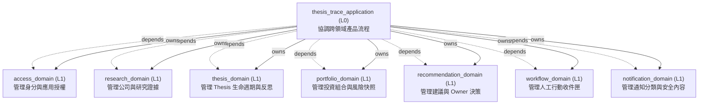
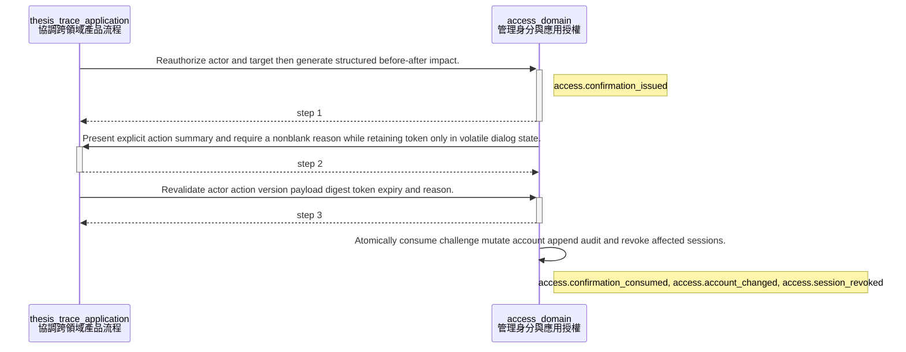
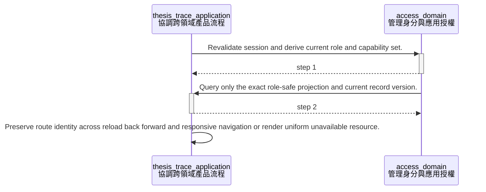
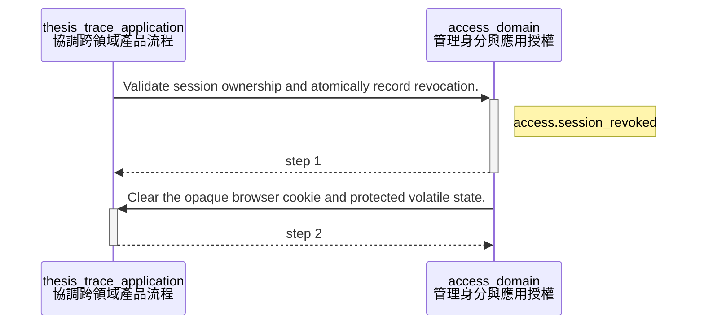
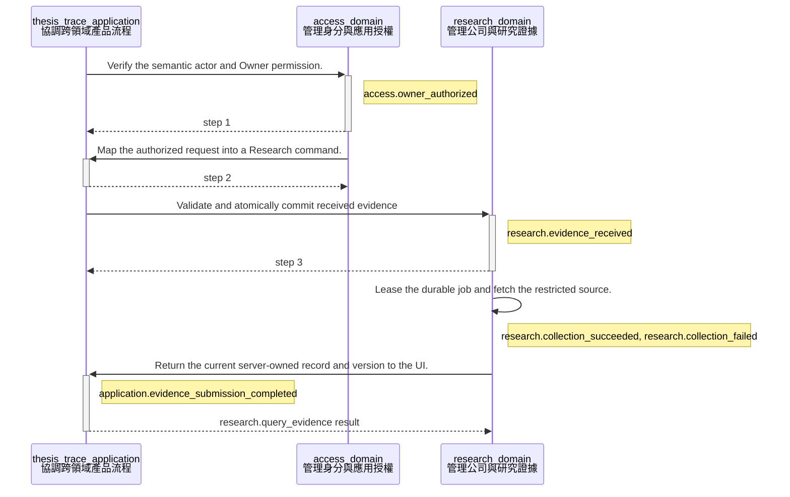
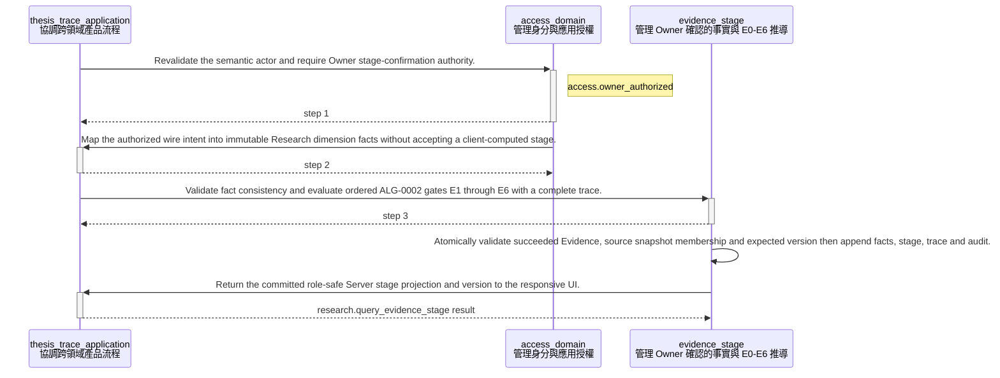
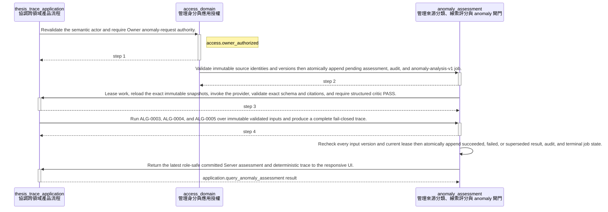

<!-- GENERATED BY govern-modular-event-architecture; DO NOT EDIT -->

# `thesis_trace_application`

## 結構圖



## 模組

| ID | Level | Role | 父模組 | 實作狀態 | 目的 |
|---|---|---|---|---|---|
| `thesis_trace_application` | L0 | orchestration | `-` | implemented | Coordinate authenticated cross-domain product flows without owning domain state. |
| `access_domain` | L1 | domain | `thesis_trace_application` | implemented | Own authenticated actor identity and application authorization decisions. |
| `research_domain` | L1 | domain | `thesis_trace_application` | implemented | Own companies, evidence provenance, collection lifecycle, evidence stages, and anomaly facts. |
| `thesis_domain` | L1 | domain | `thesis_trace_application` | planned | Own Thesis lifecycle |
| `portfolio_domain` | L1 | domain | `thesis_trace_application` | planned | Own holdings |
| `recommendation_domain` | L1 | domain | `thesis_trace_application` | planned | Own immutable recommendations |
| `workflow_domain` | L1 | domain | `thesis_trace_application` | planned | Own actionable work items |
| `notification_domain` | L1 | domain | `thesis_trace_application` | planned | Own notification classification |

### `thesis_trace_application`

- **目的:** Coordinate authenticated cross-domain product flows without owning domain state.
- **父模組:** `-`
- **實作狀態:** `implemented`
- **輸入 Ports:** `application.submit_evidence`, `application.confirm_evidence_stage`, `application.query_evidence_stage`, `application.request_anomaly_assessment`, `application.query_anomaly_assessment`, `application.process_anomaly_job`
- **輸出 Ports:** `application.events`, `application.recommendation_provider`, `application.recommendation_critic`
- **輸出 Events:** `application.evidence_submission_completed`
- **擁有狀態:** 無
- **副作用:** Coordinate child commands and map child events. (`-`)
- **異常:** `thesis_trace_application-error-1`: Reject unauthenticated or unauthorized commands → `application.evidence_submission_completed` → Reject unauthenticated or unauthorized commands; `thesis_trace_application-error-2`: Propagate child admission failures. → `application.evidence_submission_completed` → Propagate child admission failures.
- **不變條件:** Sibling domains communicate only through this parent; Domain state remains child-owned.
- **程式入口:** [`EvidenceIntakeFlow`](../../backend/src/thesis_trace/application/flows/evidence_intake.py) (orchestrator)<br>[`EvidenceStageFlow`](../../backend/src/thesis_trace/application/flows/evidence_stage.py) (orchestrator)
- **公開 Symbols:** [`SubmitEvidenceRequest`](../../backend/src/thesis_trace/application/contracts.py) (contract)<br>[`EvidenceStageFlow`](../../backend/src/thesis_trace/application/flows/evidence_stage.py) (orchestrator)<br>[`ConfirmEvidenceStageRequest`](../../backend/src/thesis_trace/application/flows/evidence_stage.py) (contract)<br>[`QueryEvidenceStageRequest`](../../backend/src/thesis_trace/application/flows/evidence_stage.py) (contract)<br>[`EvidenceStageFactsResult`](../../backend/src/thesis_trace/application/flows/evidence_stage.py) (contract)<br>[`EvidenceStageGateResult`](../../backend/src/thesis_trace/application/flows/evidence_stage.py) (contract)<br>[`EvidenceStageResult`](../../backend/src/thesis_trace/application/flows/evidence_stage.py) (contract)<br>[`AnomalyAssessmentFlow`](../../backend/src/thesis_trace/application/flows/anomaly_assessment.py) (orchestrator)<br>[`AnomalyJobProcessor`](../../backend/src/thesis_trace/application/flows/anomaly_assessment.py) (orchestrator)<br>[`RequestAnomalyAssessment`](../../backend/src/thesis_trace/application/flows/anomaly_assessment.py) (contract)<br>[`AnomalySourceInput`](../../backend/src/thesis_trace/application/flows/anomaly_assessment.py) (contract)<br>[`AnomalyAssessmentResult`](../../backend/src/thesis_trace/application/flows/anomaly_assessment.py) (contract)<br>[`AnomalyGateResult`](../../backend/src/thesis_trace/application/flows/anomaly_assessment.py) (contract)<br>[`AnomalyTraceResult`](../../backend/src/thesis_trace/application/flows/anomaly_assessment.py) (contract)<br>[`RecommendationProviderPort`](../../backend/src/thesis_trace/application/ai_ports.py) (port)<br>[`RecommendationCriticPort`](../../backend/src/thesis_trace/application/ai_ports.py) (port)<br>[`RecommendationProviderRequest`](../../backend/src/thesis_trace/application/ai_ports.py) (contract)<br>[`RecommendationCriticRequest`](../../backend/src/thesis_trace/application/ai_ports.py) (contract)<br>[`AnalysisSource`](../../backend/src/thesis_trace/application/ai_ports.py) (contract)<br>[`ValidatedAnomalyCandidate`](../../backend/src/thesis_trace/application/ai_ports.py) (contract)

### `access_domain`

- **目的:** Own authenticated actor identity and application authorization decisions.
- **父模組:** `thesis_trace_application`
- **實作狀態:** `implemented`
- **輸入 Ports:** `access.authorize_owner`
- **輸出 Ports:** `access.events`, `access.security_context`
- **輸出 Events:** `access.owner_authorized`, `access.session_established`, `access.account_changed`, `access.confirmation_consumed`
- **擁有狀態:** 無
- **副作用:** 無
- **異常:** `access_domain-error-1`: Reject absent → `access.owner_authorized` → Reject absent; `access_domain-error-2`: expired → `access.owner_authorized` → expired; `access_domain-error-3`: or unauthorized identities. → `access.owner_authorized` → or unauthorized identities.
- **不變條件:** Provider identity never collapses by email alone; JWT subject and provider discriminator resolve through a preapproved mapping.; Unknown provider, identity, session, role, or challenge fails closed without existence disclosure.; Authorization fails closed.
- **程式入口:** [`AuthenticatedActor`](../../backend/src/thesis_trace/modules/access/contracts.py) (contract)<br>[`AccountActionService`](../../backend/src/thesis_trace/modules/access/orchestration.py) (orchestrator)
- **公開 Symbols:** [`AuthenticatedActor`](../../backend/src/thesis_trace/modules/access/contracts.py) (contract)<br>[`SecurityContext`](../../backend/src/thesis_trace/modules/access/contracts.py) (contract)<br>[`AccountActionService`](../../backend/src/thesis_trace/modules/access/orchestration.py) (service)<br>[`RecoveryPolicyConfiguration`](../../backend/src/thesis_trace/modules/access/recovery_policy.py) (configuration)

### `research_domain`

- **目的:** Own companies, evidence provenance, collection lifecycle, evidence stages, and anomaly facts.
- **父模組:** `thesis_trace_application`
- **實作狀態:** `implemented`
- **輸入 Ports:** `research.submit_evidence`, `research.query_evidence`
- **輸出 Ports:** `research.events`
- **輸出 Events:** `research.evidence_received`, `research.collection_succeeded`, `research.collection_failed`
- **擁有狀態:** 無
- **副作用:** Persist evidence state through demand-owned ports (`-`); Request restricted source collection. (`-`)
- **異常:** `research_domain-error-1`: Reject invalid URLs or stale company versions → `research.evidence_received` → Reject invalid URLs or stale company versions; `research_domain-error-2`: Record safe retry and terminal failures. → `research.evidence_received` → Record safe retry and terminal failures.
- **不變條件:** State commits before success events; Evidence streams are serialized; Source records are immutable.
- **程式入口:** [`EvidenceRecord`](../../backend/src/thesis_trace/modules/research/evidence_intake/contracts.py) (contract)
- **公開 Symbols:** [`ResearchActorContext`](../../backend/src/thesis_trace/modules/research/__init__.py) (contract)<br>[`ResearchStageFacade`](../../backend/src/thesis_trace/modules/research/__init__.py) (orchestrator)<br>[`ResearchStageConfirmationRequest`](../../backend/src/thesis_trace/modules/research/__init__.py) (contract)<br>[`ResearchStageQuery`](../../backend/src/thesis_trace/modules/research/__init__.py) (contract)<br>[`ResearchStageFacts`](../../backend/src/thesis_trace/modules/research/__init__.py) (contract)<br>[`ResearchStageGate`](../../backend/src/thesis_trace/modules/research/__init__.py) (contract)<br>[`ResearchStageResult`](../../backend/src/thesis_trace/modules/research/__init__.py) (contract)<br>[`ResearchAnomalyFacade`](../../backend/src/thesis_trace/modules/research/__init__.py) (orchestrator)<br>[`ResearchAnomalySource`](../../backend/src/thesis_trace/modules/research/__init__.py) (contract)<br>[`ResearchAnomalyRequest`](../../backend/src/thesis_trace/modules/research/__init__.py) (contract)<br>[`ResearchValidatedAnomalyCandidate`](../../backend/src/thesis_trace/modules/research/__init__.py) (contract)<br>[`ResearchAnomalyJob`](../../backend/src/thesis_trace/modules/research/__init__.py) (contract)<br>[`ResearchAnomalyGate`](../../backend/src/thesis_trace/modules/research/__init__.py) (contract)<br>[`ResearchAnomalyTrace`](../../backend/src/thesis_trace/modules/research/__init__.py) (contract)<br>[`ResearchAnomalyResult`](../../backend/src/thesis_trace/modules/research/__init__.py) (contract)<br>[`EvidenceRecord`](../../backend/src/thesis_trace/modules/research/evidence_intake/contracts.py) (contract)

### `thesis_domain`

- **目的:** Own Thesis lifecycle
- **父模組:** `thesis_trace_application`
- **實作狀態:** `planned`
- **輸入 Ports:** 無
- **輸出 Ports:** 無
- **輸出 Events:** 無
- **擁有狀態:** 無
- **副作用:** 無
- **異常:** `thesis_domain-error-1`: Reject illegal lifecycle transitions. → `application.evidence_submission_completed` → Reject illegal lifecycle transitions.
- **不變條件:** Historical decisions are append-only.
- **程式入口:** [`thesis_domain_contract`](../../backend/src/thesis_trace/modules/thesis/service.py) (boundary)
- **公開 Symbols:** [`thesis_domain_contract`](../../backend/src/thesis_trace/modules/thesis/service.py) (boundary)

### `portfolio_domain`

- **目的:** Own holdings
- **父模組:** `thesis_trace_application`
- **實作狀態:** `planned`
- **輸入 Ports:** 無
- **輸出 Ports:** 無
- **輸出 Events:** 無
- **擁有狀態:** 無
- **副作用:** 無
- **異常:** `portfolio_domain-error-1`: Reject incomplete or over-allocated trades. → `application.evidence_submission_completed` → Reject incomplete or over-allocated trades.
- **不變條件:** Risk aggregates all buckets for a security.
- **程式入口:** [`portfolio_domain_contract`](../../backend/src/thesis_trace/modules/portfolio/service.py) (boundary)
- **公開 Symbols:** [`portfolio_domain_contract`](../../backend/src/thesis_trace/modules/portfolio/service.py) (boundary)

### `recommendation_domain`

- **目的:** Own immutable recommendations
- **父模組:** `thesis_trace_application`
- **實作狀態:** `planned`
- **輸入 Ports:** 無
- **輸出 Ports:** 無
- **輸出 Events:** 無
- **擁有狀態:** 無
- **副作用:** 無
- **異常:** `recommendation_domain-error-1`: Abstain when validation or risk inputs fail. → `application.evidence_submission_completed` → Abstain when validation or risk inputs fail.
- **不變條件:** AI cannot override deterministic policy.
- **程式入口:** [`recommendation_domain_contract`](../../backend/src/thesis_trace/modules/recommendation/service.py) (boundary)
- **公開 Symbols:** [`recommendation_domain_contract`](../../backend/src/thesis_trace/modules/recommendation/service.py) (boundary)

### `workflow_domain`

- **目的:** Own actionable work items
- **父模組:** `thesis_trace_application`
- **實作狀態:** `planned`
- **輸入 Ports:** 無
- **輸出 Ports:** 無
- **輸出 Events:** 無
- **擁有狀態:** 無
- **副作用:** 無
- **異常:** `workflow_domain-error-1`: Reject unsafe or unauthorized transitions. → `application.evidence_submission_completed` → Reject unsafe or unauthorized transitions.
- **不變條件:** System priority and safety floors are server-owned.
- **程式入口:** [`workflow_domain_contract`](../../backend/src/thesis_trace/modules/workflow/service.py) (boundary)
- **公開 Symbols:** [`workflow_domain_contract`](../../backend/src/thesis_trace/modules/workflow/service.py) (boundary)

### `notification_domain`

- **目的:** Own notification classification
- **父模組:** `thesis_trace_application`
- **實作狀態:** `planned`
- **輸入 Ports:** 無
- **輸出 Ports:** 無
- **輸出 Events:** 無
- **擁有狀態:** 無
- **副作用:** 無
- **異常:** `notification_domain-error-1`: Dead-letter permanent delivery failures. → `application.evidence_submission_completed` → Dead-letter permanent delivery failures.
- **不變條件:** Forbidden portfolio data never enters message content.
- **程式入口:** [`notification_domain_contract`](../../backend/src/thesis_trace/modules/notification/service.py) (boundary)
- **公開 Symbols:** [`notification_domain_contract`](../../backend/src/thesis_trace/modules/notification/service.py) (boundary)

## Port 契約

| ID | Owner | Direction | Kind | Timing | Description | Symbols |
|---|---|---|---|---|---|---|
| `application.submit_evidence` | `thesis_trace_application` | input | command | async | Submit an authenticated Evidence URL intent.: Actor | `SubmitEvidenceRequest` |
| `application.confirm_evidence_stage` | `thesis_trace_application` | input | command | sync | Admit an authenticated Owner intent to confirm dimension facts for one Evidence snapshot.: Actor, Evidence and snapshot identity, expected version, facts, reason and idempotency key. | `EvidenceStageFlow`, `ConfirmEvidenceStageRequest`, `EvidenceStageResult` |
| `application.query_evidence_stage` | `thesis_trace_application` | input | query | sync | Query one role-safe Server-authoritative Evidence stage projection.: Authenticated actor and Evidence identity. | `EvidenceStageFlow`, `QueryEvidenceStageRequest`, `EvidenceStageResult` |
| `application.request_anomaly_assessment` | `thesis_trace_application` | input | command | sync | Admit an authenticated Owner request for a version-bound anomaly assessment.: Actor, Evidence and immutable snapshot identities, expected Evidence version, reason, and idempotency key; source characteristics and all policy values remain Server-owned. | `RequestAnomalyAssessment`, `AnomalyAssessmentResult` |
| `application.query_anomaly_assessment` | `thesis_trace_application` | input | query | sync | Query one role-safe Server-authoritative anomaly assessment projection and trace.: Authenticated actor and assessment identity. | `AnomalyAssessmentResult` |
| `application.process_anomaly_job` | `thesis_trace_application` | input | command | async | Process one leased anomaly job through provider, strict validator, critic, Research policy, and atomic result commit.: Opaque lease, assessment/input versions, correlation metadata, and exact build/model/prompt/schema/critic/policy tuple. | `AnomalyJobProcessor` |
| `application.recommendation_provider` | `thesis_trace_application` | output | dependency | async | Request one provider-neutral source-bound structured analysis candidate from an immutable snapshot.: Exact snapshot/version tuple and bounded schema/model/prompt identifiers; output remains untrusted bytes until validation. | `RecommendationProviderPort`, `RecommendationProviderRequest` |
| `application.recommendation_critic` | `thesis_trace_application` | output | dependency | async | Independently verify availability, citation support, subject, time, invalidation, B independence, and newer-A conflict for one candidate.: Immutable source snapshot and candidate; output is an exact structured PASS or non-PASS result. | `RecommendationCriticPort`, `RecommendationCriticRequest` |
| `application.events` | `thesis_trace_application` | output | event | async | Publish application-visible evidence submission results.: Record identity | `SubmitEvidenceRequest` |
| `access.authorize_owner` | `access_domain` | input | query | sync | Decide whether the actor may submit Owner evidence.: Immutable authenticated actor snapshot. | `AuthenticatedActor` |
| `access.events` | `access_domain` | output | event | sync | Publish authorization facts after validation.: Actor ID and authorization purpose. | `AuthenticatedActor` |
| `access.security_context` | `access_domain` | output | dependency | sync | Bind server-derived user, role, and ownership scope to one PostgreSQL transaction for RLS.: SecurityContext without client-supplied authority fields. | `SecurityContext` |
| `research.submit_evidence` | `research_domain` | input | command | sync | Atomically admit one Evidence URL.: Authorized actor | `EvidenceRecord` |
| `research.query_evidence` | `research_domain` | input | query | sync | Return an authorized immutable Evidence status snapshot.: Evidence ID and server version. | `EvidenceRecord` |
| `research.clock` | `research_domain` | output | dependency | sync | Supply observed and retrieved times.: Time value with provenance. | `EvidenceRecord` |
| `research.ids` | `research_domain` | output | dependency | sync | Generate persistent semantic identifiers.: Opaque unique identifier. | `EvidenceRecord` |
| `research.events` | `research_domain` | output | event | async | Publish committed evidence lifecycle transitions.: Persistent event envelope and semantic payload. | `EvidenceRecord` |

## Event 契約

| ID | Owner | Delivery | Emitted when | Purpose | Consumers |
|---|---|---|---|---|---|
| `research.evidence_received` | `research_domain` | at-least-once | The atomic intake transaction has committed. | Report that received evidence | `thesis_trace_application`, `research_domain` |
| `research.collection_succeeded` | `research_domain` | at-least-once | The snapshot and succeeded state have committed. | Report a committed immutable source snapshot. | `thesis_trace_application` |
| `research.collection_failed` | `research_domain` | at-least-once | Failure state and retry metadata have committed. | Report a committed retryable or terminal safe failure. | `thesis_trace_application` |
| `access.owner_authorized` | `access_domain` | at-most-once | Identity and role checks have succeeded. | Record a successful Owner authorization decision. | `thesis_trace_application` |
| `access.identity_resolved` | `access_domain` | at-most-once | Full JWT and get-identity facts match one enabled preapproved mapping. | Record successful resolution of provider-discriminated identity to one internal user. | `access_domain` |
| `access.identity_rejected` | `access_domain` | at-most-once | Provider evidence or preapproved mapping fails closed. | Record a non-disclosing identity rejection category. | `thesis_trace_application` |
| `access.session_established` | `access_domain` | at-least-once | Session binding and expiry have committed. | Report a committed bounded application session. | `thesis_trace_application`, `workflow_domain` |
| `access.session_revoked` | `access_domain` | at-least-once | Revocation has committed. | Report that a session can no longer authorize requests. | `thesis_trace_application` |
| `access.recovery_session_detected` | `access_domain` | at-least-once | The first valid recovery session for an activation window commits. | Trigger immutable security audit and a safety-locked task to disable recovery access. | `workflow_domain`, `thesis_trace_application` |
| `access.account_changed` | `access_domain` | at-least-once | Consequential mutation, confirmation consumption, and audit commit atomically. | Report a committed identity, role, or account lifecycle change. | `session_management`, `thesis_trace_application` |
| `access.confirmation_issued` | `access_domain` | at-most-once | Challenge bindings and expiry commit. | Record issuance of a short-lived challenge without publishing its token. | `thesis_trace_application` |
| `access.confirmation_consumed` | `access_domain` | at-least-once | Challenge, reason, mutation, and append-only audit commit. | Report atomic challenge consumption and consequential mutation. | `thesis_trace_application` |
| `application.evidence_submission_completed` | `thesis_trace_application` | at-most-once | A Research lifecycle event has been mapped after commit. | Notify delivery adapters that current evidence status can be queried. | `fastapi_entrypoint` |

## Type Catalog

| ID | Owner | Declaration | Visibility | Semantic kind | Consumers | References |
|---|---|---|---|---|---|---|
| `evidencestageflow` | `thesis_trace_application` | `EvidenceStageFlow` (class, `backend/src/thesis_trace/application/flows/evidence_stage.py`) | module-public | composition-mapping | `fastapi_entrypoint`, `backend_composition` | `authenticatedactor`, `role`, `researchactorcontext`, `researchstagefacade`, `researchstageconfirmationrequest`, `researchstagequery`, `researchstageresult`, `confirmevidencestagerequest`, `queryevidencestagerequest`, `evidencestagefactsresult`, `evidencestagegateresult`, `evidencestageresult` |
| `confirmevidencestagerequest` | `thesis_trace_application` | `ConfirmEvidenceStageRequest` (class, `backend/src/thesis_trace/application/flows/evidence_stage.py`) | module-public | command | `thesis_trace_application`, `fastapi_entrypoint` | 無 |
| `queryevidencestagerequest` | `thesis_trace_application` | `QueryEvidenceStageRequest` (class, `backend/src/thesis_trace/application/flows/evidence_stage.py`) | module-public | query | `thesis_trace_application`, `fastapi_entrypoint` | 無 |
| `evidencestagefactsresult` | `thesis_trace_application` | `EvidenceStageFactsResult` (class, `backend/src/thesis_trace/application/flows/evidence_stage.py`) | module-public | domain-value | `thesis_trace_application`, `fastapi_entrypoint` | 無 |
| `evidencestagegateresult` | `thesis_trace_application` | `EvidenceStageGateResult` (class, `backend/src/thesis_trace/application/flows/evidence_stage.py`) | module-public | domain-value | `thesis_trace_application`, `fastapi_entrypoint` | 無 |
| `evidencestageresult` | `thesis_trace_application` | `EvidenceStageResult` (class, `backend/src/thesis_trace/application/flows/evidence_stage.py`) | module-public | domain-value | `thesis_trace_application`, `fastapi_entrypoint` | `evidencestagefactsresult`, `evidencestagegateresult` |
| `researchactorcontext` | `research_domain` | `ResearchActorContext` (class, `backend/src/thesis_trace/modules/research/__init__.py`) | module-public | composition-mapping | `research_domain`, `thesis_trace_application` | 無 |
| `researchstageconfirmationrequest` | `research_domain` | `ResearchStageConfirmationRequest` (class, `backend/src/thesis_trace/modules/research/__init__.py`) | module-public | command | `research_domain`, `thesis_trace_application` | 無 |
| `researchstagequery` | `research_domain` | `ResearchStageQuery` (class, `backend/src/thesis_trace/modules/research/__init__.py`) | module-public | query | `research_domain`, `thesis_trace_application` | 無 |
| `researchstagefacts` | `research_domain` | `ResearchStageFacts` (class, `backend/src/thesis_trace/modules/research/__init__.py`) | module-public | domain-value | `research_domain`, `thesis_trace_application` | 無 |
| `researchstagegate` | `research_domain` | `ResearchStageGate` (class, `backend/src/thesis_trace/modules/research/__init__.py`) | module-public | domain-value | `research_domain`, `thesis_trace_application` | 無 |
| `researchstageresult` | `research_domain` | `ResearchStageResult` (class, `backend/src/thesis_trace/modules/research/__init__.py`) | module-public | domain-value | `research_domain`, `thesis_trace_application` | `researchstagefacts`, `researchstagegate` |
| `researchstagefacade` | `research_domain` | `ResearchStageFacade` (class, `backend/src/thesis_trace/modules/research/__init__.py`) | module-public | composition-mapping | `thesis_trace_application`, `backend_composition` | `researchactorcontext`, `researchstageconfirmationrequest`, `researchstagequery`, `researchstagefacts`, `researchstagegate`, `researchstageresult`, `stageactorcontext`, `confirmdimensionfactscommand`, `dimensionfacts`, `sourceconfirmation`, `evidencestagerecord`, `evidencestageservice` |
| `submitevidencerequest` | `thesis_trace_application` | `SubmitEvidenceRequest` (class, `backend/src/thesis_trace/application/contracts.py`) | module-public | command | `thesis_trace_application` | `authenticatedactor` |
| `evidenceintakeflow` | `thesis_trace_application` | `EvidenceIntakeFlow` (class, `backend/src/thesis_trace/application/flows/evidence_intake.py`) | private | private-helper | `thesis_trace_application` | 無 |
| `role` | `access_domain` | `Role` (enum, `backend/src/thesis_trace/modules/access/contracts.py`) | module-public | policy | `access_domain` | 無 |
| `authenticatedactor` | `access_domain` | `AuthenticatedActor` (class, `backend/src/thesis_trace/modules/access/contracts.py`) | module-public | domain-value | `access_domain` | `role` |
| `jwtverificationerror` | `access_domain` | `JwtVerificationError` (class, `backend/src/thesis_trace/modules/access/jwt_verifier.py`) | module-public | domain-value | `fastapi_entrypoint` | 無 |
| `accessjwtconfiguration` | `access_domain` | `AccessJwtConfiguration` (class, `backend/src/thesis_trace/modules/access/jwt_verifier.py`) | module-public | configuration | `backend_composition` | 無 |
| `cloudflarejwtverifier` | `access_domain` | `CloudflareJwtVerifier` (class, `backend/src/thesis_trace/modules/access/jwt_verifier.py`) | module-public | policy | `fastapi_entrypoint` | `accessjwtconfiguration`, `jwtverificationerror`, `authenticatedactor` |
| `createcompanycommand` | `thesis_trace_application` | `CreateCompanyCommand` (class, `backend/src/thesis_trace/application/contracts.py`) | module-public | command | `thesis_trace_application` | `authenticatedactor` |
| `listcompaniesquery` | `thesis_trace_application` | `ListCompaniesQuery` (class, `backend/src/thesis_trace/application/contracts.py`) | module-public | query | `thesis_trace_application` | `authenticatedactor` |
| `securitycontext` | `access_domain` | `SecurityContext` (class, `backend/src/thesis_trace/modules/access/contracts.py`) | module-public | domain-value | `postgres_access_adapter` | `role` |
| `securitycontextport` | `access_domain` | `SecurityContextPort` (protocol, `backend/src/thesis_trace/modules/access/ports.py`) | module-public | port | `postgres_access_adapter` | `securitycontext` |
| `recoverypolicyconfiguration` | `access_domain` | `RecoveryPolicyConfiguration` (class, `backend/src/thesis_trace/modules/access/recovery_policy.py`) | module-public | configuration | `session_management`, `backend_composition` | `provideridentity` |
| `accountactionpreview` | `access_domain` | `AccountActionPreview` (class, `backend/src/thesis_trace/modules/access/orchestration.py`) | module-public | query | `fastapi_entrypoint` | 無 |
| `confirmedaccountaction` | `access_domain` | `ConfirmedAccountAction` (class, `backend/src/thesis_trace/modules/access/orchestration.py`) | module-public | domain-value | `fastapi_entrypoint` | 無 |
| `accountactionunitofwork` | `access_domain` | `AccountActionUnitOfWork` (protocol, `backend/src/thesis_trace/modules/access/orchestration.py`) | module-public | port | `access_domain`, `postgres_access_adapter` | `accountsummary` |
| `accountactionservice` | `access_domain` | `AccountActionService` (class, `backend/src/thesis_trace/modules/access/orchestration.py`) | module-public | policy | `backend_composition`, `fastapi_entrypoint` | `accountactionunitofwork`, `accountactionpreview`, `confirmedaccountaction`, `confirmationservice` |
| `analysissource` | `thesis_trace_application` | `AnalysisSource` (class, `backend/src/thesis_trace/application/ai_ports.py`) | module-public | composition-mapping | `thesis_trace_application`, `openai_recommendation_adapter` | 無 |
| `recommendationproviderrequest` | `thesis_trace_application` | `RecommendationProviderRequest` (class, `backend/src/thesis_trace/application/ai_ports.py`) | module-public | command | `thesis_trace_application`, `openai_recommendation_adapter` | `analysissource` |
| `recommendationcriticrequest` | `thesis_trace_application` | `RecommendationCriticRequest` (class, `backend/src/thesis_trace/application/ai_ports.py`) | module-public | command | `thesis_trace_application`, `openai_recommendation_adapter` | `analysissource` |
| `validatedanomalycandidate` | `thesis_trace_application` | `ValidatedAnomalyCandidate` (class, `backend/src/thesis_trace/application/ai_ports.py`) | module-public | domain-value | `thesis_trace_application`, `research_domain` | 無 |
| `recommendationproviderport` | `thesis_trace_application` | `RecommendationProviderPort` (protocol, `backend/src/thesis_trace/application/ai_ports.py`) | module-public | port | `thesis_trace_application`, `openai_recommendation_adapter` | `recommendationproviderrequest` |
| `recommendationcriticport` | `thesis_trace_application` | `RecommendationCriticPort` (protocol, `backend/src/thesis_trace/application/ai_ports.py`) | module-public | port | `thesis_trace_application`, `openai_recommendation_adapter` | `recommendationcriticrequest` |
| `anomalysourceinput` | `thesis_trace_application` | `AnomalySourceInput` (class, `backend/src/thesis_trace/application/flows/anomaly_assessment.py`) | module-public | composition-mapping | `thesis_trace_application`, `fastapi_entrypoint` | 無 |
| `requestanomalyassessment` | `thesis_trace_application` | `RequestAnomalyAssessment` (class, `backend/src/thesis_trace/application/flows/anomaly_assessment.py`) | module-public | command | `thesis_trace_application`, `fastapi_entrypoint` | `anomalysourceinput` |
| `anomalygateresult` | `thesis_trace_application` | `AnomalyGateResult` (class, `backend/src/thesis_trace/application/flows/anomaly_assessment.py`) | module-public | composition-mapping | `thesis_trace_application`, `fastapi_entrypoint` | 無 |
| `anomalytraceresult` | `thesis_trace_application` | `AnomalyTraceResult` (class, `backend/src/thesis_trace/application/flows/anomaly_assessment.py`) | module-public | composition-mapping | `thesis_trace_application`, `fastapi_entrypoint` | `anomalygateresult` |
| `anomalyassessmentresult` | `thesis_trace_application` | `AnomalyAssessmentResult` (class, `backend/src/thesis_trace/application/flows/anomaly_assessment.py`) | module-public | composition-mapping | `thesis_trace_application`, `fastapi_entrypoint` | `anomalytraceresult` |
| `anomalyassessmentflow` | `thesis_trace_application` | `AnomalyAssessmentFlow` (class, `backend/src/thesis_trace/application/flows/anomaly_assessment.py`) | module-public | composition-mapping | `backend_composition`, `fastapi_entrypoint` | `authenticatedactor`, `role`, `anomalysourceinput`, `anomalygateresult`, `anomalytraceresult`, `researchactorcontext`, `researchanomalyfacade`, `researchanomalysource`, `researchanomalyrequest`, `researchanomalyresult`, `requestanomalyassessment`, `anomalyassessmentresult` |
| `anomalyjobprocessor` | `thesis_trace_application` | `AnomalyJobProcessor` (class, `backend/src/thesis_trace/application/flows/anomaly_assessment.py`) | module-public | composition-mapping | `backend_composition`, `ai_worker_adapter` | `researchanomalyfacade`, `researchanomalyjob`, `researchanomalysource`, `researchvalidatedanomalycandidate`, `recommendationproviderport`, `recommendationcriticport`, `recommendationproviderrequest`, `recommendationcriticrequest`, `analysissource`, `validatedanomalycandidate` |
| `researchanomalysource` | `research_domain` | `ResearchAnomalySource` (class, `backend/src/thesis_trace/modules/research/__init__.py`) | module-public | composition-mapping | `research_domain`, `thesis_trace_application` | 無 |
| `researchanomalyrequest` | `research_domain` | `ResearchAnomalyRequest` (class, `backend/src/thesis_trace/modules/research/__init__.py`) | module-public | command | `research_domain`, `thesis_trace_application` | `researchanomalysource` |
| `researchanomalyjob` | `research_domain` | `ResearchAnomalyJob` (class, `backend/src/thesis_trace/modules/research/__init__.py`) | module-public | command | `research_domain`, `thesis_trace_application` | 無 |
| `researchanomalygate` | `research_domain` | `ResearchAnomalyGate` (class, `backend/src/thesis_trace/modules/research/__init__.py`) | module-public | composition-mapping | `research_domain`, `thesis_trace_application` | 無 |
| `researchanomalytrace` | `research_domain` | `ResearchAnomalyTrace` (class, `backend/src/thesis_trace/modules/research/__init__.py`) | module-public | composition-mapping | `research_domain`, `thesis_trace_application` | `researchanomalygate` |
| `researchanomalyresult` | `research_domain` | `ResearchAnomalyResult` (class, `backend/src/thesis_trace/modules/research/__init__.py`) | module-public | composition-mapping | `research_domain`, `thesis_trace_application` | `researchanomalytrace` |
| `researchanomalyfacade` | `research_domain` | `ResearchAnomalyFacade` (class, `backend/src/thesis_trace/modules/research/__init__.py`) | module-public | composition-mapping | `backend_composition`, `thesis_trace_application` | `anomalyassessmentservice`, `requestassessmentcommand`, `evaluateassessmentcommand`, `anomalyanalysisjob`, `anomalyassessmentrecord`, `sourcecharacteristicsnapshot`, `cluefeaturevector`, `researchactorcontext`, `researchanomalysource`, `researchanomalyrequest`, `researchanomalyjob`, `researchanomalygate`, `researchanomalytrace`, `researchanomalyresult`, `researchvalidatedanomalycandidate` |
| `researchvalidatedanomalycandidate` | `research_domain` | `ResearchValidatedAnomalyCandidate` (class, `backend/src/thesis_trace/modules/research/__init__.py`) | module-public | composition-mapping | `research_domain`, `thesis_trace_application` | 無 |

## State Ownership

| ID | Owner | Declaration | Type | Visibility | Mutability | Read authority | Write authority |
|---|---|---|---|---|---|---|---|

## Cross-module Mapping

| Interaction | Producer | Consumer | Parent | Producer contract | Consumer contract | Mapping owner | State accessed | Allowed edges | Forbidden edges |
|---|---|---|---|---|---|---|---|---|---|
| `access-response-to-react-view`: Deliver server-authoritative role-discriminated Access projections to responsive React routes through generated transport contracts. | `thesis_trace_application` | `access_domain` | `thesis_trace_application` | `-` | `-` | `thesis_trace_application` | 無 | `thesis_trace_application->access_domain` | `access_domain->thesis_trace_application` |
| `authenticated-owner-to-stage-command`: Map a revalidated Owner actor and HTTP intent into a semantic confirmed-dimension command without granting Access-to-Research dependency. | `access_domain` | `research_domain` | `thesis_trace_application` | `authenticatedactor` | `researchactorcontext` | `thesis_trace_application` | 無 | `thesis_trace_application->access_domain`, `thesis_trace_application->research_domain` | `access_domain->research_domain`, `research_domain->access_domain`, `evidence_stage->access_domain`, `evidence_stage->fastapi_entrypoint` |
| `thesis-invalidation-to-anomaly-assessment`: Map a future Server-owned immutable predeclared Thesis invalidation projection into Research assessment primitives without accepting client or AI authority. | `thesis_domain` | `research_domain` | `thesis_trace_application` | `-` | `-` | `thesis_trace_application` | 無 | `thesis_trace_application->thesis_domain`, `thesis_trace_application->research_domain` | `thesis_domain->research_domain`, `research_domain->thesis_domain`, `anomaly_assessment->thesis_domain` |

## 端到端 Flows

### `access_session_bootstrap`

Verify full Cloudflare identity, resolve a preapproved user, establish a bounded session, and return a role-safe profile.

#### Flow 圖

```mermaid
sequenceDiagram
    participant n_thesis_trace_application as thesis_trace_application<br/>協調跨領域產品流程
    participant n_access_domain as access_domain<br/>管理身分與應用授權
    n_thesis_trace_application->>+n_access_domain: Verify signature issuer audience expiry MFA subject and idp.id/type without trusting email as identity.
    n_access_domain-->>-n_thesis_trace_application: step 1
    n_access_domain->>n_access_domain: Resolve exactly one enabled preapproved ProviderIdentityMapping.
    Note right of n_access_domain: access.identity_resolved, access.identity_rejected
    n_access_domain-->>-n_access_domain: access.resolve_identity result
    n_access_domain->>n_access_domain: Commit a normal or recovery-bounded application session and role-filtered profile.
    Note right of n_access_domain: access.session_established, access.recovery_session_detected
    n_access_domain->>+n_thesis_trace_application: Return only the exact Owner Learner or Admin profile variant and route capabilities.
    n_thesis_trace_application-->>-n_access_domain: step 4
```

#### 執行步驟

| # | Module | Action | Receives | Emits | State changes | Side effects |
|---|---|---|---|---|---|---|
| 1 | `access_domain` | Verify signature issuer audience expiry MFA subject and idp.id/type without trusting email as identity. | `access.identity_provider` | 無 | 無 | Cloudflare key and get-identity access through the adapter. |
| 2 | `access_domain` | Resolve exactly one enabled preapproved ProviderIdentityMapping. | `access.resolve_identity` | `access.identity_resolved`, `access.identity_rejected` | 無 | Read account mapping through Access repository. |
| 3 | `access_domain` | Commit a normal or recovery-bounded application session and role-filtered profile. | `access.bootstrap_session` | `access.session_established`, `access.recovery_session_detected` | AccessSession is created or refreshed within the verified token expiry. | Persist session and immutable recovery audit when applicable. |
| 4 | `thesis_trace_application` | Return only the exact Owner Learner or Admin profile variant and route capabilities. | `access.session_established` | 無 | 無 | Generated HTTPS response; browser stores no JWT or domain data persistently. |

- **成功結果:** A verified identity receives one bounded role-safe session profile.
- **異常:** JWT, full identity, provider mapping, MFA, or session binding is invalid. → `access.identity_rejected` → Return uniform access_denied and persist no usable session.

#### Execution efficiency

- Workload `access_session_bootstrap_workload`: `best-effort`; steps `access_session_bootstrap.verify`, `access_session_bootstrap.resolve`, `access_session_bootstrap.establish`, `access_session_bootstrap.present`; profiles 無.

### `confirmed_account_change`

Preview and atomically confirm one consequential identity, role, or account lifecycle change.

#### Flow 圖



#### 執行步驟

| # | Module | Action | Receives | Emits | State changes | Side effects |
|---|---|---|---|---|---|---|
| 1 | `access_domain` | Reauthorize actor and target then generate structured before-after impact. | `access.preview_consequential_action` | `access.confirmation_issued` | ConfirmationChallenge becomes available for at most five minutes. | Persist challenge digest and bindings without logging token. |
| 2 | `thesis_trace_application` | Present explicit action summary and require a nonblank reason while retaining token only in volatile dialog state. | `access.confirmation_issued` | 無 | 無 | Responsive modal or full-screen mobile dialog. |
| 3 | `access_domain` | Revalidate actor action version payload digest token expiry and reason. | `access.confirm_consequential_action` | 無 | 無 | Reject mismatch expiry reuse and concurrent changes with a fresh-preview requirement. |
| 4 | `access_domain` | Atomically consume challenge mutate account append audit and revoke affected sessions. | `access.confirm_consequential_action`, `access.manage_accounts` | `access.confirmation_consumed`, `access.account_changed`, `access.session_revoked` | Challenge is consumed and account version advances. | One PostgreSQL transaction under server-derived RLS context. |

- **成功結果:** The exact account mutation, challenge consumption, reason, session revocation, and audit commit once.
- **異常:** Actor, action, version, payload, expiry, reason, or replay validation fails. → `access.identity_rejected` → Roll back the transaction and require a new preview without disclosing target existence.

#### Execution efficiency

- Workload `confirmed_account_change_workload`: `best-effort`; steps `confirmed_account_change.preview`, `confirmed_account_change.present`, `confirmed_account_change.confirm`, `confirmed_account_change.commit`; profiles 無.

### `role_filtered_deep_link`

Resolve responsive direct routes with server role filtering and indistinguishable unavailable-resource behavior.

#### Flow 圖



#### 執行步驟

| # | Module | Action | Receives | Emits | State changes | Side effects |
|---|---|---|---|---|---|---|
| 1 | `access_domain` | Revalidate session and derive current role and capability set. | `access.bootstrap_session` | 無 | 無 | Bind transaction-local RLS security context. |
| 2 | `thesis_trace_application` | Query only the exact role-safe projection and current record version. | `access.security_context` | 無 | 無 | Owner-only fields are omitted from Learner and Admin payloads. |
| 3 | `thesis_trace_application` | Preserve route identity across reload back forward and responsive navigation or render uniform unavailable resource. | 無 | 無 | 無 | React route renders no stale cached protected content. |

- **成功結果:** The browser renders the authorized projection while retaining route identity across responsive navigation.
- **異常:** The session, role, record, or requested field is unavailable or unauthorized. → `access.identity_rejected` → Clear protected client state and render the same unavailable-resource response for absent and forbidden records.

#### Execution efficiency

- Workload `role_filtered_deep_link_workload`: `best-effort`; steps `role_filtered_deep_link.session`, `role_filtered_deep_link.project`, `role_filtered_deep_link.present`; profiles 無.

### `access_session_revocation`

Revalidate and revoke one application session without extending the Cloudflare Access credential.

#### Flow 圖



#### 執行步驟

| # | Module | Action | Receives | Emits | State changes | Side effects |
|---|---|---|---|---|---|---|
| 1 | `access_domain` | Validate session ownership and atomically record revocation. | `access.revoke_session` | `access.session_revoked` | The application session becomes unusable. | Persist revocation and immutable audit metadata. |
| 2 | `thesis_trace_application` | Clear the opaque browser cookie and protected volatile state. | `access.session_revoked` | 無 | 無 | Return the bounded logout response. |

- **成功結果:** The revoked session cannot authorize another application request.
- **異常:** The session is absent, already invalid, or belongs to another actor. → `access.identity_rejected` → Return the uniform unavailable response without disclosing session existence.

#### Execution efficiency

- Workload `access_session_revocation_workload`: `best-effort`; steps `access_session_revocation.revoke`, `access_session_revocation.present`; profiles 無.

### `owner_evidence_intake`

Admit an Owner Evidence URL and expose durable lifecycle state.

#### Flow 圖



#### 執行步驟

| # | Module | Action | Receives | Emits | State changes | Side effects |
|---|---|---|---|---|---|---|
| 1 | `access_domain` | Verify the semantic actor and Owner permission. | `application.submit_evidence` | `access.owner_authorized` | 無 | 無 |
| 2 | `thesis_trace_application` | Map the authorized request into a Research command. | `access.owner_authorized` | 無 | 無 | 無 |
| 3 | `research_domain` | Validate and atomically commit received evidence | `research.submit_evidence` | `research.evidence_received` | Evidence status becomes received at a new server version. | PostgreSQL transaction writes evidence; audit; and job. |
| 4 | `research_domain` | Lease the durable job and fetch the restricted source. | `research.evidence_received` | `research.collection_succeeded`, `research.collection_failed` | Evidence becomes processing then succeeded; failed; retrying; or dead-letter. | Bounded HTTPS fetch and PostgreSQL transaction. |
| 5 | `thesis_trace_application` | Return the current server-owned record and version to the UI. | `research.query_evidence` | `application.evidence_submission_completed` | 無 | 無 |

- **成功結果:** UI observes a succeeded immutable source snapshot by record and version.
- **異常:** Identity or admission fails before acceptance. → `application.evidence_submission_completed` → Return a stable non-disclosing error without creating state.
- **異常:** Collection fails after acceptance. → `research.collection_failed` → Commit retrying

#### Execution efficiency

- Workload `owner_evidence_intake_workload`: `best-effort`; steps `owner_evidence_intake.authorize`, `owner_evidence_intake.map`, `owner_evidence_intake.commit`, `owner_evidence_intake.collect`, `owner_evidence_intake.query`; profiles [`linux_server_functional`](execution-linux_server_functional.md).

### `owner_confirmed_evidence_stage`

Confirm Owner-authored dimension facts and synchronously expose the atomically committed deterministic E0-E6 stage.

#### Flow 圖



#### 執行步驟

| # | Module | Action | Receives | Emits | State changes | Side effects |
|---|---|---|---|---|---|---|
| 1 | `access_domain` | Revalidate the semantic actor and require Owner stage-confirmation authority. | `application.confirm_evidence_stage` | `access.owner_authorized` | 無 | 無 |
| 2 | `thesis_trace_application` | Map the authorized wire intent into immutable Research dimension facts without accepting a client-computed stage. | `access.owner_authorized` | 無 | 無 | 無 |
| 3 | `evidence_stage` | Validate fact consistency and evaluate ordered ALG-0002 gates E1 through E6 with a complete trace. | `research.confirm_dimension_facts` | 無 | 無 | 無 |
| 4 | `evidence_stage` | Atomically validate succeeded Evidence, source snapshot membership and expected version then append facts, stage, trace and audit. | `research.evidence_stage_store` | 無 | The Evidence stage stream appends exactly one immutable next version. | One PostgreSQL transaction under Server-derived RLS context. |
| 5 | `thesis_trace_application` | Return the committed role-safe Server stage projection and version to the responsive UI. | `research.evidence_stage_store`, `research.query_evidence_stage` | 無 | 無 | Generated HTTPS response; browser retains only volatile form state. |

- **成功結果:** Owner and Learner queries observe one Server-authoritative stage version with source, actor, reason, policy and complete gate trace.

#### Execution efficiency

- Workload `owner_confirmed_evidence_stage_workload`: `best-effort`; steps `owner_confirmed_evidence_stage.authorize`, `owner_confirmed_evidence_stage.map`, `owner_confirmed_evidence_stage.evaluate`, `owner_confirmed_evidence_stage.commit`, `owner_confirmed_evidence_stage.present`; profiles [`linux_server_functional`](execution-linux_server_functional.md).

### `owner_anomaly_assessment`

Admit version-bound anomaly work, process it in the isolated AI worker, and expose only a committed fail-closed Research result.

#### Flow 圖



#### 執行步驟

| # | Module | Action | Receives | Emits | State changes | Side effects |
|---|---|---|---|---|---|---|
| 1 | `access_domain` | Revalidate the semantic actor and require Owner anomaly-request authority. | `application.request_anomaly_assessment` | `access.owner_authorized` | 無 | 無 |
| 2 | `anomaly_assessment` | Validate immutable source identities and versions then atomically append pending assessment, audit, and anomaly-analysis-v1 job. | `research.request_anomaly_assessment`, `research.anomaly_assessment_store` | 無 | One pending assessment version and one durable version-bound AI job commit together. | One PostgreSQL transaction under Server-derived RLS context. |
| 3 | `thesis_trace_application` | Lease work, reload the exact immutable snapshots, invoke the provider, validate exact schema and citations, and require structured critic PASS. | `application.process_anomaly_job`, `application.recommendation_provider`, `application.recommendation_critic`, `research.anomaly_assessment_store` | 無 | The durable job lease and attempt advance. | Bounded provider and critic I/O in the isolated AI-worker process. |
| 4 | `anomaly_assessment` | Run ALG-0003, ALG-0004, and ALG-0005 over immutable validated inputs and produce a complete fail-closed trace. | `research.request_anomaly_assessment` | 無 | 無 | 無 |
| 5 | `anomaly_assessment` | Recheck every input version and current lease then atomically append succeeded, failed, or superseded result, audit, and terminal job state. | `research.anomaly_assessment_store` | 無 | One immutable result version commits; a qualifying candidate remains would-be-Hard until qualification and activation. | One PostgreSQL transaction; no notification, recommendation, or trade side effect. |
| 6 | `thesis_trace_application` | Return the latest role-safe committed Server assessment and deterministic trace to the responsive UI. | `application.query_anomaly_assessment`, `research.query_anomaly_assessment` | 無 | 無 | Generated HTTPS response; browser keeps only volatile view state. |

- **成功結果:** Owner and Learner observe pending or immutable Soft/would-be-Hard status with exact source and version trace while formal Hard remains disabled.

#### Execution efficiency

- Workload `owner_anomaly_assessment_workload`: `best-effort`; steps `owner_anomaly_assessment.authorize`, `owner_anomaly_assessment.admit`, `owner_anomaly_assessment.analyze`, `owner_anomaly_assessment.evaluate`, `owner_anomaly_assessment.commit`, `owner_anomaly_assessment.present`; profiles [`linux_server_functional`](execution-linux_server_functional.md).
