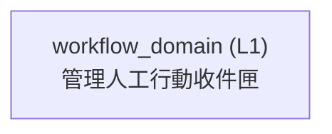

<!-- GENERATED BY govern-modular-event-architecture; DO NOT EDIT -->

# `workflow_domain`

## 結構圖

## 模組

| ID | Level | Role | 父模組 | 實作狀態 | 目的 |
|---|---|---|---|---|---|
| `workflow_domain` | L1 | domain | `thesis_trace_application` | planned | Own actionable work items |

### `workflow_domain`

- **目的:** Own actionable work items
- **父模組:** `thesis_trace_application`
- **實作狀態:** `planned`
- **輸入 Ports:** 無
- **輸出 Ports:** 無
- **輸出 Events:** 無
- **擁有狀態:** 無
- **副作用:** 無
- **異常:** `workflow_domain-error-1`: Reject unsafe or unauthorized transitions. → `application.evidence_submission_completed` → Reject unsafe or unauthorized transitions.
- **不變條件:** System priority and safety floors are server-owned.
- **程式入口:** [`workflow_domain_contract`](../../backend/src/thesis_trace/modules/workflow/service.py) (boundary)
- **公開 Symbols:** [`workflow_domain_contract`](../../backend/src/thesis_trace/modules/workflow/service.py) (boundary)

## Port 契約

| ID | Owner | Direction | Kind | Timing | Description | Symbols |
|---|---|---|---|---|---|---|

## Event 契約

| ID | Owner | Delivery | Emitted when | Purpose | Consumers |
|---|---|---|---|---|---|

## Type Catalog

| ID | Owner | Declaration | Visibility | Semantic kind | Consumers | References |
|---|---|---|---|---|---|---|

## State Ownership

| ID | Owner | Declaration | Type | Visibility | Mutability | Read authority | Write authority |
|---|---|---|---|---|---|---|---|

## Cross-module Mapping

| Interaction | Producer | Consumer | Parent | Producer contract | Consumer contract | Mapping owner | State accessed | Allowed edges | Forbidden edges |
|---|---|---|---|---|---|---|---|---|---|

## 端到端 Flows
