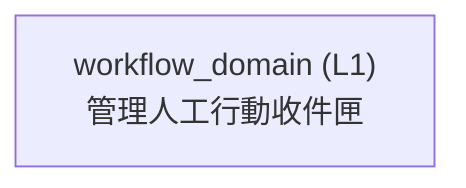

<!-- GENERATED BY govern-modular-event-architecture; DO NOT EDIT -->

# `workflow_domain`

## 結構圖

## 模組

| ID | Level | Role | 父模組 | 實作狀態 | 目的 |
|---|---|---|---|---|---|
| `workflow_domain` | L1 | domain | `thesis_trace_application` | implemented | Own actionable work items, deterministic priority and safety floors, assignment, lifecycle, recurrence, and consistent inbox queries. |

### `workflow_domain`

- **目的:** Own actionable work items, deterministic priority and safety floors, assignment, lifecycle, recurrence, and consistent inbox queries.
- **父模組:** `thesis_trace_application`
- **實作狀態:** `implemented`
- **輸入 Ports:** `workflow.create_action_item`, `workflow.query_action_inbox`, `workflow.query_action_item`, `workflow.transition_action_item`
- **輸出 Ports:** `workflow.action_item_store`
- **輸出 Events:** 無
- **擁有狀態:** 無
- **副作用:** Persist Action Items, priority evaluations, and append-only audit through a demand-owned port. (`-`)
- **異常:** 無
- **不變條件:** System priority and safety floors are server-owned.; Terminal Action Items never reopen or rewrite source records.; Assignees derive only from Server-owned identity and source ownership.
- **程式入口:** [`WorkflowService`](../../backend/src/thesis_trace/modules/workflow/service.py) (service)
- **公開 Symbols:** [`ActionItem`](../../backend/src/thesis_trace/modules/workflow/contracts.py) (contract) [`ActionInboxPage`](../../backend/src/thesis_trace/modules/workflow/contracts.py) (contract) [`CreateActionItemCommand`](../../backend/src/thesis_trace/modules/workflow/contracts.py) (contract) [`TransitionActionItemCommand`](../../backend/src/thesis_trace/modules/workflow/contracts.py) (contract) [`ActionInboxQuery`](../../backend/src/thesis_trace/modules/workflow/contracts.py) (contract) [`ActionItemStorePort`](../../backend/src/thesis_trace/modules/workflow/ports.py) (port) [`WorkflowService`](../../backend/src/thesis_trace/modules/workflow/service.py) (service)

## Port 契約

| ID | Owner | Direction | Kind | Timing | Description | Symbols |
|---|---|---|---|---|---|---|
| `workflow.create_action_item` | `workflow_domain` | input | command | sync | Apply deterministic fingerprint, assignment, priority, and safety policy then atomically create or return an Action Item.: Workflow-local actor and immutable Server-mapped source context without Access, Research, wire, or storage representations. | `CreateActionItemCommand`, `ActionItem` |
| `workflow.query_action_inbox` | `workflow_domain` | input | query | sync | Return authorized counts and page rows from the same repeatable-read query snapshot.: Workflow actor scope, normalized filters/search/sort, page size, and opaque cursor. | `ActionInboxQuery`, `ActionInboxPage` |
| `workflow.query_action_item` | `workflow_domain` | input | query | sync | Return one current assignee-scoped Action Item aggregate.: Workflow actor and Action Item identity. | `ActionItem` |
| `workflow.transition_action_item` | `workflow_domain` | input | command | sync | Apply the versioned Action Item state machine and atomically append its audit fact.: Workflow actor, item/version, target state, reason, optional defer time, idempotency, and Server time. | `TransitionActionItemCommand`, `ActionItem` |
| `workflow.action_item_store` | `workflow_domain` | output | dependency | sync | Atomically persist and query Action Item aggregates, priority history, idempotency receipts, and append-only audit under assignee RLS.: Workflow semantic values without SQL, ORM, Access, Research, or wire representations. | `ActionItemStorePort` |

## Event 契約

| ID | Owner | Delivery | Emitted when | Purpose | Consumers |
|---|---|---|---|---|---|

## Type Catalog

| ID | Owner | Declaration | Visibility | Semantic kind | Consumers | References |
|---|---|---|---|---|---|---|
| `actionitemstatus` | `workflow_domain` | `ActionItemStatus` (enum, `backend/src/thesis_trace/modules/workflow/contracts.py`) | module-public | policy | `workflow_domain`, `postgres_workflow_adapter` | 無 |
| `actionpriority` | `workflow_domain` | `ActionPriority` (enum, `backend/src/thesis_trace/modules/workflow/contracts.py`) | module-public | policy | `workflow_domain`, `postgres_workflow_adapter` | 無 |
| `actionitemtype` | `workflow_domain` | `ActionItemType` (enum, `backend/src/thesis_trace/modules/workflow/contracts.py`) | module-public | policy | `workflow_domain`, `postgres_workflow_adapter` | 無 |
| `workflowactorcontext` | `workflow_domain` | `WorkflowActorContext` (class, `backend/src/thesis_trace/modules/workflow/contracts.py`) | module-public | domain-value | `workflow_domain` | 無 |
| `actionsourceref` | `workflow_domain` | `ActionSourceRef` (class, `backend/src/thesis_trace/modules/workflow/contracts.py`) | module-public | domain-value | `workflow_domain`, `postgres_workflow_adapter` | 無 |
| `createactionitemcommand` | `workflow_domain` | `CreateActionItemCommand` (class, `backend/src/thesis_trace/modules/workflow/contracts.py`) | module-public | command | `workflow_domain`, `postgres_workflow_adapter` | `workflowactorcontext`, `actionsourceref` |
| `transitionactionitemcommand` | `workflow_domain` | `TransitionActionItemCommand` (class, `backend/src/thesis_trace/modules/workflow/contracts.py`) | module-public | command | `workflow_domain`, `postgres_workflow_adapter` | `workflowactorcontext`, `actionitemstatus` |
| `actionpriorityevaluation` | `workflow_domain` | `ActionPriorityEvaluation` (class, `backend/src/thesis_trace/modules/workflow/contracts.py`) | module-public | domain-value | `workflow_domain`, `postgres_workflow_adapter` | `actionpriority` |
| `actionitem` | `workflow_domain` | `ActionItem` (class, `backend/src/thesis_trace/modules/workflow/contracts.py`) | module-public | domain-value | `workflow_domain`, `postgres_workflow_adapter`, `thesis_trace_application` | `actionitemstatus`, `actionitemtype`, `actionpriorityevaluation` |
| `actioninboxsummary` | `workflow_domain` | `ActionInboxSummary` (class, `backend/src/thesis_trace/modules/workflow/contracts.py`) | module-public | query | `workflow_domain`, `thesis_trace_application` | 無 |
| `actioninboxquery` | `workflow_domain` | `ActionInboxQuery` (class, `backend/src/thesis_trace/modules/workflow/contracts.py`) | module-public | query | `workflow_domain`, `postgres_workflow_adapter` | `workflowactorcontext` |
| `actioninboxpage` | `workflow_domain` | `ActionInboxPage` (class, `backend/src/thesis_trace/modules/workflow/contracts.py`) | module-public | query | `workflow_domain`, `thesis_trace_application` | `actioninboxsummary`, `actionitem` |
| `actionitemstoreport` | `workflow_domain` | `ActionItemStorePort` (protocol, `backend/src/thesis_trace/modules/workflow/ports.py`) | module-public | port | `workflow_domain`, `postgres_workflow_adapter` | `createactionitemcommand`, `transitionactionitemcommand`, `actionpriorityevaluation`, `actionitem`, `actioninboxquery`, `actioninboxpage` |
| `workflowservice` | `workflow_domain` | `WorkflowService` (class, `backend/src/thesis_trace/modules/workflow/service.py`) | module-public | policy | `backend_composition`, `thesis_trace_application` | `actionitemstoreport`, `createactionitemcommand`, `transitionactionitemcommand`, `actionpriorityevaluation`, `actionitem`, `actioninboxquery`, `actioninboxpage` |

## State Ownership

| ID | Owner | Declaration | Type | Visibility | Mutability | Read authority | Write authority |
|---|---|---|---|---|---|---|---|

## Cross-module Mapping

| Interaction | Producer | Consumer | Parent | Producer contract | Consumer contract | Mapping owner | State accessed | Allowed edges | Forbidden edges |
|---|---|---|---|---|---|---|---|---|---|

## 端到端 Flows
